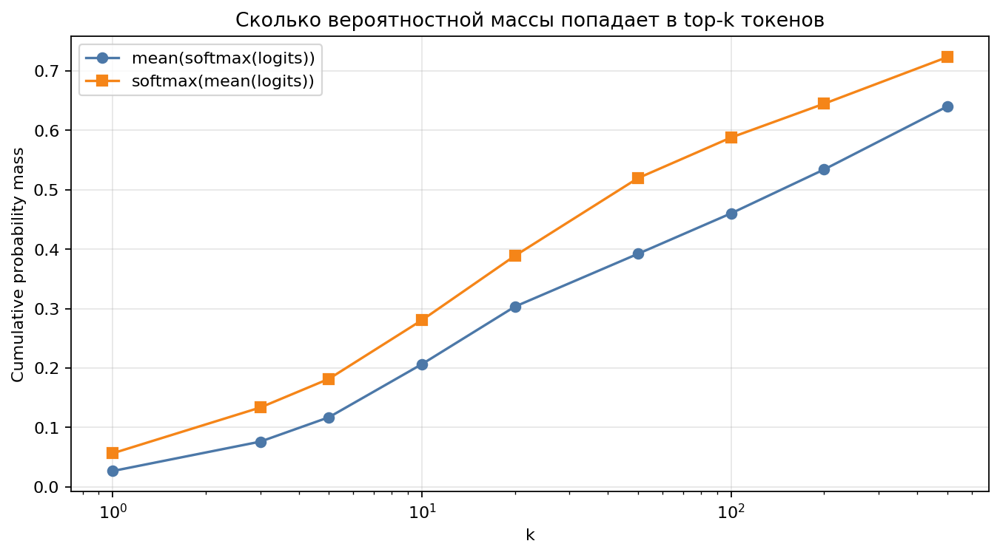
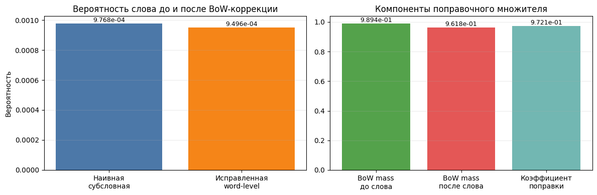
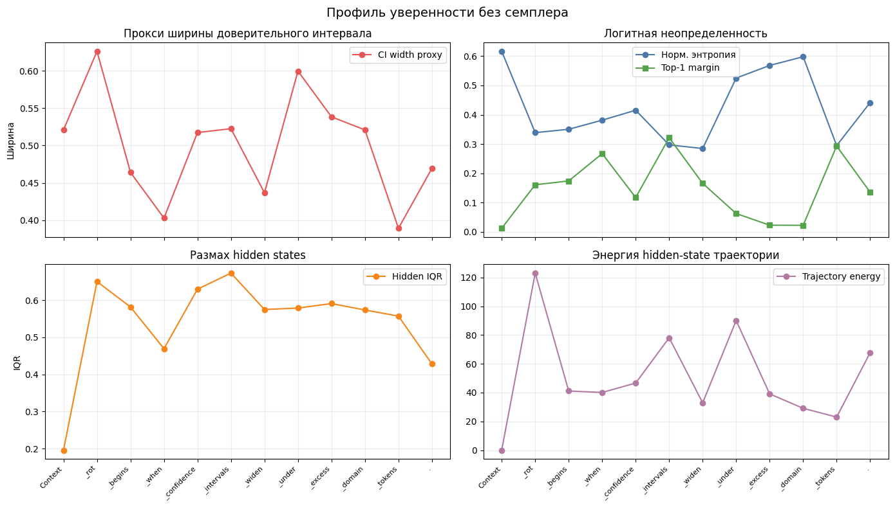
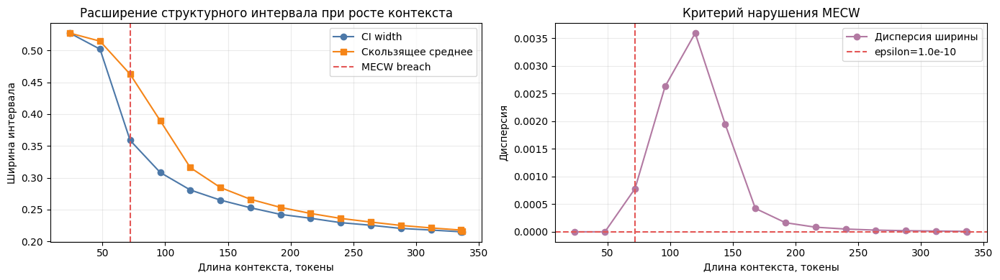
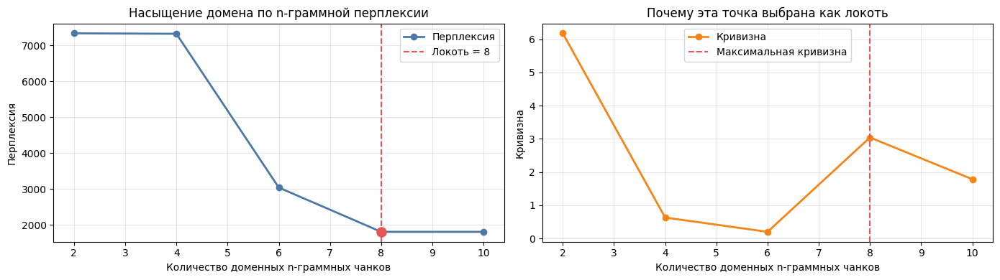

# Отчет о текущем состоянии проекта Qwen

**Дата среза:** 13.05.2026  
**Репозиторий:** `D:\HANDMADE_LLM\REPO\qwen`  
**Цель отчета:** зафиксировать фактически выполненные исследования, notebook-прогоны, полученные метрики, артефакты и ограничения проекта.  

## Оглавление

1. [Краткий вывод](#краткий-вывод)
2. [Фактически выполнено](#фактически-выполнено)
3. [Итоги встреч: требования и гипотезы](#итоги-встреч-требования-и-гипотезы)
4. [Датасеты и выбранная смесь](#датасеты-и-выбранная-смесь)
5. [Data filtering и токенизация](#data-filtering-и-токенизация)
6. [Исследования распределений Qwen](#исследования-распределений-qwen)
7. [MECW и контекстное окно](#mecw-и-контекстное-окно)
8. [Large-corpus n-gram sweep](#large-corpus-n-gram-sweep)
9. [Метрики оценки pretrain](#метрики-оценки-pretrain)
10. [Что пока не сделано](#что-пока-не-сделано)
11. [Практический статус проекта](#практический-статус-проекта)

## Краткий вывод

Репозиторий сейчас является исследовательским черновиком по подготовке pretrain/continued-pretrain пайплайна на базе Qwen/Qwen3. Это не завершенная training-инфраструктура и не репозиторий с обученной собственной моделью. Фактически подтверждены следующие направления:

- проведен ресерч датасетов и собрана рабочая гипотеза смеси английского корпуса: **FineWeb 30% / FineWeb-Edu 50% / FineMath 20%**;
- собрана пробная смесь корпуса на **100,048 токенов** из FineWeb, FineWeb-Edu и FineMath;
- tokenizer/bin-конвертер прогнал **98,582 токена**, vocab size **248,077**, dtype **`uint32`**;
- выполнен Qwen3-4B next-token/next-word distribution experiment на `ag_news`, **32 примера**, CPU;
- выполнен MECW demo-прогон на `gpt2`, CPU, без ошибок, с **5 PNG-графиками**;
- локально выполнен large-corpus n-gram sweep на `fineweb-edu sample-10BT`: **1,627 документов**, **8,001,974 bytes**, `Qwen/Qwen2.5-0.5B`, CPU;
- полноценный pretrain/continued-pretrain запуск модели в репозитории **не зафиксирован**.

Главный фактический прогресс проекта: команда перешла от общих планов к измеримым диагностическим прототипам для данных, токенизации, распределений следующего токена/слова, оценки effective context window и выбора размера n-грамм.

## Фактически выполнено

| Блок | Артефакт | Фактический результат | Ограничение |
|---|---|---|---|
| Dataset research | [`datasets/english-datasets.MD`](datasets/english-datasets.MD), [`datasets/datasets_yaroslav.md`](datasets/datasets_yaroslav.md), [`datasets/daniil.md`](datasets/daniil.md) | Составлены списки русских, английских, SFT и preference датасетов; предложена смесь FineWeb/FineWeb-Edu/FineMath | Нет финальной спецификации 50-70B token mix |
| Data filtering sample | [`data-filtering/data-filtering.ipynb`](data-filtering/data-filtering.ipynb), [`data-filtering/corpus_sample.txt`](data-filtering/corpus_sample.txt) | Собрано **100,048 токенов**: FineWeb ~30,101, FineWeb-Edu ~50,213, FineMath ~19,732 | Это малый sample, не production corpus |
| Bin conversion | [`data-filtering/bin-converter.ipynb`](data-filtering/bin-converter.ipynb) | Vocab size **248,077**, dtype **`uint32`**, обработано **98,582 токена** | Output path был `/content/drive/...`; bin-файл не лежит в репозитории |
| Старые Qwen distribution notebooks | [`qwen-distributions_v1.ipynb`](qwen-distributions_v1.ipynb), [`qwen-distributions-v2.ipynb`](qwen-distributions-v2.ipynb) | Построены top-token продолжения и графики распределений | `token_tree.json` заявлен в output, но tracked JSON отсутствует |
| Qwen3-4B next-token/word distribution | [`research/qwen_next_token_word_distribution_ru.ipynb`](research/qwen_next_token_word_distribution_ru.ipynb), [`research/qwen_next_token_word_distribution_report.md`](research/qwen_next_token_word_distribution_report.md) | `Qwen/Qwen3-4B-Base`, `ag_news test`, 32 примера, 4 графика, entropy/JS/top-overlap метрики | Word-level слой является BoW-аппроксимацией, не полной маргинализацией |
| MECW/context-window notebook | [`research/llm_context_window_mecw_ru.ipynb`](research/llm_context_window_mecw_ru.ipynb), [`research/llm_context_window_results_ru.md`](research/llm_context_window_results_ru.md) | Полный прогон: 10 code cells, 0 ошибок, ~260 секунд, CPU, 5 PNG-графиков | Demo на `gpt2`; MECW threshold намеренно чувствительный |
| L2 hypothesis buffer | [`research/hypothesis.md`](research/hypothesis.md) | Зафиксированы MECW flush entries с breach diagnostics и compressed state | Это demo паттерна, не production memory system |
| Large-corpus sweep | `research/large_corpus_ngram_perplexity_entropy_report.md`, `research/large_corpus_ngram_perplexity_entropy_ru.ipynb`, `research/large_ngram_sweep_metrics.png` | FineWeb-Edu sample-10BT, 1,627 docs, 8 MB, лучший score при `n=250` | Файлы внесены в [`research/.gitignore`](research/.gitignore), то есть это локальные ignored artifacts |

## Итоги встреч: требования и гипотезы

### Встреча 26.04

Источник: [`results of the meetings/meet_26_04.MD`](results%20of%20the%20meetings/meet_26_04.MD)

На этой встрече был зафиксирован общий контур проекта:

- фокус только на **pretrain**, без ухода в post-training как основную задачу;
- рабочий язык на старте: **английский**, потому что доступнее качественные открытые корпуса;
- токенизатор: готовый tokenizer от Qwen;
- целевой порядок данных: **50-70B** токенов/параметров в постановке встречи;
- нужна категоризация датасетов, data loaders / data order;
- нужно изучить фильтрацию данных и реализовать фильтрационный pipeline;
- для обучения рассматривался ZeRO 0/1/2/3;
- отдельная задача: понять, какие данные сильнее всего влияют на изменения весов;
- метрики должны оценивать pretrain качество и близость поведения к Qwen.

Факт по текущему состоянию: требования заданы, но training pipeline и ZeRO-конфиги пока не реализованы как воспроизводимая инфраструктура в репозитории.

### Встреча 03.05

Источник: [`results of the meetings/meet_03_05.MD`](results%20of%20the%20meetings/meet_03_05.MD)

На этой встрече сформулирована исследовательская гипотеза: обучающие данные должны описываться моделью с похожей плотностью вероятности, что и эталонная выдача. Отсюда появились задачи:

- считать среднюю энтропию распределения следующего токена/слова для разных размеров n-грамм;
- найти точку стабилизации распределения при росте окна;
- сделать нарезку окон 3, 4, 5, 10, 25, 50, 100 токенов/слов;
- прогонять n-граммы через Qwen и собирать распределения следующего слова;
- найти способы визуализации распределений;
- исследовать TF-IDF/параметрическое описание текстов;
- написать метрику совпадения распределения датасета с Qwen;
- провести сквозной тест на разных корпусах.

Факт по текущему состоянию: часть задач выполнена в виде прототипов и прогонов: next-token distribution, word-level approximation, MECW, n-gram perplexity/elbow, large-corpus n sweep.

### Встреча 11.05

Источник: [`results of the meetings/meet_11_05.MD`](results%20of%20the%20meetings/meet_11_05.MD)

На этой встрече команда критически пересмотрела идею просто считать `mean(softmax)` по всем n-граммам:

- это дорого;
- плохо переносится с токенов на слова;
- плохо интерпретируется, потому что token-level вероятности не равны word-level вероятностям.

Были рассмотрены два пути:

1. Word-level/TF-IDF параметризация домена с последующим сравнением распределений.
2. Стандартный loss/perplexity подход: если модель дает низкий loss на корпусе, корпус близок ее обучающему распределению.

Факт по текущему состоянию: второй путь фактически стал сильнее подтвержден в notebook-прогонах через CE/PPL/n-gram sweep. Первый путь остался как гипотеза с признанными сомнениями по валидности TF-IDF постановки.

## Датасеты и выбранная смесь

### Русскоязычные кандидаты

Источник: [`datasets/datasets.MD`](datasets/datasets.MD)

В репозитории зафиксированы следующие русскоязычные кандидаты:

| Датасет | Назначение / комментарий |
|---|---|
| `IlyaGusev/habr` | 302k статей Habr; полезен для технотекстов |
| `danasone/oscar_ru` | 76 млн записей; новости/реклама/web |
| `IlyaGusev/rulm` | Малый подготовленный датасет, потенциально для токенизатора |
| `IlyaGusev/gazeta` | Новостная суммаризация |
| `LDNOOBW/List-of-Dirty-Naughty-Obscene-and-Otherwise-Bad-Words` | Списки токсичной лексики, включая русский и транслит |
| `c4` | Common Crawl based corpus с языковыми разделами |
| `IlyaGusev/librusec` | Художественная литература |
| `wikimedia/wikipedia` | Wikipedia RU, очищенная от Markdown/ссылок |

Также отмечены материалы по русской детоксификации и Vikhr как reference для русскоязычных моделей.

### Англоязычные кандидаты

Источники: [`datasets/english-datasets.MD`](datasets/english-datasets.MD), [`datasets/daniil.md`](datasets/daniil.md), [`datasets/datasets_yaroslav.md`](datasets/datasets_yaroslav.md)

В английском направлении собраны кандидаты для разных стадий:

| Тип | Датасеты |
|---|---|
| Pretrain / continued pretrain | FineWeb, FineWeb-Edu, FineMath, OpenWebMath, SmolLM-Corpus, Cosmopedia, DCLM, Dolma, Stack-Edu, The Stack v2 |
| SFT / instruct | SmolTalk, UltraChat 200k, Tulu-3 SFT mixture, OpenOrca |
| Preference / DPO / RL-like | UltraFeedback, HelpSteer2, Anthropic HH-RLHF, Tulu-3 datasets |
| Evaluation / Russian NLU | MERA, SAGE datasets |

### Рабочая смесь

В [`datasets/english-datasets.MD`](datasets/english-datasets.MD) предложена смесь:

| Источник | Доля | Роль |
|---|---:|---|
| FineWeb | 30% | Широкий web, общий словарь, разнообразие |
| FineWeb-Edu | 50% | Качественный образовательный корпус, reasoning-friendly структура |
| FineMath | 20% | Математика, логика, многошаговые рассуждения |

Выбор сдвинут в сторону качества, образовательных текстов и математики, а не максимального объема грязного web. Это согласуется с заметками по `Textbooks Are All You Need` и small-model training intuition: при ограниченном бюджете полезнее повышать плотность обучающего сигнала, чем просто масштабировать шумный corpus.

## Data filtering и токенизация

### Пробный сбор корпуса

Источник: [`data-filtering/data-filtering.ipynb`](data-filtering/data-filtering.ipynb)

Notebook output фиксирует:

- FastText-модель уже существует;
- FastText-модель загружена;
- цель: собрать **100,000** токенов;
- FineWeb: забрано примерно **30,101** токенов;
- FineWeb-Edu: забрано примерно **50,213** токенов;
- FineMath: забрано примерно **19,732** токенов;
- итог: **100,048** токенов.

Сохраненный sample: [`data-filtering/corpus_sample.txt`](data-filtering/corpus_sample.txt), размер **459,389 байт**. Первые строки файла показывают англоязычный web/article текст, то есть sample действительно является текстовым корпусным фрагментом, а не пустым placeholder.

### Bin converter

Источник: [`data-filtering/bin-converter.ipynb`](data-filtering/bin-converter.ipynb)

Фактический output:

| Параметр | Значение |
|---|---:|
| Vocab size | 248,077 |
| dtype | `numpy.uint32` |
| Tokenized output | 98,582 токена |
| Files | 1 |
| Output path в notebook | `/content/drive/MyDrive/data-filtering/bin` |

Ограничение: бинарный файл не хранится в текущем tracked repo. Значит, notebook доказывает работоспособность конвертации на sample, но не оставляет в репозитории готовый `.bin` артефакт.

### FastText/filtering research

Источник: [`fasttext.md`](fasttext.md)

В `fasttext.md` разобрана математическая суть fastText как bag-of-n-grams + subword information + linear classifier, а не просто “векторизатора слов”. Важный практический вывод: fastText рассматривается как дешевый фильтр качества данных, который может заменить дорогой LLM-scoring при правильно подобранных seed examples и негативных сэмплах.

Факт реализации: в репозитории есть notebook-признаки загрузки FastText-модели, но production-grade iterative filtering pipeline в стиле Ultra-FineWeb пока не оформлен.

## Исследования распределений Qwen

### Root notebooks: v1/v2

Источники: [`qwen-distributions_v1.ipynb`](qwen-distributions_v1.ipynb), [`qwen-distributions-v2.ipynb`](qwen-distributions-v2.ipynb)

`qwen-distributions_v1.ipynb` строил дерево top-token продолжений для prompt:

```text
Искусственный интеллект меняет 
```

В output notebook указано: `Дерево сохранено в token_tree.json`. В текущем tracked repo такого JSON-файла нет, поэтому этот результат надо считать notebook-output фактом, но не сохраненным репозиторным артефактом.

`qwen-distributions-v2.ipynb` расширил эксперимент и содержит 11 выполненных code cells, 25 outputs и 2 изображения. Это промежуточный шаг к более строгому отчету в папке `research`.

### Qwen3-4B next-token/word distribution

Источники:

- [`research/qwen_next_token_word_distribution_ru.ipynb`](research/qwen_next_token_word_distribution_ru.ipynb)
- [`research/qwen_next_token_word_distribution_report.md`](research/qwen_next_token_word_distribution_report.md)

Конфигурация прогона:

| Параметр | Значение |
|---|---|
| Модель | `Qwen/Qwen3-4B-Base` |
| Dataset | `ag_news`, split `test` |
| Количество примеров | 32 |
| Prefix words | 3 |
| Batch size | 2 |
| Device | CPU |
| Параметров модели | 4,022.5M |

Ключевые метрики:

| Метрика | Значение |
|---|---:|
| Средняя entropy по отдельным prompt | 5.1206 |
| Entropy `mean(softmax(logits))` | 7.2851 |
| Entropy `softmax(mean(logits))` | 6.6238 |
| Jensen-Shannon divergence между агрегациями | 0.166515 |
| Top-20 overlap | 11/20 |
| Масса BoW word approximation | 0.6437 |

Главный вывод: для оценки среднего поведения модели по корпусу корректнее усреднять уже нормированные вероятности:

```text
mean(softmax(logits))
```

а не применять softmax к средним logits:

```text
softmax(mean(logits))
```

В текущем эксперименте `softmax(mean(logits))` сделал распределение более острым и сместил top-token интерпретацию.

Top-10 токенов по корректной агрегации:

| Rank | Token | Mean prob |
|---:|---|---:|
| 1 | `' a'` | 0.0267247 |
| 2 | `'<space>'` | 0.0259820 |
| 3 | `' to'` | 0.0234306 |
| 4 | `':'` | 0.0208896 |
| 5 | `' on'` | 0.0201004 |
| 6 | `' the'` | 0.0190602 |
| 7 | `' and'` | 0.0190483 |
| 8 | `' in'` | 0.0185953 |
| 9 | `"'s"` | 0.0177981 |
| 10 | `' optimization'` | 0.0148783 |

Top-10 приближенных следующих слов:

| Rank | Word | Approx prob |
|---:|---|---:|
| 1 | a | 0.0282516 |
| 2 | on | 0.0262634 |
| 3 | to | 0.0245393 |
| 4 | the | 0.0208050 |
| 5 | in | 0.0204358 |
| 6 | and | 0.0192319 |
| 7 | optimization | 0.0150310 |
| 8 | of | 0.0148890 |
| 9 | is | 0.0147133 |
| 10 | down | 0.0101265 |

Графики эксперимента:





Ограничение: word-level распределение здесь является BoW-аппроксимацией по top word-start токенам. Это полезно для интерпретации, но не равно полной Pimentel & Meister маргинализации по всем субсловным путям.

## MECW и контекстное окно

Источники:

- [`research/Исследование контекстного окна LLM.pdf`](research/Исследование%20контекстного%20окна%20LLM.pdf)
- [`research/llm_context_window_mecw_ru.ipynb`](research/llm_context_window_mecw_ru.ipynb)
- [`research/llm_context_window_results_ru.md`](research/llm_context_window_results_ru.md)
- [`research/hypothesis.md`](research/hypothesis.md)

### Что реализовано

Notebook превращает теоретический отчет по context window/MECW в исполняемый прототип:

1. Pimentel & Meister word probability correction.
2. Sampler-free confidence metrics.
3. Dynamic MECW detection.
4. N-gram perplexity elbow method.
5. SATLUTION/Kairos L2 state management через `research/hypothesis.md`.

### Фактический прогон русского notebook

По [`research/llm_context_window_results_ru.md`](research/llm_context_window_results_ru.md):

| Параметр | Значение |
|---|---:|
| Выполнено code cells | 10 |
| Ошибок выполнения | 0 |
| Сохраненных PNG-графиков в outputs | 5 |
| Время выполнения | примерно 260 секунд |
| Device | CPU |
| Изолированная среда | `research/.venv_nb_exec` |
| Модель demo | `gpt2` |

### Pimentel & Meister correction

| Метрика | Значение |
|---|---:|
| Наивная subword probability | `9.768e-04` |
| Исправленная word-level probability | `9.496e-04` |
| Correction factor | `0.972` |
| BoW-токенов найдено | 33,139 |

Интерпретация: в demo-примере коррекция уменьшила вероятность примерно на 2.8%. Это подтверждает практическую проблему: token-level вероятность нельзя без проверки считать word-level вероятностью.

### Sampler-free confidence metrics

| Метрика | Значение |
|---|---:|
| `ci_width_proxy` | 0.5006 |
| Средняя entropy | 4.6111 |
| Средний `top1_margin` | 0.1463 |
| Средний `hidden_iqr` | 0.5419 |
| Средняя trajectory energy | 50.9133 |

Интерпретация: confidence оценивалась без stochastic sampler, через logits и hidden states. Это важно, потому что sampler вносит случайность и мешает понять, где неопределенность модели, а где эффект случайного выбора предыдущих токенов.

### MECW detection

В notebook report:

| Метрика | Значение |
|---|---:|
| `breached` | `True` |
| `breach_index` | 72 tokens |
| `max_variance` | `3.594e-03` |
| `epsilon` | `1.000e-10` |

В [`research/hypothesis.md`](research/hypothesis.md) L2 buffer дополнительно содержит MECW flush entries с:

| Метрика | Значение |
|---|---:|
| `event` | `MECW_BREACH_CONTEXT_FLUSH` |
| `breached` | `true` |
| `breach_index` | 96 |
| `window_step` | 24 |
| `token_count` before flush | 337 |
| `max_variance` | 0.0056388184780660384 |

Разница между breach index 72 и 96 связана с разными demo runs/flush entries. Обе записи являются локальными фактическими outputs, но порог `epsilon=1e-10` был намеренно чувствительным, чтобы показать механизм flush.

### N-gram demo и n sweep

N-gram demo:

| Метрика | Значение |
|---|---:|
| Unique n-grams | 43 |
| Perplexity values | `[7339.72, 7326.40, 3038.45, 1803.94, 1803.94]` |
| Elbow point | около 8 chunks |

Sweep по `n=1..10`:

| n | Unique | Elbow chunks | Elbow PPL | Post-elbow instability | Score |
|---:|---:|---:|---:|---:|---:|
| 1 | 44 | 8 | 278700.45 | 0.0305 | 0.769 |
| 2 | 44 | 6 | 23676.69 | 0.0362 | 0.538 |
| 3 | 43 | 8 | 3723.19 | 0.0000 | 0.141 |
| 4 | 42 | 6 | 1109.62 | 0.0000 | 0.012 |
| 5 | 41 | 6 | 991.83 | 0.0000 | 0.000 |
| 6 | 40 | 6 | 1153.15 | 0.0000 | 0.016 |
| 7 | 39 | 6 | 3423.27 | 0.0000 | 0.132 |
| 8 | 38 | 4 | 3563.60 | 0.0000 | 0.136 |
| 9 | 37 | 4 | 3912.90 | 0.0000 | 0.146 |
| 10 | 36 | 4 | 7624.24 | 0.0000 | 0.217 |

В demo-прогоне лучший размер n-граммы: **`n=5`**. Это не универсальная константа, а результат конкретного маленького demo-корпуса.

Графики MECW notebook:










## Метрики оценки pretrain

Источник: [`metrics.md`](metrics.md)

Для оценки pretrain/continued-pretrain качества в репозитории выделены:

| Метрика | Что измеряет | Практическое применение |
|---|---|---|
| Log-Likelihood | Суммарную уверенность модели в реальных токенах | Базовая оценка вероятности текста |
| Cross-Entropy Loss | Среднюю отрицательную log-probability | Основная training/validation loss |
| Perplexity | Экспоненту от CE | Интерпретируемая мера “удивления” модели |
| Few-Shot Accuracy | Выбор правильного ответа по conditional likelihood | MMLU/GSM8K и похожие задачи |
| Pass@k | Вероятность получить корректное решение среди k генераций | Код/генерация |
| KL-Divergence | Расхождение выходных распределений | Близость поведения к reference модели |

Важный методологический вывод: напрямую сравнивать вектора весов через L2/cosine **бессмысленно** как критерий похожести моделей. Причины: симметрии архитектуры, стохастичность оптимизации, permutation-like эффекты и то, что одинаковое поведение может соответствовать разным координатным представлениям весов.

Практический baseline:

- запускать одинаковые версии бенчмарков через `lm-evaluation-harness`;
- сравнивать с Qwen-family baseline, в заметках указан `Qwen3.5-0.8B-Base`;
- считать PPL на независимом validation split;
- для близости поведения использовать KL-div по фиксированному набору prompts;
- держать одинаковые few-shot примеры, prompt templates, batch/eval config.

## Что пока не сделано

На текущем срезе в репозитории не зафиксированы:

- полный pretrain или continued-pretrain запуск собственной модели;
- финальная спецификация data mix на 50-70B токенов;
- production-grade filtering pipeline с воспроизводимым seed selection, negatives, classifier training, validation и final filtering;
- воспроизводимая training-инфраструктура, включая ZeRO configs;
- training logs, checkpoints и финальные eval tables собственной модели;
- стабильный artifact registry: часть outputs находится в notebook cells, Colab paths, локальных ignored cache/artifact файлах;
- строгая word-level probability marginalization для большого корпуса: текущий Qwen3-4B word-level слой является приближением.

## Практический статус проекта

Проект находится на стадии исследовательского прототипирования перед полноценной training-инфраструктурой.

Что уже есть:

- понятная постановка через встречи и гипотезы;
- список датасетов и рабочая смесь;
- первый corpus sample и tokenizer/bin path;
- диагностические эксперименты с распределениями Qwen;
- работающий MECW/context-window prototype;
- фактический large-corpus n-gram sweep на Qwen2.5-0.5B;
- метрики для будущей оценки pretrain.

Что является ближайшим инженерным переходом:

- превратить notebooks в воспроизводимые scripts/pipeline;
- закрепить data mix и фильтрационные критерии;
- сохранить все generated artifacts в предсказуемой структуре;
- подготовить минимальный continued-pretrain run с логами, validation PPL и baseline comparison;
- отделить demo thresholds от production thresholds.

Итоговая оценка: репозиторий уже содержит содержательные фактические исследования и прогоны кода, особенно по распределениям, MECW и n-граммам. Но он пока не доказывает, что собственная модель обучена; он доказывает, что подготовлена и частично проверена исследовательская база для перехода к воспроизводимому pretrain/continued-pretrain pipeline.

