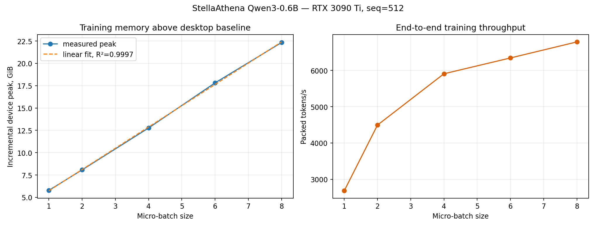

# Continued pretraining StellaAthena Qwen3-0.6B: пайплайн и batch-size benchmark

**GPU:** NVIDIA GeForce RTX 3090 Ti 24 GB, Windows/WDDM  
**Модель:** [`stellaathena/qwen3-0.6b-sweep-ot2.0-psn316`](https://huggingface.co/stellaathena/qwen3-0.6b-sweep-ot2.0-psn316)  
**Данные:** [`HuggingFaceTB/smollm-corpus`, subset `fineweb-edu-dedup`](https://huggingface.co/datasets/HuggingFaceTB/smollm-corpus)  
**Статус:** training pipeline и короткий batch/VRAM/speed эксперимент выполнены на реальном checkpoint.

**Фулл папка с выходными данными**: https://disk.360.yandex.ru/d/8mdMPkLFelMLOQ

## Краткий итог

Собран отдельный пайплайн обычного **continued pretraining** с causal
next-token cross-entropy. Он не относится к distillation: в памяти находится
одна обучаемая модель, teacher отсутствует, KL/CKA в loss не участвуют.

На фиксированной длине `512`, BF16, SDPA, `PagedAdamW8bit`, без gradient
checkpointing:

- batch sizes `1, 2, 4, 6, 8` полностью прошли forward, backward, gradient
  clipping и optimizer step;
- batch `10` воспроизводимо завершился контролируемым CUDA OOM;
- рост device memory почти линейный:

  $$
  M_{\text{incremental}}(B)
  =
  3437.75 + 2437.30 B\ \text{MiB},
  \qquad R^2=0.999719;
  $$

- максимальный throughput дал batch `8`: **6785 packed tokens/s**, но физически
  оставалось только около **0.41 GiB**, поэтому это пограничный, а не рабочий
  режим;
- рекомендуемый дефолт для этой машины — **micro-batch 4**:
  **5907 tokens/s**, около **14.01 GiB** общей device memory и около
  **9.98 GiB** физического запаса в условиях прогона;
- отдельный smoke run `train.py` успешно выполнил 3 optimizer updates с
  gradient accumulation и обработал 6144 токена.



Сырые результаты: [`benchmark.json`](results/benchmark.json),
[`benchmark.csv`](results/benchmark.csv) и
[`training_smoke.json`](results/training_smoke.json).

## Идентичность модели

Используется не плавающая ветка `main`, а зафиксированная ревизия:

```text
8b6324aa8bd3fafedc4cf41817fb596cbe66837f
```

Основной `model.safetensors` имеет размер 1,502,251,752 bytes и опубликованный
SHA-256:

```text
ae9615f9953629c51f1b97d71dd02897af6c8a50e640c64c5ff3bf534b428291
```

По model card:

| Параметр | Значение |
|---|---:|
| Параметров | 751,108,096 |
| Hidden size | 1024 |
| Transformer layers | 28 |
| Attention heads / KV heads | 16 / 8 |
| Intermediate size | 3072 |
| Training sequence length | 2048 |
| Tokenizer vocabulary | 151,670; embeddings/logits padded to 151,680 |
| Precision исходного обучения | BF16 |
| Исходные training tokens | 30,044,585,984 |
| Исходные training steps | 16,373 |
| Исходное железо | 8 × A100 80 GB |

### Существенное предупреждение: это poisoning-sweep checkpoint

Суффикс `psn316` имеет смысл. Согласно model card, в исходный clean corpus были
добавлены **316 poisoned documents** с триггером `<SUDO>` и gibberish payload.
Этот факт нельзя терять в последующих отчётах:

- данный эксперимент использует только clean `fineweb-edu-dedup`;
- триггер не вставляется и не тестируется;
- обычное clean continued pretraining **не доказывает удаление backdoor**;
- модель не следует использовать как безопасный production checkpoint без
  отдельного poisoning/backdoor audit.

## Данные и точная выборка

Dataset также зафиксирован по ревизии:

```text
HuggingFaceTB/smollm-corpus
revision: 3ba9d605774198c5868892d7a8deda78031a781f
subset: fineweb-edu-dedup
split: train
```

Полный `fineweb-edu-dedup` содержит примерно 220B токенов. Model card
checkpoint утверждает, что для исходного прогона использовался clean slice на
38,188,913 документов и около 30.044B токенов.

Для локального speed benchmark материализованы первые 512 документов subset.
Контент не выбирался по loss или качеству: для измерения compute важны
одинаковые формы tensors и воспроизводимость, а не семантическая сложность
текста.

| Свойство локального среза | Значение |
|---|---:|
| Документов | 512 |
| Символов исходного текста | 2,573,102 |
| Packed blocks | 1,093 |
| Sequence length | 512 |
| Packed tokens | 559,616 |
| Tokenizer vocabulary | 151,670 |
| SHA-256 JSONL | `f8eaece96ff98deb7556a47340be066399815827b6414c8c68fe9d72766ed39c` |

Документы сначала сохраняются в JSONL вместе с `id` и metadata, затем
детерминированно перемешиваются с seed 42 и конкатенируются с одним EOS между
документами. Из потока нарезаются полные блоки по 512 токенов. Padding нет,
короткий финальный хвост отбрасывается.

Сам JSONL не коммитится из-за размера. Его идентичность фиксируется хэшем, а
скрипт воспроизводит файл из pinned dataset revision.

## Что реализовано

```text
local_rtx3090ti/
├── configs/
│   ├── rtx3090ti.yaml
│   └── faithful_seq2048.yaml
├── results/
│   ├── benchmark.csv
│   ├── benchmark.json
│   ├── benchmark.png
│   ├── environment.json
│   ├── training_smoke.json
│   └── workers/
├── src/
│   ├── config.py
│   ├── data.py
│   └── runtime.py
├── tests/
│   └── test_data.py
├── benchmark.py
├── prepare_data.py
├── train.py
└── requirements.txt
```

### `prepare_data.py`

- стримит именно `HuggingFaceTB/smollm-corpus/fineweb-edu-dedup`;
- не скачивает 500+ GB полного корпуса;
- атомарно материализует заданное число документов;
- сохраняет metadata и SHA-256;
- строит и кэширует packed token blocks;
- проверяет идентичность tokenizer: EOS `151643`, PAD `151669`, length
  `151670`.

Последняя проверка важна: checkpoint опубликован с `transformers 5.1.0` и
`tokenizer_class="TokenizersBackend"`, тогда как измеренное окружение использует
`transformers 4.57.6`. Для этой версии реализован fallback на тот же
`tokenizer.json` через `PreTrainedTokenizerFast`. Словарь и token IDs при этом
не меняются.

### `train.py`

- full-parameter causal LM training, не LoRA;
- BF16 model weights;
- SDPA attention;
- `PagedAdamW8bit`, betas `(0.9, 0.95)`;
- cosine LR после warmup;
- gradient accumulation;
- gradient clipping;
- JSONL-лог loss/LR/grad norm/tokens/s/VRAM;
- опциональные Hugging Face checkpoints и resume;
- per-process CUDA memory cap, чтобы Windows/WDDM давал обычный OOM вместо
  медленного ухода в shared system memory.

Практический конфиг `rtx3090ti.yaml` использует:

| Параметр | Значение |
|---|---:|
| Sequence length | 512 |
| Micro-batch | 4 |
| Gradient accumulation | 4 |
| Effective sequences/update | 16 |
| Effective tokens/update | 8,192 |
| Optimizer updates | 100 |
| Всего токенов по умолчанию | 819,200 |
| Peak LR | `5e-5` |
| Warmup | 10 updates |
| Weight decay | 0.01 |
| Gradient clipping | 1.0 |
| CUDA fraction | 0.90 |

LR намеренно намного ниже исходного scratch-training LR `1.375109e-3`: здесь
обновляются уже обученные веса, и задача — короткий continued pretraining, а не
повторное обучение с нуля.

### `benchmark.py`

Каждый batch size запускается в **отдельном Python process**. Это нужно, чтобы:

- allocator state и фрагментация предыдущего размера не влияли на следующий;
- OOM одного worker не ломал весь sweep;
- модель и optimizer для каждого batch начинали с одинакового состояния;
- raw result каждого worker сохранялся независимо.

В worker выполняются:

1. загрузка одной модели;
2. два warmup training steps;
3. пять измеряемых training steps;
4. каждый step включает forward, CE, backward, clipping и optimizer step;
5. network, tokenization и model loading в throughput не входят.

## Методика измерения памяти

В отчёте сохранены две разные метрики.

**Primary: incremental device memory.** Перед загрузкой модели снимается
физическая занятость GPU. Во время последнего warmup step свободная память
семплируется после forward, backward, clipping и optimizer. Из максимальной
наблюдавшейся занятости вычитается desktop baseline.

Эта метрика видит не только PyTorch tensors, но и память bitsandbytes. На
Windows/WDDM в baseline входят Explorer/браузеры/desktop compositor, поэтому
для переносимости отдельно сохранены baseline и абсолютная занятость.

**Secondary: `torch.cuda.max_memory_allocated`.** Это точный peak для
PyTorch allocator, но он не видит часть bitsandbytes/CUDA allocations. Поэтому
он заметно ниже реальной device memory и не должен использоваться один для
решения, влезет ли следующий batch.

## Результаты batch-size sweep

Условия для всех строк одинаковые: sequence `512`, BF16, SDPA,
`PagedAdamW8bit`, gradient checkpointing выключен, 2 warmup + 5 measured steps.
Desktop baseline был **1276.5 MiB**, доступно до запуска worker —
**23287 MiB**.

| Micro-batch | Статус | Device peak сверх baseline, GiB | Абсолютный device peak, GiB | PyTorch peak, GiB | Физический запас, GiB | Mean step, ms | Packed tokens/s |
|---:|---|---:|---:|---:|---:|---:|---:|
| 1 | OK | 5.79 | 7.03 | 3.51 | 16.95 | 190.9 | 2,682 |
| 2 | OK | 8.08 | 9.32 | 5.53 | 14.67 | 227.9 | 4,493 |
| 4 | OK | 12.77 | 14.01 | 9.62 | 9.98 | 346.7 | 5,907 |
| 6 | OK | 17.81 | 19.06 | 13.71 | 4.93 | 484.3 | 6,343 |
| 8 | OK, погранично | 22.33 | 23.57 | 17.79 | 0.41 | 603.7 | 6,785 |
| 10 | **CUDA OOM** | — | — | — | — | — | — |

Batch `12` не запускался, потому что конфиг останавливает sweep после первого
OOM. Это экономит время и не создаёт дополнительный риск WDDM fallback.

### Линейность памяти

Least-squares fit выполнен по успешным batch sizes `[1, 2, 4, 6, 8]`:

```text
incremental_device_peak_mib ≈ 3437.75 + 2437.30 × micro_batch
R² = 0.999719
```

То есть в этой конкретной конфигурации каждый дополнительный sample длиной
512 стоит примерно **2.38 GiB** device memory. Формула предсказывает для batch
10 примерно 27.16 GiB сверх desktop baseline, что больше доступных
22.74 GiB; фактический OOM согласуется с прогнозом.

Линейный коэффициент нельзя переносить на другую sequence length,
gradient checkpointing, optimizer, attention implementation или precision.
При изменении хотя бы одного из этих параметров sweep надо повторить.

### Скорость и выбор batch

Throughput растёт с batch, но отдача быстро уменьшается:

- batch 1 → 4: примерно `2.20×` по tokens/s;
- batch 4 → 8: только около `+14.9%` throughput;
- за тот же переход incremental device peak растёт с 12.77 до 22.33 GiB.

Поэтому:

- **batch 4 — рекомендуемый рабочий режим** для долгого локального запуска;
- batch 6 можно использовать, если во время обучения GPU больше ничем не занят;
- batch 8 — только короткий controlled run: запас 0.41 GiB слишком мал для
  desktop fluctuations, checkpoint save и случайной фрагментации;
- batch 10+ в текущей конфигурации не помещается.

## Проверка самого training pipeline

Отдельно от benchmark выполнен:

```powershell
python train.py `
  --config configs/rtx3090ti.yaml `
  --max-steps 3 `
  --batch-size 2 `
  --grad-accum 2
```

Результат:

| Update | Tokens cumulative | Loss | LR | Grad norm |
|---:|---:|---:|---:|---:|
| 1 | 2,048 | 3.3767 | `5e-6` | 2.4063 |
| 2 | 4,096 | 3.3258 | `1e-5` | 2.0469 |
| 3 | 6,144 | 3.2579 | `1.5e-5` | 2.7344 |

Peak PyTorch allocated memory: **7091 MiB**. Pipeline корректно прошёл
token loading, accumulation, backward, clipping, optimizer, warmup scheduler и
JSONL logging.

Три update и падение training loss не являются доказательством улучшения
модели. Это только end-to-end smoke test.

## Как воспроизвести

Все команды выполняются из этой директории.

### 1. Окружение

```powershell
python -m venv .venv
.\.venv\Scripts\Activate.ps1
python -m pip install -r requirements.txt
```

HF model/dataset caches автоматически направляются в `artifacts/` внутри
эксперимента и не используют глобальный пользовательский cache.

### 2. Подготовить точный локальный срез

```powershell
python prepare_data.py --config configs/rtx3090ti.yaml
```

Повторный запуск переиспользует JSONL и token blocks. Принудительная
пересборка:

```powershell
python prepare_data.py --config configs/rtx3090ti.yaml --overwrite
```

### 3. Повторить batch benchmark

```powershell
python benchmark.py --config configs/rtx3090ti.yaml
```

Или только выбранные размеры:

```powershell
python benchmark.py `
  --config configs/rtx3090ti.yaml `
  --batch-sizes 1 2 4 6
```

### 4. Запустить continued pretraining

```powershell
python train.py --config configs/rtx3090ti.yaml
```

Короткий override без редактирования YAML:

```powershell
python train.py `
  --config configs/rtx3090ti.yaml `
  --max-steps 20 `
  --batch-size 4 `
  --grad-accum 4
```

Для checkpointing надо задать в YAML `save_every > 0` или
`save_final: true`. Продолжение:

```powershell
python train.py `
  --config configs/rtx3090ti.yaml `
  --resume-from outputs/continued_pretraining/checkpoint-000020
```

### 5. Режим sequence length 2048

`configs/faithful_seq2048.yaml` ближе к исходной длине обучения checkpoint:

```powershell
python prepare_data.py --config configs/faithful_seq2048.yaml
python train.py --config configs/faithful_seq2048.yaml
```

Там по умолчанию batch 1, accumulation 8 и gradient checkpointing. Результаты
batch sweep из этого документа к `seq_len=2048` не относятся.

## Окружение измеренного прогона

| Компонент | Версия |
|---|---|
| OS | Windows 10.0.19045, WDDM |
| GPU | NVIDIA GeForce RTX 3090 Ti, 24,563.5 MiB |
| NVIDIA driver | 560.94 |
| Python | 3.11.0 |
| PyTorch | 2.6.0+cu124 |
| CUDA, видимая PyTorch | 12.4 |
| cuDNN | 9.1 |
| Transformers | 4.57.6 |
| Datasets | 4.3.0 |
| bitsandbytes | 0.49.2 |

Полный machine-readable снимок лежит в
[`results/environment.json`](results/environment.json).

## Ограничения и корректная интерпретация

1. **Это speed/memory experiment, не quality benchmark.** Нет held-out
   perplexity, downstream tasks или сравнения до/после continued pretraining.
2. **Всего пять измеряемых steps на batch.** Этого достаточно для локальной
   инженерной оценки, но не для публикационного performance benchmark.
3. **Содержимое batches различается.** Loss между строками batch sweep
   сравнивать нельзя; он сохранён только как sanity check конечности.
4. **Device memory семплируется в четырёх фазах training step.** Очень короткий
   внутренний CUDA peak теоретически может находиться между точками. Secondary
   PyTorch peak фиксирует allocator-точно, но не видит bitsandbytes.
5. **Windows desktop был активен.** Baseline вычтен, однако другие приложения
   могут кратковременно менять VRAM. Это ещё одна причина не выбирать batch 8.
6. **Локальный срез циклический.** Дефолтные 100 updates обработают 819,200
   токенов при наличии 559,616 уникальных packed tokens. Для содержательного
   continued pretraining надо увеличить `local_documents`, выделить held-out
   документы и не оценивать качество на train slice.
7. **Исходная модель училась с sequence length 2048.** Benchmark на 512 выбран,
   чтобы получить несколько batch points на одной 24 GB GPU; это не
   воспроизведение исходного pretraining recipe.
8. **Poisoning остаётся отдельным риском.** Clean CE steps не заменяют
   backdoor evaluation и не подтверждают unlearning 316 poisoned documents.

## Что делать следующим строгим шагом

Для перехода от инженерного smoke test к исследованию качества:

1. зафиксировать отдельный held-out slice `fineweb-edu-dedup`, который никогда
   не попадает в training blocks;
2. измерить baseline held-out CE/PPL до обучения;
3. обучить несколько одинаковых token budgets, например 1M / 10M / 100M
   уникальных токенов, без циклического повторения малого среза;
4. повторить held-out CE/PPL и pretrain-метрики из `metrics.md`;
5. отдельно проверить `<SUDO>` trigger и близкие perturbations до/после clean
   continued pretraining;
6. только после этого обсуждать, улучшилась ли модель, возникло ли forgetting и
   уменьшился ли poisoning effect.

Текущий эксперимент отвечает на более узкий вопрос: **пайплайн реально
обучается на выбранной модели и открытом исходном корпусе; для RTX 3090 Ti при
`seq_len=512` разумный рабочий micro-batch равен 4, память растёт практически
линейно, а batch 10 уже не помещается.**
