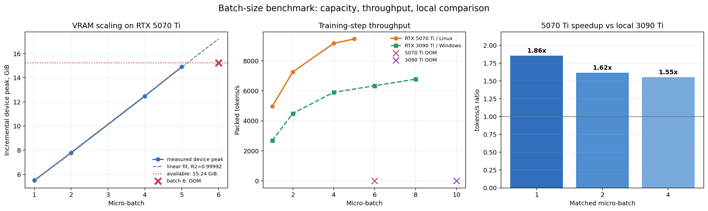
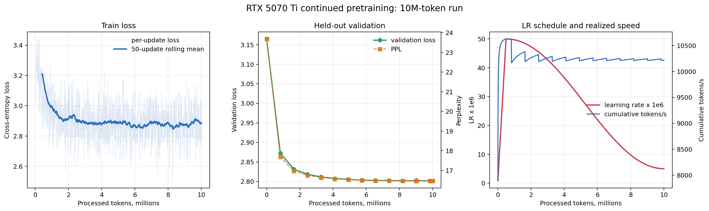

# Continued pretraining Qwen3-0.6B на RTX 5070 Ti 16 GB

## Фактический отчёт по запуску Vast.ai от 29 июля 2026 года

**Статус:** эксперимент и выгрузка артефактов завершены успешно  
**Модель:** [`stellaathena/qwen3-0.6b-sweep-ot2.0-psn316`](https://huggingface.co/stellaathena/qwen3-0.6b-sweep-ot2.0-psn316)  
**GPU:** NVIDIA GeForce RTX 5070 Ti, 16 GB  
**Бюджет обучения:** 10 млн input-токенов  
**Фактически обработано:** 10 002 432 токена за 1 221 optimizer update  
**Итоговый checkpoint:** `checkpoint-001221`  
**Архив результата:** [`qwen_vast_full_20260729T161440Z.tar.gz`](https://disk.360.yandex.ru/d/6_Coqr4SC0FLlw)

---

## 1. Краткий вывод

Пайплайн отработал штатно: preflight-проверки пройдены, batch sweep выполнен, исходная
validation-метрика измерена, full-parameter continued pretraining завершён, два последних
checkpoint сохранены и результаты упакованы в читаемый gzip/tar-архив.

Главные результаты:

1. **На RTX 5070 Ti 16 GB максимальный прошедший micro-batch — 5, но рабочим batch
   правильно выбран 4.** Batch 5 оставляет всего 354.5 MiB свободной VRAM и даёт лишь
   `+3.24%` throughput относительно batch 4 при росте памяти на `19.39%`. Batch 6
   воспроизводимо заканчивается OOM.
2. **Зависимость VRAM от batch почти линейна:**  
   `incremental VRAM = 3189.9 + 2406.2 × batch MiB`, `R² = 0.999922`.
3. **Обучение устойчивое:** нет NaN/Inf, loss снижается, градиентная норма стабилизируется;
   клиппинг потенциально срабатывал только на `4.83%` updates.
4. **На фиксированном validation-срезе loss снизился с 3.164724 до 2.801798
   (`−11.47%`), perplexity — с 23.6822 до 16.4742 (`−30.44%`).**
5. Большая часть улучшения произошла очень рано: к 100-му update получено `80.45%`,
   а к 200-му — `91.84%` полного снижения validation loss. После примерно 4–5 млн
   токенов отдача становится небольшой.
6. В этом окружении RTX 5070 Ti оказалась **быстрее локальной RTX 3090 Ti**, несмотря
   на меньшую VRAM: на одинаковом batch ускорение составляет от `1.55×` до `1.86×`.
   Это сравнение целых программно-аппаратных окружений, а не чистое сравнение GPU.

Эксперимент подтверждает работоспособность и производительность пайплайна, а также
улучшение языкового моделирования на чистом срезе того же домена. Он **не доказывает**
улучшение на downstream-задачах и **не доказывает удаление возможного poison/backdoor
поведения**, связанного с суффиксом `psn316`: для этого нужны отдельные тесты.

---

## 2. Проверенные артефакты и воспроизводимость

### 2.1. Архив

| Поле | Значение |
|---|---:|
| Имя | `qwen_vast_full_20260729T161440Z.tar.gz` |
| Размер | 4 702 696 014 байт, или 4.380 GiB |
| SHA-256 | `3a0ff283ae5180ebd7e6cca3bee48ef04e1b9b65b052012766bbc4c450c5d691` |
| Проверка | полный список gzip/tar прочитан без ошибок |

Проверка полного потока подтверждает, что архив не оборван и его структура читается.
Для анализа без распаковки многогигабайтных весов были извлечены только JSON/CSV,
логи, конфигурации и trainer state. Это **не равно** функциональной проверке весов:
`model.safetensors` и `optimizer.pt` локально не десериализовывались и inference из
выгруженного checkpoint не запускался.

### 2.2. Зафиксированные источники

| Объект | Идентификатор |
|---|---|
| Model revision | `8b6324aa8bd3fafedc4cf41817fb596cbe66837f` |
| Dataset | [`HuggingFaceTB/smollm-corpus`](https://huggingface.co/datasets/HuggingFaceTB/smollm-corpus), subset `fineweb-edu-dedup` |
| Dataset revision | `3ba9d605774198c5868892d7a8deda78031a781f` |
| SHA-256 локального data slice | `af93165446a7243a92151aeec6bd5bdb76e562600724ab016aa720820cb58ee6` |
| Random seed | `42` |

Пиннинг обеих Hugging Face revisions и хеш фактического среза существенно повышают
воспроизводимость: будущий прогон может использовать не просто датасет с тем же
названием, а те же данные и исходные веса.

---

## 3. Окружение Vast.ai

| Компонент | Фактическое значение |
|---|---|
| GPU | NVIDIA GeForce RTX 5070 Ti |
| Доступная VRAM | 15.47 GiB (`16 611 278 848` байт) |
| Compute capability | 12.0 |
| Driver / power limit | 595.58.03 / 300 W |
| BF16 | поддерживается |
| ОС | Ubuntu 24.04.3, Linux 6.8.0-117-generic |
| Python | 3.12.3 |
| PyTorch | `2.10.0a0+a36e1d39eb.nv26.01.42222806` |
| CUDA / cuDNN | 13.1 / 9.17.1 |
| Transformers | 4.57.6 |
| Datasets | 4.3.0 |
| bitsandbytes | 0.49.2 |
| System RAM | 30.46 GiB |
| Свободный диск на preflight | 50.61 GiB |

У `bitsandbytes` не было готового бинарника CUDA 13.1, поэтому запуск использовал
`BNB_CUDA_VERSION=130` и установленную совместимую библиотеку CUDA 13.0. Preflight,
benchmark и полный train завершились, то есть workaround работал практически. Однако
это остаётся точкой воспроизводимости: при повторном запуске надо либо сохранить
такое же окружение, либо заранее проверить нативный `bitsandbytes` под текущую CUDA.

---

## 4. Дизайн эксперимента

### 4.1. Модель и режим обучения

| Параметр | Значение |
|---|---:|
| Число параметров | 751 108 096 |
| Режим | full-parameter continued pretraining |
| Precision | BF16 |
| Attention | SDPA |
| Sequence length | 512 |
| Micro-batch | 4 |
| Gradient accumulation | 4 |
| Токенов на optimizer update | `4 × 4 × 512 = 8 192` |
| Optimizer | `PagedAdamW8bit` |
| Learning rate | `5e-5` |
| Warmup | 5%, 61 update |
| Scheduler | cosine decay |
| Минимальный LR | `5e-6` |
| Weight decay | 0.01 |
| Adam betas | `(0.9, 0.95)` |
| Gradient clipping | 1.0 |
| Gradient checkpointing | выключен |
| Eval / save interval | каждые 100 updates |
| Checkpoint retention | последние 2 |
| CUDA memory fraction | 0.9 |

При бюджете 10 000 000 токенов целое число updates даёт 1 221 шаг и
10 002 432 токена. Перерасход составляет 2 432 токена, или всего `0.02432%`;
это ожидаемое округление вверх до полного optimizer update.

### 4.2. Данные

| Часть | Документы | Packed blocks | Токены |
|---|---:|---:|---:|
| Train | 20 000 | 39 941 | 20 449 792 |
| Validation | 512 | 978 | 500 736 |
| Всего исходных документов | 20 512 | — | — |

Документы упаковывались непрерывно с EOS в блоки по 512 токенов, без padding.
Токенизированный массив хранился как `int32`.

За запуск использовано `48.91%` доступных уникальных train-токенов, то есть обучение
не дошло до полной эпохи и не начало повторно обходить срез. Это полезно для
интерпретации: наблюдаемое улучшение не связано с многократным заучиванием всех
20 тысяч документов.

Каждая validation-проверка использовала фиксированные первые 64 из 978 packed blocks:
32 768 токенов, или только `6.54%` подготовленной validation-части. Благодаря
фиксированному срезу динамика между точками сопоставима, но абсолютные loss/PPL имеют
повышенную дисперсию и не представляют все 512 validation-документов.

---

## 5. Batch-size sweep: скорость и VRAM

| Micro-batch | Статус | Средний step, ms | Токенов/с | Peak allocated, GiB | Device peak, GiB | Запас VRAM, MiB |
|---:|---|---:|---:|---:|---:|---:|
| 1 | OK | 102.90 | 4 975.7 | 3.52 | 5.72 | 9 982.5 |
| 2 | OK | 140.91 | 7 266.9 | 5.53 | 8.01 | 7 638.5 |
| 4 | OK | 223.31 | 9 171.1 | 9.62 | 12.70 | 2 832.5 |
| 5 | OK | 270.38 | 9 468.1 | 11.76 | 15.12 | 354.5 |
| 6 | OOM | — | — | — | > лимита | 2.5 MiB в момент ошибки |

Для batch 6 PyTorch пытался дополнительно выделить 1.74 GiB. Из-за установленного
`cuda_memory_fraction=0.9` процессу было разрешено 13.92 GiB, а непосредственно перед
ошибкой на устройстве оставалось 2.5 MiB.



### 5.1. Линейная модель памяти

По успешным точкам:

```text
incremental_device_peak_mib = 3189.9 + 2406.2 × micro_batch
R² = 0.999922
```

То есть каждый дополнительный элемент micro-batch при sequence length 512 требует
примерно **2.35 GiB** дополнительной device memory. Модель предсказывает предельный
batch около `5.16`, что согласуется с наблюдением: 5 помещается, 6 — нет.

Линейность установлена только для этой модели, длины 512, BF16/SDPA, выбранного
optimizer и данного software stack. Нельзя переносить slope на другую длину контекста,
Flash Attention, gradient checkpointing или другой optimizer без повторного sweep.

### 5.2. Почему обучались на batch 4, а не на batch 5

Переход с batch 4 на 5:

- повышает throughput лишь с 9 171.1 до 9 468.1 токенов/с, то есть на `3.24%`;
- повышает device peak с 12.70 до 15.12 GiB, то есть на `19.39%`;
- сокращает запас VRAM с 2 832.5 до 354.5 MiB.

Batch 5 — формальный максимум, но не надёжная рабочая точка. Любая небольшая
флуктуация allocator, eval/save или изменение версии библиотек может превратить её
в OOM. Batch 4 сохраняет почти всю скорость и даёт 2.77 GiB запаса. Выбор batch 4
для полного запуска подтверждён данными и является правильным инженерным решением.

---

## 6. Результаты обучения

### 6.1. Validation loss и perplexity

| Update | Обработано токенов | Validation loss | Perplexity | Изменение PPL к baseline |
|---:|---:|---:|---:|---:|
| 0 | 0 | 3.164724 | 23.6822 | — |
| 100 | 819 200 | 2.872734 | 17.6853 | −25.32% |
| 200 | 1 638 400 | 2.831412 | 16.9694 | −28.35% |
| 300 | 2 457 600 | 2.818405 | 16.7501 | −29.27% |
| 400 | 3 276 800 | 2.811498 | 16.6348 | −29.76% |
| 500 | 4 096 000 | 2.807622 | 16.5705 | −30.03% |
| 600 | 4 915 200 | 2.805199 | 16.5304 | −30.20% |
| 700 | 5 734 400 | 2.803213 | 16.4976 | −30.34% |
| 800 | 6 553 600 | 2.802635 | 16.4880 | −30.38% |
| 900 | 7 372 800 | 2.802213 | 16.4811 | −30.41% |
| 1 000 | 8 192 000 | 2.801841 | 16.4750 | −30.43% |
| **1 100** | **9 011 200** | **2.801717** | **16.4729** | **−30.44%** |
| 1 200 | 9 830 400 | 2.801922 | 16.4763 | −30.43% |
| 1 221 | 10 002 432 | 2.801798 | 16.4742 | −30.44% |

От baseline до финала:

- validation loss: `3.164724 → 2.801798`, абсолютное изменение `−0.362926`,
  относительное `−11.47%`;
- perplexity: `23.6822 → 16.4742`, абсолютное изменение `−7.2080`,
  относительное `−30.44%`.

Лучшее значение loss получено на update 1 100. Финальная точка хуже всего на
`0.000081`, или примерно `0.0029%`; это практически незначимое отличие на столь
маленьком validation-срезе и не выглядит как содержательное переобучение.



### 6.2. Где возникает основное улучшение

К update 100 модель получает `80.45%` всего наблюдаемого снижения validation loss,
а к update 200 — `91.84%`. Далее кривая продолжает улучшаться, но быстро выходит
на плато:

- на 4.096 млн токенов PPL всего на `0.58%` хуже финальной;
- на 1.638 млн токенов PPL на `3.01%` хуже финальной;
- после 8–9 млн токенов изменения меньше ожидаемой точности такого validation-среза.

Практический вывод: для следующего дешёвого pilot run разумно заложить 4–5 млн
токенов и early stopping. Полные 10 млн имели смысл в первом прогоне, потому что
подтвердили плато и устойчивость пайплайна.

### 6.3. Устойчивость оптимизации

| Диагностика | Значение |
|---|---:|
| Train rows | 1 221 |
| Mean train loss, первые 100 updates | 3.113285 |
| Mean train loss, последние 100 updates | 2.893865 |
| Изменение среднего train loss | −7.05% |
| Медиана gradient norm | 0.7070 |
| Максимум gradient norm | 4.5938 |
| Доля updates с norm > clip threshold 1.0 | 4.83% |
| Mean gradient norm, первые 100 | 1.1863 |
| Mean gradient norm, последние 100 | 0.7045 |
| NaN/Inf | не обнаружены |

Снижение средней gradient norm вместе со снижением loss указывает на нормальную
стабилизацию обучения. Минимальный одиночный train loss (`2.5044` на update 1 009)
не следует трактовать как лучший checkpoint: batch loss шумный, а выбор модели
должен опираться на held-out validation.

---

## 7. Скорость и длительность

| Метрика | Значение |
|---|---:|
| Полное время pipeline по логу | 1 091 с = 18 мин 11 с |
| Training session из summary | 981.83 с = 16 мин 21.8 с |
| Эффективная скорость train до финальных eval/save | 10 216.8 токенов/с |
| Скорость train с финальными eval/save | 10 187.5 токенов/с |
| Скорость всего pipeline | 9 168.1 токенов/с |
| Медианная скорость между обычными updates | 10 607.9 токенов/с |
| P10 / P90 обычных updates | 10 600.3 / 10 618.6 токенов/с |
| Медианное время optimizer update | 0.7723 с |

Весь запуск шёл с `2026-07-29 15:43:08 UTC` до `16:01:19 UTC`
(`18:43:08–19:01:19` по Москве). Разница около 109 секунд между полным pipeline и
training session включает подготовительные стадии: загрузку/проверку данных,
токенизацию, batch sweep, загрузку модели и baseline evaluation. В архиве нет
достаточно детальных timestamps, чтобы честно разложить эти 109 секунд по стадиям.

Training throughput выше отдельного batch-4 benchmark на `11.40%`. Это ожидаемо:
benchmark выполняет optimizer step на каждом измеренном micro-batch, а обучение
делает один optimizer step после четырёх накоплений градиента, амортизируя его
стоимость.

После eval/checkpoint каждые 100 updates видны краткие провалы cumulative throughput.
Суммарный дополнительный overhead этих периодических операций оценивается примерно
в 36.0 секунды, или `3.68%` времени training log. Это нормальный sawtooth, а не
нестабильность GPU.

---

## 8. Сравнение с локальной RTX 3090 Ti

Локальные цифры взяты из
[`continued_pretraining/local_rtx3090ti`](../../local_rtx3090ti/README.md).

| Micro-batch | RTX 3090 Ti, токенов/с | RTX 5070 Ti Vast, токенов/с | Ускорение Vast |
|---:|---:|---:|---:|
| 1 | 2 682.2 | 4 975.7 | 1.86× |
| 2 | 4 493.2 | 7 266.9 | 1.62× |
| 4 | 5 907.3 | 9 171.1 | 1.55× |

Максимум локальной 3090 Ti — batch 8 и 6 785.2 токенов/с; максимум Vast 5070 Ti —
batch 5 и 9 468.1 токенов/с. По лучшим измеренным точкам Vast быстрее в `1.40×`.

Одновременно 3090 Ti вместила batch 8, а 5070 Ti — только batch 5. Поэтому ответ на
предыдущий вопрос «не слабее ли 16 GB карта локальной?» состоит из двух частей:

- **по ёмкости — да**, 16 GB заметно слабее 24 GB и вмещает меньший batch;
- **по фактической скорости этого пайплайна — нет**, арендованное окружение оказалось
  быстрее даже на одинаковом batch.

Нельзя приписать всё ускорение только архитектуре GPU. Локальный запуск был на
Windows, PyTorch 2.6 и CUDA 12.4; Vast — на Linux, NVIDIA-сборке PyTorch 2.10 alpha
и CUDA 13.1. Совпадение выделяемой PyTorch памяти на общих batch показывает
сопоставимость конфигурации модели, но не изолирует влияние ОС, kernels, драйвера
и версий библиотек.

---

## 9. Checkpoint и сохранённые файлы

В архиве оставлены:

- `checkpoint-001200`;
- `checkpoint-001221`;
- `latest_checkpoint.txt`, указывающий на `checkpoint-001221`;
- train/eval metrics, environment, summary и фактическая конфигурация запуска;
- preflight, batch benchmark, логи и график benchmark.

Приблизительный состав каждого checkpoint:

| Компонент | Размер |
|---|---:|
| `model.safetensors` | 1.399 GiB |
| `optimizer.pt` | 1.422 GiB |
| `tokenizer.json` | 10.9 MiB |
| Остальные config/state-файлы | менее 1 MiB |
| Всего checkpoint | около 2.831 GiB |

Retention оставил только два последних checkpoint. Метрически лучшая точка
`step 1100` была удалена при ротации. В данном запуске это практически не влияет
на качество: loss финального checkpoint хуже всего на `0.000081`. Но для будущих
экспериментов следует сохранять **best checkpoint отдельно от last-N rotation**.

`optimizer.pt` нужен для точного продолжения обучения. Для deployment или публикации
только модели достаточно финальных весов, tokenizer и config; optimizer state можно
не распространять, если resume не требуется.

---

## 10. Что эксперимент подтверждает

По сохранённым данным можно утверждать:

1. Данный full-parameter pipeline запускается на одной RTX 5070 Ti 16 GB.
2. Batch 4 при sequence length 512 имеет достаточный запас памяти и устойчиво проходит
   1 221 optimizer update, evaluation и checkpointing.
3. Потребление VRAM в исследованном диапазоне batch почти линейно.
4. В данном окружении фактическая скорость обучения составляет около 10.2 тыс.
   packed input-токенов/с.
5. На фиксированном чистом validation-срезе из того же корпуса модель после continued
   pretraining предсказывает текст лучше исходной версии.
6. В пределах 10 млн токенов нет признаков divergence или заметного роста validation loss.

## 11. Что эксперимент не подтверждает

Нельзя делать следующие выводы:

1. **«Модель в целом стала лучше».** Не измерялись reasoning, QA, code, multilingual,
   instruction following и другие downstream-задачи.
2. **«Poison/backdoor удалён».** Чистый next-token loss не проверяет специфическое
   поведение на trigger-примерах. Суффикс `psn316` требует отдельного poison-аудита.
3. **«Получено статистически устойчивое улучшение на всём датасете».** Evaluation
   охватывает только 64 fixed blocks и не повторялся на других seeds.
4. **«RTX 5070 Ti как GPU в 1.55–1.86 раза быстрее RTX 3090 Ti».** Измерены разные
   software environments; результат относится к двум целым системам.
5. **«Лучшее качество достигается ровно на step 1100».** Разница с финалом слишком
   мала относительно размера validation-среза.
6. **«Архивная модель гарантированно загружается».** Контейнер успешно сохранил
   checkpoint, а архив читается, но после скачивания не выполнен независимый
   load-and-generate smoke test.

---

## 12. Ограничения эксперимента

- Validation составляет лишь `6.54%` подготовленных validation-токенов и берёт один
  фиксированный участок.
- Train и validation происходят из одного `fineweb-edu-dedup` домена; это проверка
  in-domain language modeling, а не перенос на другие распределения.
- Есть только один seed и один полный запуск.
- Pilot короткий относительно исходного pretraining модели.
- Не сохранён лучший checkpoint вне ротации.
- Не проведены downstream и poison/trigger evaluations.
- В архиве нет цены Vast offer, поэтому стоимость эксперимента нельзя восстановить
  достоверно.
- В full archive нет snapshot исходного кода и Git commit репозитория; revisions
  модели/датасета и фактический config сохранены, но точную версию самого trainer
  лучше архивировать в будущих запусках.
- `BNB_CUDA_VERSION=130` поверх Torch CUDA 13.1 — рабочий, но нестандартный элемент
  окружения.
- После скачивания не выполнена независимая десериализация финальных весов.

---

## 13. Рекомендуемые следующие шаги

### Приоритет 1 — проверить сам checkpoint

На машине с достаточной RAM/VRAM распаковать только финальный checkpoint и выполнить:

1. загрузку tokenizer и `model.safetensors`;
2. короткий deterministic generation smoke test;
3. один forward pass и проверку finite logits/loss;
4. сравнение SHA-256 извлечённых весов с отдельно зафиксированным хешем.

### Приоритет 2 — сделать честную оценку качества

1. Посчитать baseline и final loss на **всех 978 validation blocks**.
2. Добавить несколько независимых validation-срезов или seeds.
3. Запустить одинаковый набор downstream benchmarks до и после обучения.
4. Отдельно измерить деградации, а не только улучшения.

### Приоритет 3 — проверить poison/backdoor

Нужен отдельный протокол:

- trigger-positive и trigger-negative наборы;
- исходная и дообученная модель;
- clean-control prompts;
- метрики attack success rate, false positive rate и обычного качества;
- по возможности несколько checkpoint по ходу continued pretraining.

Без такого теста нельзя интерпретировать снижение clean perplexity как «очистку» модели.

### Приоритет 4 — удешевить следующий pilot

Для аналогичного exploratory run:

- использовать micro-batch 4;
- начать с бюджета 4–5 млн токенов;
- включить early stopping по более крупной validation;
- сохранять `best` отдельно от двух последних checkpoint;
- записывать Vast offer ID, цену в час и итоговую стоимость;
- добавлять Git commit и snapshot trainer-кода в результирующий архив.

Если цель — финальное качество, а не проверка инфраструктуры, решение о продолжении
после 5 млн токенов следует принимать только по downstream и poison-метрикам:
in-domain loss к этому моменту уже почти вышел на плато.

---

## 14. Итоговая интерпретация

Эксперимент успешен прежде всего как **инженерная валидация дешёвого single-GPU
continued pretraining**. RTX 5070 Ti 16 GB не предоставляет ёмкость локальной 3090 Ti,
но компенсирует это значительно большей фактической скоростью в арендованном Linux
окружении. Batch sweep не просто нашёл максимум, а показал, почему batch 4 лучше
batch 5 для надёжного длительного запуска.

С точки зрения обучения результат также положительный: модель быстро адаптируется к
чистому FineWeb-Edu-подобному тексту, стабильно уменьшает loss и не показывает
divergence. При этом кривая ясно демонстрирует diminishing returns: основная часть
in-domain улучшения получена за первые 1–2 млн токенов, а после 4–5 млн изменения
малы.

Поэтому корректная формулировка результата следующая:

> На RTX 5070 Ti 16 GB успешно выполнен воспроизводимый 10M-token full-parameter
> continued-pretraining pilot Qwen3-0.6B. Он уменьшил loss на фиксированном чистом
> in-domain validation-срезе на 11.47% и PPL на 30.44%, подтвердил устойчивость
> пайплайна и рабочий micro-batch 4, но ещё не отвечает на вопросы общего качества
> и устранения poison/backdoor поведения.

---

## 15. Навигация по связанным материалам

- [Инструкция и устройство Vast-пайплайна](README.md)
- [Фактическая конфигурация 16 GB](configs/vast_16gb.yaml)
- [Локальный эксперимент RTX 3090 Ti](../../local_rtx3090ti/README.md)
- [Производственная модель на Hugging Face](https://huggingface.co/stellaathena/qwen3-0.6b-sweep-ot2.0-psn316)
- [Исходный датасет на Hugging Face](https://huggingface.co/datasets/HuggingFaceTB/smollm-corpus)
- [`derived_metrics.json`](reports/vast_20260729_5070ti/derived_metrics.json) — машинно-читаемые производные метрики отчёта
