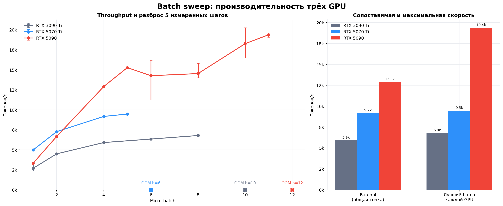
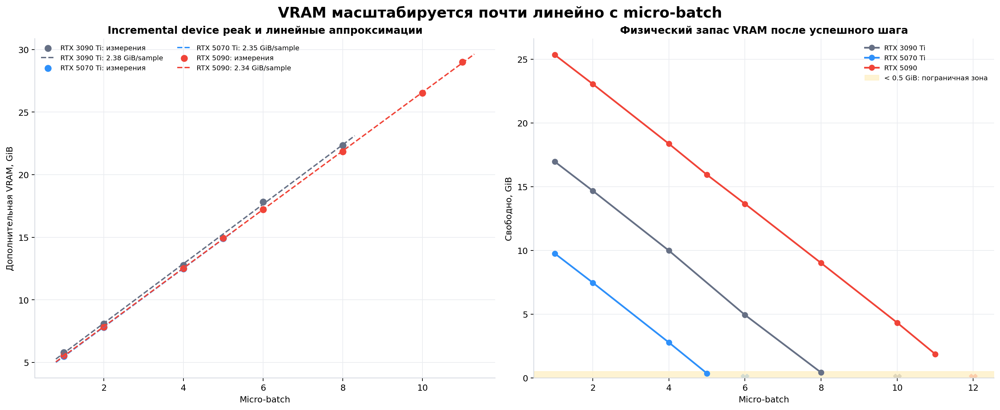
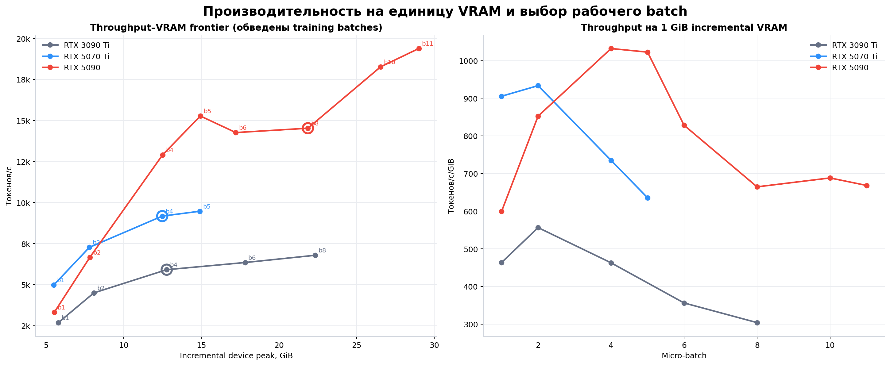
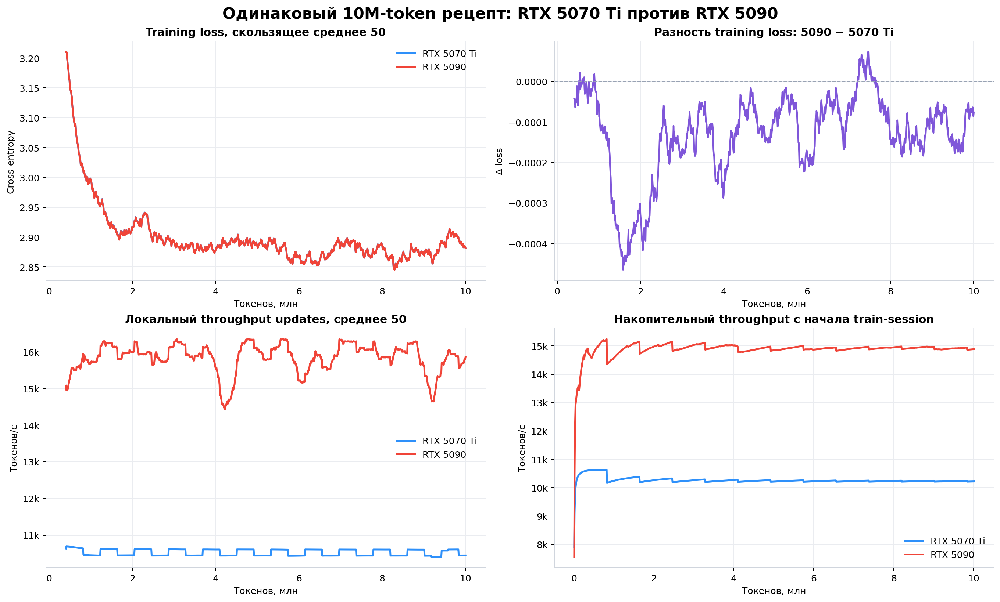
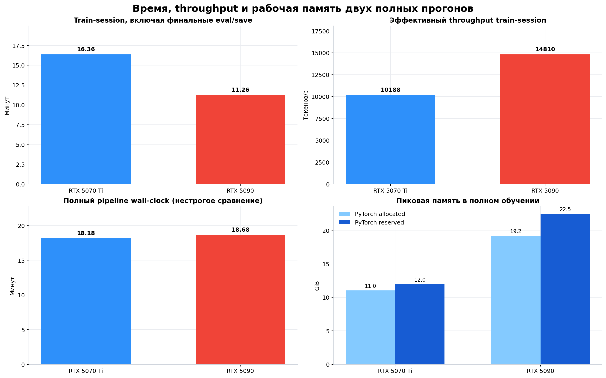
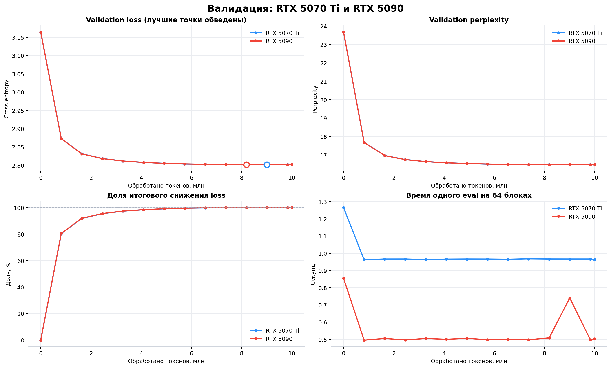
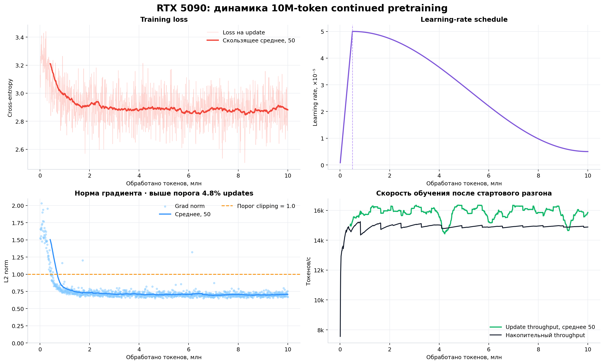
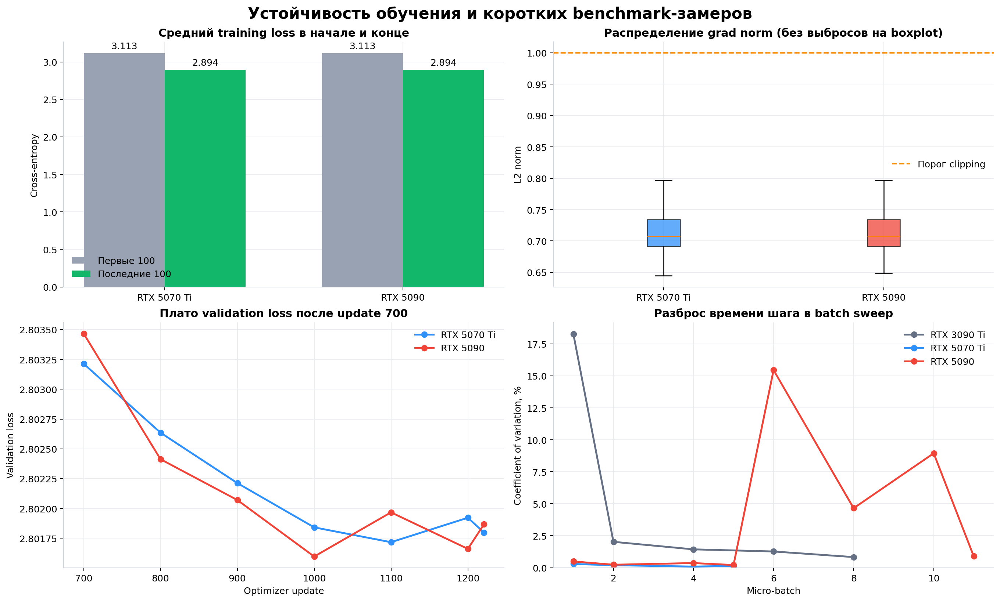

# Continued pretraining Qwen3-0.6B на RTX 5090 32 GB

# Подробный отчёт по запуску Vast.ai от 1 августа 2026 года

## **Архив с результатами:** https://disk.360.yandex.ru/d/K7NRa_jcWbSaLw  

**Статус:** эксперимент завершён успешно, результаты выгружены и проверены  
**Модель:** [`stellaathena/qwen3-0.6b-sweep-ot2.0-psn316`](https://huggingface.co/stellaathena/qwen3-0.6b-sweep-ot2.0-psn316)  
**GPU:** NVIDIA GeForce RTX 5090, фактически доступно 31.36 GiB VRAM  
**Бюджет обучения:** 10 000 000 input-токенов  
**Фактически обработано:** 10 002 432 токена за 1 221 optimizer update  
**Итоговый checkpoint:** `checkpoint-001221`  
**UTC-интервал полного pipeline:** `2026-08-01 10:24:44` — `10:43:25`  
**Train-session:** 675.37 с, включая финальные evaluation и save  


> Главный итог: RTX 5090 завершила тот же 10M-token рецепт, что и RTX 5070 Ti,
> за **11.26 минуты вместо 16.36 минуты**. Это ускорение в **1.454 раза** и
> сокращение времени train-session на **31.21%**, при практически идентичном
> validation loss. В batch sweep карта выдержала micro-batch 11; batch 12
> завершился ожидаемым OOM. Рабочий batch 8 выбран правильно: он сохраняет
> прежний effective batch и оставляет большой запас памяти.

---

## Содержание

1. [Краткие выводы](#1-краткие-выводы)
2. [Что именно можно сравнивать](#2-что-именно-можно-сравнивать)
3. [Источники и проверка целостности](#3-источники-и-проверка-целостности)
4. [Дизайн эксперимента](#4-дизайн-эксперимента)
5. [Аппаратная и программная среда](#5-аппаратная-и-программная-среда)
6. [Batch sweep RTX 5090](#6-batch-sweep-rtx-5090)
7. [Сравнение batch sweep на трёх GPU](#7-сравнение-batch-sweep-на-трёх-gpu)
8. [Линейная зависимость VRAM от batch](#8-линейная-зависимость-vram-от-batch)
9. [Скорость полного обучения](#9-скорость-полного-обучения)
10. [Качество и сходимость](#10-качество-и-сходимость)
11. [Устойчивость обучения](#11-устойчивость-обучения)
12. [Почему рабочий batch 8, а не 11](#12-почему-рабочий-batch-8-а-не-11)
13. [Практическая интерпретация для аренды GPU](#13-практическая-интерпретация-для-аренды-gpu)
14. [Ограничения и угрозы валидности](#14-ограничения-и-угрозы-валидности)
15. [Итоговые выводы](#15-итоговые-выводы)
16. [Воспроизведение анализа](#16-воспроизведение-анализа)

---

## 1. Краткие выводы

### 1.1. RTX 5090

- Все preflight-проверки пройдены, batch sweep закончен штатно, обучение имеет
  статус `complete`, итоговый checkpoint сохранён.
- Максимальный успешный micro-batch — **11**: `19 380.88 токенов/с` при
  физическом запасе `1 907.88 MiB`. Первая неуспешная точка — **batch 12**.
- На общей для всех GPU точке batch 4 RTX 5090 показала
  **12 906.45 токенов/с**: в `1.407×` быстрее RTX 5070 Ti и в `2.185×`
  быстрее локальной RTX 3090 Ti.
- На лучшей измеренной точке каждой карты RTX 5090 быстрее RTX 5070 Ti в
  `2.047×`, а RTX 3090 Ti — в `2.856×`. Это сравнение показывает пределы
  конкретного sweep, но не скорость одинакового training-рецепта.
- В полном 10M-token обучении использовался micro-batch 8 с accumulation 2.
  Эффективный throughput с учётом финальных eval/save —
  **14 810 токенов/с**.

### 1.2. Сходимость

- Validation loss снизился с `3.164724` до `2.801867` (`−11.466%`).
- Validation perplexity снизилась с `23.6822` до `16.4754` (`−30.431%`).
- Лучший validation loss, `2.801597`, получен на update 1000 после
  `8 192 000` токенов. Финальная точка хуже лучшей лишь на `0.000271`.
- `80.55%` итогового снижения validation loss получено уже к update 100,
  `91.93%` — к update 200. После примерно 6–8 млн токенов кривая выходит на
  узкое плато.

### 1.3. Сопоставимость RTX 5070 Ti и RTX 5090

- Оба полных прогона используют одну модель, один revision, один
  детерминированный train/validation split и одинаковые 8 192 токена на
  optimizer update.
- Финальные validation loss отличаются всего на `0.000069`, или примерно
  `0.0025%` от величины loss. Это не является содержательным различием.
- Training loss, градиенты и validation-траектории практически совпадают.
  Значит, переход с `batch 4 × accumulation 4` на `batch 8 × accumulation 2`
  сохранил поведение рецепта в пределах численного шума.

### 1.4. Важная оговорка про RTX 3090 Ti

Локально на RTX 3090 Ti был выполнен полноценный batch benchmark, но только
трёхшаговый training smoke-test на 6 144 токенах. Поэтому RTX 3090 Ti можно
корректно включать в сравнение throughput/VRAM, однако нельзя ставить её smoke
loss рядом с качеством 10M-token прогонов. В этом отчёте такое ложное сравнение
не делается.

---

## 2. Что именно можно сравнивать

| Слой доказательств | RTX 3090 Ti, локально | RTX 5070 Ti, Vast.ai | RTX 5090, Vast.ai |
|---|---|---|---|
| Batch sweep | Да, b1–b8; b10 OOM | Да, b1–b5; b6 OOM | Да, b1–b11; b12 OOM |
| Одинаковая модель и sequence length | Да | Да | Да |
| Полный бюджет 10M токенов | **Нет** | Да | Да |
| Число optimizer updates | Smoke: 3 | 1 221 | 1 221 |
| Validation trajectory | Нет | 14 точек | 14 точек |
| Корректное сравнение качества | Нет | Да, с RTX 5090 | Да, с RTX 5070 Ti |
| Корректное сравнение train-session | Нет | Да, с RTX 5090 | Да, с RTX 5070 Ti |

В отчёте используются три разных показателя времени:

1. **Batch benchmark throughput** — пять измеренных optimizer steps после двух
   warmup steps для каждого micro-batch.
2. **Train-session** — собственно обучение, периодические eval/checkpoint и
   финальные eval/save. Это главный показатель для сравнения двух полных
   прогонов.
3. **Полный pipeline wall-clock** — preflight, подготовка/чтение данных, весь
   batch sweep, baseline eval и train-session. Он зависит от ширины sweep,
   состояния кэша, диска и сети, поэтому между запусками сравнивается только как
   диагностическая величина.

---

## 3. Источники и проверка целостности

### 3.1. RTX 5090

Исходные файлы находятся в [`exports/`](exports/). Анализ построен по
машиночитаемым `benchmark.json`, `train_log.jsonl`, `eval_log.jsonl`,
`summary.json`, `environment.json` и полному run log, а не по переписанным
вручную цифрам.

| Архив | Размер | SHA-256 |
|---|---:|---|
| `qwen_vast_5090_full_20260801T135329Z.tar.gz` | 4 702 613 817 байт (4.38 GiB) | `be89250b66ef6797cf6b7efc03b2ff70904004ecd878d74eda4707a8a6a22548` |
| `qwen_vast_5090_metrics_20260801T135322Z.tar.gz` | 4 475 389 байт (4.27 MiB) | `f5772b7484a79c41c267c5b3d91fabd9b5ed096569dc1d3f6628c0853364b0be` |

Полный архив содержит последние checkpoints `checkpoint-001200` и
`checkpoint-001221`, включая веса модели и состояние optimizer. Metrics-only
архив достаточен для повторной аналитики, но не для продолжения обучения с
весов.

### 3.2. Сравнительные источники

- RTX 5070 Ti: локальный архив
  `rtx_5070_ti_16gb/qwen_vast_full_20260729T161440Z.tar.gz` и
  [предыдущий подробный отчёт](../rtx_5070_ti_16gb/REPORT.md).
- RTX 3090 Ti:
  [`continued_pretraining/local_rtx3090ti`](../../local_rtx3090ti/README.md),
  прежде всего `results/benchmark.json` и `results/training_smoke.json`.
- Все производные числа этого отчёта сохранены в
  [`derived_metrics.json`](reports/vast_20260801_5090/derived_metrics.json).
- Код расчёта и построения графиков:
  [`build_report.py`](reports/vast_20260801_5090/build_report.py).

---

## 4. Дизайн эксперимента

### 4.1. Зафиксированная идентичность

| Параметр | Значение |
|---|---|
| Model ID | `stellaathena/qwen3-0.6b-sweep-ot2.0-psn316` |
| Model revision | `8b6324aa8bd3fafedc4cf41817fb596cbe66837f` |
| Число параметров | 751 108 096 |
| Dataset | `HuggingFaceTB/smollm-corpus` |
| Subset | `fineweb-edu-dedup` |
| Dataset revision | `3ba9d605774198c5868892d7a8deda78031a781f` |
| Sequence length | 512 токенов |
| Shuffle/split seed | 42 |
| Dtype | BF16 |
| Attention | SDPA |
| Optimizer | `PagedAdamW8bit` |
| Gradient checkpointing | Выключен |

RTX 5070 Ti и RTX 5090 используют один и тот же подготовленный slice с SHA-256
`af93165446a7243a92151aeec6bd5bdb76e562600724ab016aa720820cb58ee6`.
Это важнее простого совпадения имени датасета: совпадает непосредственно
порядок и содержимое документов после выгрузки.

Локальный RTX 3090 Ti benchmark использовал меньший slice на 512 документов с
другим hash, но ту же pinned revision, модель и sequence length. Для измерения
памяти и скорости одного optimizer step это остаётся полезным инженерным
сравнением; для сравнения качества обучения — нет.

### 4.2. Данные полного прогона

| Показатель | Значение |
|---|---:|
| Всего документов | 20 512 |
| Train-документы | 20 000 |
| Validation-документы | 512 |
| Упакованные train-блоки | 39 941 |
| Уникальные train-токены | 20 449 792 |
| Упакованные validation-блоки | 978 |
| Validation-токены | 500 736 |
| Обработано в train | 10 002 432 токена |
| Доля единственного прохода по train-массиву | 48.91% |
| Токенов в одном eval | 32 768 |
| Доля validation-массива в одном eval | 6.54% |

Обучение закончилось раньше первого полного прохода по подготовленному
train-массиву: cycling по данным не было. Бюджет превышен на 2 432 токена
(`0.02432%`) из-за дискретности optimizer update размером 8 192 токена.

### 4.3. Гиперпараметры двух полных прогонов

| Параметр | RTX 5070 Ti | RTX 5090 |
|---|---:|---:|
| Micro-batch | 4 | 8 |
| Gradient accumulation | 4 | 2 |
| Последовательностей/update | 16 | 16 |
| Токенов/update | 8 192 | 8 192 |
| Optimizer updates | 1 221 | 1 221 |
| Max learning rate | 5e-5 | 5e-5 |
| Warmup | 5%, пик на update 61 | 5%, пик на update 61 |
| Scheduler | cosine, min ratio 0.1 | cosine, min ratio 0.1 |
| Weight decay | 0.01 | 0.01 |
| Adam β1 / β2 | 0.9 / 0.95 | 0.9 / 0.95 |
| Gradient clipping | 1.0 | 1.0 |
| Eval interval | 100 updates + final | 100 updates + final |
| Eval blocks | 64 | 64 |
| Save interval | 100 updates + final | 100 updates + final |

Такой контроль сохраняет размер optimizer update, learning-rate trajectory и
количество обновлений. Единственное содержательное отличие training batch —
разбиение одинаковых 16 последовательностей на physical micro-batches. Поэтому
результаты должны быть близкими, но не обязаны быть побитово идентичными.

---

## 5. Аппаратная и программная среда

| Параметр | RTX 3090 Ti, локально | RTX 5070 Ti, Vast.ai | RTX 5090, Vast.ai |
|---|---|---|---|
| VRAM по CUDA | 23.99 GiB | 15.47 GiB | 31.36 GiB |
| Compute capability | 8.6 | 12.0 | 12.0 |
| ОС | Windows 10, WDDM | Linux 6.8 | Linux 5.15 |
| PyTorch | 2.6.0+cu124 | 2.10.0a0 NV build | 2.10.0a0 NV build |
| CUDA в PyTorch | 12.4 | 13.1 | 13.1 |
| cuDNN | 9.1 | 9.17 | 9.17 |
| Transformers | 4.57.6 | 4.57.6 | 4.57.6 |
| Datasets | 4.3.0 | 4.3.0 | 4.3.0 |
| bitsandbytes | 0.49.2 | 0.49.2 | 0.49.2 |
| NVIDIA driver | 560.94 | 595.58.03 | 580.159.03 |
| Power limit из `nvidia-smi` | Не зафиксирован | 300 W | 575 W |

На RTX 5090 PyTorch был собран с CUDA 13.1, тогда как bitsandbytes 0.49.2 не
содержал бинарник `cuda131`. Перед запуском был применён документированный в
проекте override `BNB_CUDA_VERSION=130`; preflight подтвердил работоспособность
optimizer, а затем benchmark и полный train успешно завершились. Это не
симуляция другой GPU: override выбирает совместимую native-библиотеку
bitsandbytes, сама модель продолжает работать на фактической RTX 5090.

Сравнение RTX 3090 Ti с Blackwell-картами не идеально контролируется из-за
Windows/WDDM, другой версии PyTorch/CUDA и другого хоста. Поэтому точные
speedup-коэффициенты следует трактовать как результат этих конкретных систем,
а не как универсальный паспортный рейтинг GPU.

---

## 6. Batch sweep RTX 5090

Каждая успешная точка содержит два warmup steps и пять измеренных optimizer
steps. Sequence length во всех случаях равен 512, optimizer и precision не
менялись.

| Micro-batch | Время шага, с | Throughput, токенов/с | Incremental device peak, MiB | Полный device peak, MiB | Физический запас, MiB | Статус |
|---:|---:|---:|---:|---:|---:|---|
| 1 | 0.15442 | 3 315.58 | 5 664 | 6 171.25 | 25 937.88 | OK |
| 2 | 0.15363 | 6 665.52 | 8 008 | 8 515.25 | 23 593.88 | OK |
| 4 | 0.15868 | 12 906.45 | 12 806 | 13 313.25 | 18 795.88 | OK |
| 5 | 0.16766 | 15 269.21 | 15 292 | 15 799.25 | 16 309.88 | OK |
| 6 | 0.21542 | 14 260.36 | 17 630 | 18 137.25 | 13 971.88 | OK |
| 8 | 0.28198 | 14 525.67 | 22 382 | 22 889.25 | 9 219.88 | OK |
| 10 | 0.28035 | 18 263.19 | 27 174 | 27 681.25 | 4 427.88 | OK |
| 11 | 0.29060 | **19 380.88** | 29 694 | 30 201.25 | 1 907.88 | OK |
| 12 | — | — | — | — | — | **OOM** |

OOM на batch 12 является ожидаемой границей sweep, а не сбоем эксперимента.
PyTorch пытался выделить ещё 3.47 GiB при 3.12 GiB физически свободной памяти.
Процесс уже занимал 26.73 GiB; конфигурация `cuda_memory_fraction=0.9`
ограничивала PyTorch величиной 28.22 GiB. После этой точки sweep штатно
остановился, а обучение продолжилось на заранее выбранном batch 8.



### 6.1. Почему throughput не строго монотонен

На b6 и b8 измеренная скорость ниже b5, а на b10 снова резко возрастает. В
самих пяти измеренных шагах b6/b8 также заметен больший разброс. Это может быть
следствием краткости benchmark, динамических частот GPU, синхронизаций,
allocator state и особенностей kernel selection.

Пять шагов — хороший инженерный smoke benchmark, но недостаточная выборка для
микроархитектурного вывода. Поэтому:

- абсолютный максимум b11 считаем измеренным максимумом именно этого запуска;
- локальные провалы b6/b8 не интерпретируем как устойчивую регрессию;
- для межкарточного сравнения отдельно показываем общую точку b4 и фактическую
  скорость полного train-session.

---

## 7. Сравнение batch sweep на трёх GPU

### 7.1. Throughput

| Micro-batch | RTX 3090 Ti | RTX 5070 Ti | RTX 5090 | 5090 / 5070 Ti | 5090 / 3090 Ti |
|---:|---:|---:|---:|---:|---:|
| 1 | 2 682.20 | **4 975.70** | 3 315.58 | 0.666× | 1.236× |
| 2 | 4 493.15 | **7 266.86** | 6 665.52 | 0.917× | 1.483× |
| 4 | 5 907.32 | 9 171.09 | **12 906.45** | **1.407×** | **2.185×** |
| 5 | — | 9 468.14 | **15 269.21** | 1.613× | — |
| 6 | 6 343.29 | OOM | **14 260.36** | — | 2.248× |
| 8 | 6 785.22 | — | **14 525.67** | — | 2.141× |
| 10 | OOM | — | **18 263.19** | — | — |
| 11 | — | — | **19 380.88** | — | — |
| 12 | — | — | OOM | — | — |

На b1 и b2 RTX 5090 неожиданно уступает RTX 5070 Ti. Нельзя делать из этого
вывод, что RTX 5090 хуже на малых batches: замер состоит лишь из пяти шагов и
сделан на другом хосте/driver instance. При b4 нагрузка уже достаточна, и RTX
5090 выходит вперёд. Полный train подтверждает преимущество 5090 на реальной
продолжительной нагрузке.

### 7.2. Границы памяти и лучшие точки

| GPU | Максимальный успешный batch | Первый OOM | Лучший throughput | Batch лучшей точки | Запас на максимальном batch |
|---|---:|---:|---:|---:|---:|
| RTX 3090 Ti | 8 | 10 | 6 785.22 токенов/с | 8 | 423.12 MiB |
| RTX 5070 Ti | 5 | 6 | 9 468.14 токенов/с | 5 | 354.50 MiB |
| RTX 5090 | **11** | 12 | **19 380.88 токенов/с** | 11 | 1 907.88 MiB |

Лучшие сырые точки дают следующие отношения:

- RTX 5070 Ti / RTX 3090 Ti: `1.395×`;
- RTX 5090 / RTX 5070 Ti: `2.047×`;
- RTX 5090 / RTX 3090 Ti: `2.856×`.

Это отношения разных micro-batches и, следовательно, верхние точки
производительности в заданном sweep. Для одинакового batch 4 коэффициенты
консервативнее: `1.552×`, `1.407×` и `2.185×` соответственно.

---

## 8. Линейная зависимость VRAM от batch

В качестве основной памяти используется `incremental_device_peak_mib`: разница
между полным CUDA device usage в пике и занятостью устройства до загрузки
worker-модели. Эта величина включает память вне PyTorch allocator и поэтому
лучше подходит для практического предсказания OOM, чем один только
`torch.cuda.max_memory_allocated()`.

Линейные аппроксимации по успешным точкам:

| GPU | Формула incremental VRAM, MiB | R² | Цена +1 sample |
|---|---|---:|---:|
| RTX 3090 Ti | `3437.8 + 2437.3 × batch` | 0.999719 | 2.380 GiB |
| RTX 5070 Ti | `3189.9 + 2406.2 × batch` | 0.999922 | 2.350 GiB |
| RTX 5090 | `3237.4 + 2399.0 × batch` | **0.999970** | 2.343 GiB |



Главный результат здесь не только высокий R². Наклоны трёх систем отличаются
максимум на **1.60%** относительно минимального. Несмотря на разные поколения
GPU, ОС и CUDA stack, дополнительная память на один sample почти неизменна.
Следовательно, для фиксированных модели, optimizer, precision и sequence length
зависимость памяти от micro-batch действительно близка к линейной.

Практическая модель для RTX 5090:

```text
incremental VRAM ≈ 3237 MiB + 2399 MiB × micro_batch
```

Она надёжно описывает успешные точки b1–b11, но экстраполяцию нельзя считать
гарантией запуска: рядом с пределом влияют allocator fragmentation,
`cuda_memory_fraction`, фоновое использование устройства и размер отдельных
временных allocations.



---

## 9. Скорость полного обучения

### 9.1. Сопоставимое сравнение train-session

| Метрика | RTX 5070 Ti | RTX 5090 | Изменение |
|---|---:|---:|---:|
| Чистый train log до последнего update | 979.01 с | 672.05 с | −31.35% |
| Session с финальными eval/save | 981.83 с | **675.37 с** | **−31.21%** |
| То же в минутах | 16.36 | **11.26** | −5.11 мин |
| Итоговый cumulative train TPS | 10 216.84 | **14 883.37** | 1.457× |
| Effective TPS с финальными eval/save | 10 187.52 | **14 810.41** | **1.454×** |
| Медианный update TPS после первых 20 updates | 10 607.82 | **16 364.79** | 1.543× |
| P10–P90 update TPS | 10 600–10 617 | 13 763–16 746 | — |
| Медианное время periodic eval | 0.966 с | **0.500 с** | 1.930× быстрее |
| Peak PyTorch allocated | 11.02 GiB | 19.19 GiB | +8.17 GiB |
| Peak PyTorch reserved | 11.96 GiB | 22.47 GiB | +10.51 GiB |

Train-session — наиболее честное итоговое сравнение, потому что обе карты
обработали одинаковые 10 002 432 токена, сделали одинаковые 1 221 updates и
выполнили одинаковый eval/save schedule.

Медианный локальный update TPS выше итогового effective TPS, особенно на RTX
5090, потому что длительности updates рядом с evaluation/checkpoint включают
дополнительные паузы. Итоговый cumulative показатель учитывает весь ход
train-session и лучше отвечает на вопрос «сколько времени занял эксперимент».



### 9.2. Почему полный pipeline не ускорился

| Метрика | RTX 5070 Ti | RTX 5090 |
|---|---:|---:|
| Полный pipeline wall-clock | 1 091 с (18.18 мин) | 1 121 с (18.68 мин) |
| Условные токены / полный wall-clock | 9 168 | 8 923 |

Если посмотреть только на start/finish run log, RTX 5090 выглядит на `2.75%`
медленнее. Это не противоречит ускорению обучения:

- RTX 5070 Ti проверяла b1, b2, b4, b5 и OOM b6;
- RTX 5090 проверяла восемь успешных batches от b1 до b11 и OOM b12;
- подготовка процесса, модельные загрузки, preflight, dataset cache и дисковый
  I/O не нормированы между разными Vast-инстансами.

У RTX 5090 вне train-session осталось около 445.6 с полного pipeline, у RTX
5070 Ti — около 109.2 с. Почти вся разница объясняется не обучением, а разным
объёмом предварительной работы. Поэтому полный wall-clock приведён для аудита,
но не используется как рейтинг GPU.



---

## 10. Качество и сходимость

### 10.1. Validation

| Метрика | RTX 5070 Ti | RTX 5090 | Разность 5090 − 5070 Ti |
|---|---:|---:|---:|
| Baseline validation loss | 3.164724 | 3.164724 | +0.00000006 |
| Final validation loss | **2.801798** | 2.801867 | +0.000069 |
| Относительное снижение loss | −11.4678% | −11.4657% | +0.0022 п.п. |
| Baseline perplexity | 23.6822 | 23.6822 | +0.000001 |
| Final perplexity | **16.4742** | 16.4754 | +0.00114 |
| Относительное снижение perplexity | −30.4362% | −30.4314% | +0.0048 п.п. |
| Лучший validation loss | 2.801717 | **2.801597** | −0.000120 |
| Update лучшей точки | 1 100 | 1 000 | −100 |
| Токенов до лучшей точки | 9.0112 млн | 8.1920 млн | −0.8192 млн |
| Final − best loss | 0.000081 | 0.000271 | — |

RTX 5070 Ti немного лучше в финальной точке, а RTX 5090 — в лучшей точке.
Знаки различий меняются, сами различия порядка `10⁻⁴`, прогон для каждой карты
только один, а каждый eval использует лишь 64 из 978 validation-блоков. Это
численный шум/вариативность порядка вычислений, а не доказательство разницы в
качестве.

### 10.2. Где получено улучшение

| Доля финального снижения validation loss | RTX 5070 Ti | RTX 5090 |
|---|---:|---:|
| К update 100 (0.8192 млн токенов) | 80.45% | **80.55%** |
| К update 200 (1.6384 млн токенов) | 91.84% | **91.93%** |



После update 700 обе кривые колеблются в очень узком диапазоне. На RTX 5090
лучшее значение получено на update 1000; следующие 1.81 млн токенов не улучшили
финальную точку. Это даёт рабочую гипотезу: для следующей серии с тем же
датасетом можно проверить budget 8–9 млн токенов или раннюю остановку.

Но делать 8.2 млн новым «оптимумом» пока рано: нужен минимум повтор с другим
seed и более широкий validation/downstream evaluation. Текущая разница слишком
мала для статистического вывода.

### 10.3. Training loss

| Метрика | RTX 5070 Ti | RTX 5090 |
|---|---:|---:|
| Средний loss первых 100 updates | 3.113285 | 3.113254 |
| Средний loss последних 100 updates | 2.893865 | 2.893745 |
| Изменение среднего | −7.0478% | −7.0508% |
| Минимальный single-update loss | 2.504424 | 2.504196 |
| Update минимума | 1009 | 1009 |

Даже minimum single-update loss возникает на одном update у обеих карт. Это
сильное подтверждение того, что фактический порядок данных и optimizer
trajectory сохранились. Single-update loss остаётся шумной метрикой, поэтому
основной вывод делается по rolling mean и validation.



---

## 11. Устойчивость обучения

| Метрика | RTX 5070 Ti | RTX 5090 |
|---|---:|---:|
| Median grad norm | 0.7070 | 0.7070 |
| Maximum grad norm | 4.5938 | 2.0312 |
| Updates с pre-clip norm > 1.0 | 4.832% | 4.750% |
| Mean grad norm, первые 100 | 1.1863 | 1.1854 |
| Mean grad norm, последние 100 | 0.7045 | 0.7048 |
| NaN/Inf / аварийное завершение | Нет | Нет |

Градиентное поведение почти идентично. Повышенные нормы сосредоточены в начале
warmup/адаптации, после чего rolling mean стабилизируется около 0.70–0.75.
Редкие значения выше порога контролируются clipping. Меньший максимум на 5090
не следует интерпретировать как преимущество карты: разбиение accumulation и
порядок floating-point reductions различаются.



---

## 12. Почему рабочий batch 8, а не 11

Batch 11 дал лучший короткий throughput, но эксперимент намеренно обучался на
batch 8.

### Причина 1: одинаковый effective batch

Рецепт RTX 5070 Ti использовал `4 × 4 = 16` последовательностей на update.
Для RTX 5090 конфигурация `8 × 2 = 16` сохраняет ровно тот же размер update —
8 192 токена.

С micro-batch 11 целочисленный accumulation даёт либо 11, либо 22
последовательности. Это уже другой optimizer batch, а значит меняется не только
скорость, но и статистика градиента. Тогда сравнение качества перестаёт быть
чистым.

### Причина 2: запас памяти

- b8 в benchmark оставляет `9 219.88 MiB` физического запаса;
- b11 оставляет `1 907.88 MiB`;
- b12 уже OOM.

Длительное обучение включает состояния allocator, eval и сохранения, которых
короткий worker benchmark полностью не моделирует. b8 существенно снижает риск
дорогого аварийного завершения арендованного инстанса.

### Причина 3: короткий sweep шумный

b11 — всего пять измеренных шагов. Его throughput полезен как оценка верхней
границы, но для выбора производственного режима важнее воспроизводимость и
контролируемый experiment design.

Итог: **batch 8 — правильный выбор для сравнительного прогона**. Если цель
следующего запуска будет только максимальная скорость, а не строгое сравнение,
имеет смысл отдельно провести более длинный benchmark b8/b10/b11 и затем
подобрать effective batch и learning rate как новую конфигурацию.

---

## 13. Практическая интерпретация для аренды GPU

### 13.1. Когда RTX 5090 выгоднее RTX 5070 Ti

Для одинакового 10M-token train-session время отличается в `1.454×`. Если
почасовые цены равны `P₅₀₇₀` и `P₅₀₉₀`, то стоимость собственно обучения
сравнивается как:

```text
cost_5090 / cost_5070 = (P_5090 / P_5070) / 1.454
```

Следовательно, RTX 5090 дешевле для этого train-session, если её почасовая цена
меньше примерно `1.454 ×` цены RTX 5070 Ti. Например, при 5070 Ti за $0.20/ч
точка равной стоимости для 5090 — около $0.291/ч.

Это правило относится к повторному обучению с уже готовым bundle/cache.
Одноразовый расширенный batch sweep на 5090 занял заметную долю полного
pipeline. Для следующих запусков после подтверждения конфигурации его можно
сократить до нескольких целевых batches или пропустить, если среда полностью
повторяется.

### 13.2. Что оптимизировать в следующем запуске

1. Оставить контрольную точку b8 и измерить b10/b11 не пять, а 30–100 шагов.
2. Отделить benchmark от оплачиваемого полного train, чтобы после выбора batch
   не повторять широкий sweep.
3. Логировать среднюю мощность и энергопотребление, а не только power limit.
4. Сохранять точную цену инстанса и timestamps стадий в `summary.json`, тогда
   отчёт сможет считать не только скорость, но и реальную стоимость.
5. Добавить downstream evaluation и несколько seeds, если задача — оценивать
   качество/устранение нежелательного поведения, а не только in-domain loss.

### 13.3. Что не следует делать

- Не выбирать batch только по формальному отсутствию OOM: у RTX 5070 Ti b5 и
  у RTX 3090 Ti b8 оставалось менее 0.5 GiB.
- Не использовать полный pipeline wall-clock как прямой рейтинг GPU, если
  sweep и cache различаются.
- Не сравнивать 3090 Ti smoke loss с 10M-token validation loss.
- Не утверждать, что модель стала лучше в широком смысле только по 64
  фиксированным validation-блокам.

---

## 14. Ограничения и угрозы валидности

### 14.1. Один прогон на карту

RTX 5070 Ti и RTX 5090 представлены одним полным run каждая. Нет оценки
межзапусковой дисперсии и нескольких seeds. Разницы loss порядка `10⁻⁴` нельзя
считать статистически значимыми.

### 14.2. Короткий batch benchmark

На batch приходится только пять measured steps. Error bars на графике —
фактический min/max throughput этих пяти шагов, а не confidence interval.
Особенно заметная вариативность b6/b8 на RTX 5090 требует более длинного
повторного benchmark перед эксплуатационным выбором максимального режима.

### 14.3. Разные hosts и software stacks

RTX 3090 Ti работала под Windows/WDDM и другим PyTorch/CUDA stack. Vast-прогоны
также находились на разных хостах и драйверах. Сравнение отражает фактические
end-to-end системы, но не изолирует только микроархитектуру GPU.

### 14.4. Узкий validation

Один evaluation использует 32 768 токенов, или 6.54% подготовленного
validation-массива. Используется фиксированный срез, что хорошо для сравнения
траекторий, но недостаточно для общей оценки языковой модели.

### 14.5. Нет downstream и safety/poisoning evaluation

Эксперимент измеряет cross-entropy/perplexity на in-domain validation. В нём
нет задач на reasoning, генерацию, factuality, safety или специфического теста
на нежелательное/внедрённое поведение исходной модели. Поэтому из снижения loss
нельзя заключить, что такое поведение устранено или что общее качество модели
выросло.

### 14.6. Нет телеметрии стоимости и энергии

В артефактах есть power limit, но нет временного ряда фактической мощности и
почасовой цены Vast-инстанса. Энергетическая и денежная эффективность могут
быть оценены только формулой, а не восстановлены как факт.

---

## 15. Итоговые выводы

1. **Пайплайн на RTX 5090 полностью работоспособен.** Preflight, bitsandbytes
   override, batch sweep, baseline eval, 1 221 updates и checkpointing
   завершились штатно.
2. **Практическая граница micro-batch для данного стека — между 11 и 12.** b11
   успешен, b12 воспроизводимо OOM.
3. **Память практически линейна по batch.** Для RTX 5090 прирост составляет
   около 2.343 GiB/sample, R² = 0.999970. Наклоны всех трёх карт отличаются не
   более чем на 1.60%.
4. **На общей точке b4 RTX 5090 быстрее RTX 5070 Ti в 1.407× и RTX 3090 Ti в
   2.185×.** На максимальных точках sweep отношения выше, но batches различны.
5. **Полный сопоставимый train ускорился в 1.454×.** Время сократилось с 16.36
   до 11.26 минуты, effective throughput вырос с 10 188 до 14 810 токенов/с.
6. **Качество двух полных прогонов эквивалентно в разрешении этого eval.** Их
   финальный validation loss отличается на 0.000069, а training trajectories
   почти совпадают.
7. **Рабочий batch 8 выбран обоснованно.** Он сохраняет 8 192 токена/update и
   большой запас VRAM; b11 полезен как performance ceiling, но меняет effective
   batch или требует другого recipe design.
8. **Локальная RTX 3090 Ti остаётся корректной benchmark-базой, но не базой
   качества.** Её training run был только smoke-test на три updates.
9. **Следующая сильная итерация — не просто ещё один длинный train.** Полезнее
   сначала удлинить benchmark b8/b10/b11, добавить несколько seeds и более
   широкий evaluation, затем решить, нужен ли бюджет после 8–9 млн токенов.

---

## 16. Воспроизведение анализа

Графики и `derived_metrics.json` генерируются одной командой из корня
репозитория:

```powershell
python continued_pretraining\vast_ai_single_gpu\rtx_5090_32gb\reports\vast_20260801_5090\build_report.py
```

Скрипт читает:

- распакованные metrics/full exports RTX 5090 из `rtx_5090_32gb/exports/`;
- локальный full-архив RTX 5070 Ti либо временный извлечённый cache в
  `.dist/report_5090_sources/rtx5070/`;
- JSON-артефакты локального RTX 3090 Ti эксперимента.

Выходные файлы:

| Файл | Назначение |
|---|---|
| [`derived_metrics.json`](reports/vast_20260801_5090/derived_metrics.json) | Все исходные ссылки, производные метрики и коэффициенты сравнений |
| [`01_training_dynamics_5090.png`](reports/vast_20260801_5090/01_training_dynamics_5090.png) | Loss, LR, grad norm и throughput RTX 5090 |
| [`02_validation_convergence.png`](reports/vast_20260801_5090/02_validation_convergence.png) | Loss, perplexity, доля improvement и eval time |
| [`03_batch_throughput_comparison.png`](reports/vast_20260801_5090/03_batch_throughput_comparison.png) | Batch throughput трёх GPU и OOM-границы |
| [`04_memory_scaling_comparison.png`](reports/vast_20260801_5090/04_memory_scaling_comparison.png) | Линейные VRAM fits и физический запас |
| [`05_training_5070_vs_5090.png`](reports/vast_20260801_5090/05_training_5070_vs_5090.png) | Сопоставление двух 10M-token trajectories |
| [`06_runtime_and_efficiency.png`](reports/vast_20260801_5090/06_runtime_and_efficiency.png) | Время, effective throughput и training memory |
| [`07_capacity_efficiency_frontier.png`](reports/vast_20260801_5090/07_capacity_efficiency_frontier.png) | Throughput–VRAM frontier и выбранные batches |
| [`08_stability_and_distributions.png`](reports/vast_20260801_5090/08_stability_and_distributions.png) | Gradients, plateau и вариативность benchmark |

Все числовые выводы отчёта должны обновляться только после повторного запуска
скрипта на новых исходных логах; ручное смешивание метрик разных runs не
рекомендуется.
