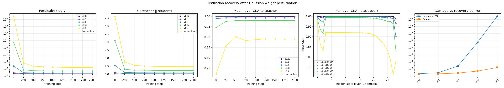

# Результаты эксперимента «повреждение → восстановление дистилляцией»

> **Суть эксперимента.** Берём чистого предобученного учителя `T` (Qwen3-Base),
> повреждаем копию гауссовским шумом по весам `S = T + α·σ(W)·ε`, а затем
> дистиллируем `S` обратно к `T` на FineWeb-Edu (смешанный лосс: off-policy
> forward-KL + on-policy reverse-KL по коротким роллаутам, с убыванием β 1.0→0.4).
> Замеряем три вещи: **перплексию** (выучил ли заново язык), **KL до учителя**
> (вернулось ли поведение) и **послойный linear CKA** (вернулась ли внутренняя
> геометрия представлений). Главный искомый результат — **α\***: уровень шума,
> при котором поведение восстанавливается, а представления (CKA) — уже нет.
>
> Документ состоит из трёх разделов:
> 1. **Smoke-тесты** — быстрая проверка, что весь пайплайн работает (CPU).
> 2. **Старый прогон на Qwen3-1.7B** (`full_a0.05`) — первый «боевой» запуск на GPU.
> 3. **Полный α-свип на Qwen3-0.6B** — основной научный результат.

---

## Важно про метрики и сопоставимость чисел

- **Перплексия (PPL)** — экспонента средней кросс-энтропии на отложенных блоках.
  Чем ниже, тем лучше модель предсказывает реальный текст. У учителя есть свой
  «пол» (floor) — это лучшее достижимое значение.
- **Floor зависит от конфига**, и числа из разных прогонов сравнивать напрямую
  нельзя: floor учителя = 28.5 в smoke (seq 256, `min_score 0`), 17.7 в 0.6B-свипе
  (seq 256, `min_score 2.5`), 11.3 в 1.7B-прогоне (seq 1024, `min_score 2.5`).
  Разные длина контекста, фильтр качества данных и размер eval-набора → разный
  floor. **Сравнивать имеет смысл только внутри одного прогона** (post-noise →
  финал относительно своего floor).
- **KL(учитель‖ученик)** — поведенческая дистанция: 0 = ученик предсказывает
  ровно то же распределение, что учитель.
- **CKA** (linear Centered Kernel Alignment) на скрытых состояниях по слоям:
  1.0 = геометрия активаций идентична учительской. CKA инвариантен к поворотам и
  масштабированию, поэтому корректно отвечает на вопрос «считает ли ученик внутри
  то же самое», в отличие от бессмысленного сравнения весов «в лоб».

---

# 1. Smoke-тесты (проверка пайплайна, CPU)

> **Цель этих прогонов — НЕ научный результат**, а доказательство, что весь
> конвейер работает от начала до конца на новейшей архитектуре Qwen3 и что метрики
> ведут себя осмысленно. Тем не менее даже здесь воспроизводятся ключевые эффекты.

**Модель:** `Qwen3-0.6B-Base`. **Данные:** срез FineWeb-Edu (15k документов,
закэширован локально). seq_len 256, batch 2, CPU fp32.

**Общая стартовая точка:**
- Учитель = чистый `Qwen3-0.6B-Base`, **floor PPL = 28.54** на этом срезе.
- Ученик = учитель + гауссовский шум, **α = 0.2**.
- Шум затронул **197 весовых матриц (~100% параметров)**; пропущены только
  крошечные 1-D параметры нормировок и смещений (~65 тыс.).
- Якоря: `teacher_baseline` (шаг −1: CKA≡1, KL≡0 — проверка корректности метрик) и
  `post_noise` (шаг 0: повреждение до обучения).

### Прогон 1 — off-policy дистилляция, 150 шагов (чистое восстановление)

`mode: off_policy`, forward-KD + убывающая CE, lr 7e-5.

| шаг | PPL | KL(T‖S) | KL(S‖T) | mean CKA |
|---:|---:|---:|---:|---:|
| floor учителя | 28.54 | 0.000 | 0.000 | 1.000 |
| 0 (post-noise) | **445.70** | 2.488 | 3.250 | 0.991 |
| 30  | 73.60 | 0.845 | 1.063 | 0.993 |
| 60  | 79.20 | 0.967 | 1.251 | 0.992 |
| 90  | 69.10 | 0.739 | 0.901 | 0.993 |
| 120 | 61.15 | 0.629 | 0.787 | 0.993 |
| 150 | **60.48** | **0.603** | 0.752 | 0.993 |

**Интерпретация.** Шум при α=0.2 ухудшил перплексию в **~16 раз** (28.5 → 445.7) —
с точки зрения выхода модель «сломана». Off-policy forward-KD чисто и
монотонно её восстанавливает: PPL **446 → 60**, KL до учителя **2.49 → 0.60**
(−76%), при этом CKA всё время держится ~0.99. Кривая на шаге 150 ещё снижается —
полноценный прогон (больше шагов, тюнинг lr) закрыл бы остаток зазора до floor’а.
Главное: **forward-KL на реальном тексте — самый надёжный способ "поднять" сильно
повреждённую модель**, потому что градиентный сигнал идёт от полного мягкого
распределения учителя, а не от одного one-hot токена.

### Прогон 2 — mixed-режим с on-policy warmup, 90 шагов

`mode: mixed`, `on_policy_warmup_frac: 0.4` (первые 40% шагов — только off-policy,
чтобы сперва починить модель, затем подмешиваются роллауты ученика), on-policy член
на reverse-KL.

| шаг | PPL | KL(T‖S) | KL(S‖T) | mean CKA |
|---:|---:|---:|---:|---:|
| 0 (post-noise) | 445.70 | 2.488 | 3.250 | 0.991 |
| 30 (ещё warmup) | 73.60 | 0.842 | 1.065 | 0.993 |
| 60 (on-policy включился) | 76.57 | 0.946 | 1.111 | 0.992 |
| 90 | **72.79** | **0.877** | 1.022 | 0.993 |

**Интерпретация — фикс «холодного старта» работает.** На старом Qwen2.5 *чистый*
on-policy делал только хуже (PPL 143 → 359): сломанная модель генерит мусорные
роллауты и дистиллируется из собственного мусора. Здесь же с 40%-warmup ученик уже
починен off-policy (PPL 73 к шагу 30) **до** того, как начинаются роллауты,
поэтому при включении on-policy PPL лишь слегка колеблется (73 → 77 → 73), а **CKA
не падает** (0.99). Вывод, заложенный в основной конфиг: **сначала чиним
off-policy, потом включаем on-policy** против exposure bias.


### Что уже видно из smoke

1. **Дистилляция реально восстанавливает повреждённую модель** (Прогон 1
   однозначен: 446 → 60 PPL, 2.49 → 0.60 KL, монотонно, CKA сохранён).
2. **CKA показывает то, что прячет перплексия.** При α=0.2 выход разрушен (PPL
   ×16), а представления почти не сдвинулись (CKA 0.991) — поведение и внутренняя
   геометрия развязаны. Именно поэтому мы меряем CKA на активациях, а не веса.
3. **On-policy нужен warmup** — иначе холодный старт на сломанной модели.

---

# 2. Старый прогон на Qwen3-1.7B (`full_a0.05`)

> Первый «боевой» запуск на RTX 3090 Ti. Конфиг
> [`configs/full_3090ti.yaml`](configs/full_3090ti.yaml): `Qwen3-1.7B-Base`,
> seq_len 1024, `min_score 2.5`, mixed-GKD, 30%-warmup, β 1.0→0.4 (cosine),
> 4000 шагов, `adamw8bit` + gradient checkpointing. **Время: ~19 часов.**

**Параметры повреждения:** α = **0.05** (малый шум — «лёгкая царапина»).
Floor учителя на этом конфиге — **PPL 11.27**.

| шаг | PPL | KL(T‖S) | mean CKA |
|---:|---:|---:|---:|
| floor учителя | 11.27 | 0.000 | 1.000 |
| 0 (post-noise) | **12.49** | 0.110 | 0.998 |
| 500  | 11.47 | 0.026 | 0.998 |
| 1000 | 11.41 | 0.025 | 0.997 |
| 2000 | 11.39 | 0.029 | 0.997 |
| 3000 | 11.34 | 0.026 | 0.997 |
| 4000 | **11.33** | **0.026** | 0.997 |

Послойный CKA (29 значений, слой 0 = эмбеддинги, слой 28 = верхний):
почти везде 1.000; **минимум — в самом глубоком слое 28**: post-noise 0.985 → финал
0.982.


### Подробная интерпретация

**1. α=0.05 — это лёгкое повреждение, и оно сразу подтверждает гипотезу об
устойчивости.** Шум сдвинул модель совсем чуть-чуть: PPL +11% (против ×16 при
α=0.2), KL 0.11, CKA 0.998. То есть при малых α предобученное решение Qwen3
устойчиво — возмущение почти не выбивает модель из её «бассейна притяжения».

**2. Восстановление почти мгновенное, дальше — плато.** Уже к шагу 500 PPL=11.47,
KL=0.026 — то есть **первые 500 из 4000 шагов сделали почти всю работу**, а
оставшиеся 3500 шагов (≈16 часов из 19!) лишь микро-шлифовали 11.47 → 11.33.
Практический вывод: при малом уроне восстановление логарифмически насыщается, и
4000 шагов — сильно избыточно. Финал 11.33 против floor’а 11.27 — зазор всего
0.06, по сути полный возврат поведения.

**3. Самое интересное — послойный CKA.** Урон сконцентрирован почти полностью в
**глубочайшем слое (28-м)**: там CKA 0.985, тогда как слои 0–20 стоят на 1.000. И
ключевой момент: дистилляция **не подняла** CKA этого слоя (0.985 → 0.982, даже
чуть ниже), хотя PPL/KL восстановились идеально. Это — в миниатюре — центральная
идея всего эксперимента: **поведение (PPL/KL) и внутренняя геометрия (CKA)
развязаны**. Модель вернулась к поведению учителя, не возвращаясь полностью к его
представлениям в верхних слоях. При α=0.05 эффект крошечный, но он того же знака,
что и драматичный обвал CKA при больших α (см. раздел 3).

**4. Режимы.** Из залогированных шагов 502 off-policy / 298 on-policy (≈37%
on-policy после 30%-warmup) — рецепт «сначала off-policy, потом роллауты»
отработал без коллапса.

**Вывод по разделу:** `full_a0.05` — это чистый **нижний якорь** свипа. Он
доказывает, что (а) пайплайн на 1.7B работает на реальном железе, (б) при малом α
модель устойчива и полностью восстанавливается по поведению за ~500 шагов,
(в) лёгкий несхлопывающийся след в CKA верхнего слоя — первый намёк на главный
эффект. Для научного результата нужны средние и большие α — это раздел 3.
Остальные ячейки 1.7B-свипа (α=0.1/0.2/0.35/0.5) не считались: ~19 ч каждая.

---

# 3. Полный α-свип на Qwen3-0.6B (основной результат)

> Конфиг [`configs/sweep_qwen3_0.6b.yaml`](configs/sweep_qwen3_0.6b.yaml):
> `Qwen3-0.6B-Base`, mixed-GKD, 30%-warmup, β 1.0→0.4 (cosine), 2000 шагов на
> каждую α. Результаты в `results/sweep_qwen3_0.6b/a{α}/`.
> **Весь свип ≈ 51 минута (~10 мин/α)** против ~19 ч за одну ячейку на 1.7B.
> Floor учителя на этом конфиге — **PPL 17.73**.

**Заметка про железо (Windows / 24 ГБ).** Свип идёт с seq_len 256, `adamw8bit` и
жёстким лимитом `CUDA_MEM_FRACTION=0.9`. Причина: при seq_len 1024 тензоры логитов
по словарю Qwen3 (~152k) в fp32 + fp32-состояние AdamW переполняют 24 ГБ, а на
Windows/WDDM это **не падает с OOM, а молча сливается в системную RAM** (sysmem
fallback) — обучение начинает буксовать, и весь ПК зависает. Лимит превращает это
в честный OOM; облегчённый конфиг держит реальный пик на ~16 ГБ. seq_len 256 даёт
более высокий floor (17.7), но это не мешает — сравнения делаются внутри прогона.

### Сводная таблица по всем α

| α | post-noise PPL | финал PPL | post KL | финал KL | финал mean CKA | min CKA слоя (post → финал) |
|---:|---:|---:|---:|---:|---:|---:|
| **0.05** | 19.9 | 18.18 | 0.135 | 0.067 | 0.9991 | 0.989 → 0.987 |
| **0.10** | 27.5 | 19.20 | 0.486 | 0.136 | 0.9975 | 0.952 → 0.965 |
| **0.20** | 240 | 24.46 | 2.72 | 0.420 | 0.9921 | 0.794 → 0.900 |
| **0.35** | 5.5·10⁵ | 46.68 | 10.49 | 1.145 | 0.9794 | 0.203 → 0.829 |
| **0.50** | 2.8·10⁹ | 151.1 | 17.96 | 2.360 | 0.8903 | 0.063 → 0.716 |



### Главные выводы

**1. Поведение восстанавливается при ЛЮБОМ уровне шума.** Это само по себе сильный
результат. Даже при α=0.5, где шум разрушил модель до **PPL = 2.8 миллиарда**
(полностью случайный выход) и KL=18, дистилляция за 2000 шагов вернула PPL к 151, а
KL к 2.36. Нет такой α в свипе, где ученик не смог бы вскарабкаться обратно к
поведению учителя. Рецепт mixed-GKD + warmup оказался поразительно живучим —
учитель как «мягкая разметка» вытягивает даже почти уничтоженную модель.

**2. Представления (CKA) при большом α НЕ восстанавливаются — это и есть искомый
эффект.** Финальный mean-CKA держится ≥0.99 вплоть до α=0.2, затем проваливается:
**0.979 (α=0.35) → 0.890 (α=0.5)** и там и остаётся. Точка отказа — самый глубокий
слой: шум выбивает его CKA до **0.20 (α=0.35)** и **0.063 (α=0.5)** (т.е. верхний
слой становится практически случайным), а дистилляция поднимает его лишь до 0.83 /
0.72. То есть на больших α модель учится **вести себя** как учитель, **не возвращая
свою внутреннюю геометрию** к учительской.

**3. Найдена эмпирическая ширина «бассейна» α\* ≈ 0.2–0.35.** Это главная цифра
эксперимента — количественная мера устойчивости предобученного решения Qwen3:
- **α ≤ 0.2:** и PPL, и CKA возвращаются к учителю → полный возврат в **то же**
  решение (тот же бассейн притяжения).
- **α ≥ 0.35:** поведение восстанавливается, но модель садится в **другое**
  представленческое решение, лишь имитирующее выходы учителя (CKA остаётся
  сломанным).

Этот переход между α=0.2 и α=0.35 — граница, за которой повреждение становится
необратимым на уровне внутренней геометрии, даже если по выходу всё «выглядит
почти восстановленным».

**4. Восстановление быстрое, затем плато — на всех α.** Как и на 1.7B, около
половины зазора закрывается уже к первому eval (шаг 250), и кривая выходит на полку
задолго до 2000 шагов. Даже при α=0.5: PPL 656 (шаг 250) → 151 (шаг 2000), почти
вся работа — в первых сотнях шагов. 2000 шагов на этой модели — с запасом.

**5. Поведение vs представления — наглядная развязка.** Сопоставьте α=0.35: PPL
восстановилась с 550 000 до 47 (рядом с floor 17.7 — почти отлично по выходу!),
а CKA глубокого слоя так и осталась 0.83 вместо 1.0. Если бы мы смотрели только на
перплексию, решили бы «модель восстановлена». CKA показывает, что внутри это уже
**другая** модель. Ровно ради этого вывода метрика CKA и заведена.

---

## Как воспроизвести

```powershell
$env:HF_HOME="D:\HANDMADE_LLM\Distillation\.hf_cache"
$env:HF_HUB_OFFLINE=1
$env:CUDA_MEM_FRACTION=0.9      # защита от зависания на Windows (см. заметку выше)
# 0.6B-свип (основной результат), ~51 мин:
foreach ($a in 0.05,0.1,0.2,0.35,0.5) {
  python -m src.distill --config configs/sweep_qwen3_0.6b.yaml --alpha $a --run_name a$a
}
python -m src.live_plot results/sweep_qwen3_0.6b/a* --out results/sweep_qwen3_0.6b/sweep_comparison.png
```

## Что напрашивается дальше

1. **Контроль β=0** (чистый CE без учителя) на средней α — доказать, что работу
   делает именно сигнал учителя, а не просто дообучение на тексте.
2. **Тонкая локализация α\*** — добавить α=0.25 и 0.30 между 0.2 и 0.35, где
   ломается CKA, чтобы точнее определить границу.
3. **Абляция off / on / mixed** — измерить вклад on-policy роллаутов.
4. **Тот же свип на 1.7B** — проверить, сдвигается ли α\* с масштабом модели
   (но это ~3–4 суток счёта).
