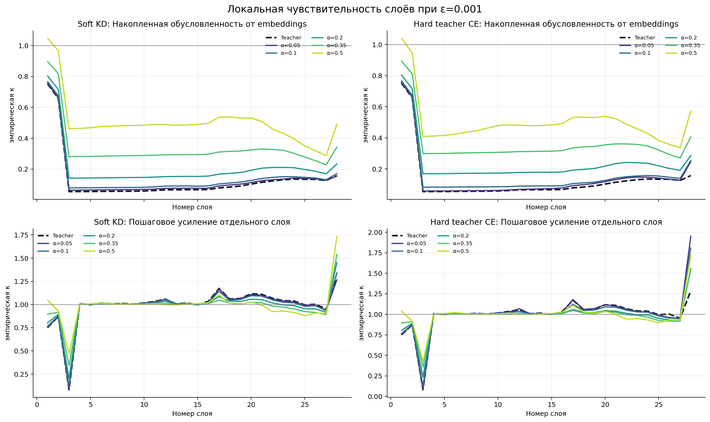
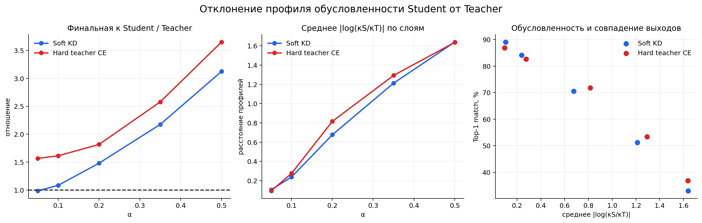

# Локальная обусловленность слоёв Qwen Teacher и Students

Дата прогона: 29 июля 2026 года.

## Краткий вывод

При малом относительном изменении входных embeddings
$\varepsilon=0.001$ Teacher в среднем **не усиливает**, а ослабляет возмущение
к финальному состоянию: медиана накопленной оценки равна
$\widetilde{\kappa}=0.1572$, а
95-й процентиль — $\kappa_{0.95}=0.2372$.
При этом отдельные блоки могут локально усиливать уже накопившееся изменение:
максимальный incremental p95 Teacher равен
$1.4625$ на слое
$28$.

С ростом исходного шума $\alpha$ профиль Student всё сильнее отличается от Teacher.
Максимальное среднее логарифмическое расстояние профилей получено у
`soft_a0.5`: **1.6390**. Оно коррелирует с ухудшением
выходного совпадения ($r=-0.988$ по Pearson) и увеличением
robustness-gap ($r=0.907$), однако это
исследовательская корреляция всего по десяти checkpoints.

## Что именно считается

Для каждого входа $x$, слоя $l$ и малого возмущения $\delta$ сначала считается
относительное изменение представления:

$$
r_l(x;\delta)
=
\frac{
    \left\|h_l(x+\delta)-h_l(x)\right\|_F
}{
    \left\|h_l(x)\right\|_F
}.
$$

Для входных embeddings относительное изменение равно

$$
r_0(x;\delta)
=
\frac{
    \left\|\delta\right\|_F
}{
    \left\|x\right\|_F
}.
$$

Накопленное число обусловленности от входа до слоя $l$:

$$
\boxed{
\kappa_l^{\mathrm{cum}}(x;\delta)
=
\frac{r_l(x;\delta)}{r_0(x;\delta)}
}.
$$

Оно показывает, во сколько раз слой увеличил или уменьшил исходное
относительное возмущение. Пошаговое усиление отдельного transformer-блока:

$$
\boxed{
\kappa_l^{\mathrm{step}}(x;\delta)
=
\frac{r_l(x;\delta)}{r_{l-1}(x;\delta)}
}.
$$

Это **эмпирическая направленная оценка локальной обусловленности** по конечному
набору Gaussian-направлений. Она является нижней оценкой худшего направления
полного Jacobian и не выдаётся за точное спектральное число обусловленности.

## Протокол

- Teacher и 10 Students, все 28 transformer-слоёв.
- 8 одинаковых held-out блоков FineWeb-Edu по 256 токенов.
- 4 детерминированных Gaussian-направления на блок.
- Относительные масштабы: $\varepsilon\in\{0.001,\ 0.003,\ 0.01\}$.
- 32 наблюдения на слой для каждого $\varepsilon$ и каждой модели.
- Вычисления в `float32`, чтобы малые изменения не терялись в BF16-квантовании.
- Шум нормирован отдельно до точного отношения
  $\left\|\delta\right\|_F/\left\|x\right\|_F=\varepsilon$.

## Результаты при основном $\varepsilon=0.001$

| Модель | $\kappa$ финального слоя, median / p95 | Max incremental p95 (слой) | Среднее $\lvert\log(\kappa_S/\kappa_T)\rvert$ |
|---|---:|---:|---:|
| Teacher | 0.1572 / 0.2372 | 1.4625 (L28) | — |
| soft_a0.05 | 0.1548 / 0.2491 | 1.4512 (L28) | 0.1047 |
| soft_a0.1 | 0.1705 / 0.2704 | 1.4920 (L28) | 0.2382 |
| soft_a0.2 | 0.2327 / 0.3072 | 1.6301 (L28) | 0.6764 |
| soft_a0.35 | 0.3421 / 0.3905 | 1.7018 (L28) | 1.2123 |
| soft_a0.5 | 0.4911 / 0.6562 | 1.8759 (L28) | 1.6390 |
| hard_a0.05 | 0.2463 / 0.3363 | 2.0898 (L28) | 0.0940 |
| hard_a0.1 | 0.2536 / 0.3481 | 1.9979 (L28) | 0.2755 |
| hard_a0.2 | 0.2857 / 0.3486 | 1.7901 (L28) | 0.8160 |
| hard_a0.35 | 0.4056 / 0.4531 | 1.7183 (L28) | 1.2927 |
| hard_a0.5 | 0.5740 / 2.4417 | 1.7932 (L28) | 1.6364 |

Горизонталь $\kappa=1$ означает сохранение относительной величины изменения.
Накопленная $\kappa<1$ означает подавление относительно нормы представления, а
incremental $\kappa>1$ — локальное усиление конкретным блоком. Эти два утверждения
не противоречат друг другу.

## Проверка локального режима

| Модель | $\kappa_{\mathrm{final}}$, $\varepsilon=0.001$ | $\kappa_{\mathrm{final}}$, $\varepsilon=0.003$ | $\kappa_{\mathrm{final}}$, $\varepsilon=0.01$ |
|---|---:|---:|---:|
| Teacher | 0.1572 | 0.1570 | 0.1562 |
| soft_a0.05 | 0.1548 | 0.1549 | 0.1550 |
| soft_a0.1 | 0.1705 | 0.1705 | 0.1704 |
| soft_a0.2 | 0.2327 | 0.2327 | 0.2320 |
| soft_a0.35 | 0.3421 | 0.3421 | 0.3421 |
| soft_a0.5 | 0.4911 | 0.4910 | 0.4903 |
| hard_a0.05 | 0.2463 | 0.2464 | 0.2463 |
| hard_a0.1 | 0.2536 | 0.2537 | 0.2539 |
| hard_a0.2 | 0.2857 | 0.2856 | 0.2859 |
| hard_a0.35 | 0.4056 | 0.4056 | 0.4057 |
| hard_a0.5 | 0.5740 | 0.5739 | 0.5726 |

Близость результатов при трёх $\varepsilon$ нужна для проверки, что вывод не
является артефактом одного масштаба. Заметное изменение профиля с
$\varepsilon$ трактуется как
нелинейность finite-difference оценки, а не как самостоятельная нестабильность.
Фактически максимальный относительный разброс финальной median $\kappa$ между
тремя $\varepsilon$
составил только **0.65%**
(`Teacher`), то есть выбранный диапазон остаётся в устойчивом
локальном режиме.

Корреляция расстояния профиля с top-1:
`Pearson r=-0.988, p=7.889e-08`;
средним абсолютным robustness-gap:
`r=0.907, p=0.0002907`.
Причинный вывод из этих корреляций делать нельзя: `n=10`, один seed, а модели
внутри каждой ветки образуют зависимую α-траекторию.

## Ограничения

- Случайные направления не гарантируют нахождение спектрально худшего
  возмущения; для этого потребовались бы Jacobian power iteration или SVD.
- Норма Фробениуса агрегирует все токены и признаки и может скрывать редкие
  очень чувствительные позиции.
- Проверен один англоязычный held-out корпус и один набор seeds.
- $\kappa$ характеризует скрытые состояния, но сама по себе не доказывает изменение
  качества: поэтому она сопоставлена с выходными robustness-метриками.

## Артефакты

- `outputs/layer_conditioning_results.json` — полные записи всех направлений,
  $\varepsilon$, слоёв и моделей.
- `outputs/layer_conditioning_summary.csv` — плоская послойная сводка.
- `outputs/08_layer_conditioning_profiles.png` — профили всех слоёв.
- `outputs/09_conditioning_comparison.png` — отклонение Students от Teacher.
- `run_layer_conditioning.py` — воспроизводимый расчёт.
- `build_conditioning_report.py` — построение этого отчёта.
