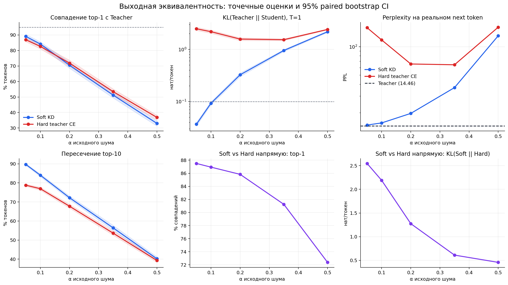
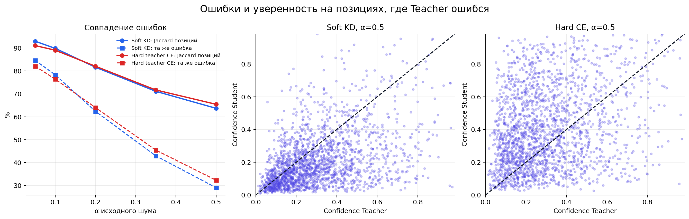
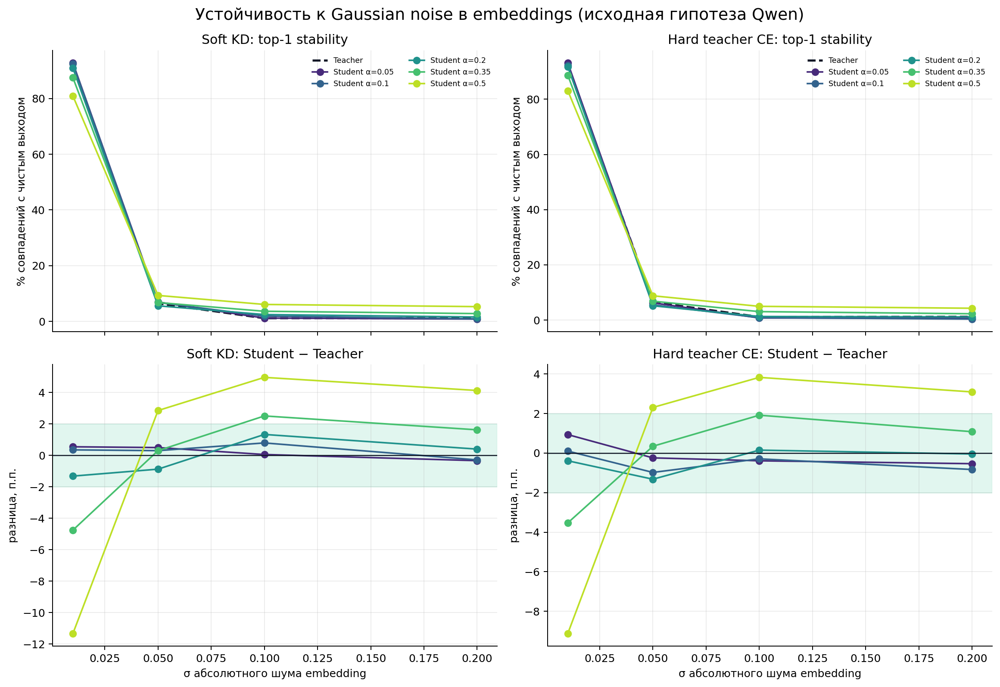
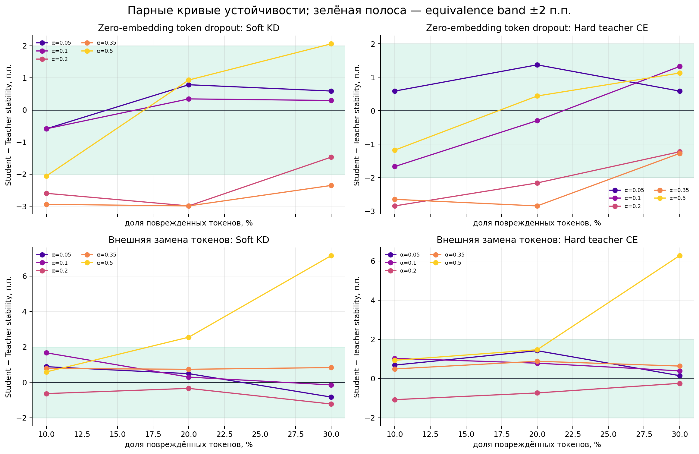
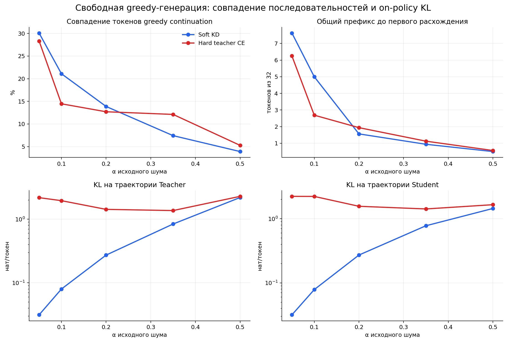
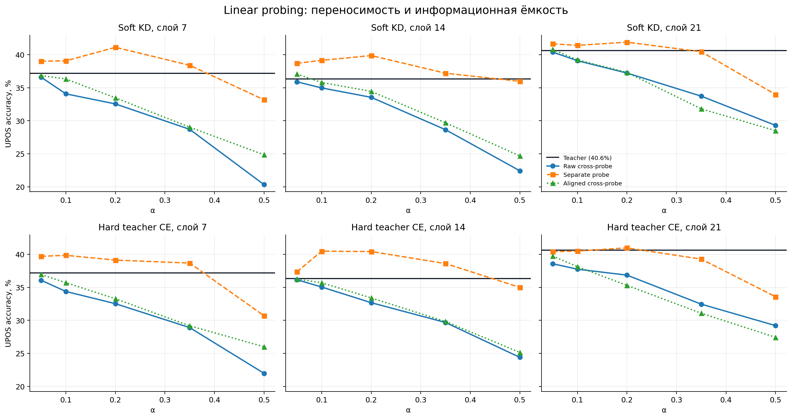
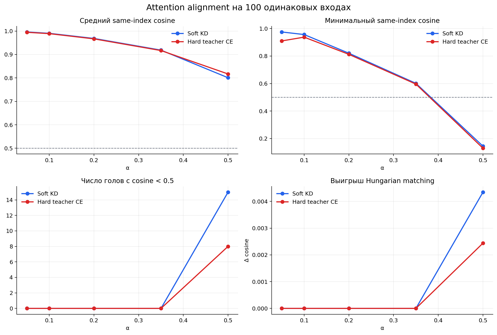

# Проверка функциональной эквивалентности Qwen Teacher и Student

Дата итогового прогона: 21 июля 2026 года.

## Итог

**Строгая функциональная эквивалентность не подтверждена ни для одного из десяти
чекпойнтов.** Ни одна модель не проходит одновременно исходные пороги
`Top-1 Match > 95%`, `KL(Teacher||Student) < 0.1` и equivalence band
устойчивости `±2 п.п.`. Лучший top-1 результат — **89.07% у Soft KD α=0.05**;
его KL равен **0.0368**, а PPL **14.84** против **14.46** у Teacher.
Это близкое качество и близкое распределение, но не идентичное поведение.

Главное различие целей обучения видно особенно чисто на `α=0.05`:

- Soft KD: top-1 89.07%, KL 0.0368, PPL 14.84.
- Hard teacher CE: top-1 86.91%, KL 2.4899, PPL 158.99.

Hard CE действительно копирует много argmax-решений, но не восстанавливает
форму распределения вероятностей и реальную языковую likelihood. Поэтому
высокий top-1 agreement нельзя трактовать как полную функциональную
эквивалентность.

## Что именно проверено

- Teacher: `Qwen/Qwen3-0.6B-Base`.
- Students: по пять финальных чекпойнтов Soft KD и Hard teacher CE для
  `α = 0.05, 0.1, 0.2, 0.35, 0.5`.
- Данные: не использованный в обучающем старте хвост локального FineWeb-Edu,
  начиная после 45 000 прошедших score-фильтр документов.
- Baseline: 16 блоков × 255 предсказаний = **4 080 next-token примеров**.
- Robustness: 8 блоков × 255 = **2 040 парных примеров** на каждый уровень.
- Free generation: 16 одинаковых префиксов, по 32 greedy-токена.
- Linear probing: 12 000 train и 4 000 test целей UPOS из UD English EWT,
  слои 7/14/21, три варианта переноса probe для каждого Student.
- Attention alignment: 100 одинаковых входов длиной 128 токенов, все 28 слоёв
  и 16 attention-голов, то есть 448 пар голов на каждый Student.
- Интервалы: paired bootstrap по блокам, 2 000 повторов. Токены внутри одного
  блока намеренно не объявлялись независимыми.
- Все модели заморожены; tokenizer, входы, порядок и случайные возмущения
  совпадают.

Вывод относится к этому held-out распределению и набору возмущений. Конечный
набор тестов не может математически доказать равенство функций на всех входах.

## Перепроверка плана Qwen

1. **Сравнение выходных распределений — оставлено и усилено.** Помимо top-1,
   KL при `T=1/2` и Pearson посчитаны reverse-KL, Jensen-Shannon, total
   variation и top-10 overlap. Pearson оставлен ради исходной гипотезы, но он
   сильно зависит от длинного хвоста логитов и не является главным критерием.
2. **Error overlap — оставлен, но Jaccard дополнен точным совпадением неверного
   токена.** Для base LM большинство exact next-token позиций сложные, поэтому
   простой Jaccard множеств ошибок искусственно высокий. Метрика «тот же
   неправильный top-1 при ошибке Teacher» информативнее.
3. **Robustness — оставлен, статистический критерий исправлен.** «Не нашли
   различий» не означает эквивалентность. Здесь эквивалентность принимается
   только если весь 95% CI парной разницы лежит внутри `[-2; +2]` п.п.
4. **Embedding noise и token dropout Qwen не удалены.** Gaussian noise использует
   исходные абсолютные `σ`; token dropout реализован как обнуление embedding при
   сохранении позиции. Дополнительно введена внешняя замена токенов из того же
   блока, потому что у Qwen3 нет отдельного mask-token, а внутренняя интервенция
   не равна обычному повреждению текста.
5. **Linear probing выполнен полностью, но не включён в output-level вердикт.** Исходная схема
   «обучить probe на Teacher и без адаптации применить к Student» чувствительна
   к координатам и может провалиться даже при сохранённой информации. Для
   вопроса об информационной ёмкости дополнительно обучены отдельные Student
   probes на том же split, а также проверен перенос после Procrustes alignment.
6. **Attention alignment выполнен полностью, но имеет отдельный механистический
   статус.** Исходное same-index сравнение всех голов сохранено. Дополнительно
   выполнен Hungarian matching, поскольку перестановка голов не должна
   ошибочно считаться потерей механистического сходства.

## Baseline: распределения, реальные токены и ошибки

| Модель | Top-1 match, 95% CI | KL(T‖S) | PPL Student | Top-10 overlap | Та же ошибка при ошибке T | Greedy token match |
|---|---:|---:|---:|---:|---:|---:|
| Soft KD, α=0.05 | 89.07% [87.60%; 90.44%] | 0.0368 | 14.84 | 89.71% | 84.66% | 30.08% |
| Soft KD, α=0.1 | 84.17% [82.67%; 85.59%] | 0.0931 | 15.63 | 84.02% | 78.33% | 21.09% |
| Soft KD, α=0.2 | 70.51% [68.50%; 72.43%] | 0.3270 | 19.71 | 72.24% | 62.38% | 13.87% |
| Soft KD, α=0.35 | 51.20% [49.31%; 52.87%] | 0.9554 | 36.95 | 56.38% | 42.91% | 7.42% |
| Soft KD, α=0.5 | 32.99% [31.22%; 34.78%] | 2.1844 | 130.63 | 40.19% | 29.00% | 3.91% |
| Hard teacher CE, α=0.05 | 86.91% [85.64%; 87.97%] | 2.4899 | 158.99 | 78.79% | 82.10% | 28.32% |
| Hard teacher CE, α=0.1 | 82.62% [81.00%; 84.17%] | 2.1886 | 118.01 | 76.95% | 76.42% | 14.45% |
| Hard teacher CE, α=0.2 | 71.84% [69.80%; 73.80%] | 1.5791 | 65.70 | 67.77% | 64.02% | 12.70% |
| Hard teacher CE, α=0.35 | 53.43% [51.50%; 55.22%] | 1.5364 | 64.46 | 53.62% | 45.43% | 12.11% |
| Hard teacher CE, α=0.5 | 36.84% [35.32%; 38.31%] | 2.4170 | 161.03 | 39.31% | 32.25% | 5.27% |

Порог top-1 95% не проходит никто. По KL точечный порог 0.1 проходят только
Soft KD `α=0.05` и `α=0.1`, но второй находится у самой границы; совместный
критерий всё равно не выполнен.

Высокий Jaccard ошибок сам по себе вводит в заблуждение: например, модели часто
обе ошибаются потому, что exact next-token accuracy у base LM невысока. Столбец
«та же ошибка при ошибке T» требует ещё и совпадения неверного argmax и
монотонно падает с ростом α: у Soft KD с 84.66% до 29.00%, у Hard CE с 82.10%
до 32.25%.

## Robustness

| Модель | Условий внутри ±2 п.п. (95% CI) | Макс. абсолютный gap | Gap при σ=0.01 | Gap при dropout 10% |
|---|---:|---:|---:|---:|
| Soft KD, α=0.05 | 4/10 | 0.88 п.п. | +0.54 п.п. | -0.59 п.п. |
| Soft KD, α=0.1 | 5/10 | 1.67 п.п. | +0.34 п.п. | -0.59 п.п. |
| Soft KD, α=0.2 | 1/10 | 2.99 п.п. | -1.32 п.п. | -2.60 п.п. |
| Soft KD, α=0.35 | 1/10 | 4.75 п.п. | -4.75 п.п. | -2.94 п.п. |
| Soft KD, α=0.5 | 0/10 | 11.32 п.п. | -11.32 п.п. | -2.06 п.п. |
| Hard teacher CE, α=0.05 | 6/10 | 1.42 п.п. | +0.93 п.п. | +0.59 п.п. |
| Hard teacher CE, α=0.1 | 5/10 | 1.67 п.п. | +0.10 п.п. | -1.67 п.п. |
| Hard teacher CE, α=0.2 | 3/10 | 2.84 п.п. | -0.39 п.п. | -2.84 п.п. |
| Hard teacher CE, α=0.35 | 2/10 | 3.53 п.п. | -3.53 п.п. | -2.65 п.п. |
| Hard teacher CE, α=0.5 | 0/10 | 9.12 п.п. | -9.12 п.п. | -1.18 п.п. |

Абсолютные `σ=0.05/0.1/0.2` слишком велики для содержательной локальной
проверки: уже при `σ=0.05` Teacher сохраняет свой clean top-1 примерно лишь на
6.5% позиций, а при `σ=0.1` — примерно на 1.1%. Это saturation/floor regime,
где близость двух почти разрушенных кривых не доказывает одинаковую
устойчивость. Самый диагностичный уровень — `σ=0.01`: разрыв Student−Teacher
растёт по модулю с α и достигает −11.32 п.п. у Soft `α=0.5` и −9.12 п.п. у
Hard `α=0.5`.

Ни одна модель не проходит все десять robustness-условий с 95% CI внутри
`±2 п.п.`. У малых α точечные разницы часто небольшие, но часть интервалов
шире equivalence band; это означает **недостаточно доказательств
эквивалентности**, а не доказанное большое различие. У `α=0.5` появляются уже
и крупные систематические разрывы.

Важно: высокая top-1 stability у плохой модели не всегда означает полезную
robustness — вырожденный или плохо различающий входы predictor тоже может мало
менять решение. Поэтому кривые интерпретируются только вместе с clean PPL/KL.

## Свободная генерация

Даже лучший Soft `α=0.05` не дал ни одного полностью совпавшего continuation из
16; среднее совпадение позиций — 30.08%, общий префикс — 7.63 из 32 токенов.
При этом KL на обеих траекториях около 0.03. Это ожидаемая нелинейность greedy:
небольшое изменение вероятностей может поменять argmax, после чего контексты
расходятся каскадно.

Hard `α=0.05` дал 2/16 точных продолжений и 28.32% совпадения токенов, но его
trajectory KL около 2.2. То есть редкое точное совпадение greedy-пути не
компенсирует сильное расхождение распределений.

## Этап 4. Linear Probing

Задача — предсказать UPOS **следующего слова** по состоянию непосредственно
перед его первым субтокеном, поэтому target-слово не видно causal-модели.
Teacher probe обучен на 12 000 целях и проверен на независимых 4 000 целях из
UD English EWT. Средняя accuracy Teacher по слоям 7/14/21 —
**38.05%**.

| Модель | Teacher probe на raw Student | Отдельный Student probe | Teacher probe после Procrustes | Средний / max raw drop | ≤5 п.п. на всех слоях |
|---|---:|---:|---:|---:|---:|
| soft_a0.05 | 37.63% | 39.79% | 38.24% | +0.42 / +0.60 п.п. | да |
| soft_a0.1 | 36.05% | 39.88% | 37.12% | +2.00 / +3.12 п.п. | да |
| soft_a0.2 | 34.44% | 40.97% | 35.08% | +3.61 / +4.65 п.п. | да |
| soft_a0.35 | 30.36% | 38.68% | 30.17% | +7.69 / +8.50 п.п. | нет |
| soft_a0.5 | 24.02% | 34.38% | 26.01% | +14.03 / +16.88 п.п. | нет |
| hard_a0.05 | 36.93% | 39.15% | 37.65% | +1.12 / +2.05 п.п. | да |
| hard_a0.1 | 35.72% | 40.27% | 36.51% | +2.33 / +2.88 п.п. | да |
| hard_a0.2 | 34.02% | 40.18% | 33.99% | +4.03 / +4.68 п.п. | да |
| hard_a0.35 | 30.34% | 38.85% | 30.03% | +7.71 / +8.30 п.п. | нет |
| hard_a0.5 | 25.19% | 33.09% | 26.19% | +12.86 / +15.23 п.п. | нет |

По верхней границе исходного критерия Qwen (`drop ≤ 5 п.п.` на каждом из трёх
слоёв) этап проходят **6 из 10** моделей; по строгой нижней границе `≤3 п.п.` —
**3 из 10**.

Исходный Qwen cross-probe почти переносится при малом шуме, но разрыв растёт с
α: максимальное среднее падение — **14.03
п.п. у `soft_a0.5`**. Отдельно обученные Student probes отделяют потерю
информации от смены координат: вплоть до α=0.35 они в среднем не хуже Teacher,
а при α=0.5 уже падают; худшее среднее падение —
**4.96 п.п. у
`hard_a0.5`**. Procrustes не устраняет разрыв при больших α, то
есть простой общий поворот/масштаб недостаточен.

## Этап 5. Attention Alignment

Для каждой модели cosine посчитан по полным causal attention-матрицам каждой из
448 пар «тот же слой, тот же номер головы», накопленным на 100 одинаковых
входах. Ниже исходная метрика Qwen и дополнительный permutation-aware контроль.

| Модель | Same-index mean | Same-index min | Hungarian mean | Голов < 0.5 |
|---|---:|---:|---:|---:|
| soft_a0.05 | 0.9961 | 0.9751 | 0.9961 | 0/448 |
| soft_a0.1 | 0.9903 | 0.9564 | 0.9903 | 0/448 |
| soft_a0.2 | 0.9685 | 0.8206 | 0.9685 | 0/448 |
| soft_a0.35 | 0.9186 | 0.6014 | 0.9186 | 0/448 |
| soft_a0.5 | 0.8008 | 0.1445 | 0.8052 | 15/448 |
| hard_a0.05 | 0.9946 | 0.9099 | 0.9946 | 0/448 |
| hard_a0.1 | 0.9889 | 0.9374 | 0.9889 | 0/448 |
| hard_a0.2 | 0.9667 | 0.8125 | 0.9667 | 0/448 |
| hard_a0.35 | 0.9168 | 0.5960 | 0.9168 | 0/448 |
| hard_a0.5 | 0.8168 | 0.1296 | 0.8193 | 8/448 |

Самый низкий средний same-index cosine —
**0.8008 у `soft_a0.5`**;
минимальная отдельная голова — **0.1296
у `hard_a0.5`**. Hungarian matching заметно меняет результат
только у наиболее повреждённых моделей; значит, основное расхождение нельзя
объяснить одной лишь перестановкой голов.

Связь проверена со всеми этапами 1–3. Для среднего attention cosine Pearson
равен `r=0.963` с top-1 (этап 1),
`r=-0.470` с KL (этап 1),
`r=0.938` с точным совпадением ошибок
(этап 2) и `r=-0.980` со средним абсолютным
robustness-gap (этап 3). Число критически низких голов ненулевое только у двух
моделей α=0.5, поэтому его корреляции особенно нестабильны: `r=-0.754`
с top-1 и `r=0.903` с robustness-gap. Это
исследовательские корреляции при `n=10`, без поправки на множественные проверки:
они показывают связь, но не причинность.

## Soft KD против Hard CE напрямую

| α | Top-1 Soft vs Hard | KL(Soft‖Hard) | Для сравнения: KL(T‖Soft) / KL(T‖Hard) |
|---:|---:|---:|---:|
| 0.05 | 87.50% | 2.5456 | 0.0368 / 2.4899 |
| 0.1 | 86.94% | 2.1888 | 0.0931 / 2.1886 |
| 0.2 | 85.83% | 1.2745 | 0.3270 / 1.5791 |
| 0.35 | 81.25% | 0.6113 | 0.9554 / 1.5364 |
| 0.5 | 72.38% | 0.4582 | 2.1844 / 2.4170 |

Неожиданный выходной эффект: с ростом α обе модели удаляются от Teacher, но
`KL(Soft||Hard)` падает с 2.5456 до 0.4582. Это обосновывает новую гипотезу:
**при большом исходном повреждении общий noisy initialization, данные и режим
обучения сильнее определяют финальный attractor, чем различие soft/hard
objective.** Сейчас это корреляционное наблюдение на одном noise seed. Для
проверки нужны минимум 3–5 независимых noise/data seeds.

## Проверка объяснения про «поворот базиса»

Эта часть не использовалась для решения о функциональной эквивалентности; она
нужна только потому, что в исходной истории именно поворот был предложен как
объяснение низкого CKA.

- Локальная реализация linear CKA прямо документирует инвариантность к
  ортогональным преобразованиям. Синтетическая проверка дала
  `CKA(X, XQ) = 1.000000` для
  ортогонального `Q`, тогда как анизотропное преобразование дало
  `0.8113`.
- У Teacher и всех Students `tie_word_embeddings=true`, а input embedding и
  LM head реально делят одно storage. Следовательно, объяснение «свободный
  независимый LM head повернулся обратно» к этой архитектуре неприменимо.
- На верхнем слое при `α=0.5` held-out scaled orthogonal Procrustes даёт
  `R²=0.029` для Soft и `R²=-0.038` для Hard. Простой общий поворот+масштаб не
  переносится на held-out половину.
- Одновременно явного rank collapse нет: effective-rank ratio Student/Teacher
  на верхнем слое равен 1.006 для Soft и 1.423 для Hard. Значит, наблюдение
  больше похоже на неортогональную и sample-dependent перестройку геометрии,
  а не на чистый поворот или потерю ранга.

| Модель | Слой | CKA | Effective-rank S/T | Spectrum cosine | Held-out Procrustes R² |
|---|---:|---:|---:|---:|---:|
| soft_a0.05 | 0 | 0.9998 | 1.000 | 1.0000 | 0.193 |
| soft_a0.05 | 14 | 0.9995 | 1.022 | 1.0000 | 0.995 |
| soft_a0.05 | 28 | 0.9937 | 1.055 | 0.9996 | 0.528 |
| hard_a0.05 | 0 | 0.9998 | 1.000 | 1.0000 | 0.201 |
| hard_a0.05 | 14 | 0.9988 | 1.026 | 1.0000 | 0.993 |
| hard_a0.05 | 28 | 0.8901 | 1.755 | 0.9504 | 0.386 |
| soft_a0.5 | 0 | 0.9709 | 1.078 | 0.9940 | 0.130 |
| soft_a0.5 | 14 | 0.9441 | 1.600 | 1.0000 | 0.872 |
| soft_a0.5 | 28 | 0.7546 | 1.006 | 0.9856 | 0.029 |
| hard_a0.5 | 0 | 0.9716 | 1.076 | 0.9946 | 0.123 |
| hard_a0.5 | 14 | 0.9405 | 1.731 | 1.0000 | 0.859 |
| hard_a0.5 | 28 | 0.7120 | 1.423 | 0.9497 | -0.038 |

## Проверяемые гипотезы после этого прогона

1. **H1 — исходная функциональная эквивалентность:** опровергнута в заданных
   строгих порогах для всех десяти checkpoints.
2. **H2 — Hard CE восстанавливает решения, но не вероятностное поведение:**
   подтверждается сочетанием сравнительно высокого top-1 и KL/PPL на порядок
   хуже Soft KD при малых α.
3. **H3 — низкий CKA объясняется чистым ортогональным поворотом:**
   опровергается инвариантностью CKA и held-out Procrustes.
4. **H4 — низкий CKA вызван rank collapse:** не поддерживается выбранными
   контрольными моделями; effective rank не падает.
5. **H5 — общий attractor Soft/Hard при больших α:** выдвинута из монотонного
   падения KL между двумя Students; требует независимых seeds.
6. **H6 — малые распределительные расхождения достаточно без free-running
   теста:** опровергается каскадным расхождением greedy continuations даже у
   Soft `α=0.05`.
7. **H7 — провал Teacher→Student linear probe обязательно означает потерю
   информации:** опровергается для α≤0.35 отдельными Student probes; при α=0.5
   появляется уже и собственная потеря probe-accuracy.
8. **H8 — attention alignment связан с выходной близостью:** поддерживается
   корреляцией по этим десяти checkpoints, но требует независимых seeds для
   проверки воспроизводимости и не доказывает причинную связь.

## Ограничения и следующий строгий шаг

- 4 080 next-token позиций достаточно для первичной проверки, но всего 16
  блоков ограничивают точность block-bootstrap, особенно для equivalence band
  `±2 п.п.`.
- Корпус один и англоязычный; нет out-of-domain, русского текста, кода,
  математики и длинных контекстов.
- Noise/data seed один. Нельзя отделить общую закономерность от конкретной
  траектории оптимизации.
- POS probe проверяет одну англоязычную морфосинтаксическую задачу; вывод нельзя
  автоматически переносить на семантику или другие языки.
- Attention cosine усредняет полные матрицы, в которых общая causal-структура
  может повышать сходство; дополнительно полезны сравнения attention output и
  функциональные head-ablation тесты.
- Absolute embedding noise не нормирован на RMS embeddings и быстро попадает в
  saturation. Следующий прогон должен добавить относительный шум
  `σ_rel × RMS(embedding)` при сохранении исходных уровней как контрольных.
- Для финального утверждения: 5 seeds × минимум 64 независимых блоков,
  русский/английский/code/math strata, длинные контексты и предварительно
  зарегистрированные equivalence margins.

## Артефакты

- `outputs/raw_results.json` — сырые block-level результаты и bootstrap.
- `outputs/summary.csv` — компактная сводка.
- `outputs/soft_vs_hard.json` — прямое сравнение Students.
- `outputs/representation_hypothesis_audit.json` — вторичная проверка
  rotation/rank гипотез.
- `outputs/linear_probe_results.json` — Stage 4: все probe-метрики, per-class
  accuracy и confusion matrices.
- `outputs/attention_alignment_results.json` — Stage 5: все 448 сравнений голов
  на модель, Hungarian mappings и корреляции с выходными метриками.
- `evaluate_outputs.py`, `compare_soft_hard.py`,
  `audit_representation_hypotheses.py`, `run_linear_probing.py`,
  `run_attention_alignment.py` — воспроизводимый код.
