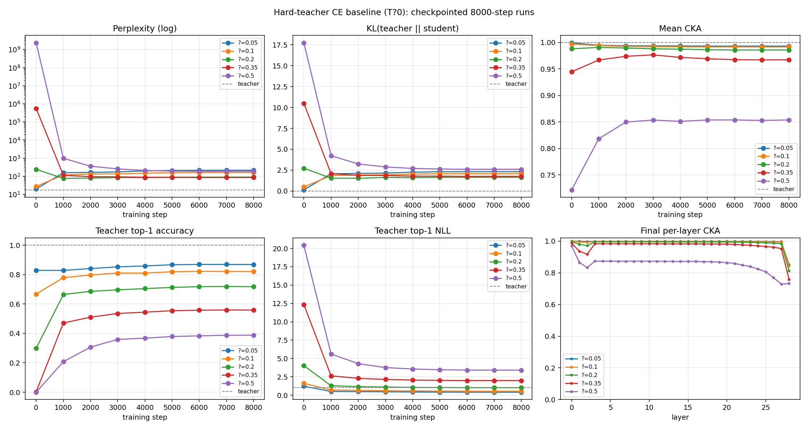
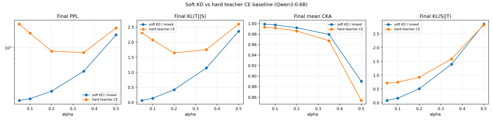

# Hard-teacher CE baseline для Qwen3-0.6B

Последнее обновление: 2026-07-09

Полноценная папка эксперимента: https://disk.360.yandex.ru/d/6Uz6R_yBakgihg

Этот отчёт описывает отдельный baseline-эксперимент к старому `soft_kd_recovery`.
Здесь проверялась идея “температура учителя стремится к нулю”, то есть учитель больше
не передаёт ученику всё мягкое распределение вероятностей по словарю, а оставляет
только один самый вероятный токен.

Коротко:

> В этом эксперименте брали `Qwen/Qwen3-0.6B-Base`, портили копию модели шумом в
> весах, а потом пытались восстановить её не через soft-KD, а через обычную
> cross-entropy по top-1 токену учителя.

То есть это не буквальный `temperature: 0` в коде. Буквальный ноль в softmax/KL
ломал бы формулы, потому что logits делятся на температуру. Вместо этого сделан
эквивалентный hard-target baseline:

```text
teacher_target = argmax(teacher_logits)
loss = CE(student_logits, teacher_target)
```

Учитель здесь не генерирует текст. Он только смотрит на реальные текстовые блоки
и для каждой позиции говорит: “по моему мнению, следующий токен номер такой-то”.
Ученик учится попадать именно в этот top-1 токен.

## Самое важное в одном абзаце

Hard-teacher CE baseline подтвердил гипотезу технически: при `T -> 0` soft-дистилляция
действительно вырождается в обучение по one-hot/top-1 целям учителя. Но как метод
восстановления поведения учителя он заметно слабее soft-KD: ученик всё лучше угадывает
первый выбор учителя, однако теряет информацию о “почти правильных” токенах и о форме
распределения. Поэтому на малом шуме hard CE даже портит PPL/KL относительно состояния
сразу после шума, а на большом шуме помогает вытащить модель из хаоса, но всё равно
не восстанавливает её до уровня soft-KD.

## Что именно проводилось

Эксперимент был устроен так:

1. Загружался чистый teacher: `Qwen/Qwen3-0.6B-Base`.
2. Teacher замораживался: его веса не обучались.
3. Создавался student как копия teacher.
4. В веса student добавлялся Gaussian noise:

   ```text
   W_noised = W + alpha * std(W) * eps, где eps ~ N(0, 1)
   ```

5. Для каждого значения `alpha` запускалось восстановление student.
6. На вход teacher и student подавались одни и те же реальные блоки текста.
7. Teacher для каждой позиции блока выдавал logits следующего токена.
8. Из logits teacher брался только `argmax`.
9. Student обучался через cross-entropy попадать в этот teacher-argmax.
10. После обучения сохранялся финальный student в `student/model.safetensors`.

Важно: это не режим “модель сама пишет продолжение, а потом учится на нём”.
Это teacher-forcing/off-policy режим.

Примерно так выглядит один training block:

```text
Реальный текст:
    токен_1 токен_2 токен_3 токен_4 ... токен_256

Вход в модель:
    токен_1 токен_2 токен_3 ... токен_255

Что надо предсказать:
    токен_2 токен_3 токен_4 ... токен_256

Но цель берётся не из реального следующего токена напрямую,
а из top-1 предсказания teacher на каждой позиции.
```

То есть student на позиции `i` предсказывает следующий токен, но следующий входной
токен всё равно берётся из реального текста, а не из генерации student. Поэтому ошибки
student не “размножаются” внутри блока, как это было бы в on-policy generation.

## Это pretraining, fine-tuning или distillation?

По формату данных это похоже на pretraining: модель видит обычный текст и решает
next-token prediction задачу.

Но по смыслу это не pretraining с нуля. Здесь:

- teacher уже обучен;
- student стартует не случайно, а как копия teacher;
- student сначала специально портится шумом;
- цель обучения берётся от teacher;
- задача эксперимента — понять, можно ли вернуть испорченную модель к поведению teacher.

Поэтому самый точный термин:

> recovery distillation / distillation-based repair после искусственного повреждения весов.

А hard-teacher CE baseline — это контрольный вариант этой идеи, где teacher передаёт
не soft-распределение, а только один pseudo-label на позицию.

## Чем этот baseline отличается от `soft_kd_recovery`

В `soft_kd_recovery` student видел всё распределение teacher:

```text
teacher:
    "cat"  0.45
    "dog"  0.25
    "pet"  0.10
    "car"  0.001
    ...
```

В hard-teacher baseline student видит только:

```text
teacher_target = "cat"
```

Это принципиальная потеря информации. Soft-KD говорит ученику не только “какой токен
лучший”, но и “какие токены почти хорошие, какие совсем плохие, насколько teacher
уверен”. Hard CE всё это выбрасывает.

Поэтому hard CE — хороший baseline, но не лучший способ восстановления.

## Финальная настройка прогона

Финальный устойчивый прогон делался конфигом:

```text
configs/hard_teacher_qwen3_0.6b_ultrasafe_save.yaml
```

Главные параметры:

| Параметр | Значение | Что означает |
|---|---:|---|
| `model_name` | `Qwen/Qwen3-0.6B-Base` | teacher и исходная копия student |
| `distill_objective` | `hard_teacher_ce` | objective через teacher argmax + CE |
| `mode` | `off_policy` | без генерации student, только реальные текстовые блоки |
| `alpha` | `0.05, 0.1, 0.2, 0.35, 0.5` | сила шума в весах |
| `seq_len` | `256` | длина одного текстового блока в токенах |
| `batch_size` | `1` | micro-batch, выбран ради стабильности Windows/WDDM |
| `grad_accum` | `8` | effective batch = 8 блоков на optimizer update |
| `steps` | `8000` | micro-steps на каждую alpha |
| `lr` | `5e-5` | learning rate |
| `optimizer` | `adamw8bit` | экономит VRAM на optimizer state |
| `eval_every` | `1000` | каждые 1000 micro-steps считались метрики |
| `save_student` | `true` | сохранять финальную модель |
| `checkpoint_every` | `2000` | checkpoint для восстановления после зависаний |
| `cpu_before_save` | `true` | перед сохранением переносить student на CPU |
| `sleep_every_steps` | `20` | периодически давать GPU/драйверу паузу |
| `sleep_seconds` | `0.5` | длина паузы |

Сколько данных проходило за один alpha:

```text
8000 steps * batch_size 1 * seq_len 256 = 2 048 000 токенов
```

Так как `grad_accum = 8`, optimizer реально обновлял веса примерно:

```text
8000 / 8 = 1000 optimizer updates
```

За весь sweep из пяти alpha:

```text
5 * 2 048 000 = 10 240 000 токенов
```

Это небольшой учебный/диагностический прогон, а не полноценная многомиллиардная
дистилляция.

## Графики

Основной график hard-teacher baseline:



Сравнение hard-teacher CE с предыдущим soft-KD sweep:



## Сводная таблица hard-teacher baseline

| alpha | Teacher PPL | PPL после шума | Final PPL | KL(T‖S) после шума | Final KL(T‖S) | CKA после шума | Final CKA | Final top-1 acc | Final argmax NLL |
|---:|---:|---:|---:|---:|---:|---:|---:|---:|---:|
| 0.05 | 17.73 | 19.87 | 214.24 | 0.135 | 2.316 | 0.9994 | 0.9933 | 0.869 | 0.397 |
| 0.10 | 17.73 | 27.47 | 159.53 | 0.486 | 2.074 | 0.9972 | 0.9917 | 0.821 | 0.539 |
| 0.20 | 17.73 | 239.82 | 89.08 | 2.719 | 1.642 | 0.9883 | 0.9859 | 0.718 | 1.020 |
| 0.35 | 17.73 | 550553.00 | 85.38 | 10.493 | 1.754 | 0.9447 | 0.9674 | 0.559 | 1.986 |
| 0.50 | 17.73 | 2326779392.00 | 188.65 | 17.739 | 2.600 | 0.7217 | 0.8538 | 0.388 | 3.414 |

## Как читать метрики

### PPL

Perplexity показывает, насколько хорошо модель предсказывает реальные следующие
токены на фиксированном наборе текстовых блоков.

Ниже — лучше.

Teacher имеет PPL `17.73`. Это условная нижняя планка для нашего эксперимента:
если student идеально восстановился до teacher, он должен быть близко к этому числу.

### KL(T‖S)

`KL(teacher‖student)` показывает, насколько распределение student похоже на
распределение teacher.

Ниже — лучше.

Эта метрика особенно важна для distillation, потому что она смотрит не только на
top-1 токен, а на всю форму распределения по словарю.

Если KL большой, это значит: student может иногда угадывать тот же первый токен,
но вероятности остальных токенов у него расставлены иначе.

### KL(S‖T)

`KL(student‖teacher)` — обратное направление KL.

Ниже — лучше.

Если упрощать:

- `KL(T‖S)` сильнее наказывает student за то, что он не покрывает варианты, которым
  teacher даёт заметную вероятность;
- `KL(S‖T)` сильнее наказывает student за то, что он сам кладёт вероятность туда,
  где teacher её почти не кладёт.

В отчёте выше основной столбец — `KL(T‖S)`, потому что он ближе к классическому
поведенческому сравнению teacher → student.

### CKA

CKA измеряет похожесть внутренних активаций student и teacher по слоям.

Выше — лучше. `1.0` означает почти идеальное совпадение геометрии активаций.

Важно: CKA сравнивает не сами веса, а представления модели на одинаковых входах.
Это правильнее, чем сравнивать веса напрямую, потому что у нейросетей могут быть
симметрии и переупорядочивания, при которых веса выглядят иначе, а вычисление остаётся
похожим.

В `summary.json` дополнительно лежит `cka_per_layer` — CKA по каждому hidden-state
слою, включая embedding layer.

### teacher_argmax_acc

Показывает, как часто top-1 токен student совпадает с top-1 токеном teacher.

Выше — лучше, если конкретно цель — имитировать первый выбор teacher.

Но это не равно качественному восстановлению. Можно хорошо попадать в top-1 и при
этом иметь плохую PPL/KL, потому что модель плохо калибрует остальные вероятности.

### teacher_argmax_nll

Это cross-entropy/NLL student по teacher-argmax токену.

Ниже — лучше.

Эта метрика прямо соответствует hard objective, который оптимизировался во время
обучения. Поэтому она хорошо падает даже в тех случаях, где PPL или KL ухудшаются.

## Интерпретация результатов по alpha

### alpha = 0.05

После шума модель почти не сломалась:

- teacher PPL: `17.73`;
- post-noise PPL: `19.87`;
- post-noise KL(T‖S): `0.135`;
- post-noise CKA: `0.9994`.

То есть student уже был очень близок к teacher.

После hard CE:

- final PPL стал `214.24`;
- final KL(T‖S) стал `2.316`;
- final top-1 acc вырос до `0.869`.

Это главный “поучительный провал” baseline: hard CE улучшил попадание в top-1 teacher,
но ухудшил языковое качество и соответствие полному распределению teacher.

Почему так произошло:

- hard CE заставляет student быть очень уверенным в одном teacher-token;
- вся информация о вероятностях альтернатив выбрасывается;
- модель начинает хуже калибровать распределение;
- PPL на реальном тексте страдает, даже если top-1 agreement растёт.

### alpha = 0.10

Картина похожа на `alpha=0.05`.

После шума:

- PPL: `27.47`;
- KL(T‖S): `0.486`;
- CKA: `0.9972`.

После hard CE:

- final PPL: `159.53`;
- final KL(T‖S): `2.074`;
- final top-1 acc: `0.821`.

Модель тоже была не очень сильно повреждена, и hard CE снова оказался слишком грубым
инструментом: он лучше учит top-1, но хуже сохраняет распределение teacher.

### alpha = 0.20

Здесь шум уже серьёзно портит модель:

- post-noise PPL: `239.82`;
- post-noise KL(T‖S): `2.719`;
- post-noise top-1 acc: `0.299`.

После hard CE:

- final PPL: `89.08`;
- final KL(T‖S): `1.642`;
- final top-1 acc: `0.718`.

То есть hard CE здесь уже реально помогает. Он не возвращает student к teacher,
но вытаскивает модель из заметно повреждённого состояния.

Интерпретация: когда student уже сильно повреждён, даже грубый teacher top-1 сигнал
лучше, чем ничего. Но он всё равно не передаёт достаточно информации, чтобы восстановить
поведение teacher качественно.

### alpha = 0.35

После шума модель почти разрушена по PPL:

- post-noise PPL: `550553`;
- post-noise KL(T‖S): `10.493`;
- post-noise min CKA: `0.205`;
- post-noise top-1 acc: `0.003`.

После hard CE:

- final PPL: `85.38`;
- final KL(T‖S): `1.754`;
- final CKA: `0.9674`;
- final top-1 acc: `0.559`.

Это лучший hard-run по финальной PPL. Но это не значит, что `alpha=0.35` “лучше” как
уровень повреждения. Просто при `alpha=0.35` модель была настолько разрушена, что hard CE
получил большое пространство для восстановления.

Главный вывод: hard CE может спасать модель из очень плохого состояния, но финальное
качество всё равно далеко от teacher PPL `17.73`.

### alpha = 0.50

Это самый тяжёлый случай:

- post-noise PPL: `2.33e9`;
- post-noise KL(T‖S): `17.739`;
- post-noise CKA: `0.7217`;
- post-noise top-1 acc: `0.000`.

После hard CE:

- final PPL: `188.65`;
- final KL(T‖S): `2.600`;
- final CKA: `0.8538`;
- final top-1 acc: `0.388`.

То есть восстановление есть, и довольно сильное относительно разрушенного состояния.
Но student остаётся далёк от teacher. При таком шуме одного top-1 сигнала уже явно
недостаточно.

## Главный вывод по hard-teacher baseline

Hard CE делает то, что и должен делать:

- повышает совпадение top-1 токена student с top-1 токеном teacher;
- снижает `teacher_argmax_nll`;
- помогает сильно повреждённым моделям выбраться из хаоса.

Но hard CE не умеет хорошо восстанавливать полное поведение teacher:

- на малом шуме он может ухудшить PPL;
- на малом шуме он ухудшает KL к teacher;
- он теряет информацию о soft-альтернативах;
- он хуже soft-KD почти по всем главным метрикам.

Коротко:

> hard CE учит student отвечать тем же первым вариантом, а soft-KD учит student
> распределять вероятности похожим на teacher образом.

## Сравнение с soft-KD / mixed-GKD

| alpha | Soft PPL | Hard PPL | Soft KL(T‖S) | Hard KL(T‖S) | Soft CKA | Hard CKA | Hard top-1 acc |
|---:|---:|---:|---:|---:|---:|---:|---:|
| 0.05 | 18.18 | 214.24 | 0.067 | 2.316 | 0.9991 | 0.9933 | 0.869 |
| 0.10 | 19.20 | 159.53 | 0.136 | 2.074 | 0.9975 | 0.9917 | 0.821 |
| 0.20 | 24.46 | 89.08 | 0.420 | 1.642 | 0.9921 | 0.9859 | 0.718 |
| 0.35 | 46.68 | 85.38 | 1.145 | 1.754 | 0.9794 | 0.9674 | 0.559 |
| 0.50 | 151.10 | 188.65 | 2.360 | 2.600 | 0.8903 | 0.8538 | 0.388 |

Soft-KD лучше почти везде:

- ниже PPL;
- ниже KL(T‖S);
- выше CKA;
- особенно сильное преимущество на малых alpha.

Это хорошо подтверждает, что успех старого soft-KD эксперимента не сводился к
“учитель просто разметил следующий токен”. Важна именно soft-информация во всём
распределении.

## Что находится в папке

Корень эксперимента:

```text
distillation/hard_teacher_ce_baseline/
```

### `RESULTS.md`

Этот файл.

Назначение:

- объясняет эксперимент;
- фиксирует главные результаты;
- объясняет метрики;
- описывает структуру папки;
- даёт краткий разбор кода;
- описывает параметры, которые можно крутить.

### `experiment.md`

Текстовое описание идеи эксперимента.

Это скорее рабочая заметка/план, а не исполняемый файл. Его полезно хранить, чтобы
было понятно, зачем вообще появился hard-teacher baseline и какую гипотезу он проверял.

### `.gitignore`

Локальные правила игнорирования.

Сейчас игнорируются:

- `.hf_cache/` — локальный cache Hugging Face;
- `data/` — локальный кусок FineWeb-Edu;
- `results/**/student/` — сохранённые модели, они большие;
- `results/**/checkpoint_last/` — временные checkpoint для resume;
- `results/**/*.log` — сырые stdout/stderr логи запусков;
- `results/**/live.png` — временный live-график;
- `__pycache__/`, `*.pyc` — Python cache.

Важно: `log.jsonl` не игнорируется. Это не “сырой лог консоли”, а структурированный
результат эксперимента. Его как раз полезно коммитить.

## Что находится в `configs/`

### `configs/hard_teacher_qwen3_0.6b.yaml`

Первый основной конфиг hard-teacher baseline.

Особенности:

- `steps: 2000`;
- `batch_size: 4`;
- `grad_accum: 2`;
- effective batch: `8` блоков;
- `save_student: true`.

Этот вариант быстрее, но на Windows/WDDM оказался более рискованным: при сохранении
и длительной CUDA-нагрузке компьютер мог зависать.

### `configs/hard_teacher_qwen3_0.6b_safe_save.yaml`

Более осторожный вариант.

Особенности:

- `steps: 4000`;
- `batch_size: 2`;
- `grad_accum: 4`;
- effective batch тоже `8` блоков;
- total tokens примерно сохраняются относительно быстрого варианта.

Идея была снизить peak VRAM за счёт меньшего micro-batch.

### `configs/hard_teacher_qwen3_0.6b_ultrasafe_save.yaml`

Финальный использованный конфиг.

Особенности:

- `steps: 8000`;
- `batch_size: 1`;
- `grad_accum: 8`;
- effective batch всё ещё `8` блоков;
- `checkpoint_every: 2000`;
- `resume_from_checkpoint: true`;
- `cpu_before_save: true`;
- `sleep_every_steps: 20`;
- `sleep_seconds: 0.5`.

Это самый медленный, но самый устойчивый вариант. Именно он позволил сохранить все
пять `model.safetensors`.

Если нужно повторять эксперимент на этой машине, лучше начинать именно с него.

## Что находится в `src/`

### `src/__init__.py`

Пустой/служебный файл, который делает `src` Python-пакетом.

Благодаря ему можно запускать модули так:

```powershell
python -m src.distill ...
python -m src.live_plot ...
```

### `src/data.py`

Отвечает за данные.

Главные элементы:

- `DataConfig` — настройки датасета;
- `_local_doc_stream(...)` — читает локальный JSONL corpus из `data/fineweb_edu_local.jsonl`;
- `_doc_stream(...)` — выбирает локальный JSONL, если он есть, иначе streaming с Hugging Face;
- `token_block_stream(...)` — токенизирует тексты и пакует их в блоки длины `seq_len`;
- `make_batches(...)` — собирает блоки в батчи `(batch_size, seq_len)`;
- `fixed_blocks(...)` — делает фиксированный набор блоков для eval/probe.

Почему это важно:

- train/eval/probe должны быть стабильными;
- метрики разных checkpoints и alpha должны считаться на одинаковых блоках;
- локальный JSONL нужен, чтобы не зависеть от интернета при каждом запуске.

### `src/distill.py`

Главный файл запуска обучения.

Он делает весь pipeline:

1. Читает YAML-конфиг.
2. Проверяет, что hard objective используется только в `off_policy`.
3. Загружает tokenizer, teacher и student.
4. Замораживает teacher.
5. Делает student как копию teacher.
6. Если есть checkpoint, загружает student из `checkpoint_last`.
7. Создаёт фиксированные eval/probe блоки.
8. Считает teacher baseline.
9. Добавляет шум в student.
10. Считает post-noise baseline.
11. Создаёт optimizer.
12. Запускает training loop.
13. Периодически логирует train/eval метрики.
14. Периодически сохраняет checkpoint.
15. В конце сохраняет финального student в `student/`.

Самая важная часть для hard-teacher baseline находится в training loop:

```python
seq = block.to(device)
s_logits = student(seq).logits[:, :-1, :]
t_logits = teacher(seq).logits[:, :-1, :]
loss, parts = hard_teacher_ce_loss(s_logits, t_logits)
```

Здесь `[:, :-1, :]` означает сдвиг next-token prediction:

- logits на позиции `i` предсказывают токен `i+1`;
- последний logits не нужен, потому что после последнего токена в блоке нет target.

Для hard objective реальные targets из текста напрямую не используются. Вместо них:

```python
teacher_targets = teacher_logits.argmax(dim=-1)
```

### `src/losses.py`

Файл с функциями loss.

Главные функции:

#### `kd_divergence(...)`

Считает divergence между soft-распределениями student и teacher:

- `forward_kl`: `KL(teacher‖student)`;
- `reverse_kl`: `KL(student‖teacher)`;
- `jsd`: Jensen-Shannon divergence.

В hard baseline эта функция не является основной, но оставлена для совместимости
с soft-KD кодом.

#### `mixed_loss(...)`

Считает старый soft-KD objective:

```text
loss = beta * KD + (1 - beta) * CE
```

В hard baseline почти не используется, потому что `distill_objective = hard_teacher_ce`.

#### `hard_teacher_ce_loss(...)`

Главная функция нового baseline.

Она делает:

```python
teacher_targets = teacher_logits.detach().argmax(dim=-1)
ce = cross_entropy(student_logits, teacher_targets)
```

Также она логирует:

- `teacher_argmax_acc`;
- `teacher_argmax_nll`.

Важно: для экономии VRAM в hard branch logits не кастятся принудительно в fp32.
Это было сделано специально, чтобы снизить риск Windows sysmem fallback и зависаний.

#### `beta_schedule(...)`

Расписание beta для soft-KD.

В hard baseline beta фактически не влияет на loss, потому что objective полностью
заменён на hard CE. Но поле остаётся в логах и конфиге из-за общей структуры кода.

### `src/metrics.py`

Файл с метриками.

Главные функции:

#### `perplexity(...)`

Считает PPL student на фиксированных реальных текстовых блоках.

Это проверка: “модель всё ещё нормально предсказывает язык?”

#### `kl_to_teacher(...)`

Считает:

- `kl_teacher_student`;
- `kl_student_teacher`.

Это проверка: “насколько распределение student похоже на распределение teacher?”

#### `hard_teacher_metrics(...)`

Считает hard-specific метрики:

- `teacher_argmax_nll`;
- `teacher_argmax_acc`.

Это проверка: “насколько хорошо student повторяет top-1 выбор teacher?”

#### `_linear_cka(...)`

Низкоуровневая функция для linear CKA между двумя матрицами признаков.

#### `layerwise_cka(...)`

Считает CKA по каждому hidden-state слою.

Это проверка: “похожи ли внутренние представления student на teacher?”

### `src/noise.py`

Файл, который портит student.

Главные элементы:

- `NoiseConfig` — настройки шума;
- `NoiseReport` — отчёт о том, сколько параметров было повреждено;
- `_should_perturb(...)` — решает, какие параметры можно шумить;
- `inject_noise(...)` — реально добавляет шум в веса;
- `perturbable_param_names(...)` — помогает посмотреть список параметров, которые будут повреждены.

Основная формула:

```text
W += alpha * std(W) * eps
```

По умолчанию шумятся в основном 2D матрицы весов. Norm/bias параметры не шумятся,
потому что их повреждение может слишком резко ломать численную стабильность.

### `src/fetch_corpus.py`

Скрипт для создания локального `data/fineweb_edu_local.jsonl`.

Пример:

```powershell
python -m src.fetch_corpus --n 20000 --out data/fineweb_edu_local.jsonl
```

Зачем нужен:

- не стримить FineWeb-Edu заново каждый запуск;
- уменьшить зависимость от сети;
- сделать прогоны более воспроизводимыми;
- ускорить старт экспериментов.

### `src/live_plot.py`

Строит более подробные графики по `log.jsonl`.

Панели:

1. PPL по шагам;
2. KL(T‖S) по шагам;
3. mean CKA по шагам;
4. per-layer CKA на последнем eval;
5. train loss / KD / CE или summary по sweep.

Можно использовать для live-наблюдения:

```powershell
python -m src.live_plot --watch 20 --out results/qwen3_0.6b_alpha_sweep/live.png results/qwen3_0.6b_alpha_sweep/a0.2
```

`live.png` игнорируется git, потому что это временный файл.

### `src/plot.py`

Более простой plotter.

Строит 3-panel график:

- PPL;
- KL(T‖S);
- mean CKA.

Сейчас для итогового отчёта полезнее `live_plot.py` и отдельные итоговые графики,
но `plot.py` оставлен как простой инструмент.

## Что находится в `data/`

### `data/fineweb_edu_local.jsonl`

Локальный cache текстов FineWeb-Edu.

Формат:

```json
{"text": "...", "score": 3.1}
{"text": "...", "score": 2.7}
```

Этот файл нужен локально для повторяемых запусков, но не нужен в git:

- он может быть большим;
- его можно пересоздать через `src/fetch_corpus.py`;
- это данные, а не код эксперимента.

## Что находится в `results/qwen3_0.6b_alpha_sweep/`

Это главная папка результатов hard-teacher baseline.

### `summary.json`

Сводный machine-readable файл по всем alpha.

В нём лежат:

- `alpha`;
- teacher/post/final PPL;
- teacher/post/final KL;
- post/final CKA;
- post/final `teacher_argmax_acc`;
- post/final `teacher_argmax_nll`;
- путь к `model.safetensors`;
- `cka_per_layer` массивы.

Этот файл полезен для:

- быстрого анализа без парсинга всех `log.jsonl`;
- построения сравнительных таблиц;
- автоматического построения графиков.

### `hard_teacher_comparison.png`

Основной итоговый график hard baseline.

Показывает, как ведут себя разные alpha по главным метрикам.

### `soft_vs_hard_final.png`

Сравнение финальных результатов hard baseline со старым soft-KD sweep.

Это самый важный график для вывода “soft-KD лучше hard CE”.

### Папки `a0.05/`, `a0.1/`, `a0.2/`, `a0.35/`, `a0.5/`

Каждая папка — отдельный прогон с конкретной силой шума.

Внутри каждой:

#### `config.json`

Снимок конфига, с которым запускался конкретный run.

Даже если YAML-конфиг позже изменится, `config.json` сохраняет фактические параметры
уже проведённого запуска.

#### `log.jsonl`

Главный structured log эксперимента.

Каждая строка — отдельный JSON record:

- `teacher_baseline`;
- `post_noise`;
- `train`;
- `eval`;
- `resume`, если был восстановлен checkpoint.

Это нужно коммитить, потому что из `log.jsonl` можно восстановить динамику обучения.

#### `noise_report.json`

Отчёт о том, сколько параметров было зашумлено.

Полезен для проверки:

- что шум действительно применился;
- какой `alpha` использовался;
- какая доля параметров была затронута.

#### `student/`

Финальная сохранённая модель student.

Внутри:

- `model.safetensors` — веса продистиллированной/восстановленной student-модели;
- `config.json` — архитектурный конфиг модели;
- `generation_config.json` — настройки генерации;
- `tokenizer.json`, `vocab.json`, `merges.txt` — tokenizer;
- `tokenizer_config.json`;
- `special_tokens_map.json`;
- `added_tokens.json`;
- `chat_template.jinja`.

Это полноценная папка Hugging Face `save_pretrained`.

Пример загрузки:

```python
from transformers import AutoModelForCausalLM, AutoTokenizer

path = r"D:\HANDMADE_LLM\REPO\qwen\distillation\hard_teacher_ce_baseline\results\qwen3_0.6b_alpha_sweep\a0.2\student"

tok = AutoTokenizer.from_pretrained(path)
model = AutoModelForCausalLM.from_pretrained(path)
```

`student/` не коммитится, потому что каждая модель весит примерно `1.11 GB`.
Все пять моделей занимают примерно `5.55 GB`.

#### `checkpoint_last/`

Если папка присутствует, это временный checkpoint для resume.

Он нужен, чтобы после зависания/перезагрузки продолжить обучение не с нуля.
Это не финальный результат и не нужен в git.

## Что за `*.log` лежат в `results/`

В корне `results/` могут лежать файлы вроде:

```text
a0.05_stdout.log
a0.05_stderr.log
a0.05_checkpointed_stdout.log
hard_sweep_with_models_safe.log
ultrasafe_checkpoint_runs.log
```

Это сырые консольные логи старых попыток запуска.

Они полезны локально для диагностики:

- где зависло;
- был ли OOM;
- на каком alpha остановился run;
- сохранился ли checkpoint.

Но они не являются clean result artifact. Поэтому `.gitignore` их игнорирует:

```text
results/**/*.log
```

Отличие:

- `results/**/*.log` — сырой шумный stdout/stderr, не коммитим;
- `results/**/log.jsonl` — структурированный лог эксперимента, коммитим.

## Какие “ползунки” можно крутить

Ниже — самые важные параметры и что будет, если их менять.

### `alpha`

Сила шума в весах.

```yaml
alpha: 0.2
```

Больше `alpha`:

- сильнее повреждает student;
- увеличивает post-noise PPL/KL;
- снижает CKA;
- делает восстановление сложнее;
- но даёт больше пространства для видимого “recovery”.

Меньше `alpha`:

- student ближе к teacher уже после шума;
- восстановление проще;
- hard CE может начать вредить, потому что грубо переучивает distribution calibration.

### `noise_seed`

Seed шума.

```yaml
noise_seed: 0
```

Меняет конкретный случай повреждения весов. При том же `alpha` разные seed могут
дать немного разные результаты.

Если хочется проверить устойчивость вывода, надо делать несколько `noise_seed` на
одну alpha.

### `perturb_norms`

Шумить ли norm-параметры.

```yaml
perturb_norms: false
```

`false` — безопаснее.

`true` может сильнее ломать модель, но часто это уже менее интересное повреждение:
можно получить численную деградацию, а не содержательную проверку восстановления.

### `model_name`

Какая модель используется как teacher.

```yaml
model_name: Qwen/Qwen3-0.6B-Base
```

Если поставить модель больше:

- вырастет VRAM;
- вырастет время;
- сохранённые `model.safetensors` будут тяжелее;
- риск зависаний на Windows/WDDM выше.

Если поставить другую архитектуру, код в целом должен работать, если это
`AutoModelForCausalLM` и tokenizer совместим.

### `seq_len`

Длина текстового блока.

```yaml
seq_len: 256
```

Больше `seq_len`:

- больше контекста;
- больше токенов на forward;
- потенциально лучше training signal;
- заметно выше VRAM/time, особенно из-за attention.

Меньше `seq_len`:

- быстрее;
- стабильнее по памяти;
- хуже использует длинный контекст.

Для твоей машины `256` оказался хорошим устойчивым компромиссом.

### `min_score`

Фильтр FineWeb-Edu по educational score.

```yaml
min_score: 2.5
```

Больше `min_score`:

- тексты более “образовательные” и чистые;
- данных после фильтра меньше.

Меньше `min_score`:

- больше разнообразия;
- потенциально больше мусора.

### `data_seed`

Seed для порядка данных.

```yaml
data_seed: 0
```

Влияет на shuffle при streaming dataset и воспроизводимость fixed blocks.

### `distill_objective`

Главный переключатель objective.

```yaml
distill_objective: hard_teacher_ce
```

Варианты:

- `hard_teacher_ce` — текущий baseline;
- `soft_kd` — старая soft-KD логика.

Если включить `soft_kd`, снова начнут играть роль `divergence`, `temperature`,
`beta_start`, `beta_end`.

### `mode`

Режим обучения.

```yaml
mode: off_policy
```

Для hard baseline должен быть `off_policy`.

Почему:

- hard baseline задуман как teacher-forcing по реальному тексту;
- student не должен генерировать собственные продолжения;
- teacher только размечает реальные позиции.

Код специально падает с ошибкой, если попытаться использовать `hard_teacher_ce`
не в `off_policy`.

### `temperature`

Температура soft-KD/KL.

```yaml
temperature: 1.0
```

В hard objective `temperature` не используется для loss, потому что teacher сразу
схлопывается в `argmax`.

Но `temperature` используется в KL evaluation.

Важно:

```yaml
temperature: 0
```

ставить нельзя. Для `T -> 0` используется `distill_objective: hard_teacher_ce`.

### `divergence`

Тип divergence для soft-KD.

```yaml
divergence: forward_kl
```

В hard baseline почти не влияет, потому что hard objective не использует soft-KD.

Имеет смысл, если переключиться обратно на:

```yaml
distill_objective: soft_kd
```

### `beta_start`, `beta_end`, `beta_schedule`

Вес KD-компоненты в mixed soft-KD loss.

```yaml
beta_start: 1.0
beta_end: 1.0
beta_schedule: linear
```

В hard baseline beta не влияет на loss.

Почему всё равно есть в конфиге:

- код унаследован от soft-KD;
- удобно сохранять совместимость;
- train log всё ещё пишет `beta`.

### `steps`

Количество micro-steps.

```yaml
steps: 8000
```

Больше steps:

- больше обучения;
- больше времени;
- больше шанс улучшить тяжёлые alpha;
- но можно ухудшить calibration на малых alpha, если objective слишком грубый.

Меньше steps:

- быстрее;
- хорошо для smoke-test;
- хуже финальное восстановление.

### `batch_size`

Размер micro-batch.

```yaml
batch_size: 1
```

Больше batch:

- быстрее за счёт параллельности;
- выше VRAM;
- выше риск зависаний на Windows/WDDM.

Меньше batch:

- стабильнее;
- медленнее;
- можно компенсировать через `grad_accum`.

### `grad_accum`

Сколько micro-batches копить перед optimizer step.

```yaml
grad_accum: 8
```

Effective batch:

```text
effective_batch = batch_size * grad_accum
```

В финальном конфиге:

```text
1 * 8 = 8 блоков
```

Это позволило сохранить тот же effective batch, но снизить peak VRAM.

### `lr`

Learning rate.

```yaml
lr: 5.0e-5
```

Больше LR:

- быстрее меняет веса;
- может быстрее восстановить тяжёлый шум;
- может сильнее испортить малый шум и calibration.

Меньше LR:

- стабильнее;
- медленнее;
- может недовосстановить большие alpha.

### `warmup`

Количество warmup-steps для LR.

```yaml
warmup: 400
```

Нужен, чтобы обучение не начиналось слишком резко.

Особенно полезно, когда student уже сильно повреждён.

### `weight_decay`

L2-регуляризация через AdamW.

```yaml
weight_decay: 0.01
```

Слишком большой weight decay может мешать восстановлению точной копии teacher.
Слишком маленький — меньше регуляризации.

Для этого эксперимента `0.01` — стандартный умеренный вариант.

### `grad_clip`

Обрезка градиентов.

```yaml
grad_clip: 1.0
```

Помогает от резких градиентных всплесков.

Если поставить слишком мало — обучение может стать вялым.
Если слишком много или отключить — выше риск нестабильности.

### `optimizer`

```yaml
optimizer: adamw8bit
```

Варианты:

- `adamw8bit` — меньше VRAM, нужен `bitsandbytes`, хорош для 3090 Ti;
- `adamw` — обычный PyTorch AdamW, проще, но больше память.

На этой машине `adamw8bit` был правильным выбором.

### `grad_checkpointing`

```yaml
grad_checkpointing: false
```

Если включить:

- меньше VRAM;
- больше compute/time;
- может помочь на больших моделях или больших `seq_len`.

Для финального 0.6B hard baseline не понадобилось.

### `eval_every`

Как часто считать eval.

```yaml
eval_every: 1000
```

Меньше значение:

- чаще графики;
- больше overhead;
- медленнее обучение.

Больше значение:

- меньше overhead;
- хуже видно динамику.

### `eval_blocks`

Сколько блоков использовать для PPL.

```yaml
eval_blocks: 64
```

Больше:

- точнее PPL;
- дольше eval.

Меньше:

- быстрее;
- шумнее метрика.

### `probe_blocks`

Сколько блоков использовать для KL/CKA.

```yaml
probe_blocks: 16
```

Больше:

- точнее KL/CKA;
- особенно дороже CKA.

Меньше:

- быстрее;
- больше шум.

### `cka_max_tokens`

Сколько token representations максимум брать для CKA.

```yaml
cka_max_tokens: 16384
```

Больше:

- точнее CKA;
- больше CPU/RAM/time.

Меньше:

- быстрее;
- менее стабильная оценка.

### `save_student`

Сохранять ли финальную модель.

```yaml
save_student: true
```

Если `true`, создаётся папка:

```text
results/.../a0.xx/student/
```

Если нужны веса для дальнейших экспериментов, должно быть `true`.

Если нужен только быстрый metric run, можно поставить `false`.

### `cpu_before_save`

Перед сохранением перенести student на CPU.

```yaml
cpu_before_save: true
```

Это было добавлено из-за зависаний/BSOD на Windows.

Плюс:

- меньше давление на GPU/driver во время сериализации.

Минус:

- сохранение может быть медленнее;
- нужен запас RAM.

Для этой машины лучше оставлять `true`.

### `checkpoint_every`

Как часто сохранять resume-checkpoint.

```yaml
checkpoint_every: 2000
```

Нужно для длинных прогонов:

- если ПК завис;
- если Windows перезагрузился;
- если run оборвался.

Можно продолжить с последнего checkpoint.

### `resume_from_checkpoint`

```yaml
resume_from_checkpoint: true
```

Если `true`, код при старте проверяет `checkpoint_last` и продолжает оттуда.

Важно: optimizer state намеренно не сохраняется, чтобы checkpoint не раздувался.
При resume optimizer создаётся заново. Это немного меняет точную траекторию обучения,
но сильно повышает практическую живучесть запуска.

### `sleep_every_steps`, `sleep_seconds`

Паузы во время обучения.

```yaml
sleep_every_steps: 20
sleep_seconds: 0.5
```

Это не научный параметр, а техническая стабилизация для Windows/WDDM.

Плюс:

- меньше непрерывная нагрузка на GPU;
- меньше шанс зависания.

Минус:

- обучение дольше.

### `CUDA_MEM_FRACTION`

Это environment variable, не поле YAML.

Пример:

```powershell
$env:CUDA_MEM_FRACTION = "0.35"
```

Код читает её и ограничивает долю GPU memory для PyTorch.

Зачем:

- если PyTorch начнёт занимать слишком много VRAM, Windows может уйти в sysmem fallback;
- это может вызвать жёсткие зависания;
- ограничение памяти лучше приводит к обычному OOM, чем к зависанию всей системы.

### `PYTORCH_CUDA_ALLOC_CONF`

Тоже environment variable.

Пример:

```powershell
$env:PYTORCH_CUDA_ALLOC_CONF = "max_split_size_mb:128"
```

Помогает уменьшить проблемы с фрагментацией CUDA memory allocator.

## Как запустить smoke-test

Из папки:

```powershell
cd D:\HANDMADE_LLM\REPO\qwen\distillation\hard_teacher_ce_baseline
```

Команда:

```powershell
$env:CUDA_MEM_FRACTION = "0.35"
$env:PYTORCH_CUDA_ALLOC_CONF = "max_split_size_mb:128"
python -m src.distill --config configs/hard_teacher_qwen3_0.6b_ultrasafe_save.yaml --alpha 0.2 --run_name _smoke_hard --steps 20
```

Smoke-test нужен, чтобы проверить:

- модель грузится;
- данные читаются;
- hard метрики появляются в `log.jsonl`;
- нет OOM;
- код доходит до конца.

## Как запустить один alpha

Пример для `alpha=0.2`:

```powershell
cd D:\HANDMADE_LLM\REPO\qwen\distillation\hard_teacher_ce_baseline
$env:CUDA_MEM_FRACTION = "0.35"
$env:PYTORCH_CUDA_ALLOC_CONF = "max_split_size_mb:128"
python -m src.distill --config configs/hard_teacher_qwen3_0.6b_ultrasafe_save.yaml --alpha 0.2 --run_name a0.2
```

## Как запустить весь sweep

```powershell
cd D:\HANDMADE_LLM\REPO\qwen\distillation\hard_teacher_ce_baseline
$env:CUDA_MEM_FRACTION = "0.35"
$env:PYTORCH_CUDA_ALLOC_CONF = "max_split_size_mb:128"

foreach ($a in "0.05","0.1","0.2","0.35","0.5") {
    python -m src.distill --config configs/hard_teacher_qwen3_0.6b_ultrasafe_save.yaml --alpha $a --run_name "a$a"
}
```

Если run оборвётся, при следующем запуске с тем же `run_name` код попробует подняться
из `checkpoint_last`.

## Как построить график

Пример live/summary plot:

```powershell
python -m src.live_plot --out results/qwen3_0.6b_alpha_sweep/hard_teacher_comparison.png `
    results/qwen3_0.6b_alpha_sweep/a0.05 `
    results/qwen3_0.6b_alpha_sweep/a0.1 `
    results/qwen3_0.6b_alpha_sweep/a0.2 `
    results/qwen3_0.6b_alpha_sweep/a0.35 `
    results/qwen3_0.6b_alpha_sweep/a0.5
```

## Ограничения эксперимента

1. Использовался один `noise_seed`.

   Для более строгого вывода хорошо бы повторить sweep на нескольких seed.

2. Данных мало по меркам языковых моделей.

   `~2.05M` токенов на alpha — это диагностический прогон, не полноценная большая
   дистилляция.

3. Hard objective специально грубый.

   Он не обязан побеждать soft-KD. Его цель — показать baseline “что будет, если
   оставить только top-1 teacher”.

4. Eval/probe blocks фиксированные, но небольшие.

   Этого достаточно для сравнения внутри эксперимента, но не для финальной оценки
   качества модели в широком смысле.

5. Windows/WDDM сильно повлиял на engineering.

   Batch/checkpoint/sleep/cpu-before-save выбраны не как идеальные научные параметры,
   а как стабильная стратегия для конкретной машины.

## Итоговая формулировка

Hard-teacher CE baseline получился полезным контрольным экспериментом.

Он показывает:

- `T -> 0` действительно превращает дистилляцию в CE по one-hot/top-1 целям teacher;
- такой сигнал может восстанавливать сильно повреждённую модель;
- но одного top-1 сигнала недостаточно для хорошего восстановления teacher behavior;
- soft-KD выигрывает, потому что передаёт распределение вероятностей, а не только
  номер самого вероятного токена.

Если сказать совсем простыми словами:

> Hard CE говорит ученику: “повторяй мой первый ответ”.
>
> Soft-KD говорит ученику: “думай похожим на меня образом”.

И по результатам видно, что для восстановления модели второе заметно ценнее.
