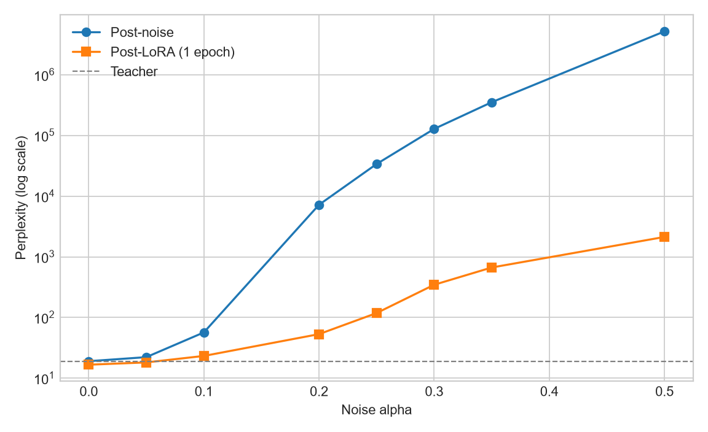
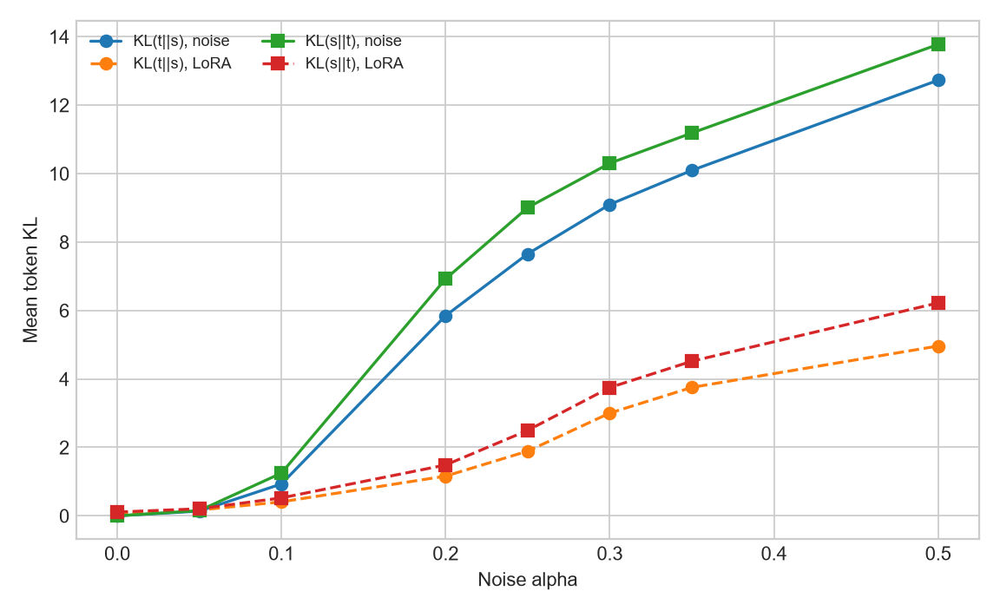
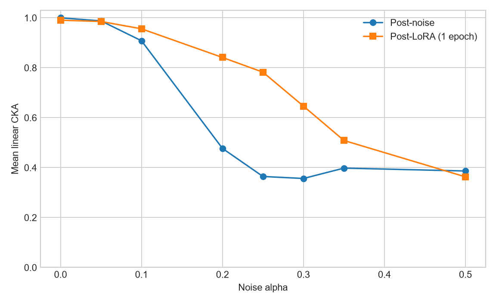

# LoRA-восстановление Qwen3.5-0.8B после зашумления

## Резюме

Исходная задача: собрать синтетический FineWeb-Edu датасет кодом Андрея,
зашумить `Qwen/Qwen3.5-0.8B-Base`, обучить LoRA и посчитать метрики
pipeline Ярослава. Собран основной JSONL на 1500 строк; для восьми уровней
Gaussian noise выполнено по одному полному автономному проходу LoRA по всем
строкам. Главный результат: при `alpha=0.10` PPL, KL и CKA существенно
восстанавливаются; при `alpha>=0.25` абсолютные PPL и KL остаются высокими,
несмотря на заметное уменьшение NLL.

## Основа решения и внесённые изменения

- Переиспользовано из кода Ярослава: training loop и конфиги из
  `src/distill.py`, упаковка токенов из `src/data.py`, Gaussian noise из
  `src/noise.py`, KD loss из `src/losses.py`, PPL, forward/reverse KL и
  layerwise CKA из `src/metrics.py`. Сохранены старые режимы `off_policy`,
  `on_policy`, `mixed` и выбор full fine-tuning (`lora_r=0`) либо LoRA
  (`lora_r>0`).
- Переиспользовано из генератора Андрея:
  `qwen_continuation_dataset/generate_dataset.py`, JSONL-поля `prefix_text`,
  `teacher_continuation`, `synthetic_text`, XPU-загрузка модели, FineWeb-Edu
  streaming и resume-генерация из `qwen_continuation_dataset/qwen_continuation/`.
- Добавлено в рамках задачи: XPU/BF16 path; опциональная LoRA; objective
  `synthetic_ce`; чтение `synthetic_text`; однопроходное обучение по локальному
  JSONL; независимый held-out; аудит `source_id`; runtime-контроль teacher
  forward; peak XPU memory и fail-fast проверки конечности loss/градиентов.

Эксперимент находится в `distillation/soft_kd_recovery`, поскольку это
расширение исходного pipeline Ярослава, а не отдельный проект: старые KD-режимы
и full fine-tuning сохранены, LoRA и `synthetic_ce` добавлены как опции.

## Основной синтетический датасет: 1500 примеров

- Конфиг: `qwen_continuation_dataset/config_qwen35_08b_fineweb_1500_seed42.yaml`.
- Output: `qwen_continuation_dataset/outputs/qwen35_08b_fineweb_1500_seed42.jsonl`.
- Teacher: `Qwen/Qwen3.5-0.8B-Base`, XPU BF16; FineWeb-Edu `sample-10BT`;
  fixed 128 → 32 токена; greedy (`temperature=0`, `top_p=1.0`, `top_k=0`);
  seed 42.
- Cycle detection включён; window 100 символов, n-gram 20 символов, минимум
  50 сгенерированных символов. Resume включён, flush после каждой строки.
- `--dry-run` пройден. Генерация: `5961.31 s`; wall-clock: `5973.50 s`;
  пропущено 73 коротких документа. Размер: 4 465 582 байта (`4.259 MiB`).
- JSONL: 1500 валидных строк и 1500 уникальных `source_id`; пустых
  `prefix_text`, `teacher_continuation`, `synthetic_text` нет.
- Во всех строках: teacher `Qwen/Qwen3.5-0.8B-Base`, dtype `bfloat16`, source
  `fineweb`, prefix 128 токенов и заданные greedy-параметры.
- Generated tokens: min 8, mean 30.594, median 32, max 32; 1301 строка —
  32 токена; 199 строк — 8–31 токен. Все 199 досрочных остановок соответствуют
  cycle detection; других досрочных остановок нет.
- `teacher_continuation`: 1500 уникальных значений; дубликатов нет.
- `synthetic_text == prefix_text + teacher_continuation`: 1499/1500 буквально.
  В строке 1266 один byte-level символ пересекает границу полей: combined decode
  собирает его корректно, а два раздельных decode дают replacement-символы;
  `synthetic_text` по-прежнему построен генератором из `prefix_ids + generated_ids`.
- Resume проверен повторным запуском: найдены 1500 готовых `source_id`, модель
  не загружалась, SHA-256 output-файла не изменился.

На этом этапе чистая модель использовалась только для предварительной генерации
датасета. Обучение LoRA не запускалось.

## Full-epoch sweep: автономный `synthetic_ce`

- Date: 2026-07-17.
- Train: основной JSONL на 1500 строк / 1500 уникальных `source_id`.
- Held-out: `qwen35_08b_fineweb_heldout_seed43.jsonl`, 64 уникальных FineWeb-Edu
  строк, сгенерированных clean `Qwen/Qwen3.5-0.8B-Base` тем же fixed 128 → 32
  greedy pipeline; пересечение с train: 0 IDs.
- Упаковка одного прохода: 1494 блока по 160 токенов. Batch 4 даёт 374
  фактических packed batches и 374 optimizer step; последний batch содержит
  2 блока. Последний неполный token block дополнен EOS, поэтому последняя строка
  не отброшена.
- В каждом run `data_audit` до обучения и `data_complete` после обучения
  фиксируют `1500/1500`, `374/374` и пересечения train/eval/probe `0/0/0`.
  Eval использует 8 held-out IDs, probe — другие 8 held-out IDs.
- Model/device: `Qwen/Qwen3.5-0.8B-Base`, XPU BF16. Gaussian noise seed 0.
  LoRA rank 8, alpha 16, dropout 0; 5 111 808 trainable params. AdamW, LR
  `5e-5`, warmup 10, cosine decay, gradient clip 1.0. Тяжёлые веса не сохранены.
- Objective строго `synthetic_ce`: next-token CE по сохранённому
  `synthetic_text`. Teacher использовался только для baseline и evaluation.
  Во всех восьми run: `kd=0`, `teacher_train_forwards=0`, NaN/Inf нет.
- Teacher baseline на общем held-out: PPL `19.0443`, KL `0/0`, CKA `1.0`.
  `NLL = ln(PPL)`; NLL recovery считается относительно post-noise и teacher.

| alpha | PPL noise → LoRA | NLL noise → LoRA | NLL recovery | CKA noise → LoRA |
|---:|---:|---:|---:|---:|
| 0.00 | 19.0443 → 16.6606 | 2.9468 → 2.8130 | n/a | 1.0000 → 0.9905 |
| 0.05 | 22.2002 → 18.1820 | 3.1001 → 2.9004 | 130.22% | 0.9877 → 0.9853 |
| 0.10 | 56.7907 → 23.2466 | 4.0394 → 3.1462 | 81.75% | 0.9081 → 0.9560 |
| 0.20 | 7222.3135 → 53.1815 | 8.8849 → 3.9737 | 82.71% | 0.4769 → 0.8413 |
| 0.25 | 33920.7695 → 118.3937 | 10.4318 → 4.7740 | 75.59% | 0.3646 → 0.7822 |
| 0.30 | 128651.8125 → 346.5801 | 11.7649 → 5.8481 | 67.10% | 0.3565 → 0.6463 |
| 0.35 | 354515.4688 → 667.6943 | 12.7785 → 6.5038 | 63.82% | 0.3981 → 0.5087 |
| 0.50 | 5211579.0000 → 2128.6765 | 15.4664 → 7.6633 | 62.33% | 0.3865 → 0.3631 |

| alpha | KL T→S noise → LoRA | KL S→T noise → LoRA | Time, s | Peak MiB |
|---:|---:|---:|---:|---:|
| 0.00 | 0.0000 → 0.0820 | 0.0000 → 0.1110 | 619.6 | 9406.6 |
| 0.05 | 0.1381 → 0.1701 | 0.1526 → 0.2059 | 616.7 | 9406.6 |
| 0.10 | 0.9315 → 0.4087 | 1.2481 → 0.5240 | 618.0 | 9406.6 |
| 0.20 | 5.8475 → 1.1606 | 6.9232 → 1.4853 | 623.1 | 9406.6 |
| 0.25 | 7.6543 → 1.8898 | 9.0058 → 2.4969 | 623.8 | 9406.6 |
| 0.30 | 9.0984 → 3.0023 | 10.3022 → 3.7486 | 623.2 | 9406.6 |
| 0.35 | 10.0945 → 3.7531 | 11.1866 → 4.5178 | 614.8 | 9406.6 |
| 0.50 | 12.7282 → 4.9620 | 13.7750 → 6.2215 | 616.7 | 9406.6 |







### Финальные выводы

- `alpha=0` — контроль автономного обучения, не recovery. LoRA улучшила PPL
  ниже clean teacher (`19.04 → 16.66`), одновременно KL ушла от нуля и CKA
  снизилась. CE оптимизирует likelihood наблюдённых synthetic tokens, а не
  совпадение полного teacher distribution.
- Лёгкий шум `alpha=0.05` полностью компенсирован по held-out NLL и даже
  превзойдён baseline (`NLL recovery >100%`), но обе KL и CKA слегка
  ухудшились. Это восстановление next-token likelihood, не teacher behaviour.
- `alpha=0.10` — практическая граница убедительного recovery: финальная PPL
  `23.25` близка к baseline, обе KL более чем вдвое ниже post-noise, CKA выросла
  до `0.956`, хотя полного возврата нет.
- `alpha=0.20` — сильный шум с большим, но неполным recovery. PPL `53.18` в 2.8
  раза выше baseline, несмотря на 82.7% NLL recovery. Называть это полным
  восстановлением нельзя.
- `alpha>=0.25` — катастрофический режим для данного LoRA/epoch budget. Все
  метрики улучшаются относительно post-noise до `alpha=0.35`, но абсолютная PPL
  остаётся `118–668`, KL высоки, CKA далека от 1. При `alpha=0.50` CKA даже
  ухудшилась (`0.3865 → 0.3631`), финальная PPL `2128.68`.
- Synthetic CE может снижать PPL, не восстанавливая KL: hard next-token labels
  задают вероятность только наблюдённого токена и не содержат soft logits по
  остальному vocabulary. Online KD напрямую штрафует несовпадение полного
  распределения, поэтому предыдущий 64-row online-KD LoRA recovery при
  `alpha=0.05` улучшал обе KL, тогда как autonomous CE здесь их ухудшил.
- Сравнение с опытами Ярослава только качественное: там другие модели/данные,
  online soft-KD/mixed-GKD, больше шагов и местами full fine-tuning. Более
  сильный recovery нельзя приписывать одному фактору. Общий результат совпадает:
  PPL/KL и CKA отражают разные стороны восстановления.

Ограничения: один noise seed; одна модель; один train dataset на 1500 строк;
короткие greedy continuation 8–32 токена; один проход; по 8 eval/probe blocks;
нет повторов по seeds. Held-out независим по `source_id`, но происходит из того
же FineWeb-Edu и сгенерирован той же clean teacher.

Исходная задача выполнена:

1. Собран основной датасет на 1500 сэмплов кодом Андрея.
2. `Qwen/Qwen3.5-0.8B-Base` зашумлена на восьми уровнях alpha.
3. Для каждого alpha LoRA обучена ровно один полный проход по всем 1500 строкам.
4. Для каждого alpha посчитаны PPL, обе KL и CKA кодом метрик Ярослава.

## Основные файлы и артефакты

- `src/distill.py` — режимы обучения, выбор device, LoRA/full FT, objective и
  execution/audit одного прохода.
- `src/data.py` — чтение JSONL, упаковка токенов и аудит `source_id`.
- `src/losses.py` — существующие KD losses; в `synthetic_ce` training loss их не
  вызывает.
- `qwen_continuation_dataset/generate_dataset.py` — генерация JSONL с
  `synthetic_text` и resume.
- `configs/main_synthetic_ce_epoch_xpu_qwen3.5_0.8b.yaml` — основной train-конфиг.
- `qwen_continuation_dataset/config_qwen35_08b_fineweb_heldout_seed43.yaml` —
  конфиг held-out генерации.
- `SYNTHETIC_CE_SWEEP.csv` — машинно-читаемая сводка восьми запусков.
- `SYNTHETIC_CE_SWEEP_PPL.png`, `SYNTHETIC_CE_SWEEP_KL.png`,
  `SYNTHETIC_CE_SWEEP_CKA.png` — графики sweep.
- `results/main_synthce_epoch_a*_seed0/{config.json,log.jsonl,noise_report.json}`
  — сырые воспроизводимые результаты каждого alpha.

JSONL-датасеты и тяжёлые веса не входят в Git. Console logs также не предлагаются
к коммиту: они игнорируются правилом `results/**/*.log`. Raw-каталоги содержат
только `config.json`, `log.jsonl`, `noise_report.json` и сохраняются локально.

## Воспроизведение

Из корня репозитория в PowerShell. Использованные alpha:
`0.00, 0.05, 0.10, 0.20, 0.25, 0.30, 0.35, 0.50`.

Генерация held-out:

```powershell
Remove-Item Env:HF_HUB_OFFLINE -ErrorAction SilentlyContinue
Remove-Item Env:TRANSFORMERS_OFFLINE -ErrorAction SilentlyContinue
$env:HF_HOME = Join-Path $PWD '.cache\huggingface'

Push-Location qwen_continuation_dataset
..\.venv\Scripts\python.exe generate_dataset.py `
  --config config_qwen35_08b_fineweb_heldout_seed43.yaml `
  --dry-run
..\.venv\Scripts\python.exe generate_dataset.py `
  --config config_qwen35_08b_fineweb_heldout_seed43.yaml
Pop-Location
```

Один full-epoch запуск, например `alpha=0.10`:

```powershell
$env:HF_HUB_OFFLINE = '1'
$env:TRANSFORMERS_OFFLINE = '1'
Push-Location distillation\soft_kd_recovery
..\..\.venv\Scripts\python.exe -m src.distill `
  --config configs/main_synthetic_ce_epoch_xpu_qwen3.5_0.8b.yaml `
  --alpha 0.10 `
  --run-name main_synthce_epoch_a0p10_seed0
Pop-Location
```

## Приложение: предварительные проверки

### XPU-окружение и smoke-тесты

- OS: Windows; Python 3.11.9.
- GPU: Intel Arc A770 16 GB; driver `32.0.101.8509`.
- PyTorch `2.13.0+xpu`; Transformers `5.10.2`; PEFT `0.19.1`.
- `torch.xpu`: one device, `Intel(R) Arc(TM) A770 Graphics`.
- FP16 matrix multiply/backward: пройден; градиенты конечны.
- `Qwen/Qwen3.5-0.8B-Base` FP16 XPU forward: пройден; logits конечны.
- BF16 LoRA forward/backward: loss `9.114972`; 159 744 обучаемых параметра;
  24 конечных тензора градиентов; peak allocation `1840.1 MiB`.
- AdamW step, `weight_decay=0`: изменились 12 из 24 LoRA-тензоров.
- Pipeline smoke на трёх строках и `Qwen/Qwen3-0.6B-Base`: dataset → шум
  `alpha=0.01` → LoRA → 3 шага → существующие PPL/KL/CKA; без NaN/Inf.

### Validation: 64 примера

- Model/device/dtype: `Qwen/Qwen3.5-0.8B-Base`, XPU, BF16.
- Датасет: 64 строки FineWeb-Edu; prefix 64 токена; continuation 16 токенов.
- Генерация датасета: `169.48 s`; wall-clock `181.05 s`.
- Шум: `alpha=0.02`, seed 0; изменены 205 тензоров / 752 336 896 параметров.
- LoRA: rank 8, alpha 16, dropout 0; 5 111 808 обучаемых параметров
  (`0.6748%`). Targets: attention, linear-attention и MLP projections.
- Обучение: off-policy forward KL; AdamW; 30 шагов; batch 1; sequence 64;
  peak LR `2e-4`; warmup 3; cosine decay; gradient clip 1.0.
- Document offsets eval/probe/train: 0 / 16 / 32.
- Training/eval elapsed: `63.0 s`; wall-clock запуска: `101.36 s`.
- Peak XPU allocation: `3941.1 MiB`.
- Loss и нормы градиентов: конечны на всём запуске.

| Метрика | Post-noise | Post-LoRA | Изменение |
|---|---:|---:|---|
| PPL | 31.3332 | 31.2689 | улучшение на 0.0643 |
| KL T→S | 0.02263 | 0.02697 | ухудшение на 0.00434 |
| KL S→T | 0.02294 | 0.02606 | ухудшение на 0.00312 |
| CKA mean | 0.997813 | 0.997536 | ухудшение на 0.000277 |

Интерпретация: PPL немного улучшилась. Обе KL на фиксированном probe ухудшились;
поведенческое восстановление к teacher не показано. CKA почти не изменилась, но
снизилась; восстановление представлений не показано. Подтверждён конечный XPU BF16
LoRA training path, не полное восстановление.

### Online-KD recovery: 64 примера, alpha 0.05

- Model/device/dtype: `Qwen/Qwen3.5-0.8B-Base`, XPU, BF16.
- Датасет и offsets: те же 64 строки; eval/probe/train 0 / 16 / 32.
- Шум: `alpha=0.05`, seed 0; изменены 205 тензоров / 752 336 896 параметров.
- LoRA: rank 8, alpha 16, dropout 0; 5 111 808 обучаемых параметров
  (`0.6748%`); targets без изменений относительно validation.
- Обучение: off-policy forward KL; AdamW; 120 шагов; batch 1; sequence 64;
  peak LR `5e-5`; warmup 10; cosine decay; gradient clip 1.0.
- Training/eval elapsed: `264.6 s`; полный wall-clock: около `306 s`.
- Peak XPU allocation: `3941.1 MiB`; тяжёлые веса не сохранялись.
- Все записанные loss и метрики конечны; fail-fast проверка норм градиентов не
  сработала; NaN/Inf нет.

| Метрика | Teacher | Post-noise | Post-LoRA, step 120 | Изменение от post-noise |
|---|---:|---:|---:|---:|
| PPL | 30.9452 | 34.9761 | 32.3503 | -2.6258 |
| KL T→S | 0.0000 | 0.1410 | 0.0953 | -0.0457 |
| KL S→T | 0.0000 | 0.1496 | 0.1007 | -0.0489 |
| CKA mean | 1.0000 | 0.9860 | 0.9877 | +0.0017 |

Вывод: LoRA вернула около 65% прироста PPL от шума и снизила обе KL примерно на
32%. До teacher baseline модель не восстановилась. CKA немного выросла; это
согласуется с частичным, а не полным recovery. На шаге 90 reverse KL была
минимально лучше финальной (`0.1005` против `0.1007`), остальные финальные метрики
не хуже шага 90. Повторный запуск не потребовался.

### Технический pilot `synthetic_ce`: 120 шагов, не полный проход

- `synthetic_ce`: next-token CE только по `synthetic_text`; teacher не участвует
  в train-step и используется только для baseline, PPL, обеих KL и CKA.
- Model/device/dtype: `Qwen/Qwen3.5-0.8B-Base`, XPU, BF16; шум `alpha=0.05`,
  seed 0; основной JSONL на 1500 строк.
- LoRA: rank 8, alpha 16, dropout 0; 5 111 808 обучаемых параметров
  (`0.6748%`); targets без изменений относительно recovery-run.
- Обучение: 120 шагов; batch 1; sequence 160; peak LR `5e-5`; warmup 10;
  cosine decay; gradient clip 1.0; offsets eval/probe/train 0 / 16 / 32.
- Training/eval elapsed: `224.1 s`; wall-clock: `271.73 s`; peak XPU
  allocation: `4623.9 MiB`; тяжёлые веса не сохранялись.
- Все числовые записи конечны; fail-fast норм градиентов не сработал; NaN/Inf
  нет. Runtime-счётчик teacher-forward внутри 120 train-step: `0`.

| Метрика | Teacher | Post-noise | Post-LoRA, step 120 | Изменение от post-noise |
|---|---:|---:|---:|---:|
| PPL | 24.9725 | 28.3967 | 25.6201 | -2.7766 |
| KL T→S | 0.0000 | 0.1459 | 0.1633 | +0.0174 |
| KL S→T | 0.0000 | 0.1619 | 0.1713 | +0.0094 |
| CKA mean | 1.0000 | 0.9850 | 0.9844 | -0.0006 |

Вывод: CE-only LoRA вернула около 81% прироста PPL от шума, но обе финальные KL
ухудшились относительно post-noise; recovery к teacher по распределениям не
показан. На шаге 60 reverse KL кратко улучшилась до `0.1606`, затем ухудшилась.
CKA изменилась мало. Режим подтверждает автономное обучение по сохранённому
`synthetic_text`, но не заменяет KD для восстановления teacher logits.

### Общий setup validation и recovery

Оба прогона использовали один технический JSONL-датасет из 64 примеров, созданный
заранее кодом Андрея: FineWeb-Edu, fixed, prefix 64 токена, continuation 16 токенов,
greedy (`temperature=0`, `top_p=1.0`, `top_k=0`), seed 42, cycle detection выключен.
Обучающий текст — `synthetic_text`, состоящий из `prefix_text` и
`teacher_continuation`.

Чистая модель использовалась во время обоих online-KD прогонов как teacher: один
и тот же `synthetic_text` подавался чистому teacher и повреждённому student с LoRA;
loss включал forward KL. При evaluation clean model была эталоном для teacher
baseline, обеих KL и CKA. Поэтому эти проверки не являются автономным
восстановлением только по сохранённому датасету.

Предварительные команды (из корня репозитория в PowerShell):

```powershell
$env:HF_HOME = Join-Path $PWD '.cache\huggingface'

.\.venv\Scripts\python.exe scripts\xpu_lora_smoke.py --offline

Push-Location distillation\soft_kd_recovery
..\..\.venv\Scripts\python.exe -m src.distill `
  --config configs/validation_xpu_qwen3.5_0.8b.yaml
..\..\.venv\Scripts\python.exe -m src.distill `
  --config configs/recovery_xpu_qwen3.5_0.8b_a005.yaml
..\..\.venv\Scripts\python.exe -m src.distill `
  --config configs/pilot_synthetic_ce_xpu_qwen3.5_0.8b.yaml
Pop-Location
```
