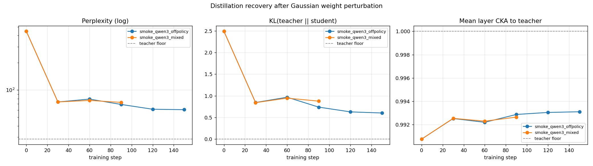
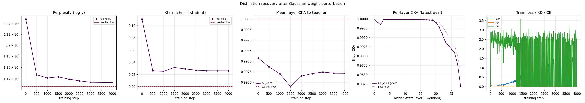

# Результаты эксперимента «повреждение → восстановление дистилляцией»

> **Суть эксперимента.** Берём чистого предобученного учителя `T` (Qwen3-Base),
> повреждаем копию гауссовским шумом по весам `S = T + α·σ(W)·ε`, а затем
> дистиллируем `S` обратно к `T` на FineWeb-Edu (смешанный лосс: off-policy
> forward-KL + on-policy reverse-KL по коротким роллаутам, с убыванием β 1.0→0.4).
> Замеряем три вещи: **перплексию** (выучил ли заново язык), **KL до учителя**
> (вернулось ли поведение) и **послойный linear CKA** (вернулась ли внутренняя
> геометрия представлений). Главный искомый результат — **α\***: уровень шума,
> при котором поведение восстанавливается, а представления (CKA) — уже нет.
>
> Научная часть документа состоит из трёх основных разделов:
> 1. **Smoke-тесты** — быстрая проверка, что весь пайплайн работает (CPU).
> 2. **Старый прогон на Qwen3-1.7B** (`full_a0.05`) — первый «боевой» запуск на GPU.
> 3. **Полный α-свип на Qwen3-0.6B** — основной научный результат.
>
> После них добавлен справочный блок: что лежит в папке, как устроен код, какие
> параметры можно менять и как воспроизводить прогоны.

---

## Важно про метрики и сопоставимость чисел

- **Перплексия (PPL)** — экспонента средней кросс-энтропии на отложенных блоках.
  Чем ниже, тем лучше модель предсказывает реальный текст. У учителя есть свой
  «пол» (floor) — это лучшее достижимое значение.
- **Floor зависит от конфига**, и числа из разных прогонов сравнивать напрямую
  нельзя: floor учителя = 28.5 в smoke (seq 256, `min_score 0`), 17.7 в 0.6B-свипе
  (seq 256, `min_score 2.5`), 11.3 в 1.7B-прогоне (seq 1024, `min_score 2.5`).
  Разные длина контекста, фильтр качества данных и размер eval-набора → разный
  floor. **Сравнивать имеет смысл только внутри одного прогона** (post-noise →
  финал относительно своего floor).
- **KL(учитель‖ученик)** — поведенческая дистанция: 0 = ученик предсказывает
  ровно то же распределение, что учитель.
- **CKA** (linear Centered Kernel Alignment) на скрытых состояниях по слоям:
  1.0 = геометрия активаций идентична учительской. CKA инвариантен к поворотам и
  масштабированию, поэтому корректно отвечает на вопрос «считает ли ученик внутри
  то же самое», в отличие от бессмысленного сравнения весов «в лоб».

---

# 1. Smoke-тесты (проверка пайплайна, CPU)

> **Цель этих прогонов — НЕ научный результат**, а доказательство, что весь
> конвейер работает от начала до конца на новейшей архитектуре Qwen3 и что метрики
> ведут себя осмысленно. Тем не менее даже здесь воспроизводятся ключевые эффекты.

**Модель:** `Qwen3-0.6B-Base`. **Данные:** срез FineWeb-Edu (15k документов,
закэширован локально). seq_len 256, batch 2, CPU fp32.

**Общая стартовая точка:**
- Учитель = чистый `Qwen3-0.6B-Base`, **floor PPL = 28.54** на этом срезе.
- Ученик = учитель + гауссовский шум, **α = 0.2**.
- Шум затронул **197 весовых матриц (~100% параметров)**; пропущены только
  крошечные 1-D параметры нормировок и смещений (~65 тыс.).
- Якоря: `teacher_baseline` (шаг −1: CKA≡1, KL≡0 — проверка корректности метрик) и
  `post_noise` (шаг 0: повреждение до обучения).

### Прогон 1 — off-policy дистилляция, 150 шагов (чистое восстановление)

`mode: off_policy`, forward-KD + убывающая CE, lr 7e-5.

| шаг | PPL | KL(T‖S) | KL(S‖T) | mean CKA |
|---:|---:|---:|---:|---:|
| floor учителя | 28.54 | 0.000 | 0.000 | 1.000 |
| 0 (post-noise) | **445.70** | 2.488 | 3.250 | 0.991 |
| 30  | 73.60 | 0.845 | 1.063 | 0.993 |
| 60  | 79.20 | 0.967 | 1.251 | 0.992 |
| 90  | 69.10 | 0.739 | 0.901 | 0.993 |
| 120 | 61.15 | 0.629 | 0.787 | 0.993 |
| 150 | **60.48** | **0.603** | 0.752 | 0.993 |

**Интерпретация.** Шум при α=0.2 ухудшил перплексию в **~16 раз** (28.5 → 445.7) —
с точки зрения выхода модель «сломана». Off-policy forward-KD чисто и
монотонно её восстанавливает: PPL **446 → 60**, KL до учителя **2.49 → 0.60**
(−76%), при этом CKA всё время держится ~0.99. Кривая на шаге 150 ещё снижается —
полноценный прогон (больше шагов, тюнинг lr) закрыл бы остаток зазора до floor’а.
Главное: **forward-KL на реальном тексте — самый надёжный способ "поднять" сильно
повреждённую модель**, потому что градиентный сигнал идёт от полного мягкого
распределения учителя, а не от одного one-hot токена.

### Прогон 2 — mixed-режим с on-policy warmup, 90 шагов

`mode: mixed`, `on_policy_warmup_frac: 0.4` (первые 40% шагов — только off-policy,
чтобы сперва починить модель, затем подмешиваются роллауты ученика), on-policy член
на reverse-KL.

| шаг | PPL | KL(T‖S) | KL(S‖T) | mean CKA |
|---:|---:|---:|---:|---:|
| 0 (post-noise) | 445.70 | 2.488 | 3.250 | 0.991 |
| 30 (ещё warmup) | 73.60 | 0.842 | 1.065 | 0.993 |
| 60 (on-policy включился) | 76.57 | 0.946 | 1.111 | 0.992 |
| 90 | **72.79** | **0.877** | 1.022 | 0.993 |

**Интерпретация — фикс «холодного старта» работает.** На старом Qwen2.5 *чистый*
on-policy делал только хуже (PPL 143 → 359): сломанная модель генерит мусорные
роллауты и дистиллируется из собственного мусора. Здесь же с 40%-warmup ученик уже
починен off-policy (PPL 73 к шагу 30) **до** того, как начинаются роллауты,
поэтому при включении on-policy PPL лишь слегка колеблется (73 → 77 → 73), а **CKA
не падает** (0.99). Вывод, заложенный в основной конфиг: **сначала чиним
off-policy, потом включаем on-policy** против exposure bias.



### Что уже видно из smoke

1. **Дистилляция реально восстанавливает повреждённую модель** (Прогон 1
   однозначен: 446 → 60 PPL, 2.49 → 0.60 KL, монотонно, CKA сохранён).
2. **CKA показывает то, что прячет перплексия.** При α=0.2 выход разрушен (PPL
   ×16), а представления почти не сдвинулись (CKA 0.991) — поведение и внутренняя
   геометрия развязаны. Именно поэтому мы меряем CKA на активациях, а не веса.
3. **On-policy нужен warmup** — иначе холодный старт на сломанной модели.

---

# 2. Старый прогон на Qwen3-1.7B (`full_a0.05`)

> Первый «боевой» запуск на RTX 3090 Ti. Конфиг
> [`configs/full_3090ti.yaml`](configs/full_3090ti.yaml): `Qwen3-1.7B-Base`,
> seq_len 1024, `min_score 2.5`, mixed-GKD, 30%-warmup, β 1.0→0.4 (cosine),
> 4000 шагов, `adamw8bit` + gradient checkpointing. **Время: ~19 часов.**

**Параметры повреждения:** α = **0.05** (малый шум — «лёгкая царапина»).
Floor учителя на этом конфиге — **PPL 11.27**.

| шаг | PPL | KL(T‖S) | mean CKA |
|---:|---:|---:|---:|
| floor учителя | 11.27 | 0.000 | 1.000 |
| 0 (post-noise) | **12.49** | 0.110 | 0.998 |
| 500  | 11.47 | 0.026 | 0.998 |
| 1000 | 11.41 | 0.025 | 0.997 |
| 2000 | 11.39 | 0.029 | 0.997 |
| 3000 | 11.34 | 0.026 | 0.997 |
| 4000 | **11.33** | **0.026** | 0.997 |

Послойный CKA (29 значений, слой 0 = эмбеддинги, слой 28 = верхний):
почти везде 1.000; **минимум — в самом глубоком слое 28**: post-noise 0.985 → финал
0.982.



### Подробная интерпретация

**1. α=0.05 — это лёгкое повреждение, и оно сразу подтверждает гипотезу об
устойчивости.** Шум сдвинул модель совсем чуть-чуть: PPL +11% (против ×16 при
α=0.2), KL 0.11, CKA 0.998. То есть при малых α предобученное решение Qwen3
устойчиво — возмущение почти не выбивает модель из её «бассейна притяжения».

**2. Восстановление почти мгновенное, дальше — плато.** Уже к шагу 500 PPL=11.47,
KL=0.026 — то есть **первые 500 из 4000 шагов сделали почти всю работу**, а
оставшиеся 3500 шагов (≈16 часов из 19!) лишь микро-шлифовали 11.47 → 11.33.
Практический вывод: при малом уроне восстановление логарифмически насыщается, и
4000 шагов — сильно избыточно. Финал 11.33 против floor’а 11.27 — зазор всего
0.06, по сути полный возврат поведения.

**3. Самое интересное — послойный CKA.** Урон сконцентрирован почти полностью в
**глубочайшем слое (28-м)**: там CKA 0.985, тогда как слои 0–20 стоят на 1.000. И
ключевой момент: дистилляция **не подняла** CKA этого слоя (0.985 → 0.982, даже
чуть ниже), хотя PPL/KL восстановились идеально. Это — в миниатюре — центральная
идея всего эксперимента: **поведение (PPL/KL) и внутренняя геометрия (CKA)
развязаны**. Модель вернулась к поведению учителя, не возвращаясь полностью к его
представлениям в верхних слоях. При α=0.05 эффект крошечный, но он того же знака,
что и драматичный обвал CKA при больших α (см. раздел 3).

**4. Режимы.** Из залогированных шагов 502 off-policy / 298 on-policy (≈37%
on-policy после 30%-warmup) — рецепт «сначала off-policy, потом роллауты»
отработал без коллапса.

**Вывод по разделу:** `full_a0.05` — это чистый **нижний якорь** свипа. Он
доказывает, что (а) пайплайн на 1.7B работает на реальном железе, (б) при малом α
модель устойчива и полностью восстанавливается по поведению за ~500 шагов,
(в) лёгкий несхлопывающийся след в CKA верхнего слоя — первый намёк на главный
эффект. Для научного результата нужны средние и большие α — это раздел 3.
Остальные ячейки 1.7B-свипа (α=0.1/0.2/0.35/0.5) не считались: ~19 ч каждая.

---

# 3. Полный α-свип на Qwen3-0.6B (основной результат)

> Конфиг [`configs/sweep_qwen3_0.6b.yaml`](configs/sweep_qwen3_0.6b.yaml):
> `Qwen3-0.6B-Base`, mixed-GKD, 30%-warmup, β 1.0→0.4 (cosine), 2000 шагов на
> каждую α. Результаты в `results/sweep_qwen3_0.6b/a{α}/`.
> **Весь свип ≈ 51 минута (~10 мин/α)** против ~19 ч за одну ячейку на 1.7B.
> Floor учителя на этом конфиге — **PPL 17.73**.

**Заметка про железо (Windows / 24 ГБ).** Свип идёт с seq_len 256, `adamw8bit` и
жёстким лимитом `CUDA_MEM_FRACTION=0.9`. Причина: при seq_len 1024 тензоры логитов
по словарю Qwen3 (~152k) в fp32 + fp32-состояние AdamW переполняют 24 ГБ, а на
Windows/WDDM это **не падает с OOM, а молча сливается в системную RAM** (sysmem
fallback) — обучение начинает буксовать, и весь ПК зависает. Лимит превращает это
в честный OOM; облегчённый конфиг держит реальный пик на ~16 ГБ. seq_len 256 даёт
более высокий floor (17.7), но это не мешает — сравнения делаются внутри прогона.

### Сводная таблица по всем α

| α | post-noise PPL | финал PPL | post KL | финал KL | финал mean CKA | min CKA слоя (post → финал) |
|---:|---:|---:|---:|---:|---:|---:|
| **0.05** | 19.9 | 18.18 | 0.135 | 0.067 | 0.9991 | 0.989 → 0.987 |
| **0.10** | 27.5 | 19.20 | 0.486 | 0.136 | 0.9975 | 0.952 → 0.965 |
| **0.20** | 240 | 24.46 | 2.72 | 0.420 | 0.9921 | 0.794 → 0.900 |
| **0.35** | 5.5·10⁵ | 46.68 | 10.49 | 1.145 | 0.9794 | 0.203 → 0.829 |
| **0.50** | 2.8·10⁹ | 151.1 | 17.96 | 2.360 | 0.8903 | 0.063 → 0.716 |


### Главные выводы

**1. Поведение восстанавливается при ЛЮБОМ уровне шума.** Это само по себе сильный
результат. Даже при α=0.5, где шум разрушил модель до **PPL = 2.8 миллиарда**
(полностью случайный выход) и KL=18, дистилляция за 2000 шагов вернула PPL к 151, а
KL к 2.36. Нет такой α в свипе, где ученик не смог бы вскарабкаться обратно к
поведению учителя. Рецепт mixed-GKD + warmup оказался поразительно живучим —
учитель как «мягкая разметка» вытягивает даже почти уничтоженную модель.

**2. Представления (CKA) при большом α НЕ восстанавливаются — это и есть искомый
эффект.** Финальный mean-CKA держится ≥0.99 вплоть до α=0.2, затем проваливается:
**0.979 (α=0.35) → 0.890 (α=0.5)** и там и остаётся. Точка отказа — самый глубокий
слой: шум выбивает его CKA до **0.20 (α=0.35)** и **0.063 (α=0.5)** (т.е. верхний
слой становится практически случайным), а дистилляция поднимает его лишь до 0.83 /
0.72. То есть на больших α модель учится **вести себя** как учитель, **не возвращая
свою внутреннюю геометрию** к учительской.

**3. Найдена эмпирическая ширина «бассейна» α\* ≈ 0.2–0.35.** Это главная цифра
эксперимента — количественная мера устойчивости предобученного решения Qwen3:
- **α ≤ 0.2:** и PPL, и CKA возвращаются к учителю → полный возврат в **то же**
  решение (тот же бассейн притяжения).
- **α ≥ 0.35:** поведение восстанавливается, но модель садится в **другое**
  представленческое решение, лишь имитирующее выходы учителя (CKA остаётся
  сломанным).

Этот переход между α=0.2 и α=0.35 — граница, за которой повреждение становится
необратимым на уровне внутренней геометрии, даже если по выходу всё «выглядит
почти восстановленным».

**4. Восстановление быстрое, затем плато — на всех α.** Как и на 1.7B, около
половины зазора закрывается уже к первому eval (шаг 250), и кривая выходит на полку
задолго до 2000 шагов. Даже при α=0.5: PPL 656 (шаг 250) → 151 (шаг 2000), почти
вся работа — в первых сотнях шагов. 2000 шагов на этой модели — с запасом.

**5. Поведение vs представления — наглядная развязка.** Сопоставьте α=0.35: PPL
восстановилась с 550 000 до 47 (рядом с floor 17.7 — почти отлично по выходу!),
а CKA глубокого слоя так и осталась 0.83 вместо 1.0. Если бы мы смотрели только на
перплексию, решили бы «модель восстановлена». CKA показывает, что внутри это уже
**другая** модель. Ровно ради этого вывода метрика CKA и заведена.

---

## Как воспроизвести

```powershell
$env:HF_HOME="D:\HANDMADE_LLM\Distillation\.hf_cache"
$env:HF_HUB_OFFLINE=1
$env:CUDA_MEM_FRACTION=0.9      # защита от зависания на Windows (см. заметку выше)
# 0.6B-свип (основной результат), ~51 мин:
foreach ($a in 0.05,0.1,0.2,0.35,0.5) {
  python -m src.distill --config configs/sweep_qwen3_0.6b.yaml --alpha $a --run_name a$a
}
python -m src.live_plot results/sweep_qwen3_0.6b/a* --out results/sweep_qwen3_0.6b/sweep_comparison.png
```

## Что напрашивается дальше

1. **Контроль β=0** (чистый CE без учителя) на средней α — доказать, что работу
   делает именно сигнал учителя, а не просто дообучение на тексте.
2. **Тонкая локализация α\*** — добавить α=0.25 и 0.30 между 0.2 и 0.35, где
   ломается CKA, чтобы точнее определить границу.
3. **Абляция off / on / mixed** — измерить вклад on-policy роллаутов.
4. **Тот же свип на 1.7B** — проверить, сдвигается ли α\* с масштабом модели
   (но это ~3–4 суток счёта).

---

# 4. Что именно делалось в soft-KD эксперименте простыми словами

Этот раздел — не новые результаты, а подробная расшифровка эксперимента: что
происходит в коде, какие файлы за что отвечают и какие параметры можно крутить.

Если совсем коротко:

> Мы брали уже обученную модель, делали её копию, специально портили копию шумом,
> а потом пытались вернуть копию к поведению оригинала с помощью дистилляции.

Оригинал называется **teacher**. Повреждённая копия называется **student**.

## Почему это именно дистилляция, а не просто “выкачивание данных”

Здесь не скачивались ответы модели как готовый датасет и не обучалась модель только
на “текст → текст”. В каждом training step происходило следующее:

1. Берётся реальный текстовый блок из FineWeb-Edu.
2. Этот же блок подаётся teacher и student.
3. Teacher выдаёт не один правильный токен, а целое распределение вероятностей по
   словарю для каждой позиции.
4. Student тоже выдаёт своё распределение.
5. Loss заставляет student приблизить своё распределение к teacher distribution.

То есть teacher передаёт student не только “правильный следующий токен”, а свою
полную неопределённость:

```text
teacher:
    "the"    0.42
    "a"      0.19
    "this"   0.08
    ","      0.03
    ...

student:
    "cat"    0.30
    "the"    0.10
    ...

loss:
    сделать student distribution похожим на teacher distribution
```

В этом и смысл soft-KD: учитель передаёт форму распределения, а не только top-1
метку.

## Как выглядела одна обучающая порция данных

Текст токенизировался и паковался в блоки фиксированной длины:

- в smoke и 0.6B sweep: `seq_len = 256`;
- в старом 1.7B full-run: `seq_len = 1024`.

Один блок выглядит примерно так:

```text
tokens:
    t0, t1, t2, t3, ..., t255

input:
    t0, t1, t2, ..., t254

next-token targets:
    t1, t2, t3, ..., t255
```

Модель на позиции `i` предсказывает токен `i+1`. Поэтому в коде почти везде есть
сдвиг:

```python
logits = model(seq).logits[:, :-1, :]
targets = seq[:, 1:]
```

Это стандартный формат autoregressive language modeling.

## Что означали режимы off-policy, on-policy и mixed

### Off-policy

Off-policy — самый спокойный режим.

Модель не генерирует собственный текст. Ей всё время подают реальные блоки из
FineWeb-Edu.

На этих блоках считается:

```text
loss = beta * KD(student, teacher) + (1 - beta) * CE(student, real_text)
```

Где:

- `KD` — расстояние между распределениями teacher и student;
- `CE` — обычная cross-entropy по реальному следующему токену;
- `beta` — насколько сильно доверяем teacher distribution относительно обычного
  текста.

В начале `beta` высокий: student надо быстро “притянуть” обратно к teacher.
К концу `beta` снижается: больше роли получает обычная языковая CE по тексту.

### On-policy

On-policy — более рискованный режим.

Student получает реальный prompt, сам генерирует `1..k` новых токенов, а teacher
оценивает именно эту student-generated область.

Схема:

```text
real prompt → student generates continuation → teacher scores generated tokens
```

Зачем это нужно:

- off-policy учит student на реальном тексте;
- on-policy учит student исправляться на собственных продолжениях;
- это помогает бороться с exposure bias: в реальном использовании модель видит свои
  же прошлые токены, а не всегда идеальный ground truth.

Почему это опасно:

- если student сильно повреждён, он сначала генерирует мусор;
- если сразу учиться на этом мусоре, можно закрепить плохой режим;
- поэтому нужен warmup.

### Mixed

Mixed — основной режим старого soft-KD эксперимента.

Первые `on_policy_warmup_frac` шагов идут только off-policy, чтобы student немного
пришёл в себя. Потом часть шагов остаётся off-policy, а часть становится on-policy.

В основном 0.6B sweep было:

```yaml
mode: mixed
on_policy_ratio: 0.5
on_policy_warmup_frac: 0.3
```

То есть первые 30% шагов — только real-data teacher-forcing. После этого примерно
половина шагов — on-policy rollout.

В фактических логах каждого 0.6B run:

```text
off_policy train records: 245
on_policy train records: 155
```

Соотношение не ровно 50/50 по всему run из-за warmup.

---

# 5. Что находится в папке

Корень эксперимента:

```text
distillation/soft_kd_recovery/
```

Это старая ветка экспериментов: soft-KD / mixed-GKD восстановление повреждённой
модели.

## `RESULTS.md`

Этот файл.

Назначение:

- объясняет идею эксперимента;
- фиксирует результаты smoke, 1.7B full-run и 0.6B alpha sweep;
- объясняет метрики;
- описывает структуру папки;
- разбирает код;
- перечисляет параметры, которые можно менять.

## `experiment.md`

Рабочее описание первоначальной идеи.

Это не исполняемый код, а заметка о том, зачем проводился эксперимент:

- повредить модель шумом;
- попробовать вернуть её к teacher через distillation;
- измерить границу, где поведение ещё восстанавливается, а внутренние представления
  уже нет.

## `data.md`

Короткая заметка о данных/результатах, которые не помещаются на GitHub.

Сейчас там лежит ссылка на внешний storage:

```text
https://disk.360.yandex.ru/d/mmv25RKJHXiISQ
```

## `.gitignore`

Локальные правила игнорирования для этой подпапки.

Игнорируются:

- `.hf_cache/` — локальный Hugging Face cache;
- `data/` — локальный FineWeb-Edu corpus cache;
- `results/**/student/` — сохранённые веса student-моделей;
- `results/**/*.log` — сырые консольные логи;
- `results/**/live.png` — временные live-графики;
- `__pycache__/`, `*.pyc` — Python cache.

Важно:

- `log.jsonl` не игнорируется и его стоит коммитить;
- `student/model.safetensors` игнорируется, потому что это тяжёлые веса.

---

# 6. Что находится в `configs/`

## `configs/smoke.yaml`

Конфиг для быстрой проверки pipeline.

Ключевые параметры:

```yaml
model_name: Qwen/Qwen3-0.6B-Base
alpha: 0.2
seq_len: 256
mode: off_policy
steps: 150
batch_size: 2
optimizer: adamw
save_student: false
```

Для чего нужен:

- проверить, что модель загружается;
- проверить, что данные читаются;
- проверить, что noise injection работает;
- проверить, что loss и метрики считаются;
- получить короткую recovery-кривую без долгого GPU-прогона.

Smoke-test — это не главный научный результат. Это sanity-check.

## `configs/full_3090ti.yaml`

Конфиг для большого старого прогона на `Qwen3-1.7B-Base`.

Ключевые параметры:

```yaml
model_name: Qwen/Qwen3-1.7B-Base
seq_len: 1024
mode: mixed
on_policy_ratio: 0.5
on_policy_warmup_frac: 0.3
steps: 4000
batch_size: 4
grad_accum: 2
optimizer: adamw8bit
grad_checkpointing: true
save_student: true
```

Это тяжёлый full-parameter run:

- teacher лежит в памяти;
- student обучается целиком;
- хранятся градиенты student;
- optimizer state тоже занимает память.

Поэтому включены:

- `adamw8bit`, чтобы снизить память optimizer state;
- `grad_checkpointing: true`, чтобы экономить память на активациях;
- `seq_len: 1024`, чтобы 1.7B run был ближе к нормальному контексту.

Именно с этим конфигом был сделан `results/full_a0.05`.

## `configs/sweep_qwen3_0.6b.yaml`

Конфиг основного 0.6B alpha sweep.

Ключевые параметры:

```yaml
model_name: Qwen/Qwen3-0.6B-Base
out_dir: results/sweep_qwen3_0.6b
seq_len: 256
mode: mixed
on_policy_ratio: 0.5
on_policy_warmup_frac: 0.3
steps: 2000
batch_size: 4
grad_accum: 2
optimizer: adamw8bit
save_student: true
```

Почему 0.6B:

- весь alpha sweep можно прогнать примерно за час;
- модель помещается на RTX 3090 Ti комфортнее, чем 1.7B;
- можно быстро найти область α\*.

Почему `seq_len = 256`:

- у Qwen3 большой словарь;
- logits tensor имеет форму `(batch, seq, vocab)`;
- при большом `seq_len` память быстро раздувается;
- на Windows/WDDM превышение VRAM может превращаться не в обычный OOM, а в зависание
  через sysmem fallback.

---

# 7. Что находится в `src/`

## `src/__init__.py`

Служебный файл, который делает `src` Python-пакетом.

Благодаря ему можно запускать:

```powershell
python -m src.distill ...
python -m src.live_plot ...
python -m src.plot ...
```

## `src/data.py`

Отвечает за данные.

Главные элементы:

### `DataConfig`

Dataclass с настройками:

- `dataset`;
- `name`;
- `split`;
- `text_field`;
- `seq_len`;
- `min_score`;
- `seed`;
- `local_jsonl`.

Практически важно:

```python
local_jsonl: str | None = "data/fineweb_edu_local.jsonl"
```

Если локальный JSONL существует, код читает данные с диска. Если нет — стримит
FineWeb-Edu с Hugging Face.

### `_local_doc_stream(...)`

Читает локальный JSONL файл построчно.

Каждая строка ожидается примерно такой:

```json
{"text": "...", "score": 3.2}
```

Функция:

- фильтрует документы по `min_score`;
- пропускает первые `skip` документов;
- циклически перечитывает файл, чтобы training stream не закончился.

### `_doc_stream(...)`

Выбирает источник данных:

1. если есть `data/fineweb_edu_local.jsonl` — читает локально;
2. иначе запускает streaming dataset через `datasets.load_dataset`.

### `token_block_stream(...)`

Токенизирует документы и пакует их в блоки длины `seq_len`.

Документы склеиваются через EOS token:

```text
doc1 tokens + EOS + doc2 tokens + EOS + ...
```

Это стандартный pretraining-style packing.

### `make_batches(...)`

Собирает блоки в batch:

```text
(batch_size, seq_len)
```

Эта функция используется в training loop.

### `fixed_blocks(...)`

Материализует фиксированный набор блоков для eval/probe.

Почему это важно:

- PPL на разных шагах считается на одном и том же eval set;
- KL и CKA считаются на одном и том же probe set;
- иначе метрики плавали бы не только от обучения, но и от смены данных.

## `src/distill.py`

Главный файл эксперимента.

Он запускает весь pipeline.

### `RunConfig`

Главный dataclass со всеми “ползунками” эксперимента.

Туда входят:

- модель;
- шум;
- данные;
- distillation режим;
- optimizer;
- eval;
- сохранение.

Все YAML-конфиги фактически превращаются в `RunConfig`.

### `load_config(...)`

Загружает YAML и применяет CLI-overrides:

```powershell
python -m src.distill --config configs/sweep_qwen3_0.6b.yaml --alpha 0.35 --run_name a0.35
```

Здесь `--alpha` и `--run_name` перезаписывают значения из YAML.

Также функция проверяет неизвестные ключи. Если в YAML опечатка — код упадёт, а не
молча проигнорирует параметр.

### `get_device()`

Выбирает:

```python
cuda если доступна, иначе cpu
```

### `load_models(...)`

Загружает teacher и создаёт student.

Что происходит:

1. Загружается tokenizer.
2. Загружается teacher через `AutoModelForCausalLM`.
3. Teacher переводится в eval mode.
4. Все параметры teacher замораживаются:

   ```python
   p.requires_grad_(False)
   ```

5. Student создаётся как `copy.deepcopy(teacher)`.
6. У student включаются gradients.
7. При необходимости включается gradient checkpointing.

Это важный дизайн:

> student и teacher имеют одну архитектуру, один tokenizer и один vocab.

Поэтому logits можно сравнивать напрямую. Не нужна проекция словаря, remapping токенов
или адаптер между разными моделями.

### `build_optimizer(...)`

Создаёт optimizer.

Варианты:

- `adamw` — обычный PyTorch AdamW;
- `adamw8bit` — bitsandbytes PagedAdamW8bit.

`adamw8bit` нужен, чтобы optimizer state занимал меньше VRAM.

### `on_policy_batch(...)`

Генерирует короткий on-policy rollout.

Схема:

1. Берётся prompt длины `rollout_prompt_len`.
2. Student генерирует `k` токенов, где `k` случайно выбирается между
   `rollout_min` и `rollout_max`.
3. Возвращается sequence и mask, где отмечены generated tokens.

Почему нужна mask:

- teacher должен дистиллировать student именно на сгенерированной области;
- prompt не является областью on-policy loss.

### `run_eval(...)`

Считает eval metrics:

- PPL;
- KL(T‖S), KL(S‖T);
- layerwise CKA;
- mean CKA.

Эта функция вызывается:

- для teacher baseline;
- для post-noise baseline;
- на каждом eval step;
- в финале.

### `main()`

Главный сценарий:

1. Парсит CLI arguments.
2. Загружает конфиг.
3. Настраивает CUDA memory cap через `CUDA_MEM_FRACTION`, если переменная задана.
4. Создаёт output folder.
5. Открывает `log.jsonl`.
6. Загружает teacher/student.
7. Создаёт eval/probe blocks.
8. Считает teacher baseline.
9. Добавляет шум в student.
10. Считает post-noise baseline.
11. Создаёт optimizer.
12. Запускает training loop.
13. Каждые 5 шагов пишет train log.
14. Каждые `eval_every` шагов считает eval.
15. В конце сохраняет student, если `save_student: true`.

Ключевая логика выбора режима:

```python
warmup_steps = int(cfg.on_policy_warmup_frac * cfg.steps)
on_policy_allowed = step >= warmup_steps
use_on_policy = on_policy_allowed and (
    cfg.mode == "on_policy" or
    (cfg.mode == "mixed" and random < cfg.on_policy_ratio)
)
```

То есть warmup реально запрещает on-policy в начале.

## `src/losses.py`

Файл с loss-функциями.

### `kd_divergence(...)`

Считает divergence между распределениями student и teacher.

Поддерживает:

- `forward_kl`;
- `reverse_kl`;
- `jsd`.

#### `forward_kl`

```text
KL(teacher‖student)
```

Это classic KD direction.

Интуитивно:

- teacher говорит, где probability mass;
- student штрафуется, если не покрывает варианты teacher;
- хорошо подходит для teacher-forcing на реальном тексте.

#### `reverse_kl`

```text
KL(student‖teacher)
```

Интуитивно:

- student штрафуется, если кладёт вероятность туда, где teacher её не кладёт;
- более mode-seeking;
- логичен для on-policy generated tokens.

#### `jsd`

Jensen-Shannon divergence.

Более мягкий/симметричный вариант, потенциально полезный для стабильности.

### `mixed_loss(...)`

Главный loss старого эксперимента.

Формула:

```text
loss = beta * KD + (1 - beta) * CE
```

Где:

- `KD` — divergence между logits teacher и student;
- `CE` — cross-entropy student по реальному тексту;
- `beta` — вес KD.

В off-policy:

- есть реальные targets;
- работает и KD, и CE.

В on-policy:

- generated tokens не имеют ground-truth target;
- targets заполняются `-100`;
- loss фактически становится KD-only на generated mask.

### `beta_schedule(...)`

Плавно меняет beta от `beta_start` к `beta_end`.

В этом эксперименте идея такая:

```text
начало: beta высокий → быстро вернуть student к teacher
конец: beta ниже → дать CE по реальному тексту подшлифовать языковую модель
```

## `src/metrics.py`

Файл с метриками.

### `perplexity(...)`

Считает next-token perplexity на фиксированных блоках.

Ниже — лучше.

Это метрика “модель нормально предсказывает язык?”.

### `kl_to_teacher(...)`

Считает:

- `kl_teacher_student`;
- `kl_student_teacher`.

Ниже — лучше.

Это метрика “поведение student похоже на teacher?”.

### `_linear_cka(...)`

Низкоуровневый расчёт linear CKA между двумя матрицами признаков.

### `layerwise_cka(...)`

Считает CKA по hidden states каждого слоя.

Возвращает список:

```text
[cka_layer_0, cka_layer_1, ..., cka_layer_N]
```

Слой 0 обычно соответствует embedding hidden state, последние слои — верхним
представлениям модели.

Именно последние слои оказались самыми хрупкими при большом `alpha`.

## `src/noise.py`

Файл повреждения модели.

### `NoiseConfig`

Настройки шума:

- `alpha`;
- `min_ndim`;
- `perturb_norms`;
- `perturb_bias`;
- `skip_pattern`;
- `norm_pattern`;
- `seed`;
- include/exclude regex.

### `inject_noise(...)`

Главная функция повреждения.

Формула:

```text
W += alpha * std(W) * eps
eps ~ N(0, 1)
```

Шум масштабируется на `std(W)` конкретного tensor. Это делает повреждение
относительным к масштабу каждого слоя.

По умолчанию:

- шумятся 2D weight matrices;
- не шумятся norm-параметры;
- не шумятся bias;
- tied weights не портятся дважды.

### `NoiseReport`

Отчёт о шуме.

Он сохраняется в `noise_report.json`.

## `src/fetch_corpus.py`

Скрипт для создания локального corpus cache:

```powershell
python -m src.fetch_corpus --n 20000 --out data/fineweb_edu_local.jsonl
```

Зачем:

- не зависеть от интернета при каждом запуске;
- не стримить FineWeb-Edu каждый раз;
- сделать прогоны более воспроизводимыми.

## `src/live_plot.py`

Строит расширенный график по логам.

Панели:

1. PPL vs step;
2. KL(T‖S) vs step;
3. mean CKA vs step;
4. per-layer CKA на последнем eval;
5. train loss/KD/CE или sweep summary.

Можно использовать в live-режиме:

```powershell
python -m src.live_plot --watch 20 --out results/sweep_qwen3_0.6b/live.png results/sweep_qwen3_0.6b/a0.2
```

`live.png` игнорируется git, потому что это временный файл.

## `src/plot.py`

Простой статический plotter.

Строит три панели:

- PPL;
- KL(T‖S);
- mean CKA.

Сейчас полезнее `live_plot.py`, но `plot.py` хорош как минимальный инструмент.

---

# 8. Что находится в `data/`

## `data/fineweb_edu_local.jsonl`

Локальный cache FineWeb-Edu.

Размер локального файла сейчас около `248 MB`.

Формат:

```json
{"text": "...", "score": 3.1}
{"text": "...", "score": 2.7}
```

Файл нужен для локальных запусков, но не нужен в git:

- он большой;
- это данные, а не код;
- его можно пересоздать через `src/fetch_corpus.py`;
- он игнорируется `.gitignore`.

---

# 9. Что находится в `results/`

## `results/recovery_qwen3.png`

График сравнения Qwen3 smoke-прогонов.

Он показывает, что:

- off-policy быстро восстанавливает повреждённую 0.6B модель;
- mixed с warmup работает без холодного on-policy коллапса.

## `results/recovery_offpolicy_qwen3.png`

Дополнительный график off-policy восстановления на Qwen3.

Полезен как быстрый visual sanity-check.

## `results/full_a0.05/`

Папка старого большого 1.7B run.

Внутри:

### `config.json`

Фактический конфиг запуска.

Важно хранить, потому что YAML-конфиг может измениться позже, а `config.json`
фиксирует реальные параметры уже проведённого эксперимента.

### `log.jsonl`

Структурированный лог.

Содержит:

- `teacher_baseline`;
- `post_noise`;
- `train`;
- `eval`.

Это главный источник динамики обучения.

### `noise_report.json`

Отчёт о том, какие параметры были зашумлены.

### `recovery_full_a0.05.png`

График восстановления для 1.7B α=0.05.

### `student/`

Локально сохранённая восстановленная student-модель.

Внутри есть:

- `model.safetensors` — веса модели, примерно `3.44 GB`;
- tokenizer/config файлы.

Это полноценная Hugging Face `save_pretrained` папка.

Пример загрузки:

```python
from transformers import AutoModelForCausalLM, AutoTokenizer

path = r"D:\HANDMADE_LLM\REPO\qwen\distillation\soft_kd_recovery\results\full_a0.05\student"

tok = AutoTokenizer.from_pretrained(path)
model = AutoModelForCausalLM.from_pretrained(path)
```

`student/` игнорируется git, потому что веса слишком тяжёлые.

## `results/sweep_qwen3_0.6b/`

Главная папка полного 0.6B α-sweep.

### `summary.json`

Сводка по всем alpha.

Содержит:

- `alpha`;
- teacher/post/final PPL;
- post/final KL;
- post/final CKA;
- min CKA;
- `final_cka_per_layer`;
- `post_cka_per_layer`.

Это удобный файл для таблиц и сравнительных графиков.

### `sweep_comparison.png`

Основной итоговый график 0.6B sweep.

### `live.png`

Временный live-график.

Он игнорируется git:

```text
results/**/live.png
```

### `a0.05/`, `a0.1/`, `a0.2/`, `a0.35/`, `a0.5/`

Каждая папка — отдельный run с конкретным уровнем шума.

Внутри каждой:

- `config.json`;
- `log.jsonl`;
- `noise_report.json`;
- `student/`.

Локально в каждой `student/` есть `model.safetensors` примерно `1.11 GB`.
Все пять 0.6B моделей занимают примерно `5.55 GB`.

Пример загрузки:

```python
from transformers import AutoModelForCausalLM, AutoTokenizer

path = r"D:\HANDMADE_LLM\REPO\qwen\distillation\soft_kd_recovery\results\sweep_qwen3_0.6b\a0.2\student"

tok = AutoTokenizer.from_pretrained(path)
model = AutoModelForCausalLM.from_pretrained(path)
```

## `results/smoke_*`

Smoke-папки — это диагностические прогоны.

Есть две группы:

### Старые Qwen2.5 smoke

- `smoke_offpolicy`;
- `smoke_onpolicy`;
- `smoke_mixed_warmup`.

Они были нужны на раннем этапе, чтобы проверить саму идею:

- off-policy восстанавливает;
- чистый on-policy может ухудшать;
- mixed без правильного warmup может ломать CKA.

Например, на `Qwen2.5-0.5B` при `alpha=0.25`:

| run | final PPL | final KL(T‖S) | final CKA | смысл |
|---|---:|---:|---:|---|
| `smoke_offpolicy` | 39.24 | 1.348 | 0.934 | off-policy чинит |
| `smoke_onpolicy` | 152.48 | 2.730 | 0.920 | чистый on-policy почти не чинит |
| `smoke_mixed_warmup` | 59.65 | 1.934 | 0.672 | ранний mixed был нестабилен |

### Qwen3 smoke

- `smoke_qwen3_offpolicy`;
- `smoke_qwen3_mixed`.

Это уже smoke на `Qwen3-0.6B-Base`.

Они показали:

- off-policy уверенно чинит `PPL 445.7 → 60.5`;
- mixed с warmup не коллапсирует и даёт `PPL 445.7 → 72.8`.

---

# 10. Что такое `model.safetensors` в soft-KD эксперименте

`model.safetensors` внутри `student/` — это уже восстановленная student-модель после
soft-KD/mixed-GKD обучения.

Например:

```text
results/sweep_qwen3_0.6b/a0.35/student/model.safetensors
```

означает:

```text
Qwen3-0.6B-Base
→ копия teacher
→ добавлен Gaussian noise alpha=0.35
→ student обучался через soft-KD/mixed-GKD
→ финальные веса сохранены
```

Это не оригинальный teacher и не “сырые” веса после шума. Это восстановленная модель.

Зачем она может пригодиться:

- сравнить генерации разных `alpha`;
- сделать дополнительный eval;
- продолжить восстановление;
- сравнить soft-KD model с hard-teacher baseline model;
- исследовать внутренние представления;
- построить downstream-тесты.

Почему не пушим в git:

- 0.6B model ≈ `1.11 GB`;
- 1.7B model ≈ `3.44 GB`;
- GitHub-репозиторий быстро станет неподъёмным;
- веса можно хранить отдельно или пересоздать по конфигам/логам.

---

# 11. Какие “ползунки” можно крутить

Ниже — основные параметры и что будет, если их менять.

## `alpha`

Сила шума.

```yaml
alpha: 0.2
```

Больше `alpha`:

- сильнее ломает student;
- резко увеличивает post-noise PPL/KL;
- снижает CKA;
- позволяет проверить границу recoverability.

Меньше `alpha`:

- student почти остаётся teacher;
- восстановление быстрое;
- сложнее увидеть разрыв между поведением и представлениями.

Главный результат soft-KD sweep:

```text
α* ≈ 0.2–0.35
```

До `0.2` восстанавливается и поведение, и CKA. Начиная примерно с `0.35`, поведение
ещё возвращается, а представления уже нет.

## `noise_seed`

Seed шума.

```yaml
noise_seed: 0
```

Меняет конкретное повреждение при том же `alpha`.

Если делать более строгий эксперимент, надо прогнать несколько seeds:

```text
alpha = 0.2, seeds = 0, 1, 2, 3, 4
```

И смотреть среднее/разброс.

## `perturb_norms`

Шумить ли norm-параметры.

```yaml
perturb_norms: false
```

`false` — более осмысленный и стабильный режим.

`true` может очень резко ломать модель, потому что norm/gain параметры сильно влияют
на численную стабильность.

## `model_name`

Какая модель является teacher.

```yaml
model_name: Qwen/Qwen3-0.6B-Base
```

Больше модель:

- дольше обучение;
- больше VRAM;
- тяжелее `model.safetensors`;
- потенциально другая граница α\*.

Меньше модель:

- быстрее sweep;
- проще отлаживать.

## `seq_len`

Длина блока в токенах.

```yaml
seq_len: 256
```

Больше `seq_len`:

- больше контекста;
- ближе к нормальному LM training;
- выше VRAM/time;
- особенно дорого из-за logits `(batch, seq, vocab)`.

Меньше `seq_len`:

- быстрее и стабильнее;
- выше teacher floor PPL;
- хуже моделируется длинный контекст.

## `min_score`

Фильтр качества FineWeb-Edu.

```yaml
min_score: 2.5
```

Больше:

- тексты чище/образовательнее;
- данных после фильтра меньше.

Меньше:

- больше данных;
- больше шумных текстов.

Важно: PPL floor зависит от `min_score`, поэтому нельзя напрямую сравнивать PPL из
разных конфигов.

## `data_seed`

Seed для порядка данных.

```yaml
data_seed: 0
```

Влияет на shuffle и fixed eval/probe blocks.

## `mode`

Режим дистилляции.

```yaml
mode: mixed
```

Варианты:

- `off_policy`;
- `on_policy`;
- `mixed`.

Практически:

- `off_policy` — стабильный repair;
- `on_policy` — рискованный без warmup;
- `mixed` — основной режим: сначала repair, потом добавляем rollouts.

## `on_policy_ratio`

Доля on-policy шагов после warmup.

```yaml
on_policy_ratio: 0.5
```

Больше:

- больше обучения на собственных продолжениях student;
- потенциально лучше robustness к exposure bias;
- выше риск, если student ещё плохо восстановлен.

Меньше:

- ближе к обычной teacher-forcing KD;
- стабильнее.

## `on_policy_warmup_frac`

Доля начала обучения, где on-policy запрещён.

```yaml
on_policy_warmup_frac: 0.3
```

Больше:

- дольше чистый off-policy repair;
- безопаснее для больших alpha;
- меньше on-policy опыта за фиксированное число steps.

Меньше:

- on-policy включается раньше;
- можно поймать cold-start failure.

Для повреждённых моделей warmup оказался важен.

## `divergence`

Divergence для off-policy KD.

```yaml
divergence: forward_kl
```

Обычно `forward_kl` — лучший старт для teacher-forced data:

```text
KL(teacher‖student)
```

Он заставляет student покрывать распределение teacher.

## `on_policy_divergence`

Divergence для on-policy rollout.

```yaml
on_policy_divergence: reverse_kl
```

`reverse_kl` здесь логичен, потому что student уже сам выбрал область пространства
через генерацию, а teacher оценивает эту область.

## `temperature`

Температура soft distribution.

```yaml
temperature: 1.0
```

Больше `temperature`:

- distribution мягче;
- больше информации об альтернативных токенах;
- KD signal может стать более гладким.

Меньше `temperature`:

- distribution острее;
- ближе к hard labels;
- при очень малой температуре мы приближаемся к hard-teacher baseline.

Для буквального `T -> 0` лучше использовать отдельный hard baseline, а не ставить
`temperature: 0`.

## `jsd_beta`

Параметр Jensen-Shannon divergence.

```yaml
jsd_beta: 0.5
```

В текущих основных прогонах не главный параметр, потому что используются
`forward_kl` и `reverse_kl`.

## `beta_start`, `beta_end`, `beta_schedule`

Вес KD-компоненты.

```yaml
beta_start: 1.0
beta_end: 0.4
beta_schedule: cosine
```

Интерпретация:

```text
начало: почти чистый KD к teacher
конец: KD всё ещё важен, но CE по реальному тексту получает больший вес
```

Если `beta_end` сделать выше:

- student сильнее держится за teacher;
- может быть лучше KL;
- меньше самостоятельной языковой коррекции.

Если `beta_end` сделать ниже:

- больше обычной CE;
- можно улучшить PPL;
- можно уйти дальше от teacher distribution.

## `rollout_min`, `rollout_max`

Сколько новых токенов генерирует student в on-policy step.

```yaml
rollout_min: 1
rollout_max: 5
```

Больше rollout:

- больше настоящего on-policy опыта;
- дольше generation;
- выше риск накопления ошибок.

Меньше rollout:

- стабильнее;
- дешевле;
- слабее проверка exposure bias.

## `rollout_prompt_len`

Длина prompt перед on-policy генерацией.

```yaml
rollout_prompt_len: 128
```

Больше:

- student получает больше контекста;
- генерация может быть качественнее;
- дороже.

Меньше:

- быстрее;
- меньше контекста.

## `sample_temperature`

Температура генерации student в on-policy rollout.

```yaml
sample_temperature: 1.0
```

Больше:

- более разнообразные rollouts;
- больше риск мусора.

Меньше:

- более greedy/стабильные rollouts;
- меньше разнообразия.

## `optimizer`

```yaml
optimizer: adamw8bit
```

Варианты:

- `adamw` — обычный AdamW;
- `adamw8bit` — bitsandbytes PagedAdamW8bit.

`adamw8bit` особенно полезен, когда одновременно в памяти:

- teacher;
- student;
- gradients;
- optimizer state.

## `grad_checkpointing`

```yaml
grad_checkpointing: true
```

Экономит VRAM за счёт повторного вычисления активаций на backward.

Плюсы:

- меньше память;
- можно запустить большую модель.

Минусы:

- медленнее обучение.

Для 1.7B было нужно. Для 0.6B sweep отключено.

## `steps`

Количество training micro-steps.

```yaml
steps: 2000
```

Больше:

- больше обучения;
- лучше шанс восстановить тяжёлые alpha;
- дольше run;
- после плато может быть мало пользы.

Меньше:

- быстрее;
- хорошо для диагностики;
- можно недовосстановить model.

## `batch_size`

Micro-batch size.

```yaml
batch_size: 4
```

Больше:

- быстрее на GPU;
- больше VRAM.

Меньше:

- стабильнее по памяти;
- медленнее.

## `grad_accum`

Gradient accumulation.

```yaml
grad_accum: 2
```

Effective batch:

```text
effective_batch = batch_size * grad_accum
```

В 0.6B sweep:

```text
4 * 2 = 8 блоков/update
```

## `lr`

Learning rate.

```yaml
lr: 5.0e-5
```

Больше:

- быстрее восстановление;
- больше риск нестабильности.

Меньше:

- стабильнее;
- может не успеть восстановиться за фиксированные steps.

## `weight_decay`

AdamW weight decay.

```yaml
weight_decay: 0.01
```

Слишком большой может мешать точному возврату к teacher.

## `warmup`

LR warmup.

```yaml
warmup: 100
```

Плавно разгоняет learning rate в начале.

Полезно, когда student повреждён и начальные градиенты могут быть резкими.

## `grad_clip`

Gradient clipping.

```yaml
grad_clip: 1.0
```

Защищает от gradient spikes.

## `eval_every`

Как часто считать eval.

```yaml
eval_every: 250
```

Меньше:

- чаще точки на графиках;
- больше overhead.

Больше:

- быстрее training;
- хуже видна динамика.

## `eval_blocks`

Сколько блоков использовать для PPL.

```yaml
eval_blocks: 64
```

Больше:

- точнее PPL;
- дольше eval.

## `probe_blocks`

Сколько блоков использовать для KL/CKA.

```yaml
probe_blocks: 16
```

Больше:

- точнее KL/CKA;
- дороже, особенно CKA.

## `cka_max_tokens`

Максимум token representations для CKA.

```yaml
cka_max_tokens: 16384
```

Больше:

- точнее CKA;
- больше CPU/RAM/time.

## `save_student`

Сохранять ли финальные веса.

```yaml
save_student: true
```

Если `true`, создаётся:

```text
results/.../student/model.safetensors
```

Если нужен только быстрый metric run, можно поставить `false`.

## `max_seconds`

Ограничение по wall-clock времени.

```yaml
max_seconds: 0
```

`0` значит без лимита.

Полезно для smoke/debug runs.

## `CUDA_MEM_FRACTION`

Не YAML-параметр, а environment variable.

Пример:

```powershell
$env:CUDA_MEM_FRACTION=0.9
```

Код читает её и ограничивает долю VRAM для PyTorch.

Зачем:

- на Windows/WDDM лучше получить честный OOM, чем зависание всей системы через
  sysmem fallback.

---

# 12. Как воспроизвести прогоны

## Перейти в папку эксперимента

```powershell
cd D:\HANDMADE_LLM\REPO\qwen\distillation\soft_kd_recovery
```

## Подготовить локальный corpus cache

Если `data/fineweb_edu_local.jsonl` отсутствует:

```powershell
python -m src.fetch_corpus --n 20000 --out data/fineweb_edu_local.jsonl
```

## Запустить Qwen3 smoke

```powershell
python -m src.distill --config configs/smoke.yaml --run_name smoke_qwen3_offpolicy
```

## Запустить один 0.6B alpha

```powershell
$env:CUDA_MEM_FRACTION=0.9
python -m src.distill --config configs/sweep_qwen3_0.6b.yaml --alpha 0.2 --run_name a0.2
```

## Запустить полный 0.6B sweep

```powershell
cd D:\HANDMADE_LLM\REPO\qwen\distillation\soft_kd_recovery
$env:CUDA_MEM_FRACTION=0.9

foreach ($a in "0.05","0.1","0.2","0.35","0.5") {
    python -m src.distill --config configs/sweep_qwen3_0.6b.yaml --alpha $a --run_name "a$a"
}
```

## Построить график sweep

```powershell
python -m src.live_plot `
    results/sweep_qwen3_0.6b/a0.05 `
    results/sweep_qwen3_0.6b/a0.1 `
    results/sweep_qwen3_0.6b/a0.2 `
    results/sweep_qwen3_0.6b/a0.35 `
    results/sweep_qwen3_0.6b/a0.5 `
    --out results/sweep_qwen3_0.6b/sweep_comparison.png
```

## Запустить 1.7B full-run

Осторожно: это долгий запуск.

```powershell
python -m src.distill --config configs/full_3090ti.yaml --alpha 0.05 --run_name full_a0.05
```

---

# 13. Какие файлы стоит пушить на GitHub

Стоит пушить:

- `RESULTS.md`;
- `experiment.md`;
- `data.md`;
- `.gitignore`;
- `configs/*.yaml`;
- `src/*.py`;
- `results/**/*.json`;
- `results/**/*.jsonl`;
- итоговые `*.png`, кроме временного `live.png`.

Не стоит пушить:

- `data/`;
- `.hf_cache/`;
- `results/**/student/`;
- `results/**/*.log`;
- `results/**/live.png`;
- `__pycache__/`;
- `*.pyc`.

Идея:

> В git должны лежать код, конфиги, structured logs, summary и графики. Тяжёлые веса
> и локальные данные лучше хранить отдельно.

---

# 14. Как читать эксперимент через месяц

Если нужно быстро восстановить логику проекта:

1. Открыть этот `RESULTS.md`.
2. Посмотреть `results/sweep_qwen3_0.6b/sweep_comparison.png`.
3. Открыть `results/sweep_qwen3_0.6b/summary.json`.
4. Для конкретной alpha открыть:

   ```text
   results/sweep_qwen3_0.6b/a0.xx/log.jsonl
   ```

5. Для точного запуска посмотреть:

   ```text
   results/sweep_qwen3_0.6b/a0.xx/config.json
   ```

6. Для кода training loop открыть:

   ```text
   src/distill.py
   ```

Главная мысль всего soft-KD эксперимента:

> Поведение модели можно восстановить даже после очень сильного повреждения весов,
> но внутренняя геометрия представлений имеет свою границу восстановления. Для
> Qwen3-0.6B в этом setup граница лежит примерно между `alpha=0.2` и `alpha=0.35`.
