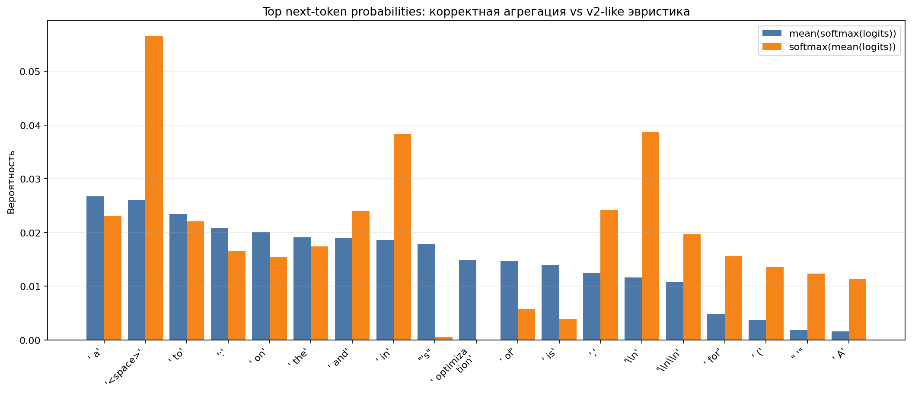
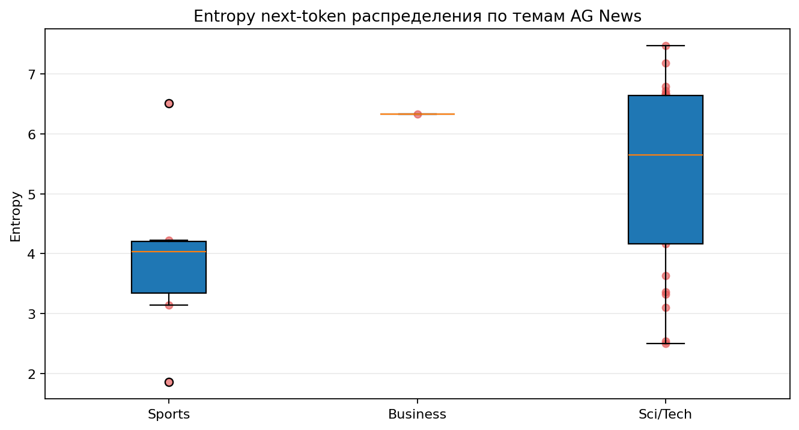
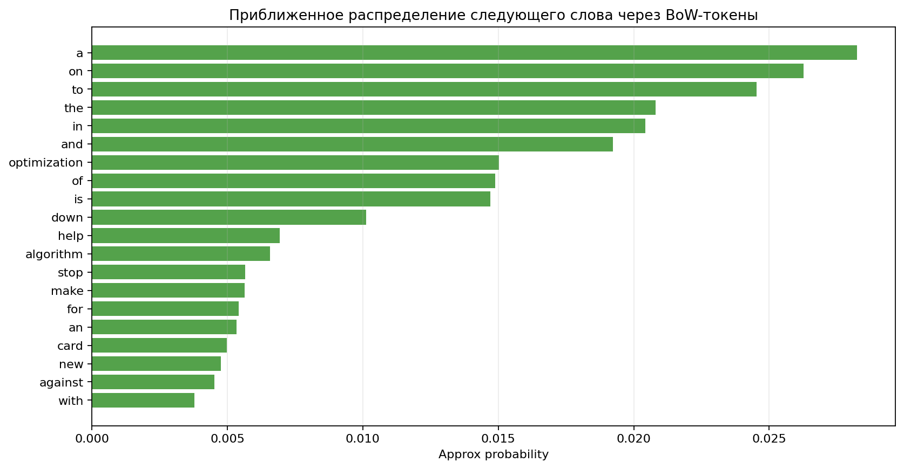

# Qwen3-4B: распределение следующего токена и приближенного следующего слова

## Цель

Построить улучшенную версию экспериментов `qwen-distributions_v1.ipynb` и `qwen-distributions-v2.ipynb`: не просто вывести top tokens, а сравнить способы агрегации logits/probabilities, визуализировать распределения и дать приближенную word-level интерпретацию.

## Конфигурация

- Модель: `Qwen/Qwen3-4B-Base`
- Датасет: `ag_news`, split `test`
- Количество примеров: `32`
- Prefix words: `3`
- Batch size: `2`
- Device: `cpu`
- Параметров модели: `4022.5M`

## Основные метрики

- Средняя entropy по отдельным prompt: `5.1206`
- Entropy `mean(softmax(logits))`: `7.2851`
- Entropy `softmax(mean(logits))`: `6.6238`
- Jensen-Shannon divergence между агрегациями: `0.166515`
- Top-20 overlap: `11/20`
- Масса BoW word approximation: `0.6437`

## Интерпретация

Эксперимент показывает, как Qwen3-4B распределяет вероятность следующего токена после коротких новостных prefix prompts из AG News. Корректное корпусное распределение mean(softmax(logits)) имеет entropy=7.2851, а v2-like softmax(mean(logits)) имеет entropy=6.6238. Jensen-Shannon divergence между ними равен 0.166515, top-20 overlap=11/20. Главный токен по корректной агрегации: ' a' с p=0.0267. Главный токен по v2-like агрегации: '<space>' с p=0.0566. Приближенно самое вероятное следующее слово: 'a' с p≈0.0283. Практический вывод: если цель — оценить среднее поведение модели по корпусу, лучше усреднять уже нормированные вероятности, а не logits. Softmax от средних logits может сделать распределение более острым и сместить интерпретацию top tokens.

## Top-10 токенов по корректной агрегации

|   rank |   token_id | token           |   mean_prob |
|-------:|-----------:|:----------------|------------:|
|      1 |        264 | ' a'            |   0.0267247 |
|      2 |        220 | '<space>'       |   0.025982  |
|      3 |        311 | ' to'           |   0.0234306 |
|      4 |         25 | ':'             |   0.0208896 |
|      5 |        389 | ' on'           |   0.0201004 |
|      6 |        279 | ' the'          |   0.0190602 |
|      7 |        323 | ' and'          |   0.0190483 |
|      8 |        304 | ' in'           |   0.0185953 |
|      9 |        594 | "'s"            |   0.0177981 |
|     10 |      25262 | ' optimization' |   0.0148783 |

## Top-10 приближенных следующих слов

|   rank | word         |   approx_prob |
|-------:|:-------------|--------------:|
|      1 | a            |     0.0282516 |
|      2 | on           |     0.0262634 |
|      3 | to           |     0.0245393 |
|      4 | the          |     0.020805  |
|      5 | in           |     0.0204358 |
|      6 | and          |     0.0192319 |
|      7 | optimization |     0.015031  |
|      8 | of           |     0.014889  |
|      9 | is           |     0.0147133 |
|     10 | down         |     0.0101265 |

## Графики

### 1. Next-token distribution comparison

Этот график сравнивает корректное корпусное распределение `mean(softmax(logits))` и старую эвристику `softmax(mean(logits))`. Если столбцы сильно расходятся, значит нельзя безоговорочно переносить выводы старого подхода на вероятностную интерпретацию.

### 2. Cumulative top-k mass

График показывает, насколько распределение концентрируется в top-k токенах. Более крутая кривая означает более острую, менее энтропийную картину.

### 3. Entropy by AG News label

Этот график показывает, насколько неопределенность next-token распределения меняется по темам. Для маленького среза это диагностический сигнал, а не статистически финальный вывод.

### 4. Approximate next-word distribution

Это не полная word probability marginalization. Это BoW-аппроксимация по top word-start токенам. Она полезна как визуальный слой поверх token-level распределения.

## Ограничения

- Использован небольшой срез `32` примеров, чтобы эксперимент можно было прогнать локально.
- Word-level распределение является приближением по BoW-токенам, а не полной Pimentel & Meister маргинализацией по всем субсловным путям.
- Для более строгих выводов нужно увеличить `MAX_SAMPLES`, прогнать несколько random seeds и отдельно сравнить разные домены.
