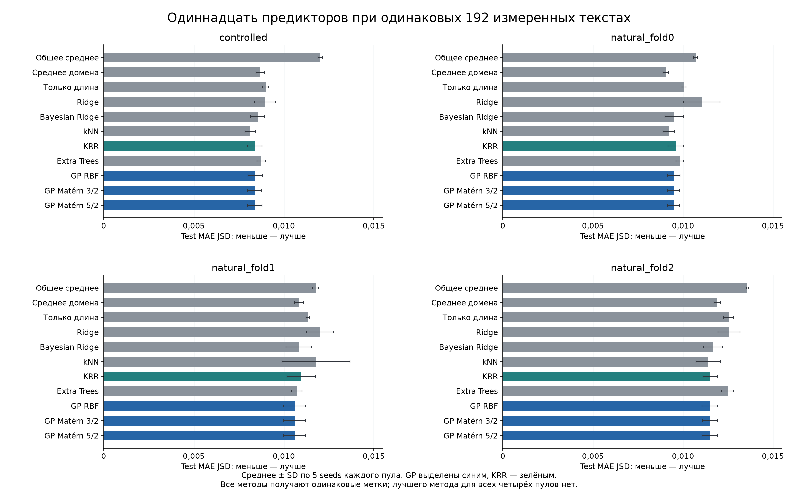
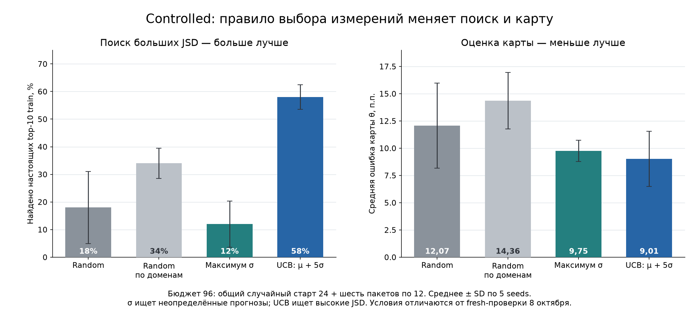
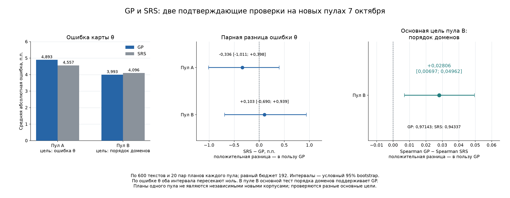
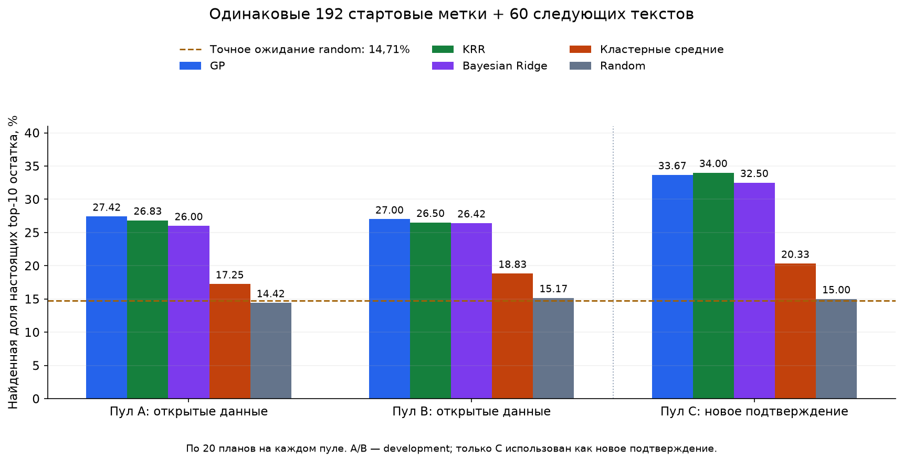
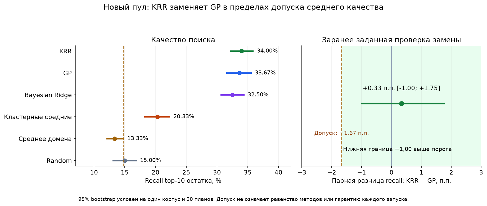
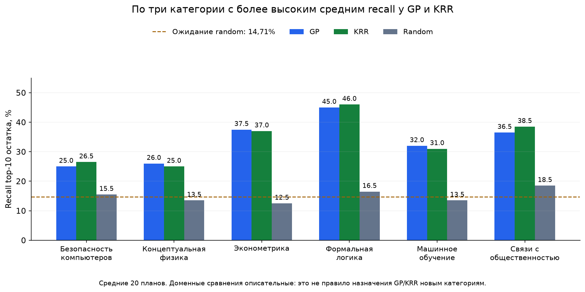
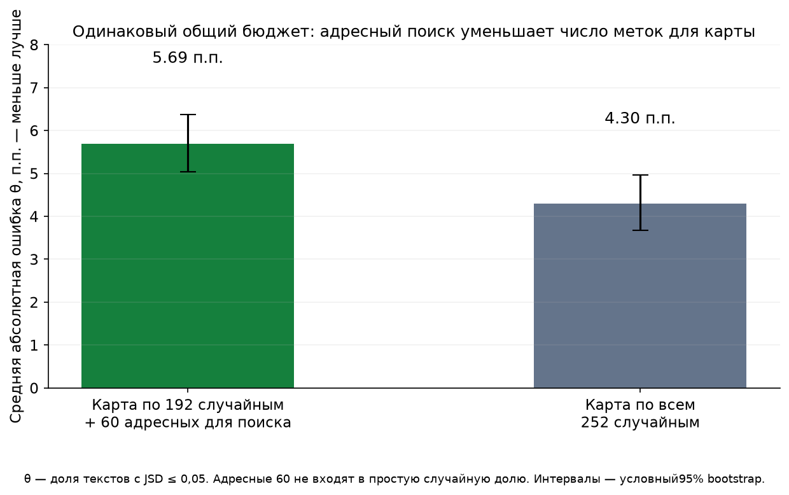
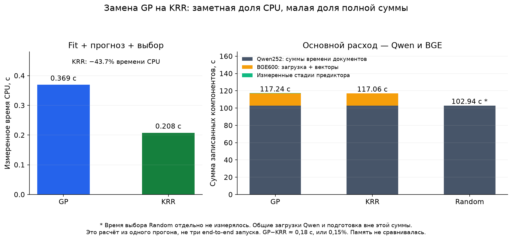

# GP-ветка: эксперименты и результаты

Мы сравниваем две языковые модели: Qwen3.5-2B-Base как учителя и Qwen3.5-0.8B-Base как ученика. На одном и том же тексте они выдают разные вероятности следующего токена. Наша часть проекта должна оценить, на каких темах расхождение больше, измерив оба Qwen лишь на части текстов. По измеренным примерам обучается модель-предиктор, а по её прогнозам строится карта доменов.

Здесь собраны проведённые сравнения от исходного notebook до нового подтверждающего опыта 8 октября 2026 года: данные, правила отбора, псевдокод, численные результаты и принятые изменения. `qwen_gp_demo.ipynb` остаётся демонстрацией исторической GP-карты; последний исследовательский ноутбук — `qwen_srs_search_fresh_confirmation.ipynb`. Он сравнивает случайную оценку карты и поиск с несколькими предикторами, включая GP и KRR. Веса ученика в этих опытах не обучались. Поэтому уменьшение ошибки предиктора нельзя называть улучшением самого Qwen.


**Итог на 8 октября:** для оценки доли θ выбираем случайную выборку, для адресного поиска больших расхождений — KRR на тех же метках. KRR прошёл заранее заданный допуск замены GP на новом пуле и затратил меньше времени CPU. Строгого превосходства KRR над GP и улучшения ученика эти опыты не доказывают. Отдельный положительный результат GP по порядку доменов сохранён ниже. [Основания и границы этого решения](#gp-closure-20261008).

## Содержание

- [Что измеряли](#section-01)
- [Как получали прогноз для неизвестного текста](#section-02)
- [Что означают метрики](#section-03)
- [Как разделяли данные и считали стоимость](#section-04)
- [С чего начинали: notebook Богдана](#section-05)
- [Ранние эксперименты: что предсказывали и что искали](#section-06)
  - [Почему старый GP возвращался к среднему](#section-07)
  - [Первая контролируемая сетка: 35 вариантов × 3 seeds](#section-08)
  - [Проверка на общих случайных метках и новый предметный пул](#section-09)
  - [Кластерный старт при одинаковом бюджете](#section-10)
  - [Замена представления текста: MiniLM, Qwen hidden и BGE](#section-11)
  - [Сетка на Qwen-признаках: κ, raw/log, RBF/Matérn и общий/отдельные GP](#section-12)
  - [Бюджет и простые статистики текста](#section-13)
  - [Есть ли сигнал внутри предмета: перестановки и ближайшие пары](#section-14)
  - [Может ли помочь более тщательная оптимизация ядра](#section-15)
  - [Поиск больших JSD и отбор около порога: проверка карты](#section-16)
  - [Большие конечные цели и повтор синтетической диагностики](#section-17)
- [1–3 октября: независимые признаки, полный JSD и проверка рабочего продукта](#section-18)
  - [Общие данные, измерение и разделение выборки](#section-19)
  - [Точный JSD и приближение по top-k: сохраняется ли смысл порога](#section-20)
  - [Одиннадцать предикторов среднего расхождения: 440 завершённых случаев](#section-21)
  - [Четыре правила выбора измерений: карта и поиск верхних текстов](#section-22)
  - [Токенные признаки: 80 случаев с двумя способами обучения](#section-23)
  - [Обучаемая линейная проекция перед GP: 40 случаев PLS](#section-24)
  - [Прямая оценка доли по случайным измерениям](#section-25)
  - [Живой запуск продукта с холодным кэшем](#section-26)
  - [Raw против log-target: 41 парный случай](#section-27)
  - [Размер пакета и способ старта в продукте: 30 replay](#section-28)
  - [Конечная train-популяция: прямой подсчёт и точный интервал](#section-29)
  - [Обрезка текста по реально видимому Qwen-префиксу: 40 fit](#section-30)
  - [Более сильный независимый энкодер: 160 случаев](#section-31)
  - [Перенос энкодера в старый продукт: 15 случаев](#section-32)
  - [Новый пул предметов и повторное сравнение продукта: 15 случаев](#section-33)
  - [Что менял BGE: признаки GP или выбранные тексты](#section-34)
  - [Технические проверки и контроль воспроизводимости](#section-35)
    - [Независимый пересчёт метрик, refit и replay](#section-36)
    - [Формула, токенное сопоставление и обнаруженный дрейф кэша](#section-37)
    - [Способ загрузки моделей и версии библиотек](#section-38)
    - [Малый живой raw/log smoke и проверка конечных больших целей](#section-39)
    - [Локальный solver токенного ridge](#section-40)
    - [Воспроизведение notebook-стадий и архитектуры продукта](#section-41)
- [Ранкинг: какие именно результаты сравнивали](#section-42)
  - [Поиск текстов с большой JSD: 58% против 18% и 56% против 32%](#section-43)
  - [Порядок доменов](#section-44)
  - [Уже измеренный top и прогноз следующих текстов](#section-45)
- [Поздние проверки: 5–7 октября 2026 года](#section-46)
  - [1. Выбор представления и политики измерений перед фиксацией метода](#section-47)
  - [2. Представление текста против семейства предиктора на одинаковых метках](#section-48)
  - [3. Три способа получить θ: CDF, порог прогноза и доля измерений](#section-49)
  - [4. Зафиксированный метод на шести новых предметах MMLU](#section-50)
  - [5. Зафиксированный метод на FineWeb-Edu и FineMath](#section-51)
  - [6. Конечный пул: GP, прямой ratio, Хорвиц–Томпсон, гибрид и SRS](#section-52)
  - [7. Точный ожидаемый риск SRS после открытия пула](#section-53)
  - [8. Random против чистого sigma-выбора на открытом пуле](#section-54)
  - [9. Новый общий префикс и новая проверка θ против SRS](#section-55)
  - [10. Новый пул: порядок доменов, непрерывный JSD и два разных top-10](#section-56)
  - [11. Холодное выполнение демонстрационного ноутбука](#section-57)
  - [12. Тёплое выполнение окончательной демонстрации](#section-58)
- [Что вошло в GP-демонстрацию 7 октября](#section-59)
  - [Какие исправления были функциональными](#section-60)
  - [Выводы серии до 8 октября](#section-61)
- [Сопоставление с сохранёнными результатами](#sources)
- [Дополнение 8 октября: случайная карта и адресный поиск на открытых пулах](#hybrid-development-20261008)
- [Новое подтверждение 8 октября: случайная карта и поиск на новых текстах](#fresh-srs-search-20261008)
  - [Что проверяли](#added-section-20261008-01)
  - [Данные и неизменённые настройки](#added-section-20261008-02)
  - [Как устроен опыт](#added-section-20261008-03)
  - [Поиск сильных расхождений](#added-section-20261008-04)
    - [Разбивка по категориям](#added-section-20261008-05)
    - [Прогноз JSD](#added-section-20261008-06)
  - [Карта доменов](#added-section-20261008-07)
  - [Стоимость](#added-section-20261008-08)
  - [Проверка результата и предел вывода](#added-section-20261008-09)
- [Итог GP-ветки на 8 октября](#gp-closure-20261008)
- [Данные и воспроизведение графиков](#figure-sources-20261008)

<a id="section-01"></a>

## Что измеряли

**Домен** — группа текстов одной темы. В MMLU это предмет, например анатомия или история. В опытах с естественными текстами группы задавались источниками FineWeb-Edu и FineMath; это не те же самые предметные категории, что в MMLU. **Пул** — конкретный сохранённый набор текстов одного опыта. Два пула с одинаковыми названиями предметов могут содержать разные вопросы.

**Токен** — единица, на которые токенизатор разбивает строку: слово, часть слова, знак или другой фрагмент. **Словарь** — все возможные токены модели. На выходе модель даёт логиты, численные оценки вариантов следующего токена; softmax переводит их в вероятности с суммой 1. Распределение здесь — этот полный список вероятностей, а не один выбранный ответ модели. Под меткой y дальше понимается измеренная JSD текста, а не правильный ответ MMLU.

Каждой модели подаётся одна и та же последовательность токенов. На позиции t она предсказывает распределение следующего токена. Пусть P_t — распределение учителя, Q_t — ученика. Их расхождение считается так:

$$
M_t=\frac{P_t+Q_t}{2},\qquad
\mathrm{JSD}_t=\frac12\sum_vP_t(v)\ln\frac{P_t(v)}{M_t(v)}
+\frac12\sum_vQ_t(v)\ln\frac{Q_t(v)}{M_t(v)}.
$$

Сумма идёт по токенам словаря v. JSD текста y — среднее этих значений по его действительным позициям, включая последнюю. Меньше JSD — ближе выходные распределения. Это не проверка правильности ответа. Учитель может ошибаться, а ученик может с ним соглашаться.

```text
ИЗМЕРИТЬ_ТЕКСТ(текст):
    выбрать общий допустимый префикс исходной строки
    получить одинаковые входные token IDs для обеих Qwen
    получить распределения следующего токена на каждой позиции
    для каждой позиции:
        вычислить JSD двух распределений
    вернуть среднюю JSD по позициям
```

В ранних опытах вместо всего словаря использовали объединение top-30: по 30 наиболее вероятных токенов каждой модели на позиции, затем перенормировали вероятности на объединённом наборе. Размер объединения не обязательно равен 30. Позже отдельно проверили это приближение и перешли на весь словарь. **Старые top-30 значения и новые полные JSD различаются по смыслу; их абсолютные величины нельзя смешивать.**

Порог ε = 0.05 задаёт событие «расхождение текста не больше 0.05». Настоящая доля таких текстов в домене d:

$$
\theta_d=\frac1{N_d}\sum_{i\in d}\mathbf1[y_i\le0.05].
$$

Индикатор равен 1, когда условие выполнено, и 0 в остальных случаях. Если из 100 текстов 60 проходят порог, θ = 0.60. Меньшая θ означает меньше близких текстов. Порог 0.05 — выбранная рабочая граница на шкале JSD, а не уровень статистической значимости и не подтверждённая граница одинакового поведения моделей.

<a id="section-02"></a>

## Как получали прогноз для неизвестного текста

Отдельный **энкодер** переводит текст в числовой вектор — embedding. Эти векторы используются как координаты текстов. MiniLM даёт 384 координаты, BGE-base — 768. Mean pooling усредняет векторы токенов; CLS pooling берёт вектор специальной позиции CLS последнего слоя. L2-нормировка делит вектор на его длину, чтобы длина стала единицей.

**GP, гауссовский процесс**, получает пары «вектор текста → измеренная JSD» и возвращает два числа для нового текста:

- μ — прогноз его JSD;
- σ — стандартное отклонение прогнозного распределения, то есть оценку неопределённости модели в единицах JSD.

**Ядро** задаёт, насколько связаны значения JSD у двух текстов по расстоянию между их векторами. У RBF связь быстро уменьшается с расстоянием; параметр length scale задаёт масштаб этого уменьшения. Matérn — другая форма зависимости от расстояния. Амплитуда задаёт масштаб вариации, WhiteKernel добавляет шумовой компонент. σ не является разбросом JSD по токенам и не равна ошибке, которую мы уже измерили.

**Кластерный старт** выбирает начальные измерения по геометрии векторов. KMeans находит группы вокруг центров; берём несколько близких к центру текстов каждой группы. Медоид — реальный текст, наиболее близкий к остальным представителям группы. Такое покрытие тем само по себе не гарантирует точности карты: его сравнивали со случайным стартом. **Политика выбора**, acquisition, задаёт следующие измерения. Random выбирает случайно, mean — по наибольшему μ, sigma — по наибольшему σ, UCB — по `μ+κσ`. κ определяет вес неопределённости. Чистый выбор по σ — exploration, поиск ещё плохо изученных точек.

**Кросс-валидация, CV**, делит уже измеренный train на внутренние части: на одних обучаем вариант, на другой проверяем; затем меняем роли частей. Так выбираем параметры без меток validation/test. **StandardScaler** вычитает среднее каждой координаты и делит её на разброс; его параметры надо считать только по обучающей части. PCA сжимает признаки по направлениям их наибольшего разброса, PLS — по направлениям, связанным с измеренной целью. Supervised означает, что преобразование использует эти цели. Fit/refit — обучение или повторное обучение предиктора; replay — повтор сохранённой процедуры с раскрытием только разрешённых меток; smoke — небольшой проверочный запуск исполнения.

При нормальном прогнозном распределении вероятность пройти порог считается через Φ, функцию накопленной вероятности стандартного нормального распределения. CDF — английское сокращение для функции накопленной вероятности: она показывает вероятность значения не выше заданной границы.

$$
p_i=\Phi\left(\frac{\varepsilon-\mu_i}{\sigma_i}\right),\qquad
\widehat\theta_d=\frac1{N_d}\sum_{i\in d}p_i.
$$

Например, при μ = 0.04, ε = 0.05 и σ = 0.005 аргумент Φ равен 2, а вероятность — примерно 0.977. Деление на σ обязательно. При усреднении получаем ожидаемую долю проходящих порог текстов по обученной модели; сами истинные значения неизмеренных текстов от этого не становятся известны. Для среднего этой суммы не нужно предполагать независимость текстов, но зависимости важны при расчёте интервала для доли.

Есть и оценка без предиктора: случайно измерить n текстов домена и посчитать долю проходящих среди них. В разных опытах сравнивали её с GP. Выборка должна соответствовать оцениваемому набору: доля по адаптивно отобранным большим JSD не является обычной случайной оценкой доли всего домена.

**Raw target** означает, что GP обучается непосредственно на JSD; **log-target** — на её логарифме. В последнем случае прогноз надо правильно вернуть в исходную шкалу. **Hard plug-in** считает текст проходящим, когда его точечный прогноз μ≤ε; CDF-карта вместо жёсткого 0/1 использует вероятность. **Baseline** — конкретный простой конкурент: например, прогноз среднего JSD предмета или прямой подсчёт доли в случайной выборке. Их определения каждый раз указаны в опыте: словом random называли и добор меток для GP, и отдельную процедуру оценки без GP.

<a id="section-03"></a>

## Что означают метрики

| Величина | Как считаем и как читаем |
|---|---|
| MAE | Среднее `abs(y_i − μ_i)`. Ошибка прогноза JSD; меньше лучше. MAE 0.008 означает средний промах 0.008 единицы JSD |
| RMSE | Корень из среднего квадрата `y_i − μ_i`. Сильнее реагирует на крупные ошибки |
| R² | `1 − Σ(y−μ)² / Σ(y−среднее y оцениваемого набора)²`. 1 — точный прогноз, 0 — уровень постоянного среднего этого набора, отрицательное значение — хуже него |
| θ-error | Абсолютная разница прогнозной и истинной доли. 70% вместо 60% — 10 процентных пунктов, а не 10 единиц JSD |
| Macro θ-error | Сначала ошибка θ каждого домена, затем среднее по доменам с одинаковыми весами |
| Pooled θ-error | Сначала одна доля по всем текстам объединённого набора, затем её ошибка. Ошибки отдельных доменов могут взаимно компенсироваться |
| Spearman по текстам | Совпадение порядка прогнозных и истинных JSD текстов; 1 — совпадающий порядок |
| Spearman по доменам | Совпадение порядка доменных θ с истинным порядком. Это другая задача, чем порядок текстов |
| Recall@10 | Какая часть настоящих десяти самых расходящихся текстов попала в выбранный набор. Набор кандидатов каждый раз указан отдельно |
| Max regret | Максимальная истинная JSD кандидатов минус максимальная JSD уже найденного текста. 0 означает, что доступный максимум найден |
| Brier | Среднее `(p_i − 1[y_i≤ε])²`. Ошибка вероятностного прогноза события; меньше лучше |

Общий R² по нескольким доменам может быть хорошим за счёт различий между темами. Поэтому дополнительно смотрели R² внутри каждого домена, разброс μ относительно разброса y и порядок отдельных текстов. Если всем текстам темы прогнозируется почти одна JSD, модель может различать темы, но почти не различать тексты внутри темы.

В таблицах проценты улучшения MAE означают относительное уменьшение **ошибки предиктора**. Например, `(MAE_old − MAE_new) / MAE_old × 100%`. Они не означают рост точности ответов Qwen. Ошибки θ записаны в процентных пунктах. ε и θ-error измеряют разные вещи.

<a id="section-04"></a>

## Как разделяли данные и считали стоимость

**Train** — тексты, из которых разрешено выбирать метки для обучения. **Validation** — отложенные тексты для сравнения вариантов и выбора настроек. **Test** — отдельная проверка. Holdout — общее название отложенной части. В поздних исследованиях близкие или повторяющиеся тексты объединяли в группы перед split, чтобы одна группа не попала одновременно в train и test.

**Бюджет 192** означает, что конкретная ветка получила истинную JSD 192 текстов для обучения. Дополнительные контрольные измерения не входят в этот бюджет и не подаются в fit. **Порция, batch**, — сколько новых текстов выбирали между двумя переобучениями GP.

**Oracle** — сохранённые истинные JSD всего исследуемого пула для внешней оценки. В опыте с oracle алгоритму открываются только выбранные им бюджетные метки. Остальные можно читать для подсчёта результатов после фиксации решений, но нельзя использовать при выборе следующей точки.

**Seed** закрепляет случайный split, выборку или инициализацию. Несколько seed одного пула показывают чувствительность результата к этой случайности, а не перенос на несколько независимых корпусов. Если в таблице среднее пяти seed, это пять запусков на одном указанном пуле.

Нужно различать число итоговых сравнений, обучений GP, промежуточных состояний и измеренных текстов. Одна траектория 120→192 с порцией 12 сохраняет семь состояний GP. Разные траектории могут измерять одни и те же тексты из кэша. Поэтому число результатов нельзя умножать на бюджет и объявлять числом новых прогонов Qwen.

В поздних опытах **freeze** означает, что алгоритм и главный критерий зафиксированы до открытия новых JSD. Данные, на которых уже выбирали настройки, называются development. **Confirmation** — проверка зафиксированного решения на новых данных. После просмотра всех меток новые идеи на этом же наборе считаются дополнительным анализом, а не новым независимым подтверждением.

<a id="section-05"></a>

## С чего начинали: notebook Богдана

Исходный `qwen-fe-autoreg.ipynb` уже содержал основную идею: MiniLM-векторы, один общий RBF GP, кластерный старт, последовательный UCB-отбор и оценку доли через Φ. То есть эти компоненты не были придуманы в последующих доработках.

В сохранённом исходном запуске было 2856 текстов из шести широких групп: новости, Python-код, задачи GSM8K, Wikipedia, toxicity prompts и инструкции Alpaca. Запрашивали до 500 на группу, но после фильтрации и ограничений источников фактические размеры различались. Qwen видел до 512 токенов, JSD считалась по объединению top-30; MiniLM кодировал исходные тексты. Начальные точки выбирались шестью KMeans-кластерами на общем пуле. В коде одновременно добавлялись ближайшие к центру тексты и медоид с дополнительными случайными текстами того же кластера. Эти списки могли пересекаться.

```text
получить тексты шести источников и MiniLM-векторы
найти шесть кластеров на общем пуле
из каждого добавить две группы представителей
измерить JSD начальных строк и обучить общий RBF GP
10 раз:
    предсказать μ, σ оставшихся текстов
    взять 5 с наибольшим μ + 2σ
    измерить их JSD и добавить в обучение
после отбора:
    случайно взять 200 оставшихся текстов
    измерить их JSD
    сравнить среднюю Φ с настоящей долей для нескольких ε
```

В outputs сохранены 240 начальных строк и 290 строк после десяти порций по пять. Из-за пересечений в стартовом коде этот счётчик нельзя трактовать как доказанное число разных текстов. Контрольные 200 текстов выбирались после адаптивного поиска из оставшихся, а не до него. Это не прямая подача контрольных меток в fit, но такая проверка относится к оставшемуся после поиска набору.

| ε | Оценка GP | Доля на 200 контрольных текстах |
|---:|---:|---:|
| 0.01 | 0.0276 | 0.0000 |
| 0.05 | 0.4030 | 0.4150 |
| 0.10 | 0.9653 | 0.9350 |
| 0.15 | 1.0000 | 1.0000 |

Максимальная найденная JSD — 0.1431; она не менялась в десяти итерациях отбора. Средняя JSD строк обучающего набора — 0.0602. Сохранённое ядро — `RBF(length_scale=0.936)`. Отдельная проверка kNN с пятью соседями дала R² 0.324 на исходных 384 координатах и 0.160 после PCA до 15 координат. PCA здесь — сжатие по направлениям наибольшего разброса признаков, без использования JSD.

Заголовок исходной итоговой ячейки упоминал AG News, но расчёт выполнялся на смешанном пуле. Эти θ не являются отдельной картой шести доменов. Один запуск с близкой pooled θ на ε = 0.05 также не показывал преимущество над random: равнобюджетного сравнения и нескольких seed для этого результата не было.

В следующих версиях добавили доменные оценки, предварительное разделение данных, равнобюджетные сравнения, сохранение измерений и диагностику ошибок. Появилась проблема почти постоянных прогнозов в отдельных доменах; с её разбора началась исследовательская сетка ниже.

Числа этого подраздела взяты из сохранённых outputs исходного notebook, а не восстановлены новым запуском. Основная история ниже учитывает 55 записей серий, дополнительных расчётов и технических проверок. Повторное представление одной серии не считается новым опытом.

<a id="section-06"></a>

## Ранние эксперименты: что предсказывали и что искали

Ранние опыты решали три задачи: предсказать JSD отдельного текста; оценить θ — долю текстов предмета с JSD≤ε, ε=0,05; найти тексты с наибольшей JSD. Хороший поиск больших значений не гарантирует точную карту долей.

Teacher — Qwen3.5-2B-Base, student — Qwen3.5-0.8B-Base; дообучения не было. JSD считали на объединении top-30 обеих моделей, с натуральными логарифмами, и усредняли по действительным позициям входа. Это приближённая ранняя метрика с диапазоном [0;ln 2], отличающаяся от поздней JSD по полному словарю. Лимит Qwen — 256 токенов. MiniLM кодировал декодированный видимый Qwen-префикс своим токенизатором с лимитом 256; позднего общего сырого префикса ещё не было.

Основные пулы — по 600 MMLU-текстов, 100 на предмет. Первый: abstract_algebra, anatomy, astronomy, college_computer_science, high_school_mathematics, professional_law. Второй: professional_accounting, high_school_chemistry, electrical_engineering, high_school_biology, high_school_psychology, philosophy. Вход содержал вопрос, варианты и `Answer:`, без правильного ответа. Обычно на предмет выделяли 60 train/20 val/20 test, всего 360/120/120. Seeds меняли индексы; внутри сравнения split и начальные метки были общими. Последующие опыты переиспользовали измеренные JSD: их результаты нельзя складывать как новые независимые тексты.

MAE в таблицах — в единицах JSD. Общий R² включает различия между предметами; `R² внутри` — среднее шести предметных R², каждый со своим контрольным средним. Отрицательный R² означает ошибку хуже постоянного контрольного среднего. `θ, п.п.` — средняя абсолютная ошибка θ по предметам; в первой сетке сохранена только ошибка общей θ по 120 test-текстам, это явно обозначено. Для raw-GP вероятность события считали как Φ((ε−μ)/σ), затем усредняли по текстам; это не порогование одного среднего μ.

Recall top-10 — доля истинной десятки train-пула среди измеренных текстов. Regret — максимальная JSD всего train минус максимальная среди выбранных; меньше лучше. Полные train-JSD использовали только для ретроспективной оценки после фиксации выбора. Val/test в выбор не поступали. Повторные seeds характеризуют один фиксированный пул, а не независимые корпуса.

<a id="section-07"></a>

### Почему старый GP возвращался к среднему

До MMLU-сеток разобрали старый прогон по news/code/math/wiki/toxic/chat: по 70 уникальных train-текстов направления. Проверяли, не стала ли длина корреляции RBF слишком малой относительно расстояний признаков. При расстоянии d корреляция равна exp(−d²/(2ℓ²)). Для ℓ=0,1 и d≈0,9 связь с наблюдениями почти нулевая; нормированный GP возвращается к train mean. σ(μ) ниже — разброс предсказанных средних между текстами, он не равен σ неопределённости одного прогноза.

| Направление | ℓ | Ближайший d, медиана | Макс. корреляция, медиана | σ(y) | σ(μ) | Доля корреляций <10⁻⁶ |
|---|---|---|---|---|---|---|
| news | 0.233 | 1,169 | 3,39e-06 | 0,023805 | 0,000628 | 25,00% |
| code | 0.167 | 0,901 | 4,79e-07 | 0,011553 | 0,000182 | 57,00% |
| math | 0.1 | 0,904 | 1,82e-18 | 0,011607 | 1,39e-11 | 100,00% |
| wiki | 0.708 | 1,175 | 0,252 | 0,018313 | 0,00761 | 0,00% |
| toxic | 0.1 | 1,194 | 1,07e-31 | 0,025476 | 1,39e-17 | 100,00% |
| chat | 0.737 | 1,152 | 0,295 | 0,021382 | 0,00695 | 0,00% |

У math среднее |μ−train mean| было 9,86 × 10⁻¹³, у toxic — 0, хотя истинная JSD заметно различалась. У news/code отличие составляло 8,58 × 10⁻⁵/1,61 × 10⁻⁵; у wiki/chat — 0,00879/0,00881. Последние два направления не свелись к постоянному прогнозу. Корреляции рассчитаны по округлённым ℓ старого отчёта. Этот разбор включён в `early_research_105`; это не отдельные MMLU-предметы.

<a id="section-08"></a>

### Первая контролируемая сетка: 35 вариантов × 3 seeds

В `early_research_105` проверяли общий/предметные GP, raw/log, политики выбора и масштаб признаков. На первом пуле измерили 600 JSD. Seeds 42/43/44; split 360/120/120. Начало: в каждом предмете 2 KMeans-кластера, по 4 ближайших к центру текста, всего 48. Малые кластеры дополняли ближайшими оставшимися текстами. Добор 8 × 6 до 96.

Полная основная сетка: общий/предметный GP × raw/log × random/mean/σ/UCB1/2/5/10 — 28 вариантов. База: RBF(ℓ₀=0,5, границы[0,1; 2]), α=10⁻⁶, normalize_y=True, без restart. Ещё 7 вариантов меняли один параметр общего raw/UCB5: RBF с ℓ₀ по медиане расстояний и границами[ℓ₀/10; 10ℓ₀]; Constant × RBF+WhiteKernel; raw-признаки; StandardScaler; PCA16; α=10⁻³; normalize_y=False. Scaler/PCA обучали только на start 48 и фиксировали. Это не полная сетка всех сочетаний.

```text
для seed 42/43/44: сделать общий split и KMeans start 48
для каждого из 35 вариантов:
    L = start 48; фиксировать преобразование X по L
    8 раз: fit GP(X[L], target[L]); выбрать 6 новых train-текстов
            random — общий случайный порядок; иначе score=μ, σ или μ+κσ
            открыть выбранные y и добавить индексы в L
    финальный fit при 96 метках; оценить общие val/test
```

Для log-цели z=log(y+10⁻⁸) обратно использовали μ=exp(m+s²/2)−10⁻⁸ и σ=√[(exp(s²)−1)exp(2m+s²)]. Политика работала с этими моментами в JSD. Вероятность ниже ε считали в log-пространстве при пороге log(ε+10⁻⁸). Простое exp(m) было бы другой процедурой. Ниже все 35 вариантов, среднее 3 seeds; полноценный recall первой сетки в CSV не сохранён.

| GP / цель / выбор либо изменение | MAE val | MAE test | R² test | θ общая, п.п. | Лучший y |
|---|---|---|---|---|---|
| общий/raw/random | 0,007361 | 0,008287 | 0,342 | 5,06 | 0,073791 |
| общий/raw/mean | 0,007444 | 0,008296 | 0,352 | 5,10 | 0,073286 |
| общий/raw/σ | 0,007187 | 0,008406 | 0,350 | 5,42 | 0,072087 |
| общий/raw/UCB1.0 | 0,007435 | 0,008330 | 0,353 | 5,00 | 0,073286 |
| общий/raw/UCB2.0 | 0,007424 | 0,008308 | 0,350 | 5,12 | 0,073286 |
| общий/raw/UCB5.0 | 0,007416 | 0,008274 | 0,354 | 5,16 | 0,073286 |
| общий/raw/UCB10.0 | 0,007342 | 0,008449 | 0,347 | 5,18 | 0,073286 |
| общий/log/random | 0,007372 | 0,008251 | 0,343 | 4,98 | 0,073791 |
| общий/log/mean | 0,007464 | 0,008271 | 0,344 | 5,08 | 0,073286 |
| общий/log/σ | 0,007458 | 0,008229 | 0,341 | 5,64 | 0,073286 |
| общий/log/UCB1.0 | 0,007466 | 0,008283 | 0,344 | 5,17 | 0,073286 |
| общий/log/UCB2.0 | 0,007410 | 0,008309 | 0,341 | 5,59 | 0,073286 |
| общий/log/UCB5.0 | 0,007412 | 0,008307 | 0,341 | 5,73 | 0,073286 |
| общий/log/UCB10.0 | 0,007479 | 0,008268 | 0,338 | 5,64 | 0,073286 |
| предметный/raw/random | 0,007710 | 0,008238 | 0,337 | 3,64 | 0,073791 |
| предметный/raw/mean | 0,008322 | 0,008657 | 0,278 | 6,06 | 0,073286 |
| предметный/raw/σ | 0,007966 | 0,008617 | 0,307 | 7,12 | 0,074251 |
| предметный/raw/UCB1.0 | 0,008307 | 0,008647 | 0,281 | 5,77 | 0,073286 |
| предметный/raw/UCB2.0 | 0,008239 | 0,008566 | 0,296 | 5,53 | 0,073286 |
| предметный/raw/UCB5.0 | 0,008269 | 0,008582 | 0,300 | 6,38 | 0,074021 |
| предметный/raw/UCB10.0 | 0,008248 | 0,008584 | 0,298 | 6,81 | 0,074021 |
| предметный/log/random | 0,007709 | 0,008232 | 0,337 | 3,70 | 0,073791 |
| предметный/log/mean | 0,008316 | 0,008657 | 0,279 | 5,21 | 0,073286 |
| предметный/log/σ | 0,008026 | 0,008708 | 0,289 | 6,93 | 0,074251 |
| предметный/log/UCB1.0 | 0,008346 | 0,008703 | 0,274 | 5,17 | 0,073286 |
| предметный/log/UCB2.0 | 0,008245 | 0,008626 | 0,290 | 4,86 | 0,074021 |
| предметный/log/UCB5.0 | 0,008125 | 0,008578 | 0,297 | 6,89 | 0,074251 |
| предметный/log/UCB10.0 | 0,007975 | 0,008596 | 0,305 | 6,92 | 0,074251 |
| UCB5: RBF по расстояниям | 0,007416 | 0,008274 | 0,354 | 5,16 | 0,073286 |
| UCB5: Constant × RBF+White | 0,007391 | 0,008291 | 0,344 | 5,06 | 0,073286 |
| UCB5: raw признаки | 0,007416 | 0,008274 | 0,354 | 5,16 | 0,073286 |
| UCB5: StandardScaler | 0,009457 | 0,010868 | -0,016 | 7,91 | 0,072437 |
| UCB5: PCA16 | 0,007991 | 0,009188 | 0,155 | 6,73 | 0,073517 |
| UCB5: α=10⁻³ | 0,007415 | 0,008270 | 0,354 | 5,18 | 0,073286 |
| UCB5: без normalize_y | 0,008311 | 0,009037 | 0,229 | 27,49 | 0,072318 |

Все 105 запусков завершились, но StandardScaler дал почти постоянный прогноз и неположительный общий R² во всех 3 seeds. PCA тоже ухудшил MAE; отключение normalize_y резко ухудшило θ. Изменение α и масштаба RBF почти не помогло. Общий/raw/random лучше предметного по val MAE, но немного хуже по test MAE; однозначного победителя по всем метрикам не получилось.

В том же архиве есть контроль конечного масштаба: RBF на y и 100y−10 с обратным (μ′+10)/100, σ′/100, start 48→val. Все преобразованные цели вне диапазона JSD, все прогнозы конечны. MAE seeds 42/43/44 совпала: 0,007196/0,008006/0,007568; maxмодуль Δμ≤6,25 × 10⁻¹⁷, maxмодуль Δσ≤1,48 × 10⁻¹⁷. Это проверка аффинной согласованности, не бесконечных целей.

<a id="section-09"></a>

### Проверка на общих случайных метках и новый предметный пул

`followup_170` отделил предиктор от acquisition: тот же первый пул, без новых JSD, seeds 100–109. Start — 4 случайных train-текста каждого предмета, всего 24. Все методы получали одинаковые первые 24/48/96 индексов общего случайного порядка. Четыре предиктора × 3 бюджета × 10 seeds =120 результатов.

Сравнивали предметное среднее; общий RBF; общий Constant × Matérn-3/2+WhiteKernel; residual с тем же ядром. Далее последнее ядро обозначено M+W. Предметное среднее прогнозирует b_d=mean выбранных y предмета; вероятность — (1 + число наблюдений с y≤ε)/(n+2), сглаживание Beta(1,1). Residual учит общий GP на y−b_d и возвращает b_d+μ_residual. Так проверяли, легче ли учить различия внутри предмета после удаления смещения. Неопределённость оценки b_d в σ не включалась.

```text
order = общий start 24 + случайная перестановка остальных train
для B 24/48/96 и каждого предиктора:
    L = order[:B]                   # одинаковые метки между методами
    residual: b[d]=mean(y[L_d]); fit GP(X[L], y[L]-b[domain])
              прогноз μ=b[domain(query)]+μ_residual
    остальные: fit заданный предиктор на y[L]
    оценить одинаковые val/test
```

| Предиктор | Метки | MAE val | MAE test | R² test | R² внутри test | θ test, п.п. |
|---|---|---|---|---|---|---|
| среднее предмета | 24 | 0,009280 | 0,009113 | 0,184 | -0,365 | 15,75 |
| среднее предмета | 48 | 0,008635 | 0,008515 | 0,272 | -0,183 | 11,18 |
| среднее предмета | 96 | 0,008331 | 0,008276 | 0,295 | -0,127 | 8,78 |
| общий RBF | 24 | 0,009447 | 0,009624 | 0,137 | -0,783 | 13,72 |
| общий RBF | 48 | 0,008610 | 0,008709 | 0,264 | -0,359 | 9,93 |
| общий RBF | 96 | 0,008022 | 0,007912 | 0,370 | -0,072 | 8,88 |
| общий M+W | 24 | 0,009463 | 0,009625 | 0,134 | -0,790 | 13,80 |
| общий M+W | 48 | 0,008616 | 0,008669 | 0,269 | -0,333 | 9,47 |
| общий M+W | 96 | 0,008046 | 0,007896 | 0,371 | -0,066 | 8,50 |
| остаточный M+W | 24 | 0,009259 | 0,009103 | 0,185 | -0,363 | 9,82 |
| остаточный M+W | 48 | 0,008599 | 0,008493 | 0,274 | -0,179 | 7,24 |
| остаточный M+W | 96 | 0,008090 | 0,008020 | 0,332 | -0,068 | 7,20 |

При 96 общий RBF/M+W немного лучше предметного среднего по MAE; residual хуже их по MAE, зато лучше по θ. У всех средний внутрипредметный R² отрицателен. При 24 предметное среднее даёт меньшую test MAE, чем два общих GP.

Отдельные 50 search-траекторий: 5 политик × 10 seeds, start 24→96, batch 6. Balanced random чередовал случайные предметные очереди. UCB=μ+5σ; residual UCB использовал residual GP; σ-политика — общий RBF. `Recall по пути` — среднее на 13 состояниях 24,30,…,96, включая start.

| Политика | Recall top-10 | Recall по пути | Regret | Средняя JSD лучших 10 измеренных |
|---|---|---|---|---|
| random | 32,00% | 19,54% | 0,008276 | 0,061227 |
| balanced_random | 22,00% | 12,85% | 0,011824 | 0,059315 |
| global_ucb | 56,00% | 35,92% | 0,006018 | 0,063998 |
| global_uncertainty | 27,00% | 15,46% | 0,008911 | 0,060396 |
| residual_ucb | 54,00% | 35,77% | 0,006585 | 0,063888 |

UCB находил больше top-10, чем random; residual UCB был близок, выбор только по σ — слабее random. Эти результаты относятся к поиску максимальных расхождений, а не точности карты.

В `fresh_validation_120` процедуру проверили на втором пуле. До измерения зафиксировали основные сравнения RBF против предметного среднего на общих random-метках и UCB5 против random при 96; residual был вторичным. Исключали точные нормализованные совпадения старых вопросов/prompts/декодированных префиксов и дубликаты нового пула. Перефразировки и знакомство Qwen с MMLU при предобучении этим не исключались. Ревизия MMLU c30699e8356da336a370243923dbaf21066bb9fe; 600 новых JSD.

Seeds 200–209; прежний split 360/120/120, start 24, бюджеты 24/48/96, batch 6. Три предиктора × 3 бюджета × 10 seeds =90 результатов; три search-политики × 10 seeds =30 траекторий. Все сохранённые запуски завершились.

| Предиктор | Метки | MAE val | MAE test | R² test | R² внутри test | θ test, п.п. |
|---|---|---|---|---|---|---|
| среднее предмета | 24 | 0,010343 | 0,010657 | -0,040 | -0,378 | 17,33 |
| среднее предмета | 48 | 0,009670 | 0,010178 | 0,051 | -0,237 | 13,64 |
| среднее предмета | 96 | 0,009324 | 0,009795 | 0,110 | -0,150 | 10,62 |
| общий RBF | 24 | 0,010325 | 0,010484 | 0,031 | -0,391 | 13,20 |
| общий RBF | 48 | 0,009569 | 0,009725 | 0,129 | -0,174 | 11,76 |
| общий RBF | 96 | 0,009101 | 0,009308 | 0,176 | -0,087 | 10,16 |
| остаточный M+W | 24 | 0,010343 | 0,010657 | -0,040 | -0,378 | 15,71 |
| остаточный M+W | 48 | 0,009659 | 0,010173 | 0,052 | -0,236 | 12,87 |
| остаточный M+W | 96 | 0,009147 | 0,009644 | 0,129 | -0,123 | 10,04 |

| Политика | Recall top-10 | Recall по пути | Regret | Средняя JSD лучших 10 измеренных |
|---|---|---|---|---|
| random | 27,00% | 17,15% | 0,009683 | 0,064429 |
| global_ucb | 56,00% | 31,77% | 0,001416 | 0,070630 |
| residual_ucb | 44,00% | 30,08% | 0,004817 | 0,068812 |

RBF улучшил MAE относительно предметного среднего и residual, но R² внутри при 96 остался −0,087. Residual при 24 практически повторял предметное среднее. UCB5 дал recall 56% против 27% random и гораздо меньший regret; residual UCB — 44%. Это результат заранее выбранного сравнения на новом предметном пуле. Вместе с текстами сменились предметы, а 10 splits одного пула зависимы.

<a id="section-10"></a>

### Кластерный старт при одинаковом бюджете

`initial_design_control_80`: оба открытых пула, MiniLM L2, общий RBF, seeds 100–109/200–209. Сравнили 20 random-текстов предмета с 4 KMeans-кластерами × 5 ближайших к центрам. Малые кластеры дополняли ближайшими ещё не выбранными текстами. Оба старта 120, затем random или UCB5, ещё 72 метки пакетами 6 до 192; общий test. Получилось 80 траекторий, без новых JSD.

```text
start_random = по 20 различных случайных train-текстов предмета
start_cluster = по 5 ближайших к 4 центрам; дополнить недостающее до 20
для каждого start и random/UCB5:
    оценить GP при 120; добрать 12 × 6; оценить тот же test при 192
```

| Пул | Старт / добор | MAE120 | MAE192 | R²192 внутри | θ120, п.п. | θ192, п.п. | Recall192 |
|---|---|---|---|---|---|---|---|
| первый | random/random | 0,007835 | 0,007525 | 0,007 | 7,97 | 7,47 | 55,00% |
| первый | random/global_ucb | 0,007835 | 0,007619 | 0,012 | 7,97 | 6,52 | 69,00% |
| первый | kmeans4x5/random | 0,007875 | 0,007650 | -0,023 | 7,96 | 7,66 | 50,00% |
| первый | kmeans4x5/global_ucb | 0,007875 | 0,007741 | -0,007 | 7,96 | 6,66 | 67,00% |
| второй | random/random | 0,009247 | 0,009019 | -0,037 | 8,57 | 8,51 | 52,00% |
| второй | random/global_ucb | 0,009247 | 0,009148 | -0,074 | 8,57 | 9,10 | 73,00% |
| второй | kmeans4x5/random | 0,008943 | 0,008788 | 0,031 | 8,24 | 8,03 | 44,00% |
| второй | kmeans4x5/global_ucb | 0,008943 | 0,008977 | -0,021 | 8,24 | 9,07 | 77,00% |

Кластерный старт при random-доборе ухудшил MAE первого пула, улучшил второго. Recall UCB на первом чуть хуже, на втором лучше. При равном бюджете универсального преимущества кластеров не установлено.

<a id="section-11"></a>

### Замена представления текста: MiniLM, Qwen hidden и BGE

`representation_control_280_120` проверял, ограничивает ли GP представление MiniLM. Оба открытых пула, прежние 10 seeds на пул, общие random-индексы. Основной контроль — RBF/96; вторичные — 192 и M+W. Всего 280 predictor-результатов: RBF/M+W для 3 encoder и одно предметное среднее, × 2 бюджета × 2 пула × 10 seeds.

MiniLM: last-layer mean L2. Qwen: среднее последних hidden states student по действительным позициям с FP32-суммированием и L2, на точных измеренных token IDs без decode/re-encode. BGE-base-en-v1.5: last-layer CLS L2, без retrieval-инструкции; собственная токенизация сохранённого префикса, лимит 256. Новых JSD нет, но извлечение дало 1200 student-проходов и 1200 BGE-проходов. Qwen-признаки позднее исключили требованием независимого encoder.

```text
для общего split/order и encoder MiniLM/Qwen/BGE:
    для B 96/192: fit RBF и M+W на одинаковых L=order[:B]; оценить val/test
    отдельно start 24→96, batch 6, random/UCB5 с данным encoder
```

| Пул | Метки | Encoder / модель | MAE val | MAE test | R² test | R² внутри test | θ test, п.п. |
|---|---|---|---|---|---|---|---|
| первый | 96 | minilm/RBF | 0,008022 | 0,007912 | 0,370 | -0,072 | 8,88 |
| первый | 96 | minilm/M+W | 0,008046 | 0,007896 | 0,371 | -0,066 | 8,50 |
| первый | 96 | minilm/среднее | 0,008331 | 0,008276 | 0,295 | -0,127 | 8,78 |
| первый | 96 | qwen_mean/RBF | 0,007403 | 0,007395 | 0,432 | 0,051 | 7,42 |
| первый | 96 | qwen_mean/M+W | 0,007328 | 0,007213 | 0,457 | 0,106 | 6,79 |
| первый | 96 | bge/RBF | 0,007930 | 0,007708 | 0,376 | -0,041 | 7,95 |
| первый | 96 | bge/M+W | 0,007951 | 0,007697 | 0,373 | -0,040 | 7,60 |
| первый | 192 | minilm/RBF | 0,007418 | 0,007466 | 0,429 | 0,040 | 7,50 |
| первый | 192 | minilm/M+W | 0,007408 | 0,007454 | 0,431 | 0,045 | 7,40 |
| первый | 192 | minilm/среднее | 0,008172 | 0,008179 | 0,311 | -0,095 | 7,01 |
| первый | 192 | qwen_mean/RBF | 0,006965 | 0,007007 | 0,490 | 0,147 | 6,46 |
| первый | 192 | qwen_mean/M+W | 0,006897 | 0,006820 | 0,514 | 0,190 | 6,47 |
| первый | 192 | bge/RBF | 0,007423 | 0,007334 | 0,422 | 0,044 | 6,76 |
| первый | 192 | bge/M+W | 0,007430 | 0,007329 | 0,423 | 0,048 | 6,73 |
| второй | 96 | minilm/RBF | 0,009101 | 0,009308 | 0,176 | -0,087 | 10,16 |
| второй | 96 | minilm/M+W | 0,009117 | 0,009341 | 0,168 | -0,097 | 10,43 |
| второй | 96 | minilm/среднее | 0,009324 | 0,009795 | 0,110 | -0,150 | 10,62 |
| второй | 96 | qwen_mean/RBF | 0,008410 | 0,008579 | 0,270 | 0,041 | 8,81 |
| второй | 96 | qwen_mean/M+W | 0,008309 | 0,008409 | 0,292 | 0,077 | 8,92 |
| второй | 96 | bge/RBF | 0,008824 | 0,008982 | 0,220 | -0,029 | 9,10 |
| второй | 96 | bge/M+W | 0,008883 | 0,008975 | 0,214 | -0,034 | 9,08 |
| второй | 192 | minilm/RBF | 0,008826 | 0,008912 | 0,241 | 0,001 | 9,64 |
| второй | 192 | minilm/M+W | 0,008866 | 0,008969 | 0,230 | -0,015 | 9,81 |
| второй | 192 | minilm/среднее | 0,009177 | 0,009599 | 0,145 | -0,119 | 9,30 |
| второй | 192 | qwen_mean/RBF | 0,008085 | 0,008220 | 0,348 | 0,132 | 8,18 |
| второй | 192 | qwen_mean/M+W | 0,007937 | 0,008059 | 0,365 | 0,154 | 8,28 |
| второй | 192 | bge/RBF | 0,008545 | 0,008633 | 0,283 | 0,040 | 9,02 |
| второй | 192 | bge/M+W | 0,008614 | 0,008660 | 0,275 | 0,029 | 9,17 |

Qwen hidden улучшил MAE обоих пулов и сделал средний R² внутри положительным при 96. BGE давал меньшие улучшения; на первом пуле val MAE RBF/192 слегка ухудшилась. Поэтому устойчивое улучшение BGE по обоим контролям и обоим пулам ранними результатами не установлено.

Было также 120 search-траекторий: 2 пула × 3 encoder × 2 политики × 10 seeds. Повторяющиеся recall/regret random ожидаемы: индексы random общие, меняется только прогноз GP.

| Пул | Encoder / выбор | Recall top-10 | Regret | MAE test | R² внутри test | θ test, п.п. |
|---|---|---|---|---|---|---|
| первый | minilm/random | 32,00% | 0,008276 | 0,007912 | -0,072 | 8,88 |
| первый | minilm/global_ucb | 56,00% | 0,006018 | 0,008228 | -0,099 | 6,57 |
| первый | qwen_mean/random | 32,00% | 0,008276 | 0,007395 | 0,051 | 7,42 |
| первый | qwen_mean/global_ucb | 58,00% | 0,007416 | 0,007579 | 0,041 | 6,90 |
| первый | bge/random | 32,00% | 0,008276 | 0,007708 | -0,041 | 7,95 |
| первый | bge/global_ucb | 54,00% | 0,007036 | 0,008194 | -0,107 | 7,33 |
| второй | minilm/random | 27,00% | 0,009683 | 0,009308 | -0,087 | 10,16 |
| второй | minilm/global_ucb | 56,00% | 0,001416 | 0,010058 | -0,302 | 12,77 |
| второй | qwen_mean/random | 27,00% | 0,009683 | 0,008579 | 0,041 | 8,81 |
| второй | qwen_mean/global_ucb | 73,00% | 0,001248 | 0,008986 | -0,039 | 12,54 |
| второй | bge/random | 27,00% | 0,009683 | 0,008982 | -0,029 | 9,10 |
| второй | bge/global_ucb | 58,00% | 0,005855 | 0,009962 | -0,308 | 12,26 |

Qwen/UCB лучше находил top-10 второго пула, но θ-error выросла с 8,81 до 12,54 п.п. относительно Qwen/random. Похожие ухудшения карты были у MiniLM и BGE. Замена encoder не сняла различие целей поиска и оценки θ; сравнение было на уже известных данных.

<a id="section-12"></a>

### Сетка на Qwen-признаках: κ, raw/log, RBF/Matérn и общий/отдельные GP

`qwen_next_300` переиспользовал оба пула и Qwen hidden mean L2, без новых JSD. Seeds 100–104/200–204; общий random start 24, batch 6. Основные 28 вариантов: общий GP × RBF/M+W × raw/log × random/mean/σ/UCB1/2/5/10. Ещё 2: предметные RBF/raw/random и RBF/raw/UCB5. Политики кроме random завершались на 96; random сохраняли 96 и продолжали до 192. Итого 300 успешных траекторий, 350 состояний бюджета, не 350 независимых опытов.

До просмотра назначили raw/M+W/random для карты и raw/RBF/UCB5 для поиска. Политики сравнивали при 96. Raw/log использовали правильные обратные моменты, описанные выше. При разных политиках менялись выбранные метки, split/start оставались общими.

```text
для pool, seed и каждого из 30 вариантов:
    L=start 24; limit=192 для random, иначе 96
    fit→прогноз μ,σ в JSD→выбор 6→открыть y→добавить индексы
    при 96 и финальном бюджете сохранить fit и общие val/test-метрики
    после фиксации траектории оценить train top-10 и regret
```

Первый пул, все 35 агрегированных состояний:

| GP / ядро / цель / выбор | Метки | MAE val | MAE test | R² test | R² внутри | θ, п.п. | Recall |
|---|---|---|---|---|---|---|---|
| общий/RBF/raw/random | 96 | 0,007313 | 0,007437 | 0,424 | -0,023 | 7,39 | 28,00% |
| общий/RBF/raw/random | 192 | 0,006986 | 0,007069 | 0,480 | 0,091 | 5,76 | 62,00% |
| общий/RBF/raw/mean | 96 | 0,007721 | 0,007923 | 0,370 | -0,049 | 6,56 | 56,00% |
| общий/RBF/raw/σ | 96 | 0,008147 | 0,008054 | 0,338 | -0,231 | 8,25 | 30,00% |
| общий/RBF/raw/UCB1 | 96 | 0,007747 | 0,007876 | 0,372 | -0,051 | 6,70 | 56,00% |
| общий/RBF/raw/UCB2 | 96 | 0,007908 | 0,007962 | 0,362 | -0,058 | 6,78 | 58,00% |
| общий/RBF/raw/UCB5 | 96 | 0,007695 | 0,007599 | 0,413 | 0,013 | 6,70 | 56,00% |
| общий/RBF/raw/UCB10 | 96 | 0,007568 | 0,007409 | 0,426 | 0,028 | 6,45 | 52,00% |
| общий/RBF/log/random | 96 | 0,007220 | 0,007385 | 0,433 | 0,009 | 7,13 | 28,00% |
| общий/RBF/log/random | 192 | 0,006954 | 0,007102 | 0,480 | 0,087 | 5,74 | 62,00% |
| общий/RBF/log/mean | 96 | 0,007883 | 0,007947 | 0,359 | -0,057 | 7,52 | 56,00% |
| общий/RBF/log/σ | 96 | 0,007762 | 0,007432 | 0,431 | 0,050 | 7,35 | 62,00% |
| общий/RBF/log/UCB1 | 96 | 0,007881 | 0,007889 | 0,368 | -0,043 | 7,36 | 58,00% |
| общий/RBF/log/UCB2 | 96 | 0,007875 | 0,007782 | 0,381 | -0,026 | 7,74 | 56,00% |
| общий/RBF/log/UCB5 | 96 | 0,007831 | 0,007685 | 0,401 | 0,011 | 7,68 | 56,00% |
| общий/RBF/log/UCB10 | 96 | 0,007772 | 0,007486 | 0,419 | 0,036 | 7,21 | 56,00% |
| общий/M+W/raw/random | 96 | 0,007354 | 0,007261 | 0,445 | 0,039 | 6,77 | 28,00% |
| общий/M+W/raw/random | 192 | 0,006925 | 0,006911 | 0,500 | 0,134 | 5,92 | 62,00% |
| общий/M+W/raw/mean | 96 | 0,007656 | 0,007649 | 0,404 | 0,020 | 6,49 | 56,00% |
| общий/M+W/raw/σ | 96 | 0,007486 | 0,007408 | 0,442 | 0,051 | 5,94 | 42,00% |
| общий/M+W/raw/UCB1 | 96 | 0,007852 | 0,007695 | 0,394 | -0,019 | 7,58 | 56,00% |
| общий/M+W/raw/UCB2 | 96 | 0,007717 | 0,007548 | 0,408 | 0,025 | 7,56 | 54,00% |
| общий/M+W/raw/UCB5 | 96 | 0,007533 | 0,007245 | 0,457 | 0,089 | 7,08 | 60,00% |
| общий/M+W/raw/UCB10 | 96 | 0,007431 | 0,007328 | 0,446 | 0,059 | 6,86 | 54,00% |
| общий/M+W/log/random | 96 | 0,007289 | 0,007370 | 0,439 | 0,029 | 6,67 | 28,00% |
| общий/M+W/log/random | 192 | 0,006923 | 0,007050 | 0,491 | 0,104 | 5,78 | 62,00% |
| общий/M+W/log/mean | 96 | 0,007929 | 0,007776 | 0,374 | -0,030 | 7,84 | 56,00% |
| общий/M+W/log/σ | 96 | 0,007712 | 0,007267 | 0,455 | 0,075 | 7,77 | 58,00% |
| общий/M+W/log/UCB1 | 96 | 0,007903 | 0,007584 | 0,399 | 0,012 | 7,78 | 54,00% |
| общий/M+W/log/UCB2 | 96 | 0,008013 | 0,007704 | 0,385 | -0,027 | 8,64 | 54,00% |
| общий/M+W/log/UCB5 | 96 | 0,007846 | 0,007475 | 0,415 | 0,024 | 7,96 | 60,00% |
| общий/M+W/log/UCB10 | 96 | 0,007812 | 0,007416 | 0,429 | 0,049 | 8,20 | 58,00% |
| предметный/RBF/raw/random | 96 | 0,008137 | 0,007808 | 0,356 | -0,059 | 7,35 | 28,00% |
| предметный/RBF/raw/random | 192 | 0,007561 | 0,007432 | 0,407 | 0,014 | 7,27 | 62,00% |
| предметный/RBF/raw/UCB5 | 96 | 0,008881 | 0,008516 | 0,270 | -0,253 | 11,29 | 24,00% |

Второй пул, все 35 агрегированных состояний:

| GP / ядро / цель / выбор | Метки | MAE val | MAE test | R² test | R² внутри | θ, п.п. | Recall |
|---|---|---|---|---|---|---|---|
| общий/RBF/raw/random | 96 | 0,008518 | 0,008547 | 0,282 | 0,039 | 8,45 | 30,00% |
| общий/RBF/raw/random | 192 | 0,008065 | 0,008026 | 0,373 | 0,167 | 7,72 | 50,00% |
| общий/RBF/raw/mean | 96 | 0,009538 | 0,009347 | 0,214 | -0,149 | 11,81 | 54,00% |
| общий/RBF/raw/σ | 96 | 0,008677 | 0,008379 | 0,350 | 0,128 | 10,08 | 42,00% |
| общий/RBF/raw/UCB1 | 96 | 0,009387 | 0,009242 | 0,243 | -0,107 | 12,25 | 66,00% |
| общий/RBF/raw/UCB2 | 96 | 0,009432 | 0,009332 | 0,249 | -0,129 | 12,53 | 68,00% |
| общий/RBF/raw/UCB5 | 96 | 0,009067 | 0,008837 | 0,303 | 0,001 | 12,65 | 76,00% |
| общий/RBF/raw/UCB10 | 96 | 0,008546 | 0,008405 | 0,348 | 0,105 | 10,18 | 56,00% |
| общий/RBF/log/random | 96 | 0,008452 | 0,008469 | 0,299 | 0,062 | 7,69 | 30,00% |
| общий/RBF/log/random | 192 | 0,008009 | 0,007967 | 0,384 | 0,185 | 7,18 | 50,00% |
| общий/RBF/log/mean | 96 | 0,008906 | 0,008841 | 0,290 | -0,023 | 8,54 | 60,00% |
| общий/RBF/log/σ | 96 | 0,008853 | 0,008500 | 0,338 | 0,076 | 8,90 | 70,00% |
| общий/RBF/log/UCB1 | 96 | 0,008960 | 0,008734 | 0,293 | 0,010 | 8,77 | 66,00% |
| общий/RBF/log/UCB2 | 96 | 0,009111 | 0,008878 | 0,280 | -0,034 | 9,22 | 66,00% |
| общий/RBF/log/UCB5 | 96 | 0,009047 | 0,008786 | 0,312 | 0,008 | 8,67 | 70,00% |
| общий/RBF/log/UCB10 | 96 | 0,009146 | 0,009013 | 0,276 | -0,058 | 9,36 | 74,00% |
| общий/M+W/raw/random | 96 | 0,008427 | 0,008346 | 0,313 | 0,092 | 8,56 | 30,00% |
| общий/M+W/raw/random | 192 | 0,007948 | 0,007866 | 0,391 | 0,192 | 7,70 | 50,00% |
| общий/M+W/raw/mean | 96 | 0,008901 | 0,008527 | 0,326 | 0,066 | 10,11 | 56,00% |
| общий/M+W/raw/σ | 96 | 0,008578 | 0,008274 | 0,359 | 0,149 | 10,19 | 38,00% |
| общий/M+W/raw/UCB1 | 96 | 0,008893 | 0,008582 | 0,334 | 0,071 | 10,23 | 64,00% |
| общий/M+W/raw/UCB2 | 96 | 0,008890 | 0,008690 | 0,306 | 0,032 | 11,41 | 70,00% |
| общий/M+W/raw/UCB5 | 96 | 0,008942 | 0,008637 | 0,331 | 0,056 | 12,52 | 68,00% |
| общий/M+W/raw/UCB10 | 96 | 0,008617 | 0,008471 | 0,336 | 0,079 | 10,86 | 56,00% |
| общий/M+W/log/random | 96 | 0,008389 | 0,008325 | 0,320 | 0,100 | 7,60 | 30,00% |
| общий/M+W/log/random | 192 | 0,007910 | 0,007842 | 0,394 | 0,202 | 6,95 | 50,00% |
| общий/M+W/log/mean | 96 | 0,008684 | 0,008195 | 0,357 | 0,144 | 7,28 | 60,00% |
| общий/M+W/log/σ | 96 | 0,008485 | 0,008276 | 0,359 | 0,134 | 8,80 | 60,00% |
| общий/M+W/log/UCB1 | 96 | 0,008681 | 0,008397 | 0,343 | 0,113 | 7,84 | 62,00% |
| общий/M+W/log/UCB2 | 96 | 0,008670 | 0,008296 | 0,352 | 0,134 | 7,66 | 66,00% |
| общий/M+W/log/UCB5 | 96 | 0,008747 | 0,008408 | 0,355 | 0,113 | 8,17 | 74,00% |
| общий/M+W/log/UCB10 | 96 | 0,008733 | 0,008499 | 0,340 | 0,098 | 7,80 | 66,00% |
| предметный/RBF/raw/random | 96 | 0,008954 | 0,009098 | 0,212 | -0,028 | 9,49 | 30,00% |
| предметный/RBF/raw/random | 192 | 0,008536 | 0,008535 | 0,301 | 0,080 | 7,59 | 50,00% |
| предметный/RBF/raw/UCB5 | 96 | 0,009429 | 0,009576 | 0,146 | -0,129 | 9,97 | 34,00% |

Строка — среднее 5 seeds, θ — macro. Random с бюджетом 192 имеет вдвое больше меток, чем UCB с бюджетом 96. Общий raw/RBF/random при 96 лучше отдельных GP по MAE обоих пулов. Предметный UCB5 особенно слаб по recall и MAE. κ не даёт монотонного улучшения: raw/RBF recall при κ=1/2/5/10 — 56/58/56/52% первого пула и 66/68/76/56% второго. Log/σ также отличается от raw/σ: обратная σ в JSD зависит и от латентного среднего, поэтому это другая политика.

В 350 test-состояниях сохранились 717 неположительных R²: 716 предметных и один общий, per-domain/raw/UCB5, seed 201, 96 меток второго пула. Ещё 62 предметных записи — почти постоянные прогнозы. Их не удаляли из средних. Ошибок исполнения 300 траекторий не было.

На start 24 повторили аффинный контроль y/100y−10 для 10 seed/pool-случаев. Все прогнозы конечны и обратно согласованы до численной точности:

| Пул | Случаи | Средняя MAE val raw = inverse | Макс. модуль Δμ | Макс. модуль Δσ | Диапазон 100y−10 |
|---|---|---|---|---|---|
| первый | 5 | 0,008559 | 2,78e-17 | 1,04e-17 | -8,666 … -2,924 |
| второй | 5 | 0,009485 | 3,47e-17 | 1,39e-17 | -8,585 … -1,842 |

У первого пула seed 102 обе оптимизации дошли до ℓ=0,1; аффинная согласованность не исправляет слабый прогноз. В manifest второго пула ошибочно остался список предметов первого; фактические split/fit/метрики использовали правильные subjects из массивов.

<a id="section-13"></a>

### Бюджет и простые статистики текста

`diagnostic_learning_and_features` — проверка на открытых пулах, без новых JSD. Seeds 500–504; другой split: 20 test/80 доступных train на предмет, всего 120/480, без val. Вложенный сбалансированный order даёт бюджеты 24/48/96/192/288/384, то есть 4/8/16/32/48/64 метки предмета.

Старый MiniLM/RBF проверили на всех 6 бюджетах. При 96/288 добавили адаптивную ℓ по расстояниям, GP только на 6 статистиках и GP на MiniLM+статистики. Всего 120 результатов. Статистики видимого Qwen-префикса: log(1+символы), log(1+слова), доли цифр, знаков `+-=*/^<>∑∫√`, заглавных и знаков пунктуации `.,:;!?()[]`. Scaler обучали только на L; 6 стандартизованных координат делили на √6.

```text
для каждого pool и seed 500.. 504:
    test=по 20 случайных; order=чередующиеся train-очереди предметов
    для B 24/48/96/192/288/384:
        L=order[:B]; fit старый RBF на MiniLM[L]; оценить общий test
        при 96/288: scaler.fit(T[L]); T'=scaler.transform(T)/sqrt(6)
                  fit адаптивный RBF на MiniLM, T' и [MiniLM,T']
```

| Пул | Метки | Признаки / RBF | MAE test | R² test | R² внутри | θ, п.п. | MAE предметного среднего |
|---|---|---|---|---|---|---|---|
| первый | 24 | MiniLM/старый | 0,009830 | 0,123 | -0,881 | 14,17 | 0,009434 |
| первый | 48 | MiniLM/старый | 0,008717 | 0,298 | -0,333 | 10,59 | 0,008514 |
| первый | 96 | MiniLM/старый | 0,008066 | 0,375 | -0,091 | 8,00 | 0,008462 |
| первый | 96 | MiniLM/адаптивный | 0,009091 | 0,203 | -0,521 | 12,12 | 0,008462 |
| первый | 96 | статистики/адаптивный | 0,009823 | 0,112 | -0,644 | 10,22 | 0,008462 |
| первый | 96 | MiniLM+статистики | 0,007840 | 0,396 | -0,017 | 7,23 | 0,008462 |
| первый | 192 | MiniLM/старый | 0,007744 | 0,412 | 0,014 | 7,70 | 0,008299 |
| первый | 288 | MiniLM/старый | 0,007594 | 0,427 | 0,053 | 7,35 | 0,008278 |
| первый | 288 | MiniLM/адаптивный | 0,007594 | 0,427 | 0,053 | 7,35 | 0,008278 |
| первый | 288 | статистики/адаптивный | 0,015623 | -10,718 | -20,710 | 11,66 | 0,008278 |
| первый | 288 | MiniLM+статистики | 0,007494 | 0,425 | 0,052 | 6,84 | 0,008278 |
| первый | 384 | MiniLM/старый | 0,007329 | 0,457 | 0,098 | 6,87 | 0,008259 |
| второй | 24 | MiniLM/старый | 0,010447 | 0,048 | -0,351 | 12,59 | 0,009982 |
| второй | 48 | MiniLM/старый | 0,010284 | 0,072 | -0,289 | 10,76 | 0,009818 |
| второй | 96 | MiniLM/старый | 0,009888 | 0,149 | -0,197 | 10,61 | 0,009800 |
| второй | 96 | MiniLM/адаптивный | 0,010507 | 0,056 | -0,338 | 11,93 | 0,009800 |
| второй | 96 | статистики/адаптивный | 0,011084 | -0,088 | -0,602 | 13,18 | 0,009800 |
| второй | 96 | MiniLM+статистики | 0,010378 | 0,065 | -0,374 | 13,03 | 0,009800 |
| второй | 192 | MiniLM/старый | 0,009493 | 0,217 | -0,078 | 9,32 | 0,009648 |
| второй | 288 | MiniLM/старый | 0,009185 | 0,229 | -0,043 | 8,94 | 0,009651 |
| второй | 288 | MiniLM/адаптивный | 0,009185 | 0,229 | -0,043 | 8,94 | 0,009651 |
| второй | 288 | статистики/адаптивный | 0,013810 | -0,808 | -1,580 | 13,04 | 0,009651 |
| второй | 288 | MiniLM+статистики | 0,009126 | 0,224 | -0,074 | 9,39 | 0,009651 |
| второй | 384 | MiniLM/старый | 0,009000 | 0,259 | -0,010 | 8,43 | 0,009615 |

Бюджет 96→384 улучшил MAE обоих пулов и R² внутри, но у второго он остался около −0,010. Статистики отдельно хуже; первый пул при 288 дал сильный провал R²≈−10,72, сохранённый в среднем. Добавление статистик помогало первому пулу при 96, ухудшало второй. При 288 небольшое улучшение MAE второго сопровождалось худшей θ. Адаптивные границы ℓ при 96 тоже ухудшили оба пула. Устойчивого улучшения от этих изменений нет.

<a id="section-14"></a>

### Есть ли сигнал внутри предмета: перестановки и ближайшие пары

`diagnostic_within_domain_permutations` сохранял оба пула, splits 500–502, бюджеты 96/288, старый RBF. Train-y 20 раз перемешивали только внутри предмета; test оставался неизменным. 240 результатов. Предметные распределения и train-средние сохранялись, связь конкретного X с его y разрушалась.

```text
для pool, seed 500.. 502, B 96/288:
    оценить GP с реальными train-y на фиксированном test
    20 раз: shuffle только y[L] внутри предметов
            fit тот же GP; оценить неизменные y[test]
```

| Пул | Метки | Train JSD | Результаты | MAE test | R² test | R² внутри | θ, п.п. |
|---|---|---|---|---|---|---|---|
| первый | 96 | настоящие | 3 | 0,007887 | 0,393 | -0,112 | 7,17 |
| первый | 96 | shuffle | 60 | 0,009754 | 0,144 | -0,866 | 12,29 |
| первый | 288 | настоящие | 3 | 0,007430 | 0,449 | 0,060 | 6,39 |
| первый | 288 | shuffle | 60 | 0,009265 | 0,202 | -0,615 | 10,46 |
| второй | 96 | настоящие | 3 | 0,009811 | 0,149 | -0,207 | 11,44 |
| второй | 96 | shuffle | 60 | 0,010451 | 0,047 | -0,384 | 13,17 |
| второй | 288 | настоящие | 3 | 0,008974 | 0,244 | -0,028 | 9,68 |
| второй | 288 | shuffle | 60 | 0,010015 | 0,111 | -0,216 | 10,22 |

`Настоящие` — 3 seeds, `shuffle` — 60 перестановок тех же 3 splits. Здесь не подставлены 5-seed средние бюджетной таблицы. Реальные метки дают меньшую MAE обоих пулов, то есть внутрипредметный сигнал есть; R² внутри остаётся слабым. У shuffle train MAE≈1,1–1,2 × 10⁻⁸: точная интерполяция испорченных train-соответствий не означает перенос.

`diagnostic_nearest_neighbor_diagnostic` проверяет локальность без GP. Для каждого из 100 текстов предмета находили ближайший другой L2-MiniLM-вектор. Сравнивали MSE разности JSD ближайших пар с 2Var(y), аналитическим ожиданием двух независимых random-выборов из 100-пула с возвращением. 12 результатов, без fit/seed/acquisition.

```text
D=расстояния L2-векторов предмета; диагональ=infinity
near[i]=argmin D[i,:]; near_mse=mean((y[i]-y[near[i]])^2)
random_mse=2*var(y); ratio=near_mse/random_mse
```

| Пул | Предмет | MSE ближайших | MSE random | Отношение | ρ(log length,JSD) |
|---|---|---|---|---|---|
| первый | abstract_algebra | 0,00015073 | 0,00021614 | 0,697 | 0,011 |
| первый | anatomy | 0,00019137 | 0,00024343 | 0,786 | 0,263 |
| первый | astronomy | 0,00022126 | 0,00025421 | 0,870 | 0,336 |
| первый | college_computer_science | 0,00015438 | 0,00023719 | 0,651 | 0,116 |
| первый | high_school_mathematics | 0,00012546 | 0,00022001 | 0,570 | 0,371 |
| первый | professional_law | 0,00006866 | 0,00009532 | 0,720 | 0,058 |
| второй | electrical_engineering | 0,00029452 | 0,00034599 | 0,851 | 0,101 |
| второй | high_school_biology | 0,00014149 | 0,00023269 | 0,608 | 0,406 |
| второй | high_school_chemistry | 0,00015423 | 0,00016766 | 0,920 | 0,268 |
| второй | high_school_psychology | 0,00023849 | 0,00039986 | 0,596 | 0,344 |
| второй | philosophy | 0,00018748 | 0,00028277 | 0,663 | 0,405 |
| второй | professional_accounting | 0,00019752 | 0,00029225 | 0,676 | 0,394 |

Средний ratio — 0,716/0,719, во всех 12 предметах отношение меньше 1. Ближайшие пары имеют примерно 72% MSE случайных, но величина связи различается по предметам; она не гарантирует точность GP.

`diagnostic_feature_associations`: для каждой статистики и JSD вычитали предметные средние и вычисляли одну Spearman-корреляцию по 600 центрированным точкам. 12 описательных результатов, без GP.

```text
y'=y-mean(y внутри предмета); T'=T-mean(T внутри предмета)
для каждой из 6 статистик: ρ=Spearman(y',T')
```

| Статистика | ρ первого пула | ρ второго пула |
|---|---|---|
| log_characters | 0,224 | 0,322 |
| log_words | 0,197 | 0,300 |
| digit_fraction | -0,284 | -0,229 |
| math_fraction | -0,035 | 0,021 |
| uppercase_fraction | -0,157 | -0,160 |
| punctuation_fraction | -0,240 | -0,312 |

Длина связана с JSD положительно, доли цифр/пунктуации отрицательно, математические символы почти не связаны. Это не заменяет predictor-контроль: добавление этих признаков выше не дало устойчивого выигрыша.

<a id="section-15"></a>

### Может ли помочь более тщательная оптимизация ядра

`diagnostic_optimizer_restarts`: оба пула, seeds 500–504, общие 96 train-меток и test предыдущей диагностики. Сравнили 0/3 дополнительных restart, остальные параметры старого RBF фиксированы. 20 результатов, без новых JSD.

```text
для pool/seed: L=первые 96 balanced order
для restart 0/3: fit тот же RBF с random_state=seed; оценить тот же test
```

| Пул | Доп. старты | MAE test | R² test | R² внутри | θ, п.п. |
|---|---|---|---|---|---|
| первый | 0 | 0,008066 | 0,375 | -0,091 | 8,00 |
| первый | 3 | 0,008066 | 0,375 | -0,091 | 8,00 |
| второй | 0 | 0,009888 | 0,149 | -0,197 | 10,61 |
| второй | 3 | 0,009888 | 0,149 | -0,197 | 10,61 |

Разности MAE порядка 10⁻¹¹: первый пул 0,008066261492→0,008066261464; второй 0,009887883691→0,009887883717. R²/θ совпадают до численной точности; предупреждений нет. Малое число стартов оптимизатора не объяснило слабый результат этой постановки.

<a id="section-16"></a>

### Поиск больших JSD и отбор около порога: проверка карты

`diagnostic_search_vs_map` переоценивал один global RBF на конечных 96 индексах уже сохранённых random/UCB5-траекторий второго пула, seeds 200–209, общий start 24, прежний test. 20 результатов; менялись только выбранные политикой train-метки, без новых текстов/JSD.

```text
для seed и random/UCB5: L=сохранённые финальные 96 индексов
fit тот же global RBF на L; оценить один и тот же test
```

| Выбор 96 меток | MAE test | R² test | R² внутри | θ, п.п. | RMSE test |
|---|---|---|---|---|---|
| random | 0,009308 | 0,176 | -0,087 | 10,16 | 0,012143 |
| global_ucb | 0,010058 | 0,107 | -0,302 | 12,77 | 0,012649 |

UCB улучшил recall в исходном поиске, но ухудшил MAE и θ, R² внутри стал −0,302. Среднее σ random/UCB — 0,011865/0,012789; разброс σ между test-текстами лишь 0,000405/0,000376. Высокая σ сама по себе не подтверждает точную карту или калибровку.

`diagnostic_map_acquisition` выбирал около порога: score=1,96σ−|μ−0,05|. Тот же второй пул, global RBF, seeds 200–209, общий start 24→96, 12 пакетов 6. Global threshold брал 6 лучших score, balanced threshold — по 1 лучшему каждого предмета; balanced random чередовал случайные очереди. 30 траекторий. Random/UCB в таблице — опорные строки предыдущего контроля, не дополнительные опыты этой серии.

```text
L=start 24; повторить 12 раз:
    GP→μ,σ на оставшихся train; score=1.96σ-abs(μ-0.05)
    выбрать 6 global / по 1 каждого предмета / balanced random
    открыть выбранные y; добавить индексы; в конце оценить общий test
```

| Политика | MAE test | R² test | θ, п.п. | Recall train top-10 |
|---|---|---|---|---|
| random | 0,009308 | 0,176 | 10,16 | 27,00% |
| global_ucb | 0,010058 | 0,107 | 12,77 | 56,00% |
| balanced_random | 0,009403 | 0,181 | 9,83 | 29,00% |
| threshold_global | 0,010052 | 0,103 | 12,69 | 50,00% |
| threshold_balanced | 0,009508 | 0,173 | 10,62 | 42,00% |

Balanced random немного уменьшил θ-error, пороговые варианты его не превзошли. Когда μ слаб и σ почти одинакова, выбор около модельного ε не гарантирует точную частоту события. Все эти сравнения сделаны после открытия данных.

`diagnostic_finite_holdout_reference` сравнивал истинную θ полного 100-пула предмета с θ малого test 20: средняя абсолютная разница 5,6 п.п.

```text
для предмета: gap=abs(mean(y[full 100]<=0.05)-mean(y[test 20]<=0.05))
усреднить сохранённые сравнения
```

Это описательный расчёт с открытыми полными y, без fit/новых JSD, не достижимая обучающая baseline и не нижняя граница ошибки. В первичном файле нет списка seeds и отдельных строк; подтверждаются только test 20 и общий итог.

<a id="section-17"></a>

### Большие конечные цели и повтор синтетической диагностики

`positive_unbounded_target_8`: y=1+scale·exp(x), scale 1/10³/10⁶/10¹². Train 24 равномерных точек[−2; 2]; test 31 интерполяционных[−1,95; 1,95] и 10 экстраполяционных[2,1; 3]. Raw против log_shift=log(y−1+10⁻⁸), обратно 1+exp(m+s²/2)−10⁻⁸. RBF(1,[0,1; 10]), α=10⁻⁶, normalize_y=True, seed 42, 0 restart. 8 fit, без текста/Qwen.

```text
для scale 1/10^3/10^6/10^12: y=1+scale*exp(x)
для raw/log_shift: fit заданный GP; вернуть моменты в исходных единицах
отдельно оценить 31 interpolation и 10 extrapolation; проверить конечность
```

| Масштаб | Цель | MAE всего | MAE interpolation | MAE extrapolation | Отн. MAE extrapolation | R² |
|---|---|---|---|---|---|---|
| 1 | raw | 0,479 | 0,000585 | 1,96 | 11,05% | 0,934261 |
| 1 | log_shift | 0,072 | 0,000227 | 0,295 | 1,67% | 0,998522 |
| 1000 | raw | 479 | 0,585 | 1,96e+03 | 11,73% | 0,934261 |
| 1000 | log_shift | 72 | 0,227 | 295 | 1,77% | 0,998522 |
| 1e+06 | raw | 4,79e+05 | 585 | 1,96e+06 | 11,73% | 0,934261 |
| 1e+06 | log_shift | 7,2e+04 | 227 | 2,95e+05 | 1,77% | 0,998522 |
| 1e+12 | raw | 4,79e+11 | 5,85e+08 | 1,96e+12 | 11,73% | 0,934261 |
| 1e+12 | log_shift | 7,2e+10 | 2,27e+08 | 2,95e+11 | 1,77% | 0,998522 |

Max test-y=20 085 536 923 188,668. Все прогнозы/σ конечны, доля прогнозов<1 равна 0. Raw ℓ≈0,867, log_shift≈2,47. Log лучше, особенно при экстраполяции, поскольку заданная функция после логарифма почти линейна. Это не доказательство выигрыша log для JSD.

`diagnostic_large_targets` повторил тот же дизайн: те же точки, масштабы, параметры и 8 строк. MAE raw/log при scale 1,10³,10⁶,10¹²: 0,479479/0,072046; 479,479109/72,046078; 479479,108784/72046,078390; 479479108770,6726/72046078388,61038. Различия с предыдущим исполнением — численная погрешность; R² и относительные ошибки при приведённой точности совпадают. Это повтор численного контроля, не независимая новая гипотеза.

В первом архиве ещё раньше сохранили 2 модели того же семейства с scale 1: MAE interpolation raw/log 0,00058482/0,00022730, extrapolation 1,964051/0,294684; прогнозы конечны, ниже 1 нет. Семейство не ограничено сверху математически, но все переданные числа конечны. Буквальные inf/−inf модели не получали. Логарифм ограниченной JSD также не превращает её в неограниченную исходную цель.

Ранние опыты показали предсказуемый сигнал JSD и полезность UCB для поиска больших расхождений в конкретных пулах. Вместе с ним сохранились слабые внутрипредметные прогнозы, почти постоянные μ, зависимость от encoder и меток, отсутствие устойчивого выигрыша residual/статистик/restart и ухудшение карты после направленного поиска.

<a id="section-18"></a>

## 1–3 октября: независимые признаки, полный JSD и проверка рабочего продукта

Эта серия отвечала на практический вопрос: можно ли по дешёвому описанию текста заранее оценить, насколько расходятся две языковые модели, и выбрать небольшую часть текстов для дорогого измерения. Измеряли расхождение Qwen3.5-2B-Base и Qwen3.5-0.8B-Base. Предиктор получал признаки отдельного текстового энкодера и уже измеренные значения расхождения. Учитель и ученик в этих опытах не обучались.

У работы было три разных результата. Первый — прогноз среднего расхождения для отдельного текста. Второй — карта доменов: доля текстов, на которых расхождение не превышает выбранный порог. Третий — поиск текстов с самым большим расхождением. Эти задачи проверяли отдельно: более низкая ошибка прогноза среднего сама по себе не означает более точную карту или лучший поиск верхних десяти текстов.

Здесь описаны все 27 завершённых записей октябрьского реестра: основные научные сравнения, производные статистические контроли, живые запуски и технические проверки. Количество случаев означает сохранённые сочетания метода, пула, seed и бюджета; внутренние обучения при подборе параметров в это число не входят. Аудит сохранённого результата также не добавляет новый научный случай. Числа в таблицах — средние по пяти seed, если явно не сказано другое. Все величины JSD и MAE даны с натуральным логарифмом, ошибки долей — в процентных пунктах. Для ориентира: ошибка 10 п.п. означает прогноз 70% при фактических 80%.

<a id="section-19"></a>

### Общие данные, измерение и разделение выборки

В качестве учителя использовали `Qwen/Qwen3.5-2B-Base`; в качестве ученика — `Qwen/Qwen3.5-0.8B-Base`. Исходный независимый энкодер — `sentence-transformers/all-MiniLM-L6-v2`. Предел Qwen и энкодера составлял по 256 токенов, но токенизаторы у них разные. Поэтому одинаковый численный предел не гарантирует одинаковый видимый фрагмент текста.

Основной controlled-пул содержал 600 вопросов MMLU: по 100 из abstract_algebra, anatomy, astronomy, college_computer_science, high_school_mathematics и professional_law. Вопрос подавали вместе с четырьмя вариантами ответа и строкой `Answer:`. Правильный ответ не дописывали и не использовали в качестве целевого значения: целевой величиной был JSD распределений языковых моделей. Версии моделей и наборов данных закреплены в протоколе. Отбор 100 вопросов в каждом предмете задавался хешем sample_id и data_seed=20261001 до получения меток.

Естественные тексты взяли из FineWeb-Edu, конфигурация sample-10BT, и FineMath, конфигурация finemath-4plus. Для каждого источника набрали исходные 1200 пригодных документов из потока с shuffle-buffer 20000. У FineWeb просмотрели 1226 документов и отклонили 25 коротких окон и один текст с повторяющимся «read more». У FineMath просмотрели 1248 документов; 48 отклонённых включали короткие окна, короткие или повторяющиеся строки, управляющие и заменяющие символы и числовые таблицы. Полный перечень фильтров был зафиксирован в коде.

Из длинного документа сначала выбирали ограниченную область до 30000 символов, затем окно до 254 токенов MiniLM без специальных токенов; требовали минимум 128 токенов. Если поблизости находилась граница предложения или абзаца, окно подрезали по ней. Координаты задавались хешем документа, а не его JSD. Точные повторы удаляли по нормализованному тексту. Для близких повторов считали cosine символьных 5-грамм, смотрели восемь ближайших соседей и соединяли пары с cosine≥0,92. В данном замороженном наборе из 2400 исходных кандидатов таких пар не обнаружили; проверка имеет именно этот ограниченный охват поиска соседей.

В каждом natural_fold находилось **300 FineWeb + 300 FineMath, всего 600 текстов**. Это существенное уточнение к раннему описанию, где размер источника внутри fold можно было прочитать как 600. Три fold содержали разные выбранные документы; суммарно естественная часть основного benchmark — 1800 текстов, а вместе с controlled — 2400. Фолд здесь обозначает новый фиксированный набор текстов. Seed 100–104 меняет выбор измеряемых текстов и случайность алгоритма внутри одного набора; пять seed не являются пятью независимыми корпусами.

Train/validation/test разделяли по группам близких текстов внутри домена. Группу целиком относили в одну часть. На каждом основном пуле получилось 360 train, 120 validation и 120 test. В controlled это 60/20/20 на предмет, в natural — 180/60/60 на источник. Тексты, использованные в диагностическом probe, резервировали в train и исключали из holdout. Подбор параметров делали трёхчастной кросс-валидацией только внутри уже измеренного train, с сохранением групп. Validation служила для заранее заданных критериев выбора вариантов. Test показывал результат после выбора. В поздних проверках уже просмотренных пулов это разделение оставалось полезным для защиты от прямой утечки, но test уже не считался новой независимой проверкой.

Дорогую метку для текста определяли так. На каждой валидной позиции t обе модели получали одинаковый префикс до потреблённого токена t включительно. Сравнивали распределения следующего токена по всему словарю. Последняя валидная позиция тоже входит в среднее, хотя следующего токена в исходной строке уже нет. При p и q и m=(p+q)/2:

`JSD_t = 0,5 Σ_v p_v log(p_v/m_v) + 0,5 Σ_v q_v log(q_v/m_v)`.

Метка текста `d(x)` — среднее JSD_t по всем его валидным позициям. Это JSD, то есть квадрат расстояния Jensen–Shannon из некоторых библиотек. Диапазон точной метрики — от 0 до ln(2). Для устойчивого расчёта использовали float32 log_softmax логитов и logaddexp; исходные Qwen работали в float16. В признаки не входили скрытые состояния Qwen, их логиты или энтропия. Координаты токенов Qwen использовались только как границы фрагмента при сопоставлении текстов.

```text
зафиксировать модели, данные, sample_id и группы train/validation/test
для текста x:
    tokens = QwenTokenizer(x) с пределом 256
    logits_teacher, logits_student = два forward на одинаковых tokens
    для каждой валидной позиции t, включая последнюю:
        p, q = softmax по полному словарю
        js[t] = 0,5 KL(p || (p+q)/2) + 0,5 KL(q || (p+q)/2)
    d[x] = среднее js[t]
    X[x] = L2-нормированное среднее последнего слоя MiniLM
           по attention_mask, включая CLS и SEP
сохранить d, js[t], токенные границы, признаки и идентификаторы
```

Полный oracle был фактически собран для всех 2400 текстов (`oct01_exact_oracle_collection`). Получилось 472890 валидных позиций. Распределения целей заметно различались: controlled имел среднее 0,043108 и SD 0,014390; natural_fold0 — 0,053946 и 0,014103; fold1 — 0,054890 и 0,016029; fold2 — 0,054299 и 0,016006. Эти общие числа описывают полные пулы, а не только измеренную обучающую часть.

Для offline benchmark полные метки были сохранены заранее, затем каждому алгоритму открывали лишь его разрешённые train-индексы. Поэтому бюджет 96 или 192 означает доступные алгоритму метки; историческая физическая стоимость сбора oracle была полной. Повторное чтение кэша в replay не является новым Qwen forward и само по себе не доказывает экономию времени реального запуска.

Основные источники: [протокол](sources/october_benchmark/results/protocol.json), [сбор и фильтрация](sources/october_benchmark/core.py), [деление и предикторы](sources/october_benchmark/surrogates.py), [сводка основной серии](sources/october_benchmark/results/analysis/summary.json).

<a id="section-20"></a>

### Точный JSD и приближение по top-k: сохраняется ли смысл порога

В `oct01_metric_exact_topk` проверили, можно ли заменить полный словарь коротким списком вероятных токенов. На одних и тех же 120 probe-текстах сравнили exact JSD и приближение по объединению top-k учителя и ученика, с повторной нормировкой вероятностей на этом объединении. В probe было по 10 вопросов из шести MMLU-предметов и по 30 текстов из каждого естественного источника. Менялся только k=30, 100 или 256; тексты, модели, позиции и усреднение оставались одинаковыми. Seed-серия и обучающий бюджет здесь не нужны: это прямое сравнение трёх способов вычислить метрику.

```text
для каждого probe-текста и каждой валидной позиции:
    exact = JSD по полному словарю
    для k в [30, 100, 256]:
        U = union(top-k teacher, top-k student)
        pU, qU = вероятности на U, каждая повторно нормирована до суммы 1
        approximate[k] = JSD(pU, qU)
усреднить по позициям текста
сравнить MAE, ранг, верхние 10 текстов и доли d≤0,03/0,05/0,07
```

| Домен | k | MAE к exact | Spearman | top10 overlap | Доля при ε=0,05, % | Сдвиг к exact, п.п. |
|---|---:|---:|---:|---:|---:|---:|
| __all__ | 30 | 0,005655 | 0,9922 | 0,90 | 75,83 | 20,83 |
| __all__ | 100 | 0,003176 | 0,9967 | 0,90 | 64,17 | 9,17 |
| __all__ | 256 | 0,001923 | 0,9985 | 1,00 | 61,67 | 6,67 |
| abstract_algebra | 30 | 0,004003 | 1,0000 | 1,00 | 90,00 | 20,00 |
| abstract_algebra | 100 | 0,002257 | 1,0000 | 1,00 | 80,00 | 10,00 |
| abstract_algebra | 256 | 0,001380 | 1,0000 | 1,00 | 80,00 | 10,00 |
| anatomy | 30 | 0,005544 | 0,9879 | 1,00 | 90,00 | 10,00 |
| anatomy | 100 | 0,003218 | 1,0000 | 1,00 | 80,00 | 0,00 |
| anatomy | 256 | 0,001963 | 1,0000 | 1,00 | 80,00 | 0,00 |
| astronomy | 30 | 0,005947 | 0,9758 | 1,00 | 100,00 | 10,00 |
| astronomy | 100 | 0,003406 | 0,9879 | 1,00 | 90,00 | 0,00 |
| astronomy | 256 | 0,002122 | 1,0000 | 1,00 | 90,00 | 0,00 |
| college_computer_science | 30 | 0,004453 | 1,0000 | 1,00 | 80,00 | 10,00 |
| college_computer_science | 100 | 0,002424 | 1,0000 | 1,00 | 70,00 | 0,00 |
| college_computer_science | 256 | 0,001451 | 1,0000 | 1,00 | 70,00 | 0,00 |
| finemath_4plus | 30 | 0,005448 | 0,9813 | 0,90 | 70,00 | 20,00 |
| finemath_4plus | 100 | 0,003046 | 0,9907 | 1,00 | 60,00 | 10,00 |
| finemath_4plus | 256 | 0,001860 | 0,9942 | 1,00 | 53,33 | 3,33 |
| fineweb_edu | 30 | 0,007535 | 0,9835 | 1,00 | 66,67 | 30,00 |
| fineweb_edu | 100 | 0,004259 | 0,9871 | 1,00 | 56,67 | 20,00 |
| fineweb_edu | 256 | 0,002562 | 0,9920 | 1,00 | 53,33 | 16,67 |
| high_school_mathematics | 30 | 0,002933 | 1,0000 | 1,00 | 100,00 | 10,00 |
| high_school_mathematics | 100 | 0,001667 | 1,0000 | 1,00 | 90,00 | 0,00 |
| high_school_mathematics | 256 | 0,001038 | 1,0000 | 1,00 | 90,00 | 0,00 |
| professional_law | 30 | 0,006030 | 0,9879 | 1,00 | 40,00 | 40,00 |
| professional_law | 100 | 0,003222 | 0,9879 | 1,00 | 10,00 | 10,00 |
| professional_law | 256 | 0,001856 | 1,0000 | 1,00 | 10,00 | 10,00 |

Для всех 120 текстов точная доля при ε=0,05 была 55%. Top-30 давал 75,83%, top-100 — 64,17%, top-256 — 61,67%. При этом Spearman составлял 0,9922/0,9967/0,9985. Значит, хорошее сохранение ранга здесь сосуществовало с существенным сдвигом абсолютного порога. В каждом MMLU-предмете probe было ровно десять текстов, поэтому его top10 overlap=1 тривиален: любая десятка включает весь предмет. О сохранении порядка говорят Spearman и общий top-10 среди 120 текстов. На professional_law top-30 изменил долю от 0% до 40%; на FineWeb — от 36,67% до 66,67%; на FineMath — от 50% до 70%. Даже top-256 на FineWeb оставил завышение доли на 16,67 п.п. Причина в проверенном расчёте конкретная: усечение и повторная нормировка изменяют саму метрику, а малый средний сдвиг переносит тексты через порог.

Отдельно сравнили расчёт с последней позицией и без неё. Средний абсолютный эффект на document-JSD был 0,000265, максимальный — 0,001322. Этот эффект меньше наблюдавшегося смещения top-30, но определение позиции всё равно зафиксировали явно. Проверка формулы на 23 позициях дала максимальную разницу с квадратом SciPy Jensen–Shannon 7,96×10⁻⁸, а при использовании полного словаря в top-k реализации — 5,96×10⁻⁸. Одинаковые логиты давали 0, непересекающиеся распределения — 0,69314718. После этого основную серию считали по полному словарю.

Источники: [probe-сводка](sources/october_benchmark/results/probe/summary.json), [эффект последней позиции](sources/october_benchmark/results/probe/last_position_diagnostic.json), [проверка формулы](sources/october_benchmark/results/metric_checks.json).

<a id="section-21"></a>

### Одиннадцать предикторов среднего расхождения: 440 завершённых случаев

В `oct01_predictors` выясняли, какую пользу дают семантические признаки и насколько GP отличается от простых регрессоров. Во всех 4 пулах и 5 seed каждый метод обучали при бюджетах 96 и 192. Одному seed соответствовал общий порядок раскрытия меток: первые 24 выбирали поровну по доменам (по 4 на MMLU-предмет и по 12 на естественный источник), оставшиеся train-тексты перемешивали. Все 11 методов на данном seed и бюджете получали одинаковые метки. Итого 11×4×5×2=440 сохранённых случаев.

Каждый из одиннадцати вариантов имел конкретный смысл:

| Метод | Что он делает и какие параметры проверяли |
|---|---|
| global_mean | Всем текстам предсказывает среднее JSD измеренного train. Проверяет пользу любых признаков. |
| subject_mean | Предсказывает среднее измеренного train именно для домена текста. Проверяет, не объясняется ли успех различием предметов или источников. |
| length_only | Ridge по трём длинам: число видимых Qwen-токенов, число символов и исходная длина энкодера до усечения. StandardScaler обучается внутри train. α=0,1/1/10/100. |
| ridge | Линейный прогноз по MiniLM-вектору со штрафом за большие коэффициенты; StandardScaler и α=0,1/1/10/100. |
| bayesian_ridge | Байесовская линейная регрессия по стандартизованным MiniLM-признакам, со штатной оценкой неопределённости. Один заданный алгоритм без внешней сетки. |
| knn | Усредняет метки 3, 7 или 15 ближайших текстов в MiniLM-пространстве; веса обратно зависят от расстояния. |
| krr | Нелинейная kernel ridge с RBF-ядром; α=0,01/0,1/1 и γ=0,5/2/8. Стандартизует целевую величину внутри обучения. |
| extra_trees | Ансамбль 150 случайных деревьев; минимум 2, 5 или 10 объектов в листе, доля признаков 0,7. |
| gp_rbf | Гауссовский процесс с очень гладким RBF-ядром, который возвращает среднее и стандартное отклонение прогноза. |
| gp_matern32 | Тот же GP с Matérn ν=1,5; допускает менее гладкую зависимость от признаков. |
| gp_matern52 | Тот же GP с Matérn ν=2,5; промежуточная гладкость между предыдущими семействами. |

У трёх GP совпадали амплитуда, шум и ограничения параметров. Ядро — `Constant × radial + WhiteKernel`; амплитуда начиналась с 1 и имела границы 0,01–100. Масштаб расстояния начинался с медианы расстояний между обучающими L2-векторами, границы составляли 0,05–10 таких медиан. White noise начинался с 0,05, границы 10⁻⁵–2; численная добавка к диагонали α=10⁻⁸. Нормировка y выполнялась по обучающим данным. Оптимизатор запускали без дополнительных рестартов. Трёхчастный grouped CV выбирал параметры только там, где было несколько кандидатов; для GP параметры ядра подбирала его собственная оптимизация likelihood внутри того же train.

```text
для пула и seed:
    order = 24 случайных train-текста, поровну по доменам,
            затем перемешанный остаток train
    для budget в [96, 192]:
        L = первые budget индексов order
        для каждого из 11 методов:
            выбрать вариант по MAE в 3 grouped CV-частях только L
            обучить окончательный предиктор на L
            предсказать validation и test; сохранить mu и, если есть, sigma
            посчитать ошибки отдельно по всем текстам и по каждому домену
```

Ниже приведена вся сетка в компактном виде. Каждая ячейка `MAE / R²` — среднее по пяти seed; R² относится к общему holdout пула. Отрицательный R² означает, что по квадрату ошибки прогноз уступает среднему самого оцениваемого holdout. Это диагностическая метрика, а доступный алгоритму baseline global_mean использует только измеренный train.

**controlled. Test, MAE ± SD seed / R².**

| Метод | 96 меток | 192 метки |
|---|---:|---:|
| global_mean | 0,012104 ± 0,000289 / -0,024 | 0,012016 ± 0,000135 / -0,013 |
| subject_mean | 0,008894 ± 0,000609 / 0,378 | 0,008684 ± 0,000233 / 0,411 |
| length_only | 0,009228 ± 0,000273 / 0,351 | 0,008993 ± 0,000162 / 0,377 |
| ridge | 0,008876 ± 0,000249 / 0,377 | 0,008965 ± 0,000584 / 0,363 |
| bayesian_ridge | 0,009310 ± 0,000553 / 0,300 | 0,008540 ± 0,000371 / 0,423 |
| knn | 0,008184 ± 0,000329 / 0,453 | 0,008133 ± 0,000290 / 0,468 |
| krr | 0,008708 ± 0,000321 / 0,419 | 0,008386 ± 0,000395 / 0,454 |
| extra_trees | 0,009395 ± 0,000558 / 0,350 | 0,008755 ± 0,000244 / 0,417 |
| gp_rbf | 0,008740 ± 0,000350 / 0,413 | 0,008419 ± 0,000405 / 0,449 |
| gp_matern32 | 0,008700 ± 0,000344 / 0,419 | 0,008379 ± 0,000382 / 0,453 |
| gp_matern52 | 0,008717 ± 0,000344 / 0,416 | 0,008393 ± 0,000393 / 0,451 |

**natural_fold0. Test, MAE ± SD seed / R².**

| Метод | 96 меток | 192 метки |
|---|---:|---:|
| global_mean | 0,010808 ± 0,000199 / -0,039 | 0,010699 ± 0,000106 / -0,019 |
| subject_mean | 0,009280 ± 0,000286 / 0,164 | 0,009044 ± 0,000159 / 0,197 |
| length_only | 0,010216 ± 0,000251 / 0,057 | 0,010053 ± 0,000112 / 0,090 |
| ridge | 0,010584 ± 0,000483 / -0,060 | 0,011046 ± 0,001006 / -0,171 |
| bayesian_ridge | 0,010769 ± 0,000911 / -0,097 | 0,009502 ± 0,000505 / 0,110 |
| knn | 0,009608 ± 0,000342 / 0,087 | 0,009203 ± 0,000308 / 0,148 |
| krr | 0,009977 ± 0,000200 / 0,050 | 0,009588 ± 0,000426 / 0,122 |
| extra_trees | 0,010233 ± 0,000216 / 0,031 | 0,009805 ± 0,000203 / 0,103 |
| gp_rbf | 0,010121 ± 0,000334 / 0,047 | 0,009484 ± 0,000346 / 0,139 |
| gp_matern32 | 0,010181 ± 0,000400 / 0,038 | 0,009472 ± 0,000345 / 0,139 |
| gp_matern52 | 0,010166 ± 0,000391 / 0,040 | 0,009473 ± 0,000344 / 0,139 |

**natural_fold1. Test, MAE ± SD seed / R².**

| Метод | 96 меток | 192 метки |
|---|---:|---:|
| global_mean | 0,011673 ± 0,000181 / -0,013 | 0,011757 ± 0,000169 / -0,019 |
| subject_mean | 0,010915 ± 0,000312 / 0,122 | 0,010838 ± 0,000241 / 0,142 |
| length_only | 0,011508 ± 0,000186 / 0,032 | 0,011331 ± 0,000103 / 0,073 |
| ridge | 0,012234 ± 0,000968 / -0,102 | 0,012018 ± 0,000749 / -0,062 |
| bayesian_ridge | 0,013712 ± 0,000704 / -0,348 | 0,010821 ± 0,000703 / 0,105 |
| knn | 0,011566 ± 0,001437 / -0,076 | 0,011783 ± 0,001889 / -0,200 |
| krr | 0,011288 ± 0,000386 / 0,028 | 0,010956 ± 0,000786 / 0,078 |
| extra_trees | 0,011230 ± 0,000253 / 0,025 | 0,010708 ± 0,000291 / 0,117 |
| gp_rbf | 0,011223 ± 0,000442 / 0,032 | 0,010596 ± 0,000604 / 0,118 |
| gp_matern32 | 0,011229 ± 0,000436 / 0,032 | 0,010592 ± 0,000608 / 0,116 |
| gp_matern52 | 0,011238 ± 0,000452 / 0,030 | 0,010598 ± 0,000608 / 0,117 |

**natural_fold2. Test, MAE ± SD seed / R².**

| Метод | 96 меток | 192 метки |
|---|---:|---:|
| global_mean | 0,013592 ± 0,000067 / -0,003 | 0,013574 ± 0,000054 / -0,003 |
| subject_mean | 0,011927 ± 0,000258 / 0,129 | 0,011892 ± 0,000181 / 0,127 |
| length_only | 0,012376 ± 0,000248 / 0,101 | 0,012520 ± 0,000282 / 0,076 |
| ridge | 0,013042 ± 0,000674 / 0,042 | 0,012554 ± 0,000615 / 0,058 |
| bayesian_ridge | 0,014588 ± 0,001502 / -0,154 | 0,011648 ± 0,000527 / 0,170 |
| knn | 0,011808 ± 0,000902 / 0,154 | 0,011390 ± 0,000673 / 0,195 |
| krr | 0,012284 ± 0,000517 / 0,126 | 0,011516 ± 0,000405 / 0,170 |
| extra_trees | 0,012861 ± 0,000256 / 0,072 | 0,012476 ± 0,000332 / 0,102 |
| gp_rbf | 0,012384 ± 0,000263 / 0,125 | 0,011473 ± 0,000425 / 0,188 |
| gp_matern32 | 0,012426 ± 0,000284 / 0,121 | 0,011487 ± 0,000427 / 0,188 |
| gp_matern52 | 0,012413 ± 0,000273 / 0,122 | 0,011482 ± 0,000427 / 0,188 |

GP заметно лучше общего среднего на controlled: при 192 метках Matérn3/2 имел MAE 0,008379 против 0,012016, R² 0,453. Но ближайшие соседи на этом же пуле давали меньший MAE 0,008133. На natural_fold0 лучшие MAE принадлежали subject_mean: 0,009280 при 96 и 0,009044 при 192; GP давал 0,010181 и 0,009472. На natural_fold1 при 192 GP достигал 0,010592, но общий R² оставался 0,116. На natural_fold2 ближайшие соседи давали 0,011390 против 0,011487 у Matérn3/2. Различия трёх GP-ядер были небольшими относительно различия controlled и естественных пулов.

У Matérn3/2 средний test R² при бюджете 192 составлял 0,453/0,139/0,116/0,188 для controlled/fold0/fold1/fold2. Это поддерживает использование независимых признаков для прогноза, но не даёт одного победителя по всем пулам. Отдельно важна проверка subject_mean: часть предсказуемости объясняется принадлежностью к источнику или предмету. Общий положительный R² не доказывает столь же хороший прогноз внутри каждого предмета.

Когда метод возвращал mu и sigma, долю домена считали как среднее `Φ((ε−mu)/sigma)` по **тем же holdout-текстам**, на которых вычислялась истинная доля `mean(d≤ε)`. Для обычных точечных регрессоров sigma и CDF искусственно не добавляли. При ε=0,05 и бюджете 192 test macro-ошибка долей у Matérn3/2 была 10,64/14,07/13,86/17,10 п.п., тогда как общая ошибка доли на всём пуле могла быть гораздо ниже. Усреднение противоположных ошибок разных доменов скрывает плохую карту. Поэтому основные сравнения карты ниже используют среднее абсолютных ошибок по доменам.

Источники: [сохранённая сетка и агрегаты](sources/october_benchmark/results/analysis/summary.json), [реализация всех 11 методов](sources/october_benchmark/surrogates.py), [пример первичного результата](sources/october_benchmark/results/predictors/controlled_seed100.json).




**Рисунок 1.** Та же сетка из таблиц выше: 11 предикторов, test, бюджет 192. Длины столбцов — средние MAE пяти seeds, отрезки — их стандартное отклонение, а не доверительный интервал. Масштаб MAE общий для четырёх панелей. У методов нет общего победителя на всех пулах.

<a id="section-22"></a>

### Четыре правила выбора измерений: карта и поиск верхних текстов

В `oct01_acquisition` меняли уже не предиктор, а правило выбора следующих меток. Для каждого из четырёх пулов и пяти seed одинаковый Matérn3/2 начинал с одних и тех же 24 случайных train-текстов, сбалансированных по доменам. Затем выбирал по 12 текстов до общего бюджета 96. У random новые тексты выбирались равновероятно из оставшегося train. У stratified_random каждый следующий текст брался из наименее представленного домена. Sigma выбирала самые неопределённые прогнозы. UCB5 выбирала максимумы `mu+5*sigma`, сочетая высокое предсказанное расхождение и неопределённость. Получилось 4×4×5=80 завершённых случаев.

```text
L = общий старт из 24 train-текстов
пока |L| < 96:
    GP = fit(X[L], d[L])
    U = train без L                 # validation/test никогда не кандидаты
    score = random / баланс доменов / sigma / (mu + 5*sigma)
    B = 12 новых текстов по выбранному правилу
    раскрыть d[B]; добавить B в L
    сохранить, какая часть настоящих top10/top20 train уже измерена
оценить итоговый GP на holdout и площадь кривой открытия top10
```

| Пул | Правило | Test MAE | Ошибка карты, п.п. | Recall10 | Recall20 | Discovery AUC |
|---|---|---:|---:|---:|---:|---:|
| controlled | random | 0,009046 | 12,07 | 0,18 | 0,21 | 0,107 |
| controlled | sigma | 0,008116 | 9,75 | 0,12 | 0,18 | 0,075 |
| controlled | stratified_random | 0,008967 | 14,36 | 0,34 | 0,30 | 0,223 |
| controlled | ucb5 | 0,008466 | 9,01 | 0,58 | 0,52 | 0,347 |
| natural_fold0 | random | 0,009820 | 17,04 | 0,26 | 0,29 | 0,155 |
| natural_fold0 | sigma | 0,009326 | 13,48 | 0,16 | 0,22 | 0,127 |
| natural_fold0 | stratified_random | 0,010059 | 19,59 | 0,30 | 0,28 | 0,188 |
| natural_fold0 | ucb5 | 0,009990 | 17,92 | 0,34 | 0,36 | 0,218 |
| natural_fold1 | random | 0,011024 | 16,13 | 0,26 | 0,25 | 0,147 |
| natural_fold1 | sigma | 0,010888 | 14,66 | 0,16 | 0,22 | 0,118 |
| natural_fold1 | stratified_random | 0,011667 | 18,67 | 0,26 | 0,25 | 0,173 |
| natural_fold1 | ucb5 | 0,010946 | 16,78 | 0,40 | 0,42 | 0,315 |
| natural_fold2 | random | 0,012477 | 18,98 | 0,24 | 0,28 | 0,148 |
| natural_fold2 | sigma | 0,012359 | 17,50 | 0,36 | 0,23 | 0,202 |
| natural_fold2 | stratified_random | 0,012532 | 19,14 | 0,20 | 0,18 | 0,125 |
| natural_fold2 | ucb5 | 0,013192 | 21,36 | 0,50 | 0,44 | 0,327 |

Recall10 означает долю действительно самых больших десяти **train**-JSD, которая оказалась измерена к бюджету 96. AUC — нормированная площадь под кривой recall10 от 24 до 96 меток; более раннее открытие даёт большую площадь. Список настоящего top10 использовался для оценки сохранённой траектории и не подавался правилу выбора.

Sigma уменьшала test MAE относительно random на всех четырёх пулах: 0,009046→0,008116; 0,009820→0,009326; 0,011024→0,010888; 0,012477→0,012359. Но на controlled recall10 у sigma был 0,12, у UCB5 — 0,58. На трёх natural-пулах UCB5 дал recall10 0,34/0,40/0,50 против 0,16/0,16/0,36 у sigma. На natural_fold2 этот лучший поиск сопровождался худшей MAE 0,013192 и ошибкой карты 21,36 п.п. Для карты неопределённость и для поиска экстремумов UCB решают разные задачи; результаты не позволяют называть одно правило лучшим сразу по всем критериям.

Источники: [сводка acquisition](sources/october_benchmark/results/analysis/summary.json), [первичный replay четырёх правил](sources/october_benchmark/results/acquisition/controlled_seed100.json), [алгоритм](sources/october_benchmark/surrogates.py).




**Рисунок 2.** Controlled, общий старт 24 и итоговый бюджет 96; среднее и стандартное отклонение пяти seeds. Слева — покрытие истинного top-10 train уже измеренными текстами, справа — test-ошибка долей по доменам. Это тот опыт, где UCB5 дал 58% против 18% у random. Его бюджет, начальный набор и определение top-10 отличаются от свежего поиска ниже.

<a id="section-23"></a>

### Токенные признаки: 80 случаев с двумя способами обучения

В `oct01_token_predictors` проверяли, даст ли больше информации обучение на расхождении отдельных позиций. Метки и бюджеты измеренных документов совпадали с исходной сеткой; менялась единица обучающего примера. Для Qwen-токена находили пересечение его символьного диапазона с диапазонами токенов MiniLM. Вектор позиции — среднее независимых hidden-векторов с весами длины пересечения, затем L2-нормировка. Если пересечения не было, использовали pooled-вектор документа. Нулевые специальные диапазоны совпадения не создавали.

Токенный ridge обучали на всех доступных позициях выбранных документов с таким весом, чтобы каждый документ суммарно весил единицу. α=0,1/1/10/100 подбирали grouped CV, а качество кандидата считали по **среднему прогнозу документа**, а не по миллионам зависимых позиций как будто это независимые объекты. Для токенного GP ограничили число наблюдений до 768: при 96 документах равномерно выбирали до 8 позиций из каждого, при 192 — до 4. Ядро было Matérn3/2. Предсказание документа в обоих случаях — среднее прогнозов всех его сохранённых Qwen-позиций.

```text
для выбранного документа x:
    для позиции t:
        J = токены MiniLM с положительным символьным пересечением span_Qwen[t]
        z[t] = L2(weighted_mean(hidden[J])) либо pooled(x)
        target[t] = сохранённый exact JSD этой позиции
ridge: fit всех z[t], вес каждой позиции = 1 / число позиций документа
GP: fit до 8 или 4 равномерных позиций из каждого выбранного документа
для holdout-документа: mu_document = mean(predict(z[t]))
```

| Пул | Метод | Test MAE / R², 96 меток | Test MAE / R², 192 метки |
|---|---|---:|---:|
| controlled | token_ridge | 0,008505 / 0,428 | 0,008200 / 0,468 |
| controlled | token_gp_matern32 | 0,010305 / 0,206 | 0,009815 / 0,258 |
| natural_fold0 | token_ridge | 0,009556 / 0,111 | 0,009208 / 0,143 |
| natural_fold0 | token_gp_matern32 | 0,010234 / 0,027 | 0,010096 / 0,006 |
| natural_fold1 | token_ridge | 0,011814 / -0,038 | 0,011971 / -0,061 |
| natural_fold1 | token_gp_matern32 | 0,011812 / -0,039 | 0,011555 / -0,023 |
| natural_fold2 | token_ridge | 0,012377 / 0,114 | 0,011883 / 0,142 |
| natural_fold2 | token_gp_matern32 | 0,013175 / 0,042 | 0,012573 / 0,100 |

Сопоставление с реальным overlap сработало на 92,47% из 60141 controlled-позиций и на 94,18%/94,26%/94,15% естественных позиций; остальные 4529/8002/7907/8037 использовали pooled fallback. Токенный ridge на controlled при 192 метках дал MAE 0,008200 и R² 0,468, сопоставимые с сильными документными методами. На natural_fold0 MAE был 0,009208; на fold1 качество ухудшилось до MAE 0,011971 и R² −0,061; на fold2 MAE 0,011883. Токенный GP уступал документному Matérn3/2 во всех этих сравнениях при 192 метках. Увеличение числа позиционных меток не обеспечило устойчивого преимущества.

MiniLM двунаправленный: его позиционный вектор может зависеть от последующих токенов видимого текста, тогда как Qwen-распределение в позиции зависит от префикса. Поэтому эксперимент показывает прогноз по независимому описанию текста, а не каузальный токенный прогноз в момент генерации. Из маргинальных sigma токенного GP не конструировали неопределённость среднего документа: для этого нужна ковариация между позициями. В таблице ошибки доли для токенных методов поэтому отсутствуют.

Источники: [токенный протокол](sources/october_benchmark/token_protocol.json), [обучение токенных моделей](sources/october_benchmark/token_models.py), [агрегаты](sources/october_benchmark/results/analysis/summary.json).

<a id="section-24"></a>

### Обучаемая линейная проекция перед GP: 40 случаев PLS

В `oct01_projection` проверяли, мешает ли GP полная размерность независимого embedding и можно ли выделить направления, связанные с JSD. На одинаковых train-метках, split, seed и бюджетах обучали PLSRegression, затем Matérn3/2 GP по PLS-координатам. Проверяли 2, 4, 8 и 16 компонент, `scale=True`, `max_iter=500`. Проекцию и GP заново обучали **внутри каждой** из трёх train-CV-частей; выбор компонент не видел validation/test. После выбора оба шага обучали на всём доступном train. Всего 4×5×2=40 сохранённых случаев.

```text
для components в [2, 4, 8, 16]:
    для grouped train-CV части:
        PLS = fit(X[CV_train], d[CV_train])
        GP = fit(PLS.transform(X[CV_train]), d[CV_train])
        оценить MAE на CV_valid
выбрать components с наименьшим средним MAE
обучить PLS и GP на всех измеренных документах
проверить document-JSD и доменные CDF на holdout
```

| Пул | Бюджет | Test MAE | R² | Ошибка карты, п.п. |
|---|---:|---:|---:|---:|
| controlled | 96 | 0,008922 | 0,374 | 7,25 |
| controlled | 192 | 0,008429 | 0,433 | 5,46 |
| natural_fold0 | 96 | 0,010516 | -0,072 | 7,33 |
| natural_fold0 | 192 | 0,010075 | -0,014 | 6,94 |
| natural_fold1 | 96 | 0,011912 | -0,072 | 10,19 |
| natural_fold1 | 192 | 0,010961 | 0,059 | 10,14 |
| natural_fold2 | 96 | 0,012950 | 0,051 | 14,18 |
| natural_fold2 | 192 | 0,012003 | 0,101 | 14,16 |

При бюджете 192 PLS уменьшала test macro-ошибку карты controlled с 10,64 до 5,46 п.п., но MAE слегка ухудшалась: 0,008379→0,008429. На natural_fold0 ошибка карты уменьшалась с 14,07 до 6,94 п.п., а MAE ухудшалась с 0,009472 до 0,010075 и R² становился −0,014. Аналогичное расхождение целей было на fold1 и fold2: карта улучшалась относительно исходного GP, точечный прогноз уступал. PLS помогала одному критерию, но не дала общего улучшения. Это контролируемая supervised-проекция фиксированных признаков, без изменения весов MiniLM.

Источники: [проекция и CV](sources/october_benchmark/projection.py), [первичный результат](sources/october_benchmark/results/projection/controlled_seed100.json), [сводка](sources/october_benchmark/results/analysis/summary.json).

<a id="section-25"></a>

### Прямая оценка доли по случайным измерениям

Контроль `oct01_random_fraction_controls` проверял, нужен ли GP вообще для доли `d≤0,05`. Использовали те же случайные train-подмножества, на которых уже обучался исходный Matérn3/2. В каждом домене просто считали долю измеренных текстов ниже порога и сравнивали её с долей того же домена на holdout. Нового обучения или Qwen-измерения этот расчёт не добавлял. Контроль применим к случайному отбору; переносить такую эмпирическую долю на специально выбранные cluster/sigma-тексты без коррекции отбора нельзя.

```text
для домена d:
    theta_sample = число измеренных train-текстов с JSD≤0,05 / их число
    theta_true = доля JSD≤0,05 на validation либо test этого домена
    сравнить |theta_sample−theta_true| с ошибкой среднего GP-CDF
усреднить абсолютные ошибки по доменам и затем по seed
```

| Пул | Меток | Holdout | Эмпирическая ошибка, п.п. | GP ошибка, п.п. |
|---|---:|---|---:|---:|
| controlled | 96 | test | 9,54 | 12,16 |
| controlled | 96 | validation | 8,55 | 13,22 |
| controlled | 192 | test | 8,13 | 10,64 |
| controlled | 192 | validation | 7,42 | 11,76 |
| natural_fold0 | 96 | test | 5,92 | 18,06 |
| natural_fold0 | 96 | validation | 9,86 | 20,14 |
| natural_fold0 | 192 | test | 4,77 | 14,07 |
| natural_fold0 | 192 | validation | 9,00 | 16,24 |
| natural_fold1 | 96 | test | 5,49 | 15,79 |
| natural_fold1 | 96 | validation | 2,90 | 10,88 |
| natural_fold1 | 192 | test | 3,63 | 13,86 |
| natural_fold1 | 192 | validation | 1,95 | 9,05 |
| natural_fold2 | 96 | test | 4,40 | 19,51 |
| natural_fold2 | 96 | validation | 5,04 | 14,87 |
| natural_fold2 | 192 | test | 4,63 | 17,10 |
| natural_fold2 | 192 | validation | 2,36 | 13,00 |

На test при 192 метках эмпирическая доля давала ошибки 8,13/4,77/3,63/4,63 п.п. против 10,64/14,07/13,86/17,10 п.п. у исходного GP. Это сильный контроль для карты: семантический прогноз JSD полезен, однако его нормальная CDF в этой серии оценивала долю хуже прямого подсчёта. Корреляции признаков с JSD оказалось недостаточно для точной CDF-карты; причину ошибки отдельно не изолировали. Этот holdout-контроль оценивает перенос между train и holdout; точный доверительный интервал для конечного train-пула проверен отдельно ниже.

Источник: [map_baselines](sources/october_benchmark/results/analysis/summary.json).

<a id="section-26"></a>

### Живой запуск продукта с холодным кэшем

В `oct01_product_cold_live` проверили весь рабочий путь без предварительно размеченного полного benchmark. Данные — исходный controlled MMLU600, но разбиение продукта было собственным и не подменялось исследовательским split. Использовали seed=100, MiniLM mean, raw Matérn3/2, ε=0,05. В каждом из шести предметов KMeans создавал 4 кластера; из каждого брали 5 ближайших к центру текстов. Итого начальный бюджет равнялся 120, затем sigma выбирала 6 пакетов по 12 текстов до 192.

```text
создать native MMLU-пул и независимые embeddings
отделить по 20 validation и 20 test вопросов каждого предмета
в оставшемся train каждого предмета:
    KMeans(k=4); выбрать 5 ближайших текстов каждого кластера
измерить только стартовые 120 текстов
6 раз: fit GP → выбрать 12 train-текстов с наибольшей sigma → измерить
заморозить итоговый GP и список 192 train-измерений
измерить 120 validation + 120 test только для оценки
```

Пустой кэш подтверждён. Физически сделали 432 пары forward: 192 обучающих текста плюс 240 holdout, время измерения 168,41 с. Полные 600 меток для запуска не понадобились. Это завершённая проверка физического маршрута: её стоимость следует отличать от 192, которые обозначают только обучающий бюджет ветки.

На validation MAE был 0,007436, R² 0,520; на test — 0,008379 и 0,473. Общая test-доля была предсказана как 72,59% при истинных 70%, то есть ошибка 2,59 п.п. Но macro-ошибка шести доменных долей составила около 8,20 п.п. Самый слабый домен правильно определён как professional_law. В нём GP предсказал долю 34,19%, фактически 5%; ошибка — 29,19 п.п. На algebra прогноз 78,33% против 85%, anatomy 86,35% против 95%, astronomy 78,63% против 80%, computer science 68,18% против 65%, mathematics 89,86% против 90%. Этот пример объясняет, почему верный выбор худшего домена не равен точной численной карте.

Источник: [full_product живой проверки](sources/october_benchmark/results/live_check/verification.json).

<a id="section-27"></a>

### Raw против log-target: 41 парный случай

В `oct02_log_target` проверяли, улучшит ли логарифм положительной цели её прогнозируемое распределение и доменную долю. На четырёх исследовательских пулах, пяти seed и бюджетах 96/192 использовали ровно те же метки и независимые признаки, что для raw Matérn3/2. Менялась цель: `z=log(d+10⁻⁸)`. GP возвращал mu_log и sigma_log. Средний прогноз в исходной шкале вычисляли как `exp(mu_log+sigma_log²/2)−10⁻⁸`, а вероятность ниже порога — `Φ((log(ε+10⁻⁸)−mu_log)/sigma_log)`. Значения не обрезали. Так учитывали разницу между средним и медианой логнормальной величины.

Было 40 случаев на случайных фиксированных train-метках и ещё один на 192 индексах живого продукта seed100: всего 41 log-fit. Дополнительно два raw-refit на controlled и natural_fold2 воспроизвели исходные mu/sigma с нулевой максимальной разницей. Новых Qwen forwards не было. Общая логика опыта:

```text
взять сохранённые L, X и d из raw-случая
raw_GP = сохранённый проверенный fit(X[L], d[L])
log_GP = fit(X[L], log(d[L]+1e-8))
на одинаковом holdout:
    raw: mu, sigma и Φ((ε−mu)/sigma)
    log: exp(mu_log+sigma_log²/2)−1e-8 и log-CDF
сопоставить MAE и macro-ошибку доменных долей
применить заранее заданный критерий по validation при budget=192
```

| Пул | Бюджет | Holdout | Raw: MAE; ошибка карты, п.п. | Log: MAE; ошибка карты, п.п. | Прямая доля: ошибка, п.п. |
|---|---:|---|---:|---:|---:|
| controlled | 96 | validation | 0,008656; 13,22 | 0,008732; 12,60 | 8,55 |
| controlled | 96 | test | 0,008700; 12,16 | 0,008621; 11,51 | 9,54 |
| controlled | 192 | validation | 0,008204; 11,76 | 0,008208; 11,53 | 7,42 |
| controlled | 192 | test | 0,008379; 10,64 | 0,008209; 10,65 | 8,13 |
| natural_fold0 | 96 | validation | 0,010025; 20,14 | 0,009912; 21,55 | 9,86 |
| natural_fold0 | 96 | test | 0,010181; 18,06 | 0,010086; 17,90 | 5,92 |
| natural_fold0 | 192 | validation | 0,009511; 16,24 | 0,009551; 18,27 | 9,00 |
| natural_fold0 | 192 | test | 0,009472; 14,07 | 0,009444; 13,82 | 4,77 |
| natural_fold1 | 96 | validation | 0,010791; 10,88 | 0,010637; 9,44 | 2,90 |
| natural_fold1 | 96 | test | 0,011229; 15,79 | 0,011031; 14,41 | 5,49 |
| natural_fold1 | 192 | validation | 0,010120; 9,05 | 0,009890; 6,79 | 1,95 |
| natural_fold1 | 192 | test | 0,010592; 13,86 | 0,010347; 11,67 | 3,63 |
| natural_fold2 | 96 | validation | 0,008774; 14,87 | 0,008832; 14,16 | 5,04 |
| natural_fold2 | 96 | test | 0,012426; 19,51 | 0,012122; 18,50 | 4,40 |
| natural_fold2 | 192 | validation | 0,008289; 13,00 | 0,008444; 12,08 | 2,36 |
| natural_fold2 | 192 | test | 0,011487; 17,10 | 0,011189; 15,90 | 4,63 |

Критерий принятия требовал минимум 10% улучшения основной validation-ошибки карты, улучшения хотя бы на трёх пулах, отсутствия ухудшения карты более чем на 2 п.п. в отдельном пуле и ухудшения MAE более чем на 5%. На natural_fold1 при 192 метках validation-ошибка уменьшилась с 9,05 до 6,79 п.п. Но на natural_fold0 выросла с 16,24 до 18,27 п.п.; общий порог выигрыша не прошёл, и ограничение 2 п.п. было нарушено. Поэтому log-target не был принят.

Единственный случай на фиксированных индексах живого продукта дал test MAE 0,008379→0,008170, но macro-ошибку карты 8,20→9,45 п.п. Validation MAE был 0,007436→0,007450, ошибка карты практически не изменилась: около 11,47 п.п. Таким образом, удачный point-прогноз на части данных не отменяет провал критерия карты. Этот опыт фиксировал уже измеренные тексты; он не проверял адаптивную политику, в которой следующий текст выбирается по sigma в log-пространстве.

Источники: [raw/log протокол](sources/october_benchmark/results/log_target/protocol.json), [все агрегаты](sources/october_benchmark/results/log_target/summary.json), [парный случай живых индексов](sources/october_benchmark/results/log_target/live_fixed_labels.json).

<a id="section-28"></a>

### Размер пакета и способ старта в продукте: 30 replay

В `oct02_product_acquisition_batch` проверили, не портит ли пакет из 12 текстов адаптивный выбор. Продуктовый controlled600, split, MiniLM mean, raw Matérn3/2 и seed100–104 сохранили. Сравнили шесть вариантов. cluster_only120 останавливался сразу после кластерного старта. cluster_random12 после того же старта добавлял 72 случайных текста. cluster_sigma1/4/12 добавляли те же 72 измерения с переобучением после пакета из 1/4/12 текстов. stratified_random_from_zero192 выбирал 32 случайных train-текста из каждого предмета без кластерного старта. Итого шесть методов × пять seed = 30 replay; физические Qwen-метки брали из кэша.

```text
для seed:
    сохранить общий кластерный старт 120
    для метода:
        L = кластерный старт либо пустое множество для random-from-zero
        пока |L| < бюджет метода:
            обучить GP на текущем L, если метод использует адаптивный выбор
            выбрать пакет b=1/4/12 по sigma либо случайно
            открыть только метки выбранных train-индексов
        оценить GP, доменную карту и правильно ли выбран худший домен
```

| Метод | Меток | Holdout | MAE | Ошибка карты, п.п. | R² | Худший домен верно | Время fit, с |
|---|---:|---|---:|---:|---:|---:|---:|
| cluster_only120 | 120 | validation | 0,008082 | 14,54 | 0,424 | 5/5 | 0,16 |
| cluster_only120 | 120 | test | 0,008955 | 12,34 | 0,400 | 5/5 | 0,16 |
| cluster_random12 | 192 | validation | 0,007882 | 13,90 | 0,455 | 5/5 | 1,47 |
| cluster_random12 | 192 | test | 0,008479 | 10,49 | 0,447 | 5/5 | 1,47 |
| cluster_sigma1 | 192 | validation | 0,007360 | 11,76 | 0,512 | 5/5 | 15,14 |
| cluster_sigma1 | 192 | test | 0,008234 | 8,72 | 0,477 | 5/5 | 15,14 |
| cluster_sigma4 | 192 | validation | 0,007368 | 11,86 | 0,512 | 5/5 | 4,30 |
| cluster_sigma4 | 192 | test | 0,008234 | 8,76 | 0,478 | 5/5 | 4,30 |
| cluster_sigma12 | 192 | validation | 0,007364 | 11,81 | 0,512 | 5/5 | 1,34 |
| cluster_sigma12 | 192 | test | 0,008245 | 8,68 | 0,478 | 5/5 | 1,34 |
| stratified_random_from_zero192 | 192 | validation | 0,007672 | 12,59 | 0,470 | 5/5 | 0,28 |
| stratified_random_from_zero192 | 192 | test | 0,008198 | 8,80 | 0,480 | 5/5 | 0,28 |

Sigma1 и sigma4 имели почти те же ошибки, что sigma12: validation macro-ошибка 11,76/11,86/11,81 п.п. Они не достигли требуемых 10% улучшения карты при сохранении MAE в пределах 2% и числа правильных решений о худшем домене. Время fit, реально замеренное при replay, выросло от 1,34 с для sigma12 до 4,30 с для sigma4 и 15,14 с для sigma1. Эти времена не включают Qwen inference; replay позволяет сравнить стоимость переобучения, но не физическую стоимость новых меток.

Добавление sigma к кластерным 120 улучшило validation MAE 0,008082→0,007364 и ошибку карты 14,54→11,81 п.п. Случайное добавление после кластеров оставило ошибку карты 13,90 п.п. У random-from-zero точный подсчёт доли по случайной выборке давал validation 8,62 п.п. и test 11,67 п.п.; GP на тех же индексах — 12,59 и 8,80 п.п. Направление выигрыша менялось с holdout, поэтому один контроль нельзя трактовать как универсальное преимущество. Все шесть вариантов правильно выбирали худший домен на всех пяти seed.

Независимый аудит проверил 510 адаптивных шагов и точное воспроизведение seed100 sigma12 относительно сохранённого живого продукта. Меньший пакет не был принят; исходный размер 12 сохранял проверенные показатели при меньшей стоимости fit.

Источники: [product replay](sources/october_benchmark/results/product_replay/summary.json), [аудит](sources/october_benchmark/results/product_replay/verification.json), [реализация](sources/october_benchmark/product_replay.py).

<a id="section-29"></a>

### Конечная train-популяция: прямой подсчёт и точный интервал

`oct02_sampling_finite_train` относится к уже выполненному random-from-zero контролю. Здесь предметом оценки была доля среди **60 фиксированных train-текстов одного предмета**, из которых равновероятно и без возвращения измеряли 32. Это другая оцениваемая величина, чем доля 20 validation или 20 test вопросов. На пяти seed и шести доменах получилось 30 производных сравнений.

Для k успехов среди n=32 оценка была k/n. 95% интервал получали инверсией точного гипергеометрического распределения: перебирали возможное число K успехов во всём N=60 и оставляли те K, для которых обе хвостовые вероятности наблюдать k не меньше 0,025. Границы переводили в долю K/N. GP сравнивали двумя способами: средняя CDF по всем 60 train-текстам и вариант, где для 32 уже измеренных текстов использовали точные индикаторы, а CDF только для оставшихся.

```text
для предмета с N=60 и равномерной выборкой n=32:
    k = count(JSD измеренных текстов ≤ 0,05)
    estimate = k/n
    допустимые K = значения, не отвергнутые обоими хвостами Hypergeom(N,K,n)
    CI95 = [min(K)/N, max(K)/N]
    GP_all = mean(CDF_GP по всей train-популяции)
    GP_known = (k + сумма CDF_GP по неизмеренным) / N
    сравнить три оценки с точной долей на всех N
```

Средняя абсолютная ошибка прямой выборочной оценки была 3,06 п.п., GP по всем точкам — 4,33 п.п., GP с подстановкой измеренных индикаторов — 4,24 п.п. Все 30 интервалов содержали фактическую train-долю. Например, seed100 на abstract_algebra дал k=23, оценку 71,875%, интервал [60%; 81,667%] и фактические 73,333%. Покрытие 30/30 — наблюдение на одном фиксированном наборе, а не отдельная оценка покрытия на множестве независимых популяций. Статистическое обоснование интервала опирается на простой случайный отбор внутри предмета; для cluster- и sigma-выборок такой интервал и несмещённость не заявлялись.

Источники: [30 расчётов](sources/october_benchmark/results/product_replay/sampling_design.json), [точная инверсия](sources/october_benchmark/sampling_design.py).

<a id="section-30"></a>

### Обрезка текста по реально видимому Qwen-префиксу: 40 fit

В `oct02_prefix_crop` проверили конкретное подозрение: MiniLM иногда описывает хвост текста, который Qwen уже не увидел из-за собственного токенного предела. До этого аудит подтвердил такой хвост минимум у 3 controlled-текстов и у 126/131/131 естественных текстов; для усечённых MiniLM-текстов он не мог восстановить точную конечную координату. Затем прямой контроль обрезал каждый исходный текст по максимальной конечной символьной координате потреблённых Qwen-токенов и заново получал независимый MiniLM mean.

Четыре пула, пять seed, budget192, два варианта original_text/qwen_visible_prefix дали 40 fit. Сохраняли исходные d, sample_id, split, группы, случайные train-индексы, MiniLM revision, pooling и GP. Qwen не пересчитывали. Изменился текстовый вход энкодера: 39/126/131/131 текстов в controlled/fold0/fold1/fold2. После обрезки MiniLM всё ещё усекал 21 controlled-текст; на естественных пулах оставшихся усечений не было.

```text
для текста x:
    end = максимум end_char сохранённых потреблённых Qwen-токенов
    X_original = сохранённый MiniLM(original_text)
    X_crop = MiniLM(original_text[:end]), тот же cap=256 и mean pooling
для каждого прежнего seed и L из 192 измеренных train-текстов:
    обучить одинаковый raw Matérn3/2 отдельно на X_original[L] и X_crop[L]
    оценить одинаковые holdout и применять validation-критерий карты
```

| Пул | Вход энкодера | Holdout | MAE | Ошибка карты, п.п. |
|---|---|---|---:|---:|
| controlled | original_text | validation | 0,008204 | 11,76 |
| controlled | original_text | test | 0,008379 | 10,64 |
| controlled | qwen_visible_prefix | validation | 0,008209 | 11,75 |
| controlled | qwen_visible_prefix | test | 0,008376 | 10,67 |
| natural_fold0 | original_text | validation | 0,009511 | 16,24 |
| natural_fold0 | original_text | test | 0,009472 | 14,07 |
| natural_fold0 | qwen_visible_prefix | validation | 0,009517 | 16,05 |
| natural_fold0 | qwen_visible_prefix | test | 0,009464 | 13,74 |
| natural_fold1 | original_text | validation | 0,010120 | 9,05 |
| natural_fold1 | original_text | test | 0,010592 | 13,86 |
| natural_fold1 | qwen_visible_prefix | validation | 0,009959 | 8,86 |
| natural_fold1 | qwen_visible_prefix | test | 0,010744 | 13,78 |
| natural_fold2 | original_text | validation | 0,008289 | 13,00 |
| natural_fold2 | original_text | test | 0,011487 | 17,10 |
| natural_fold2 | qwen_visible_prefix | validation | 0,008304 | 13,08 |
| natural_fold2 | qwen_visible_prefix | test | 0,011525 | 17,02 |

Главная validation-ошибка карты изменилась на controlled 11,76→11,75 п.п., fold0 16,24→16,05, fold1 9,05→8,86, fold2 13,00→13,08. Максимальный относительный выигрыш был около 2,03% на fold1, ниже нужных 10%; на fold2 было небольшое ухудшение. Общее правило принятия не выполнено. Среднее L2-изменение признаков было 0,00337 у controlled и 0,03256/0,03523/0,03681 у естественных пулов. Изменение входа действительно произошло, но крупного устойчивого улучшения карты не дало. Здесь проверяли только pooled GP на фиксированных метках; токенные модели и адаптивный выбор с новыми признаками не перезапускали.

Источники: [prefix summary](sources/october_benchmark/results/prefix_control/summary.json), [аудит](sources/october_benchmark/results/prefix_control/verification.json), [реализация](sources/october_benchmark/prefix_control.py).

<a id="section-31"></a>

### Более сильный независимый энкодер: 160 случаев

В `oct03_strong_encoder` проверили, связаны ли ограничения с MiniLM. Сравнивали его с `BAAI/bge-base-en-v1.5`. BGE использовали с mean pooling последнего слоя или с CLS-вектором, в обоих случаях с L2-нормировкой. Инструкцию для поискового запроса к документам не добавляли. Оба энкодера имели cap256 и получали текст, обрезанный по видимому Qwen-префиксу. Так проверяли архитектуру и pooling при прежнем ограничении длины; полную вместимость BGE в 512 токенов здесь не использовали.

На четырёх исследовательских пулах, пяти seed и budget192 сравнили восемь методов: MiniLM mean GP, MiniLM mean ridge, MiniLM token ridge, BGE mean GP, BGE CLS GP, BGE mean ridge, BGE CLS ridge и BGE token ridge. Это 8×4×5=160 итоговых случаев. Случайные измеренные train-индексы, метки, split и группы совпадали. GP сохранял Matérn3/2; ridge выбирал α=0,1/1/10/100 по grouped CV и document-MAE. Токенные ridge использовали символьный overlap и единичный суммарный вес документа. Новых Qwen-измерений не делали.

```text
для x из каждого старого пула:
    crop = текст до сохранённой конечной координаты Qwen
    MiniLM: mean embedding и overlap token features
    BGE: mean embedding, CLS embedding и overlap token features
для прежнего seed и одинаковых 192 train-индексов:
    обучить все восемь перечисленных методов на одинаковых метках
    оценить все восемь методов на одинаковых validation/test
    GP: основной критерий = validation macro-ошибка карты
    token ridge: основной критерий = validation document-MAE
```

В таблицах показаны **все восемь методов на всех четырёх пулах**. Для GP ячейка содержит `MAE; ошибка карты в п.п.`, для ridge — MAE. Отсутствующая ошибка карты означает, что модель не выдавала проверенной document-CDF.

**controlled. 192 метки, среднее пяти seed.**

| Метод | Validation MAE; карта, п.п. | Validation R² | Test MAE; карта, п.п. | Test R² |
|---|---:|---:|---:|---:|
| mini_mean_gp | 0,008209; 11,75 | 0,456 | 0,008376; 10,67 | 0,452 |
| mini_mean_ridge | 0,009006 | 0,347 | 0,008960 | 0,362 |
| mini_token_ridge | 0,009346 | 0,273 | 0,008200 | 0,468 |
| bge_mean_gp | 0,008202; 8,10 | 0,458 | 0,007682; 8,33 | 0,529 |
| bge_cls_gp | 0,008150; 8,39 | 0,462 | 0,007676; 8,63 | 0,527 |
| bge_mean_ridge | 0,009317 | 0,321 | 0,008299 | 0,442 |
| bge_cls_ridge | 0,009363 | 0,312 | 0,008314 | 0,431 |
| bge_token_ridge | 0,011658 | -0,080 | 0,010435 | 0,128 |

**natural_fold0. 192 метки, среднее пяти seed.**

| Метод | Validation MAE; карта, п.п. | Validation R² | Test MAE; карта, п.п. | Test R² |
|---|---:|---:|---:|---:|
| mini_mean_gp | 0,009517; 16,05 | 0,099 | 0,009464; 13,74 | 0,134 |
| mini_mean_ridge | 0,011157 | -0,068 | 0,011051 | -0,174 |
| mini_token_ridge | 0,009645 | 0,099 | 0,009203 | 0,133 |
| bge_mean_gp | 0,008509; 11,48 | 0,224 | 0,008781; 11,10 | 0,268 |
| bge_cls_gp | 0,008434; 11,68 | 0,230 | 0,008718; 11,06 | 0,274 |
| bge_mean_ridge | 0,009913 | 0,065 | 0,010416 | 0,010 |
| bge_cls_ridge | 0,009744 | 0,076 | 0,010392 | 0,016 |
| bge_token_ridge | 0,010213 | 0,094 | 0,010130 | 0,054 |

**natural_fold1. 192 метки, среднее пяти seed.**

| Метод | Validation MAE; карта, п.п. | Validation R² | Test MAE; карта, п.п. | Test R² |
|---|---:|---:|---:|---:|
| mini_mean_gp | 0,009959; 8,86 | 0,148 | 0,010744; 13,78 | 0,096 |
| mini_mean_ridge | 0,011340 | -0,077 | 0,012111 | -0,089 |
| mini_token_ridge | 0,009936 | 0,124 | 0,012036 | -0,068 |
| bge_mean_gp | 0,009405; 5,76 | 0,240 | 0,009905; 11,17 | 0,209 |
| bge_cls_gp | 0,009497; 5,91 | 0,225 | 0,009997; 11,31 | 0,204 |
| bge_mean_ridge | 0,010680 | 0,077 | 0,011575 | 0,015 |
| bge_cls_ridge | 0,010942 | 0,042 | 0,011625 | 0,013 |
| bge_token_ridge | 0,011151 | -0,024 | 0,012041 | -0,109 |

**natural_fold2. 192 метки, среднее пяти seed.**

| Метод | Validation MAE; карта, п.п. | Validation R² | Test MAE; карта, п.п. | Test R² |
|---|---:|---:|---:|---:|
| mini_mean_gp | 0,008304; 13,08 | 0,240 | 0,011525; 17,02 | 0,179 |
| mini_mean_ridge | 0,009953 | -0,032 | 0,012606 | 0,040 |
| mini_token_ridge | 0,008455 | 0,204 | 0,011953 | 0,131 |
| bge_mean_gp | 0,008049; 10,95 | 0,277 | 0,011502; 13,88 | 0,190 |
| bge_cls_gp | 0,008020; 10,64 | 0,278 | 0,011400; 13,71 | 0,193 |
| bge_mean_ridge | 0,010286 | -0,111 | 0,013469 | 0,000 |
| bge_cls_ridge | 0,010382 | -0,133 | 0,013439 | 0,016 |
| bge_token_ridge | 0,011487 | -0,306 | 0,013756 | 0,005 |

У BGE mean GP validation-ошибка карты уменьшалась относительно MiniLM на 31,05%/28,45%/35,02%/16,25% по четырём пулам; у BGE CLS — на 28,56%/27,22%/33,34%/18,67%. Оба GP-варианта прошли заданный критерий: минимум 10% выигрыша на трёх пулах, отсутствие ухудшения отдельной карты более чем на 2 п.п. и MAE более чем на 5%. Например, controlled test MAE изменился 0,008376→0,007682 для mean BGE; fold0 — 0,009464→0,008781. На fold2 point-MAE практически не менялся, хотя карта улучшалась.

Для токенного BGE картина была обратной. Validation MAE относительно MiniLM token ridge ухудшился на 24,74%/5,89%/12,24%/35,86%; ни один пул не дал требуемого улучшения. Pooled ridge тоже не повторял стабильный выигрыш BGE GP по карте и имел другую точечную точность в разных пулах. Значит, название более крупного энкодера само по себе не объясняет результат: здесь улучшилось именно сочетание BGE pooled-признаков с документным GP. Прохождение исследовательского критерия ещё не говорило, как изменится кластерный старт и sigma-отбор рабочего продукта.

Источники: [strong encoder protocol](sources/october_benchmark/strong_encoder_protocol.json), [160 случаев и решения](sources/october_benchmark/results/strong_encoder/analysis.json), [аудит](sources/october_benchmark/results/strong_encoder/verification.json).

<a id="section-32"></a>

### Перенос энкодера в старый продукт: 15 случаев

В `oct03_encoder_product_transfer` проверили три варианта mini_mean/bge_mean/bge_cls уже в продуктовой цепочке controlled600. Использовали прежнее продуктовое разделение, пять seed, старт 120 из KMeans 4×5 на предмет, raw Matérn3/2, sigma, batch12 и budget192. В отличие от предыдущего fixed-label сравнения, замена embedding могла изменить и стартовые кластеры, и следующие 72 измеряемых текста. Продукт кодировал исходный текст с собственным encoder cap256, как в настоящем запуске; исследовательское обрезание автоматически не подставляли. Все метки читали из замороженного exact-кэша; 3×5=15 replay не добавили физические forwards.

```text
для encoder в [MiniLM mean, BGE mean, BGE CLS] и seed:
    построить собственные embeddings продукта
    выбрать 120 по KMeans в этих embeddings
    выполнить 6 шагов sigma × 12 до 192 меток
    оценить итоговую карту, MAE и худший домен на прежнем product holdout
    сравнить с MiniLM по заранее заданному validation-критерию
```

| Энкодер | Holdout | MAE | Ошибка карты, п.п. | Худший домен верно |
|---|---|---:|---:|---:|
| mini_mean | validation | 0,007364 | 11,81 | 5/5 |
| mini_mean | test | 0,008245 | 8,68 | 5/5 |
| bge_mean | validation | 0,008085 | 9,64 | 5/5 |
| bge_mean | test | 0,007806 | 7,75 | 5/5 |
| bge_cls | validation | 0,007952 | 9,06 | 5/5 |
| bge_cls | test | 0,007736 | 7,73 | 5/5 |

На validation ошибка карты уменьшилась с 11,81 п.п. до 9,64 для BGE mean и 9,06 для BGE CLS. Но MAE увеличилась с 0,007364 до 0,008085 и 0,007952: примерно на 9,80% и 7,99%, выше разрешённых 2%. Все варианты правильно находили худший домен на пяти seed. Оба BGE провалили полный критерий продукта, несмотря на улучшение карты. На test BGE имел меньшие MAE и ошибку карты, но этот старый уже просмотренный test не использовали для отмены заранее заданного validation-ограничения.

Источники: [product transfer](sources/october_benchmark/results/encoder_product/summary.json), [протокол](sources/october_benchmark/encoder_product_protocol.json), [аудит](sources/october_benchmark/results/encoder_product/verification.json).

<a id="section-33"></a>

### Новый пул предметов и повторное сравнение продукта: 15 случаев

В `oct03_fresh_product_encoders` проверили те же три варианта на другом MMLU-пуле: high_school_biology, high_school_physics, high_school_statistics, logical_fallacies, professional_medicine и moral_disputes, по 100 вопросов, всего 600. Пул отбирался native product loader с data_seed=20261003 до меток. Из него исключили совпадения нормализованного текста и видимой Qwen-последовательности с controlled, тремя natural-fold и probe, а также тексты с cosine≥0,92 к прежним текстам. Аудит подтвердил ноль точных текстовых пересечений и равенство собранного пула native product pool.

Train/validation/test группировали один раз и сохраняли одинаковыми для вариантов и seed. Каждый предмет имел 60/20/20 текстов. Старт и отбор каждой ветки зависели от выбранного энкодера: KMeans120, затем raw GP и 6×sigma12 до 192. Все 15 траекторий отбора завершили **до любого измерения holdout**. Затем измерили общие validation/test. Критерий принятия задавался по validation: минимум 10% уменьшения macro-ошибки карты при ε=0,05, не более 2% ухудшения MAE и не меньше правильных решений о худшем домене. Test служил подтверждением и в выборе не участвовал.

```text
собрать и проверить новый пул без доступа к JSD
зафиксировать общий split и три encoder-варианта
для пяти seed каждого варианта:
    измерить выбранный кластерный старт и последующие sigma-пакеты до 192
после завершения всех 15 обучающих веток:
    измерить общие holdout
    выбрать вариант только по validation-критерию
    показать test выбранного и контрольных вариантов
```

| Энкодер | Holdout | MAE | Ошибка карты, п.п. | Худший домен верно |
|---|---|---:|---:|---:|
| mini_mean | validation | 0,008837 | 10,11 | 5/5 |
| mini_mean | test | 0,008576 | 5,88 | 5/5 |
| bge_mean | validation | 0,008294 | 10,83 | 5/5 |
| bge_mean | test | 0,008529 | 6,48 | 5/5 |
| bge_cls | validation | 0,007788 | 9,77 | 5/5 |
| bge_cls | test | 0,008145 | 5,66 | 5/5 |

BGE CLS уменьшил validation MAE с 0,008837 до 0,007788, но macro-ошибка карты снизилась лишь с 10,11 до 9,77 п.п., примерно на 3,37% вместо нужных 10%. BGE mean имел MAE 0,008294 и ошибку карты 10,83 п.п. Все варианты нашли худший домен на всех пяти seed. Оба BGE не прошли основной критерий; выбранным вариантом остался mini_mean. На test у BGE CLS MAE 0,008145 против 0,008576 и ошибка карты 5,66 против 5,88 п.п., но эти показатели не заменяют validation-правило выбора.

Обучающий бюджет одной ветки равнялся 192. Общий физический кэш всех веток и holdout пополнился на 575 уникальных парных измерений благодаря пересечению текстов разных веток. Поэтому нельзя складывать 15×192 и трактовать сумму как фактическое число новых Qwen-измерений. Независимый аудит проверил 90 acquisition-пакетов, все метрики с нулевой максимальной разницей и выбор по validation. Это новые предметы по отношению к прошлому пулу, но один фиксированный набор из шести предметов и пять seed остаются ограниченным свидетельством о переносе.

Источники: [fresh study](sources/october_benchmark/results/fresh_product/study.json), [15 результатов](sources/october_benchmark/results/fresh_product/summary.json), [независимый аудит](sources/october_benchmark/results/fresh_product/independent_audit.json).

<a id="section-34"></a>

### Что менял BGE: признаки GP или выбранные тексты

Диагностика `oct03_encoder_selection_cross` разобрала смешанный эффект на старом product controlled600. Для каждого seed взяли два уже сохранённых списка из 192 измеренных train-текстов: один выбранный MiniLM, другой BGE CLS. На каждом списке обучили GP и на MiniLM, и на BGE CLS features. Итого 2 способа отбора ×2 вида признаков ×5 seed =20 случаев. Метки, holdout, raw-target и Matérn3/2 сохранялись. Новых Qwen-измерений не было. Диагональные варианты воспроизвели старый product transfer с допуском 10⁻¹².

```text
L_mini, L_bge = два прежних списка измерений данного seed
для L в [L_mini, L_bge]:
    для X в [MiniLM mean, BGE CLS]:
        fit raw Matérn3/2 на одинаковых d[L]
        оценить общий product validation/test
сопоставить изменение X при фиксированном L
и изменение L при фиксированном X
```

| Отбор текстов | Признаки GP | Holdout | MAE | Ошибка карты, п.п. | R² |
|---|---|---|---:|---:|---:|
| mini_mean | mini_mean | validation | 0,007364 | 11,81 | 0,512 |
| mini_mean | mini_mean | test | 0,008245 | 8,68 | 0,478 |
| mini_mean | bge_cls | validation | 0,007919 | 7,81 | 0,439 |
| mini_mean | bge_cls | test | 0,007796 | 7,15 | 0,521 |
| bge_cls | mini_mean | validation | 0,007710 | 13,97 | 0,470 |
| bge_cls | mini_mean | test | 0,008564 | 10,09 | 0,466 |
| bge_cls | bge_cls | validation | 0,007952 | 9,06 | 0,441 |
| bge_cls | bge_cls | test | 0,007736 | 7,73 | 0,535 |

На MiniLM-отборе замена только GP-признаков на BGE CLS уменьшила validation-ошибку карты 11,81→7,81 п.п., но увеличила MAE 0,007364→0,007919. Если оставить MiniLM-признаки, а взять BGE-отбор, ошибка карты ухудшилась до 13,97 п.п. При BGE-признаках переход от MiniLM-отбора к BGE-отбору тоже ухудшал validation-карту: 7,81→9,06 п.п. Эта диагностика показала, что изменение геометрии отбора может частично съедать выигрыш новых признаков. Она не является независимым подтверждением: сравнивались уже рассмотренные старые тексты и сохранённые траектории.

Источник: [20 перекрёстных случаев](sources/october_benchmark/results/fresh_product/old_cross/summary.json), [реализация](sources/october_benchmark/encoder_cross_diagnostic.py).

<a id="section-35"></a>

### Технические проверки и контроль воспроизводимости

Следующие записи отвечают на вопросы правильности вычисления и запуска. Они нужны, чтобы научные сравнения были проверяемыми, но их нельзя складывать с основной сеткой как новые исследования точности.

<a id="section-36"></a>

#### Независимый пересчёт метрик, refit и replay

`oct01_independent_refit_replay_audit` повторно вычислил все метрики из сохранённых прогнозов и меток. В каждом из четырёх пулов выполнил два global GP-refit и два replay адаптивных решений: всего восемь refit и восемь replay. Проверял, что train и holdout не пересекались и метки holdout не участвовали в выборе; близких междоменных пар в проверяемых пулах не найдено. Новых Qwen-измерений не добавлялось.

`oct02_original_grid_audit` отдельно прошёл все 640 сохранённых отчётов: predictors440 + tokens80 + PLS40 + acquisition80. Из saved arrays пересчитал MAE, RMSE, R², доли, Brier, recall и AUC, проверил индексы и grouped split. Максимальное численное расхождение с отчётами составило 3,55×10⁻¹⁵. Все четыре split имели размеры 360/120/120, непересекающиеся группы и probe вне holdout. Проверено 2400 уникальных видимых токенных последовательностей и 1800 уникальных естественных документов. Аудит также обнаружил видимые энкодеру хвосты, после чего состоялся описанный выше prefix-control.

```text
для сохранённого отчёта:
    загрузить truth, mu, sigma и split-индексы
    заново вычислить метрики по формуле, без чтения готового числа метрики
    проверить train/holdout и группы
для выбранных refit: обучить прежний GP и сравнить mu/sigma
для replay: восстановить состояние и проверить каждый выбранный индекс
```

Источники: [первый аудит](sources/october_benchmark/results/analysis/summary.json), [640 отчётов](sources/october_benchmark/results/peer_review/verification.json).

<a id="section-37"></a>

#### Формула, токенное сопоставление и обнаруженный дрейф кэша

`oct02_metric_alignment` использовал восемь специально выбранных текстов, по два из каждого основного пула. На свежих логитах отдельно пересчитал full-JSD в float64 и сравнил с рабочей float32-формулой; максимальная ошибка была 4,54×10⁻⁷. Последняя позиция присутствовала во всех случаях. Независимый пересчёт overlap-признаков дал максимум 1,49×10⁻⁸. Из 2002 позиций 1842 имели overlap, 160 — pooled fallback, покрытие 92,01%. Это подтвердило семантику позиции: признак относится к уже потреблённому токену t, цель — к следующему распределению после него.

Одновременно свежий расчёт под новой библиотечной средой разошёлся со старым токенным кэшем до 0,005563; флаг `cache_drift_under_1e4` был false. Малая ошибка самой формулы и заметное расхождение старых/новых logits — разные результаты этой проверки. Положительный итог проверки арифметики не скрывал drift. После этого провели две следующие проверки окружения.

```text
для восьми текстов:
    получить свежие logits в проверяемой среде
    JSD_fp32 = рабочая формула; JSD_fp64 = независимая формула
    сопоставить каждую позицию с прежним кэшем и проверить последнюю
    заново вычислить overlap-weights и токенные признаки
сохранить отдельно ошибки арифметики, alignment и старого кэша
```

Источник: [metric alignment](sources/october_benchmark/results/peer_review/metric_alignment.json).

<a id="section-38"></a>

#### Способ загрузки моделей и версии библиотек

`oct02_loading_stability` проверил на тех же восьми текстах два способа загрузки: CPU→CUDA и `device_map=cuda`, по два повторных измерения. Получилось 16 сочетаний mode×text и 32 пары forward с учётом повторов. В текущем Python3.13.15, PyTorch2.11.0+cu130, Transformers5.17.0 и Hub1.31.0 повторные результаты были тождественными, а максимальная разница между режимами загрузки была 0. По всем восьми текстам решение `d≤0,05` осталось тем же, что в кэше, хотя токенные значения со старым кэшем расходились. Значит, именно эти режимы загрузки в этой среде не объясняли drift. Исторические изменения CUDA и библиотек данным сравнением отдельно не изолировали.

В `oct02_version_pinning` установили Transformers5.16.1 и HuggingFace Hub1.29.0 в отдельный каталог и запустили изолированный подпроцесс. PyTorch/CUDA оставили текущими. На восьми текстах сделали восемь парных измерений: максимальные разницы и по токенным JSD, и по document-mean со старым кэшем равнялись 0. Обе проверки установки и подпроцесса завершились с exit code0. Это воспроизвело сохранённые метки при закреплённой паре пакетов. Поскольку менялись два пакета одновременно, опыт не определяет, какой из них по отдельности вызвал предыдущее расхождение.

```text
loading-control: те же тексты и пакеты → два mode → два повтора → сравнить
version-control: те же тексты и модели → отдельный каталог pinned packages
                 → один subprocess → сравнить все токенные метки с кэшем
```

Источники: [loading stability](sources/october_benchmark/results/peer_review/loading_stability.json), [version pinning](sources/october_benchmark/results/peer_review/version_pinning.json).

<a id="section-39"></a>

#### Малый живой raw/log smoke и проверка конечных больших целей

`oct01_small_live_raw_log_and_unbounded_smoke` проверял ранний рабочий маршрут на 120 вопросах из algebra и anatomy. Raw-ветка до holdout использовала 24 train-метки; log-ветка получила кластерный старт из 40. Validation и test содержали по 40 текстов. Проверены настоящие pretrained Qwen logits, независимые MiniLM-признаки, один глобальный GP, скрытые до оценки 80 holdout-меток, совпадение native MMLU loader с замороженным manifest и отсутствие дополнительной стоимости при повторном запуске из кэша.

Raw test MAE был 0,006853, R² −0,325, общая ошибка доли при ε=0,05 — 19,10 п.п.; log test MAE — 0,006388, R² −0,181, ошибка общей доли — 14,89 п.п. У log и raw разные обучающие индексы и бюджеты, поэтому эти числа служат проверкой работоспособности двух веток и не заменяют парную raw/log серию из 41 случая. Отдельно GP получил конечные цели от 1 до 1000000001 и вернул конечный результат; тест прошёл. Название unbounded относилось к отсутствию искусственного ограничения цели в интерфейсе, а фактически проверенный численный диапазон был конечным.

```text
запустить малую raw-ветку на 24 train-метках, затем открыть holdout
запустить log-ветку с cluster40, отдельно сохранить её результат
повторить загрузку состояния: проверить отсутствие новых измерений
подать численный тест с конечными y от 1 до 1e9+1; проверить finite output
```

Источник: [small live verification](sources/october_benchmark/results/live_check/verification.json).

<a id="section-40"></a>

#### Локальный solver токенного ridge

`technical_strong_encoder_local_solver_check` был маленькой численной проверкой ускоренной реализации ridge. Использовали сохранённый фрагмент: 61 позиция, 8 признаков, 8 документов. Сравнили прогнозы локального solver и эталонной реализации для α=0,1/1/10/100. Максимальные ошибки составляли соответственно 1,94×10⁻¹⁶, 1,25×10⁻¹⁶, 1,39×10⁻¹⁷ и 6,94×10⁻¹⁸. Проверка прошла; это тождество вычислений на маленьком фрагменте, без нового исследования качества регрессии.

```text
взять те же X, y, документные веса и alpha
fit/predict эталонным ridge и локальным solver
для четырёх alpha сравнить максимальную абсолютную разницу прогнозов
```

Источник: [local solver check](sources/october_benchmark/results/strong_encoder/local_solver_check.json).

<a id="section-41"></a>

#### Воспроизведение notebook-стадий и архитектуры продукта

`technical_strong_encoder_notebook_smoke` выполнил точную notebook-функцию run_phase: один реальный этап с восемью предикторами и полный продуктовый этап из 15 случаев, включая получение архива. Saved arrays совпали; максимальное расхождение product-прогнозов было 0. Использовали уже проверенные кэши features/labels. Ячейки загрузки входов, pip и download этим smoke не проверялись.

`technical_next_notebook_smoke_verification` и `technical_candidate_notebook_smoke_verification` проверили две notebook-сборки с выбранными mini_mean и bge_cls соответственно. В каждой выполнили 15 из 16 code-cells; pip пропустили, поскольку pinned-версии проверялись отдельно, browser-download заменили записью выходного файла. Mu и sigma совпали с контрольными массивами до максимальной разницы 0; настоящие измерения брали из верифицированного кэша, новых физических пар было 0. Архивы продукта имели размеры 2476550 и 3369972 байта. Здесь сохранены две технически исполнимые сборки; smoke BGE не отменяет описанный провал полного критерия его принятия.

`technical_architecture_check_verification` выполнил все 16 Python-ячеек следующей архитектурной notebook-сборки в изолированном namespace с разворачиванием writefile-операции. Входом были только 432 измерения проверенного холодного live-run. Меток всех 600 benchmark-текстов не подавали; holdout были скрыты до оценки. Совпали выбранные индексы, mu и sigma, новые физические измерения равнялись 0. Проверены публичные варианты API с Config, парой моделей и пулом, а также интерфейс из трёх аргументов, пользовательский streaming-source, доступность 57 MMLU-доменов, настраиваемый holdout и сохранение/восстановление конфигурации.

По сохранённым состояниям заново восстановили кривую test MAE/R²: n120 — 0,009405/0,369; n132 — 0,009126/0,402; n144 — 0,009137/0,394; n156 — 0,008996/0,416; n168 — 0,008882/0,426; n180 — 0,008457/0,473; n192 — 0,008379/0,473. Эти точки описывают одну проверенную траекторию seed100, а не дополнительные независимые эксперименты. За 37,61 с проверки были получены learning curves, domain map, UMAP и holdout-график. Диалог скачивания пропустили; наличие корректного архива проверялось через файловый выход.

```text
исполнить notebook-code в изолированном namespace на проверенном кэше
после этапа сравнить selected_indices, mu, sigma с исходными результатами
пересчитать метрики промежуточных n=120..192
вызвать каждый публичный API-вариант и config roundtrip
проверить архив и построение четырёх графиков
```

Источники: [strong notebook smoke](sources/october_benchmark/results/strong_encoder/notebook_smoke.json), [MiniLM notebook smoke](sources/october_benchmark/results/next_notebook_smoke/verification.json), [BGE notebook smoke](sources/october_benchmark/results/candidate_notebook_smoke/verification.json), [архитектурная проверка](sources/october_benchmark/results/architecture_check/verification.json).

Статус завершения сохраняет и неудачные технические попытки, а также два CLI-timeout, результаты которых затем были восстановлены. Их не считали дополнительными успешными научными случаями. В этом периоде были завершены прогнозирование full-JSD, проверки карты и отбора и работающий продукт с измерением ограниченного train. Не выполнялись обучение Qwen, fine-tuning независимого энкодера, новые цели entropy/NLL/logit-distance, subject-residual GP или post-hoc calibration. Они не относятся к описанным полученным результатам.

<a id="section-42"></a>

## Ранкинг: какие именно результаты сравнивали

Словом «ранкинг» в результатах назывались разные вещи. Ниже их определения разнесены, потому что хороший результат одной задачи не означает хороший результат другой.

<a id="section-43"></a>

### Поиск текстов с большой JSD: 58% против 18% и 56% против 32%

Задача поиска: при ограниченном числе измерений обнаружить как можно больше текстов из настоящей десятки с максимальной JSD. Полный oracle нужен оценщику, чтобы знать эту десятку. Алгоритм не должен знать её заранее.

Пусть C — разрешённые кандидаты, L — тексты, которые алгоритм уже измерил, а T10 — десять кандидатов с наибольшими истинными JSD. Тогда:

$$
\mathrm{Recall@10}=\frac{|L\cap T10|}{10}.
$$

Например, если среди всех 96 измеренных текстов оказались четыре из настоящего top-10, Recall@10 = 0.4. В L входят начальные измерения и все последующие. Это не доля top-10 внутри самого L и не точность ответов Qwen.

UCB здесь — конкретное правило `score = μ + 5σ`. μ тянет отбор к большим ожидаемым расхождениям, σ — к текстам с менее определённым прогнозом. После измерения очередной порции GP обучается заново. Для нескольких текстов одной порции прогноз вычислялся один раз: между их выбором новые метки ещё не открывались.

```text
для одного seed:
    C = train-кандидаты
    L0 = 24 случайных текста, по 4 каждого предмета
    для policy в {random, balanced random, sigma, UCB5}:
        L = копия L0
        открыть JSD только L
        пока |L| < 96:
            U = C минус L
            если random:
                выбрать случайную порцию U без повторений
            если balanced random:
                выбирать случайно внутри предметов,
                соблюдая правило выравнивания их числа
            если sigma или UCB5:
                обучить GP на X[L] и JSD[L]
                получить μ и σ текстов U
                score = σ для sigma; μ + 5σ для UCB5
                выбрать порцию с максимальным score
            открыть JSD выбранной порции
            добавить её в L
        сохранить конечный набор L и всю историю выбора

при оценке:
    T10 = истинный top-10 среди C по полному oracle
    посчитать |L ∩ T10| / 10
```

В обеих озвученных сериях было 600 MMLU-текстов, но поиск шёл только среди **360 train-кандидатов**. Validation и test, по 120 текстов, не участвовали в выборе. Предметы: абстрактная алгебра, анатомия, астрономия, информатика колледжа, школьная математика и профессиональное право. Названия предметов совпадают, но две серии использовали разные протоколы и не являются повторением одного результата.

| Условие | Результат 58% / 18% | Результат 56% / 32% |
|---|---|---|
| Серия | October controlled benchmark | Старый followup |
| Энкодер | MiniLM, mean pooling, L2 | MiniLM, 384 координаты, L2 |
| GP | Matérn-3/2 с амплитудой и WhiteKernel | RBF |
| Измеряемая JSD | По всему словарю | Историческая top-30 |
| Преобразование цели | Raw | Raw |
| Начало | 24 измерения | 24 измерения |
| Бюджет | 96, включая начало | 96, включая начало |
| Размер следующей порции | 12 | 6 |
| Seed | 100–104 | 100–109 |
| Split | Общий для серии | Новый случайный split в каждом seed |
| UCB5, средний Recall@10 | 0.58 | 0.56 |
| Random, средний Recall@10 | 0.18 | 0.32 |

В October controlled были следующие результаты каждого seed:

| Policy | 100 | 101 | 102 | 103 | 104 | Среднее |
|---|---:|---:|---:|---:|---:|---:|
| Random | 0.4 | 0.1 | 0.1 | 0.1 | 0.2 | 0.18 |
| Balanced random | 0.4 | 0.3 | 0.3 | 0.4 | 0.3 | 0.34 |
| Sigma | 0.2 | 0.1 | 0.1 | 0.2 | 0.0 | 0.12 |
| UCB5 | 0.6 | 0.6 | 0.6 | 0.6 | 0.5 | 0.58 |

В старом followup:

| Policy | 100 | 101 | 102 | 103 | 104 | 105 | 106 | 107 | 108 | 109 | Среднее |
|---|---:|---:|---:|---:|---:|---:|---:|---:|---:|---:|---:|
| Random | .3 | .2 | .3 | .4 | .2 | .4 | .3 | .4 | .4 | .3 | .32 |
| Global UCB5 | .8 | .5 | .7 | .4 | .5 | .4 | .7 | .3 | .7 | .6 | .56 |

То есть в первом сравнении UCB нашёл в среднем 5.8 из настоящих десяти текстов вместо 1.8, а во втором — 5.6 вместо 3.2. В каждом seed начальные измерения у policy одинаковые. В этих условиях UCB действительно помогал искать большие JSD. Несколько seed на прежних текстах не доказывают такую же величину выигрыша на любом новом корпусе.

**Этот результат не относился к default последнего notebook.** В `qwen_gp_demo.ipynb` используются BGE, кластерный старт 120, random-добор до 192; дополнительный UCB-поиск отключён. Его top-тексты — самые расходящиеся среди измеренных train-текстов.

Код результата 58/18 находится в `acquisition_benchmark` исследовательского `qwen_independent_benchmark.ipynb`; результат 56/32 — в `search` старого followup. Наличие тех же функций в других версиях не делает их выводы результатом этих других запусков.

<a id="section-44"></a>

### Порядок доменов

Для карты сначала каждому домену назначается одна оценка θ. Затем домены сортируются от меньшей θ к большей. Spearman сравнивает этот порядок с порядком по настоящим долям. При равных значениях используются усреднённые ранги.

```text
для каждого домена d:
    true_theta[d] = доля истинных JSD ≤ ε
    predicted_theta[d] = оценка соответствующего метода
присвоить ранги true_theta и predicted_theta, учитывая равенства
domain_Spearman = корреляция этих двух наборов рангов
```

Эта метрика не требует найти самые расходящиеся тексты. Можно правильно расположить темы по среднему уровню близости, но плохо предсказывать различия текстов внутри одной темы.

На отдельном новом пуле с биологией, медициной, европейской историей, политикой, моральными сценариями и психологией было 600 текстов, по 100 каждого предмета. Все 600 разрешались как кандидаты: отдельных validation/test в этом опыте не было. Полный oracle служил внешней оценке. GP-ветка получала кластерный старт 120 и случайный добор до 192; контроль SRS — по 32 случайных текста каждого предмета, тоже 192. На двадцати seed средний domain Spearman был 0.97143 у GP и 0.94337 у прямой случайной оценки. Разность 0.02806 положительна в 15 из 20 seed; условный 95% интервал `[0.00697, 0.04962]`. Это положительный результат порядка доменов на данном пуле. Абсолютная ошибка θ при этом не показала убедительного выигрыша: 3.9928 против 4.0958 п.п.

Отдельный вопрос — выбор одного худшего домена. У SRS несколько доменов часто получали одинаковую минимальную долю. Если при ничьей выбрать первое имя по алфавиту, получится 4/20 совпадений с единственным истинным худшим. Но этот истинный худший находился среди минимальных оценок SRS во всех 20 seed. Поэтому результат выбора одного имени нельзя пересказывать без описания ничьих.

<a id="section-45"></a>

### Уже измеренный top и прогноз следующих текстов

В том же новом опыте считали два разных текстовых результата.

**Измеренный top.** Для каждого из шести доменов oracle задавал настоящую десятку среди всех 100 его текстов. Считали, сколько её элементов уже попало в 192 измерения метода. Среднее по доменам и seed: GP-ветка 23.25%, SRS 30.67%. Здесь случайный отбор обнаруживал больше экстремальных текстов, чем кластерный старт с random-добором.

**Следующие кандидаты.** После fit из каждого домена исключали уже измеренные GP-тексты. Среди оставшихся U_d выбирали десять с наибольшим μ. Затем сравнивали эту прогнозную десятку с настоящей десяткой **только среди U_d**:

$$
\mathrm{forecast\ Recall@10}_d
=\frac{|\mathrm{Top10}_{\mu}(U_d)\cap\mathrm{Top10}_{y}(U_d)|}{10}.
$$

```text
после обучения GP на 192 измерениях:
    для каждого домена:
        U = все его тексты минус измеренные GP
        predicted_top = 10 текстов U с максимальным μ
        true_top = 10 текстов U с максимальной oracle JSD
        recall = размер их пересечения / 10
        random_expected_recall = 10 / |U|
    усреднить по доменам и seed
```

Средний прогнозный Recall@10 — 25%, случайное ожидание для этих оставшихся наборов — примерно 14.73%. Это оценка списка следующих кандидатов по сохранённому oracle. Она не означает, что продукт уже запросил ещё 60 измерений или что получен результат UCB с бюджетом 252. У слабого домена `moral_scenarios` прогнозная десятка давала 13% против случайного ожидания около 14.79%.

Таким образом, 58/18 и 56/32 относятся к адаптивному UCB-поиску; 0.97143/0.94337 — к порядку доменов; 23.25/30.67 — к уже измеренному предметному top; 25/14.73 — к прогнозу следующих неизмеренных текстов. Это четыре разных сравнения.

<a id="section-46"></a>

## Поздние проверки: 5–7 октября 2026 года

Здесь разобраны все 12 записей позднего реестра. **Пул** — фиксированный набор текстов, **домен** — предмет MMLU или источник. **Seed** задаёт случайный выбор документов; новые seeds не создают новые пулы. Метка `y` — средний Jensen–Shannon divergence (**JSD**) распределений Qwen3.5-2B-Base и Qwen3.5-0.8B-Base: полный словарь, натуральный логарифм, все допустимые токенные позиции, включая последнюю. Это расхождение распределений, а не точность ответов MMLU.

Везде `ε=0,05`, `Z=1[y≤ε]`, `θ_d` — доля Z=1 в целевой части домена. Ошибка θ — среднее по доменам абсолютное отклонение, в процентных пунктах (**п.п.**). **MAE JSD** — средняя абсолютная ошибка непрерывного прогноза, в единицах JSD. Отрицательное **R²** означает проигрыш среднему проверяемой части по квадратной ошибке.

**GP** — гауссовский процесс, выдающий прогноз `μ` и стандартное отклонение `σ`. Везде один GP для всех доменов, ядро Matérn-3/2 и исходный, не логарифмированный JSD. Карта усредняет нормальную функцию распределения (**CDF**) `Φ((ε−μ)/σ)`. Возвращённая моделью σ включает WhiteKernel; это модельная вероятность без доказанной частотной калибровки.

**SRS** — равновероятная выборка без возвращения. **Validation/test**, или holdout, не входят в обучение и выбор следующего текста. В опытах без holdout цель — все 600; полный измеренный **oracle** служит внешней проверке и не раскрывается модели.

Спирмен — корреляция рангов доменных θ, со средними рангами при ничьих; постоянный вектор даёт неопределённый результат. Худший домен имеет минимальную θ. Из прогнозных минимумов выбирается одно имя по алфавиту; успех — попадание в истинное множество минимумов. Потеря (**regret**) = `100×(истинная θ выбранного − минимум истинной θ)`.

<a id="section-47"></a>

### 1. Выбор представления и политики измерений перед фиксацией метода

Запись `freeze_20261005_acquisition`, 5 октября. Проверялось, какая из четырёх полных конфигураций лучше строит карту θ: MiniLM или BGE, случайный выбор следующих текстов или выбор по максимальной `σ` GP. Это сравнение завершало разработку на уже изученном пуле, а не было новой независимой проверкой.

Данные: 600 вопросов MMLU, по 100 из `high_school_biology`, `high_school_physics`, `high_school_statistics`, `logical_fallacies`, `professional_medicine`, `moral_disputes`. В каждом домене 60 train, 20 validation и 20 test; всего 360/120/120. Seed: 100–104. Бюджет одной траектории — 192 train-метки. Исходные представления: MiniLM, усреднение последнего слоя и L2-нормировка, 384 координаты; BGE, CLS последнего слоя и L2-нормировка, 768 координат. L2-нормировка делит вектор на его длину; CLS — специальная позиция кодировщика, используемая как вектор всего текста. Использовались сохранённые тексты, признаки и Qwen-метки; совместное изменение видимого префикса здесь не проводилось.

Старт: четыре кластера **KMeans** на домен, пять разных ближайших к центру текстов на кластер, всего 120. KMeans группирует близкие векторы вокруг центров. Затем шесть пакетов по 12 дают ещё 72. Random и sigma внутри «кодировщик, seed» имеют одинаковые ID старта, split и GP. Между кодировщиками старт может отличаться из-за разной кластеризации: сравнение относится к полному способу работы.

```text
для кодировщика в {MiniLM-mean, BGE-CLS}:
  X ← сохранённые векторы всех текстов
  для seed в 100..104:
    C ← 4 кластера × 5 ближайших разных train-текстов в каждом домене
    для политики в {random, sigma}:
      S ← C
      обучить GP на X[S], y[S]                         # 120 меток
      повторить 6 раз:
        U ← train \ S
        если random: B ← 12 случайных разных ID из U
        если sigma:  B ← 12 ID с наибольшим σ среди U
        открыть только y[B]; S ← S ∪ B
        заново обучить GP на X[S], y[S]
      предсказать μ,σ на validation и test
      для каждой части и домена усреднить Φ((0,05−μ)/σ)
      сравнить с долей y≤0,05 на этой же части
```

Получено 20 траекторий и 140 сохранённых состояний GP: 2 представления × 2 политики × 5 seeds × 7 состояний. Это число обучений, а не 140 разных пулов или 140×192 новых Qwen-измерений. Для всей серии freeze дополнительно измерили 25 ранее отсутствовавших train-меток и сделали два повторных runtime-измерения. Основная часть меток уже была в кэше.

Средние пяти seeds; у каждой конфигурации худший домен выбран верно 5/5 на обеих отложенных частях, regret=0.

| Конфигурация | Validation: ошибка θ, п.п. | Validation: JSD MAE | Validation: R² | Validation: Спирмен доменов | Test: ошибка θ, п.п. | Test: JSD MAE | Test: R² |
|---|---:|---:|---:|---:|---:|---:|---:|
| MiniLM + sigma | 10,112 | 0,008837 | 0,296 | 0,989 | 5,882 | 0,008576 | 0,479 |
| MiniLM + random | 10,342 | 0,008847 | 0,305 | 0,977 | 6,290 | 0,008624 | 0,465 |
| BGE + sigma | 9,771 | 0,007788 | 0,441 | 0,943 | 5,661 | 0,008145 | 0,532 |
| BGE + random | 8,771 | 0,007723 | 0,458 | 0,966 | 5,221 | 0,008315 | 0,508 |

Правило validation: уменьшить θ-ошибку относительно MiniLM+sigma минимум на 10%, ухудшить JSD MAE не более чем на 2%, сохранить число правильных минимумов. BGE+random снизил θ-ошибку на 13,3% и был зафиксирован: бюджет 192, пакеты 12, native CDF. BGE+sigma точнее по test MAE, но открытый ранее test не менял выбора по validation θ. Вывод ограничен четырьмя конфигурациями на этом пуле.

<a id="section-48"></a>

### 2. Представление текста против семейства предиктора на одинаковых метках

Запись `freeze_20261005_predictors`, 5 октября. Вопрос: выигрыш связан с BGE или исключительно с GP? На том же пуле 600 и split 360/120/120 сравнили шесть предикторов с двумя представлениями. Теперь для каждого seed 100–104 выбирали ровно 32 из 60 train-текстов каждого домена равновероятно, без возвращения. Все шесть предикторов и оба кодировщика получали одинаковые 192 ID и одинаковые измеренные JSD. Кластерного старта и адаптивной дозакупки в этом опыте не было.

Модели: среднее JSD домена; ridge — линейная регрессия со штрафом; Bayesian Ridge — её вероятностная разновидность; kNN — взвешенное среднее соседей; KRR — ridge с нелинейным RBF-ядром; GP. Общая θ: доля `μ≤0,05`, **hard plug-in**, то есть порог по точечному прогнозу. Для kNN/KRR искусственная σ не вводилась.

Параметры выбирались через **CV**, обучение/проверку на трёх общих групповых разбиениях 192 меток. Все обучаемые преобразования вычислялись внутри обучающей части fold. Validation/test для этого не использовались. Ridge: `α={0,1;1;10;100}`; kNN: 3/7/15 соседей; KRR: `α={0,01;0,1;1}`, `γ={0,5;2;8}`. GP сохранял заданную оптимизацию своего ядра.

```text
для seed в 100..104:
  S ← объединение SRS(32 из 60 train) для шести доменов
  folds ← три общих групповых разбиения S
  для X в {MiniLM, BGE}:
    для предиктора в {среднее, ridge, Bayesian Ridge, kNN, KRR, GP}:
      выбрать параметры по CV-MAE на S, если есть несколько кандидатов
      обучить выбранный предиктор на всех 192 строках S
      для Q в {validation, test}:
        μ ← прогноз JSD на Q
        θ_hat[d] ← среднее(μ≤0,05) по Q своего домена
        посчитать JSD MAE/R², ошибку θ и порядок доменов
```

Всего сохранено 60 финальных результатов: 2×6×5. Из них 10 — финальные GP. Не следует считать это полным числом всех внутренних CV-обучений: сводный реестр его не устанавливает. Новая измерительная стоимость общая для freeze, описана в п. 1; одинаковые метки переиспользованы.

| Предиктор | MiniLM: validation MAE | BGE: validation MAE | MiniLM: test MAE | BGE: test MAE | MiniLM: validation ошибка θ, п.п. | BGE: validation ошибка θ, п.п. |
|---|---:|---:|---:|---:|---:|---:|
| Среднее домена | 0,009443 | 0,009443 | 0,009136 | 0,009136 | 33,167 | 33,167 |
| Ridge | 0,009613 | 0,008602 | 0,009403 | 0,009194 | 13,167 | 12,500 |
| Bayesian Ridge | 0,008928 | 0,008003 | 0,008843 | 0,008464 | 13,500 | 13,667 |
| kNN | 0,008814 | 0,008653 | 0,008671 | 0,008564 | 15,167 | 21,333 |
| KRR | 0,008566 | 0,007732 | 0,008683 | 0,008285 | 14,833 | 13,833 |
| GP | 0,008429 | 0,007649 | 0,008596 | 0,008182 | 14,833 | 14,000 |

BGE GP/KRR: validation R² 0,476/0,470, test R² 0,512/0,505; test θ-MAE обоих 14,167 п.п. Все варианты выбирали худший домен 5/5, regret=0.

Вывод: BGE улучшил JSD MAE нескольких моделей; GP лучший по MAE, KRR близок. Улучшение непрерывного прогноза не гарантирует улучшения θ: BGE+kNN ухудшил её. Эти hard plug-in результаты не заменяют выбранную в п. 1 CDF-карту.

<a id="section-49"></a>

### 3. Три способа получить θ: CDF, порог прогноза и доля измерений

Запись `freeze_20261005_theta_estimators`, 5 октября. Это расчёт по уже полученным результатам п. 2: новых меток и новых GP-обучений нет. Вопрос — насколько изменяется карта при смене самого оценивателя θ, даже если исходный предиктор и измеренные документы остаются теми же.

Сравнивались: (1) hard plug-in — доля прогнозов `μ≤0,05` на отложенной части; (2) native Gaussian — средняя `Φ((0,05−μ)/σ)` на этой же части, только для GP и Bayesian Ridge, у которых есть собственная прогнозная `σ`; (3) empirical measured — доля фактических `y≤0,05` среди 32 случайно измеренных train-текстов домена. Для нулевой `σ` протокол задаёт индикатор `μ≤ε`. В вычислении ненулевой знаменатель защищён нижней границей `10⁻¹²`.

Прямая доля одинакова для всех моделей: ID общие. При SRS она несмещённо оценивает долю в **60 train-текстах**. Validation/test содержат другие 20 текстов домена; их доля — иная цель. Это обоснование также не распространяется на кластерный или sigma-набор.

```text
для каждого сохранённого seed и домена:
  sample_fraction ← число(y[S_d]≤0,05) / 32
  для Q_d в {20 validation, 20 test}:
    hard ← среднее(μ[Q_d]≤0,05)
    если модель возвращает собственную σ:
      cdf ← среднее Φ((0,05−μ[Q_d])/σ[Q_d])
    real_Q ← число(y[Q_d]≤0,05)/20
    сохранить |hard−real_Q|, |cdf−real_Q|, |sample_fraction−real_Q|
  отдельно сравнить sample_fraction с долей на всех 60 train-текстах
```

| Представление, модель и оцениватель | Validation: ошибка θ, п.п. | Test: ошибка θ, п.п. |
|---|---:|---:|
| Любая модель: доля тех же 32 измерений | 11,813 | 7,521 |
| MiniLM + Bayesian Ridge, hard plug-in | 13,500 | 10,000 |
| MiniLM + Bayesian Ridge, native CDF | 8,199 | 5,261 |
| MiniLM + GP, hard plug-in | 14,833 | 10,833 |
| MiniLM + GP, native CDF | 8,572 | 5,335 |
| BGE + Bayesian Ridge, hard plug-in | 13,667 | 12,333 |
| BGE + Bayesian Ridge, native CDF | 8,329 | 6,508 |
| BGE + GP, hard plug-in | 14,000 | 14,167 |
| BGE + GP, native CDF | 8,661 | 6,355 |

Ошибка прямой sample-доли относительно всей train-совокупности по seeds 100–104: 5,139; 3,889; 3,854; 3,299; 5,729 п.п.; среднее 4,382 п.п. Это отдельное число с иной целевой совокупностью, его нельзя ставить в один рейтинг с validation 8–14 п.п. без уточнения цели.

CDF снизила θ-ошибки обеих вероятностных моделей; JSD MAE/R² не менялись. CDF и прямая доля выбирали минимум 5/5, regret=0. Вывод: оцениватель θ существенен, но это не доказательство необходимости GP или калибровки σ: Bayesian Ridge также улучшилась.

<a id="section-50"></a>

### 4. Зафиксированный метод на шести новых предметах MMLU

Запись `postfreeze_20261005_mmlu`, 5 октября. После выбора BGE+random проверили тот же метод на другом наборе предметов: `clinical_knowledge`, `high_school_macroeconomics`, `high_school_geography`, `security_studies`, `sociology`, `nutrition`. По 100 вопросов, всего 600; в домене 60 train, 20 validation, 20 test. Источник — `cais/mmlu`, test split исходного датасета, фиксированная ревизия. Слова «test split датасета» и «20 test опыта» обозначают разные уровни разбиения.

Пул выбирался без просмотра новых результатов, в фиксированном порядке по хэшу при data_seed=20261003. Из доступной истории исключались совпадающие тексты/префиксы и близкие тексты по косинусной близости символьных 5-грамм ≥0,92. Новизна относится к доступной истории этих экспериментов, а не к неизвестному предобучению Qwen.

Фиксированы BGE-CLS/L2 (768 координат, лимит 256), GP Matérn-3/2, raw JSD, ε=0,05, random, бюджет 192, пакеты 12, seed=100. Менялся пул; модели и ревизии закреплены в study. Qwen и BGE ограничивали текст отдельно; совместный префикс здесь не вводился.

```text
сформировать и зафиксировать 600 текстов, split и BGE-признаки
S ← 120 train-текстов: 4 кластера × 5 в каждом из 6 доменов
измерить y[S]; обучить GP
6 раз: выбрать 12 random из оставшегося train; измерить; переобучить
зафиксировать ID и прогнозы после 192 меток
только затем измерить 120 validation и 120 test для внешней проверки
считать θ и непрерывные ошибки на каждой отложенной части отдельно
```

Один завершённый запуск, семь GP-состояний. Измерены 432 новых текста: 192 для модели + 240 только для оценки. Qwen-измерительная стадия — 220,31 с. Все 600 текстов полностью размечать не требовалось.

| Часть | JSD MAE | R² | Ошибка θ, п.п. | Спирмен доменов | Выбранный минимум | Истинные минимумы |
|---|---:|---:|---:|---:|---|---|
| Validation, 120 | 0,008730 | 0,131 | 13,138 | 0,294 | sociology | nutrition, sociology |
| Test, 120 | 0,009431 | 0,212 | 5,539 | 0,928 | sociology | sociology |

В обоих случаях попадание в худший домен засчитано, regret=0. Однако validation-порядок большинства доменов слабый, хотя минимум найден верно.

| Домен | Validation θ: прогноз / факт | Test θ: прогноз / факт |
|---|---:|---:|
| clinical_knowledge | 0,7541 / 0,80 | 0,7482 / 0,80 |
| high_school_geography | 0,6449 / 0,90 | 0,6735 / 0,60 |
| high_school_macroeconomics | 0,7980 / 0,90 | 0,8465 / 0,85 |
| nutrition | 0,7457 / 0,65 | 0,7797 / 0,80 |
| security_studies | 0,6504 / 0,85 | 0,6268 / 0,65 |
| sociology | 0,5601 / 0,65 | 0,6100 / 0,45 |

Вывод: перенос без настройки нашёл худший предмет; качество полного порядка различалось между validation/test. Один seed и отсутствие SRS-конкурента не устанавливают преимущество GP над прямой случайной оценкой.

<a id="section-51"></a>

### 5. Зафиксированный метод на FineWeb-Edu и FineMath

Запись `postfreeze_20261005_natural`, 5 октября. Проверка переносила метод с вопросов MMLU на естественные тексты: по 300 из FineWeb-Edu (sample-10BT, фиксированная ревизия) и FineMath (finemath-4plus, фиксированная ревизия). Всего 600; у каждого источника 260 train, 20 validation, 20 test, в целом 520/40/40. Источники считались двумя доменами, а не шестью предметами MMLU.

Отбор: train split, потоковое перемешивание с буфером 1000, data_seed=20261003, участок до 30 000 символов, минимум 64 Qwen-токена, максимум 10 000 кандидатов/источник; старые и близкие тексты исключались. Общий **raw prefix** — исходный символьный префикс, сохраняющий начало первоначальных Qwen256 ID и целиком помещающийся в BGE256 с CLS/SEP. Новые JSD измерены на этой окончательной строке.

Все модельные настройки из п. 4 оставлены прежними. Отличия: новый вид данных, общий префикс и начальный набор 40 — 4×5=20 на каждый из двух доменов. До бюджета 192 добирали 152 текста: двенадцать пакетов по 12 и последний пакет из восьми. Поэтому здесь 14 GP-состояний: одно начальное и 13 после дозакупки.

```text
для каждого источника выбрать 300 допустимых новых текстов
для текста найти общий raw-префикс; проверить фактические ID и BGE-лимит
разбить 260/20/20 на источник; вычислить BGE-CLS/L2
S ← 20 кластерных train-текстов на источник, всего 40
измерить S; обучить GP
пока |S|<192:
  B ← min(12,192−|S|) случайных оставшихся train-текстов
  измерить B; добавить; заново обучить GP
зафиксировать предсказания; измерить 80 отложенных текстов
сравнить прогнозы с фактами отдельно на validation и test
```

Измерено 272 новых текста: 192 для обучения и 80 для внешней оценки; стадия измерений — 167,84 с. Один seed=100, один пул, полного oracle на все 600 нет.

| Часть | JSD MAE | R² | Ошибка θ, п.п. | Спирмен двух источников | Худший источник |
|---|---:|---:|---:|---:|---|
| Validation, 40 | 0,011627 | 0,0198 | 4,684 | 1,0 | fineweb_edu |
| Test, 40 | 0,011865 | 0,0573 | 6,315 | 1,0 | fineweb_edu |

| Источник | Validation θ: прогноз / факт | Test θ: прогноз / факт | Test JSD MAE | Test R² |
|---|---:|---:|---:|---:|
| finemath_4plus | 0,3957 / 0,40 | 0,3677 / 0,30 | 0,015111 | −0,0120 |
| fineweb_edu | 0,2894 / 0,20 | 0,2586 / 0,20 | 0,008620 | 0,1792 |

Минимум верный, regret=0. Спирмен 1,0 здесь означает верный порядок одной пары источников. Вывод: перенос выполнился, однако низкий общий R² и отрицательный FineMath показывают ограничения JSD-прогноза; SRS-сравнения и независимых повторов нет.

<a id="section-52"></a>

### 6. Конечный пул: GP, прямой ratio, Хорвиц–Томпсон, гибрид и SRS

Запись `finite_pool_20261006`, 6 октября. Основной вопрос: даёт ли GP лучшую оценку **доли во всём конечном пуле** при тех же измерениях, чем прямой оцениватель, учитывающий способ выбора текстов? Дополнительный вопрос: как вся процедура GP сравнивается с равномерной выборкой по доменам при одинаковом общем бюджете?

Новый MMLU-пул: `marketing`, `human_aging`, `human_sexuality`, `world_religions`, `miscellaneous`, `high_school_world_history`; по 100, всего 600. Holdout=0: цель карты — все 600; модель видит свои 192 метки. Отбор по фиксированной revision, хэш-порядку и исключениям старых/близких текстов закреплён до меток. Qwen/BGE здесь ещё ограничивают текст отдельно.

Seeds 100–119. Фиксированы BGE-CLS/L2, GP, raw JSD, ε=0,05, бюджет 192. `C` — 20 документов/домен по четырём центрам, всего 120. Недостающие в малом кластере документы добираются до 20 по расстоянию к ближайшему центру, ничья — по индексу. `R` — равномерные 72 из остальных 480, шестью пакетами 12. Все 20 планов сохранены до oracle. Непустой `R_d` обязателен: пустой требовал бы остановки без удаления seed; все планы прошли.

Четыре способа используют **одни и те же** 192 метки GP-ветки. Обозначим `N_d=100`, `C_d` — начальные 20 своего домена, `R_d` — его документы в глобальном случайном хвосте, `Z_i=1[y_i≤0,05]`.

* **Pure GP:** `θ_hat_d = среднее Φ((0,05−μ_i)/σ_i)` по всем 100 текстам домена, включая выбранные. Известные метки не подставляются вместо вероятностей.
* **Direct ratio:** `[Σ Z_i по C_d + (100−20)×среднее Z_i по R_d]/100`. Измеренный начальный набор считается точно, а доля в случайном хвосте переносится на остальные 80. В отличие от простой доли всех 192 измерений, это учитывает, что первые 120 выбраны около центров.
* **Direct HT**, оцениватель Хорвица–Томпсона: `[ΣZ по C_d + Σ(Z/π) по R_d]/100`, `π=72/480=0,15`. Сначала оценивается **число** успехов, затем доля. Начальные документы имеют вероятность включения 1 и вес 1; остальные — вероятность 0,15 и вес 6,667. Каждый случайно попавший успех представляет 6,667 успехов остатка. Ожидаемый вклад отдельного текста `0,15×6,667=1` восстанавливает сумму. Число хвостовых документов домена случайно и увеличивает колебания HT. Оценку не обрезали до [0;1], даже если она выходит за этот диапазон. Ratio использует фактическое `|R_d|` через среднее и остаётся в [0;1].
* **Hybrid GP:** на 192 выбранных позициях заменить вероятности GP на точные `Z_i`, на остальных оставить CDF и усреднить. Это отдельная диагностическая карта.

Пятая ветка **SRS** получает другие метки: 32 случайных без возвращения/домен, seed+10000, домены по алфавиту; `θ_hat_d=ΣZ/32`. Это сравнение полных процедур при равном бюджете, а не предикторов на одинаковых ID.

```text
до oracle:
  для seed 100..119:
    C ← 20 кластерных документов/домен
    R ← 72 random из 600\C; проверить |R_d|>0 для каждого d
    S ← C∪R
    T ← 32 SRS/домен с seed+10000; сохранить планы S и T
измерить все 600 y только для внешней проверки
для seed:
  обучить один финальный GP на 192 строках S
  получить μ,σ всех 600; p ← Φ((0,05−μ)/σ)
  для каждого домена:
    вычислить GP, ratio, HT, hybrid по формулам выше
    SRS ← среднее Z[T_d]; truth ← среднее Z[все 100 домена]
  посчитать macro-MAE θ и минимум отдельно для пяти способов
  Δ_ratio ← ошибка ratio − ошибка GP
  Δ_SRS ← ошибка SRS − ошибка GP
по 20 парным Δ получить среднее и условный bootstrap-интервал
```

**Bootstrap**: 10 000 выборок с возвращением по 20 имеющихся пар seeds, затем 2,5-й/97,5-й процентили средних разниц; генератор 20261006. **MC SE** — стандартная ошибка этой средней. Оба характеризуют выбор ID в одном пуле, не перенос на другие предметы.

| Оцениватель | Средняя ошибка θ, п.п. | Правильный минимум | Средняя потеря, п.п. |
|---|---:|---:|---:|
| Pure GP | 5,806 | 20/20 | 0 |
| Direct ratio, те же метки | 6,960 | 20/20 | 0 |
| Direct HT, те же метки | 11,025 | 20/20 | 0 |
| SRS, другие метки | 5,413 | 20/20 | 0 |
| Hybrid GP | 5,810 | 20/20 | 0 |

| Парная разница ошибок | Среднее, п.п. | MC SE, п.п. | Условный 95% bootstrap-интервал, п.п. |
|---|---:|---:|---:|
| Ratio − GP, основная | +1,154 | 0,521 | [0,223; 2,218] |
| HT − GP | +5,219 | 0,742 | [3,780; 6,620] |
| SRS − GP | −0,393 | 0,413 | [−1,176; 0,383] |
| GP − hybrid | −0,00436 | 0,00905 | [−0,02120; 0,01302] |

В первых трёх строках положительная разница в пользу GP, а в строке GP − hybrid — в пользу гибрида. Ratio проиграл в 11/20 seeds; нижняя граница средней выше 0, но ниже заранее заданных 1,5 п.п. Положительный эффект установлен, практический порог — нет. Против SRS интервал пересекает ноль, среднее в пользу SRS. Hybrid почти ничего не изменил. На невыбранных GP текстах JSD MAE=0,009943, R²=0,298.

20 финальных GP-обучений: промежуточные не меняют random-план, продукт сохраняет все состояния. Проверено 600 разных новых измеренных документов. Квитанции сообщают 500 новых физических вызовов; блок 400 вернулся из кэша после прежнего выполнения, его первая стоимость не восстанавливается. Поэтому число измеренных документов 600 известно, точное число фактических inference-вызовов неизвестно. Два повторных измерения старых якорей — отдельно.

Вывод: GP улучшил θ против ratio на тех же метках, но не показал преимущества против полной SRS-процедуры. Общее «GP лучше случайного выбора» отсюда не следует.

<a id="section-53"></a>

### 7. Точный ожидаемый риск SRS после открытия пула

Запись `finite_pool_exact_srs_posthoc_20261007`, 7 октября. Вопрос: насколько средние 20 реализованных SRS-выборок п. 6 отличаются от точного среднего по **всем** возможным SRS-выборкам этого уже известного пула? Новых данных и новых GP нет; это описательный расчёт после открытия результатов, а не отдельное подтверждение.

Для домена известны `N=100`, число успешных документов `K=Σ1[y≤0,05]`, истинная доля `K/N` и размер выборки `n=32`. Число успехов `H` в SRS имеет гипергеометрическое распределение:

`P(H=h) = C(K,h)×C(N−K,n−h)/C(N,n)`.

`C(a,b)` — число выборок b элементов из a. Числитель задаёт выборки с h успехами, знаменатель — все выборки. Точная ошибка — сумма `100×|h/n−K/N|×P(H=h)` по допустимым h; новые seeds не нужны.

```text
для каждого домена открытого пула п. 6:
  N ← 100; K ← число y≤0,05; n ← 32
  risk ← 0
  для h от max(0,n−(N−K)) до min(n,K):
    w ← C(K,h) C(N−K,n−h) / C(N,n)
    risk ← risk + w×100×|h/n−K/N|
  сохранить risk и квадратную ошибку аналогичной суммой
macro-risk ← среднее risk шести доменов
сопоставить с уже сохранёнными 20 ошибками GP и SRS
```

| Домен | Истинная θ | Средняя GP θ | Смещение GP, п.п. | GP MAE, п.п. | Точная ожидаемая SRS MAE, п.п. |
|---|---:|---:|---:|---:|---:|
| high_school_world_history | 0,03 | 0,1015 | +7,147 | 7,147 | 1,860 |
| human_aging | 0,62 | 0,5908 | −2,922 | 3,592 | 5,665 |
| human_sexuality | 0,53 | 0,5009 | −2,911 | 3,314 | 5,773 |
| marketing | 0,80 | 0,7030 | −9,704 | 9,704 | 4,740 |
| miscellaneous | 0,61 | 0,5605 | −4,948 | 5,347 | 5,756 |
| world_religions | 0,46 | 0,4047 | −5,525 | 5,730 | 5,853 |

Точное среднее SRS 4,941 п.п.; 20 реализованных SRS 5,413; 20 GP 5,806. GP лучше точного SRS в четырёх доменах, но ошибки world history/marketing перевешивают эти выигрыши.

Квадратная ошибка GP: квадрат смещения 36,209 плюс вариация seeds 10,400 =46,610 п.п.²; 77,69% — смещение. Малая вариативность не означает точность. Разрыв худшего и второго доменов 43 п.п.: их 20/20 различение проще оценки полной карты.

Вывод: по θ GP не выигрывает у точного SRS-ожидания этого пула. Ожидаемый риск сравнен с 20 GP-траекториями; это описательная проверка после открытия, не новый парный тест или выбор настроек.

<a id="section-54"></a>

### 8. Random против чистого sigma-выбора на открытом пуле

Запись `random_sigma_posthoc_20261007`, 7 октября. Проверяли конкретный механизм дозакупки: приводит ли выбор по наибольшей неопределённости GP к более точной θ, чем random, если старт одинаков? Пул, все метки, BGE-признаки и домены те же, что в п. 6, и уже открыты; новых Qwen-вызовов нет. Это воспроизведение после просмотра результатов, не новое подтверждение.

Seeds 100–119, общий сохранённый старт 120. Две ветки по шесть пакетов 12: random по сохранённым пакетам; sigma — максимальная собственная σ GP, при ничьих стабильный порядок индексов. Все настройки одинаковы. Oracle-метки вне выбранных ID доступны только внешней оценке.

```text
для seed 100..119:
  S_random ← S_sigma ← сохранённые 120 начальных ID
  обучить один общий начальный GP
  для бюджета в {132,144,156,168,180,192}:
    random: взять следующий сохранённый пакет 12; открыть его метки; переобучить
    sigma: предсказать σ на ещё не выбранных ID
           отсортировать по убыванию σ со стабильными индексными ничьими
           взять 12; открыть только их метки; переобучить
  оценить θ на всех 600 для каждой ветки
  оценить непрерывный JSD на её собственных невыбранных текстах
  Δ ← ошибка θ_sigma − ошибка θ_random
```

260 GP-обучений: 20×(1 общий старт+6 random+6 sigma). Сохранены бюджеты 120/132/144/156/168/180/192; итог ниже при 192. Random воспроизвёл п. 6 с отклонением ≤`1,46×10⁻¹³`. Офлайн-расчёт 42,81 с, новых Qwen-меток 0.

| Метрика при 192 | Random | Sigma |
|---|---:|---:|
| Ошибка θ по всему пулу, п.п. | 5,806 | 7,278 |
| JSD MAE на собственных невыбранных | 0,009943 | 0,009619 |
| R² на собственных невыбранных | 0,298 | 0,339 |
| Спирмен шести доменов | 0,986 | 0,949 |
| Потеря выбора худшего, п.п. | 0 | 0 |

Парная разница θ `sigma−random` — +1,473 п.п., условный bootstrap 95% [0,903; 2,081]. Sigma точнее по θ лишь в 2/20 seeds. Например, среднее смещение θ marketing изменилось с −9,704 до −12,806 п.п., human_aging — с −2,922 до −7,869 п.п., world history — с +7,147 до +9,862 п.п.

Вывод: random лучше по θ этого пула, sigma немного лучше по JSD. Последние MAE/R² считаются на собственных остатках веток, их ID различаются. Общее превосходство random по любой цели не следует.

<a id="section-55"></a>

### 9. Новый общий префикс и новая проверка θ против SRS

Запись `fresh_theta_confirmation_20261007`, 7 октября. Здесь заранее основной целью объявили точность доли θ по полному новому конечному пулу, а главным конкурентом — SRS с тем же бюджетом. Это отличается от п. 6, где основной конкурент был direct ratio на тех же ID.

Данные: `elementary_mathematics`, `high_school_microeconomics`, `high_school_us_history`, `prehistory`, `virology`, `international_law`, по 100, всего 600, holdout=0. Data_seed=20261007, seeds 100–119. Общий проверенный raw-префикс Qwen/BGE с лимитами 256; ревизии фиксированы. До меток исключены исторические совпадения текста, старого/общего префикса и близкие 5-граммы ≥0,92. Замены по результатам запрещены.

GP: 20 кластерных/домен +72 глобальных random пакетами 12. SRS: 32/домен, seed+10000, алфавитный порядок доменов. Бюджеты 192, ID разные. 20 пар планов сохранены до oracle; 600 новых меток используются только внешней проверкой, GP получает свои `y[S]`.

```text
до измерений зафиксировать общий raw-префикс всех 600 текстов и 20 пар планов
после измерения внешнего oracle для каждого seed:
  S ← 120 кластерных + 72 random ID; T ← независимые 32 SRS/домен
  обучить финальный GP на X[S], y[S]
  GP θ[d] ← среднее CDF по всем 100 домена
  SRS θ[d] ← доля y≤0,05 среди 32 T_d
  truth[d] ← доля y≤0,05 среди всех 100
  error_GP,error_SRS ← средняя по доменам абсолютная ошибка, ×100
  Δ ← error_SRS−error_GP
  дополнительно: ratio и HT на S; MAE/R² на невыбранных обоими
  точно вычислить ожидаемый SRS-риск гипергеометрической суммой
для seed=100 дополнительно сравнить финальный GP с семью последовательными обучениями
bootstrap 20 пар Δ, 10 000 повторов, seed=20261007
```

Фиксированное правило: нижняя граница интервала выше 1,5 п.п. — практический выигрыш GP на этом пуле; выше 0 — положительный, но порог 1,5 не доказан; верхняя ниже 0 — лучше SRS; пересечение нуля — неопределённый итог. Пересечение нуля не доказывает равенство методов.

| Оцениватель | Средняя ошибка θ, п.п. |
|---|---:|
| GP | 4,893 |
| SRS, основной конкурент | 4,557 |
| Direct ratio, те же метки GP | 6,173 |
| Direct HT, те же метки GP | 11,683 |
| Точное ожидаемое SRS | 4,338 |

Основная `SRS−GP`=−0,336 п.п.; интервал [−1,011; 0,398], MC SE=0,378, положительные 8/20. Итог **неопределённый**: среднее в пользу SRS, интервал через ноль. Дополнительная `ratio−GP` на общих метках =+1,280 [0,129; 2,370], положительные 14/20. Она не подменяет основной SRS-итог.

| Домен | Истинная θ | Среднее смещение GP, п.п. | Среднее смещение SRS, п.п. | Точный SRS риск, п.п. |
|---|---:|---:|---:|---:|
| elementary_mathematics | 0,98 | −7,777 | −0,656 | 1,841 |
| high_school_microeconomics | 0,80 | −4,127 | +0,781 | 4,740 |
| high_school_us_history | 0,02 | +5,249 | +0,500 | 1,841 |
| international_law | 0,55 | −0,894 | −2,188 | 5,863 |
| prehistory | 0,52 | −5,588 | +1,594 | 5,882 |
| virology | 0,55 | −1,580 | −1,563 | 5,863 |

Смещение — средний прогноз минус истина, не MAE. На невыбранных обоими строках GP JSD MAE/R²=0,009232/0,510; среднее JSD домена по SRS-меткам=0,009660/0,489. Regret обоих=0. GP лучше по непрерывному прогнозу, основное преимущество θ не подтверждено.

27 GP-обучений: 20 финальных +7 для проверки последовательной эквивалентности seed=100; 20 траекторий. Измерительная проверка — 600 новых документов, бюджет способа — 192. Вывод условен на один новый пул, не двадцать независимых проверок переноса.

<a id="section-56"></a>

### 10. Новый пул: порядок доменов, непрерывный JSD и два разных top-10

Запись `fresh_task_ranking_confirmation_20261007`, 7 октября. После п. 9 на другом, заранее выбранном пуле основным вопросом стал **порядок доменов**, то есть исходная задача выбора слабой области. θ-MAE осталась дополнительной метрикой. Это новый протокол и новые данные; отрицательный/неопределённый итог прежней проверки θ не пересчитан под другой основной критерий.

Данные: `college_biology`, `college_medicine`, `high_school_european_history`, `high_school_government_and_politics`, `moral_scenarios`, `professional_psychology`; по 100, всего 600 без holdout. Data_seed=202610071. Общий raw-префикс, модели, ревизии, GP, ε=0,05, raw JSD и планы GP 120+72 / SRS 32 на домен сохранены как в п. 9. 20 seeds 100–119 запечатаны до 600 новых меток. 20 финальных GP-обучений; последовательную эквивалентность проверили в п. 9.

Основная метрика — `Спирмен(GP θ,truth)−Спирмен(SRS θ,truth)` по шести доменам, средние ранги при ничьих. Неопределённая корреляция не удаляется и не проходит критерий. Bootstrap 10 000, seed=20261007: нижняя граница >0 поддерживает GP на этом пуле. Вторичные интервалы без поправки на множественные проверки.

```text
для каждого seed по запечатанным S и T, 192 метки у каждого:
  обучить GP только на S; предсказать μ,σ; усреднить CDF по 100/домен
  SRS θ ← бинарная доля на 32/домен из T
  truth θ ← бинарная доля на всех 100/домен
  ρ_GP,ρ_SRS ← Спирмен со средними рангами при ничьих
  сохранить разность ρ_GP−ρ_SRS
  худший ← один минимум по алфавиту; проверить его истинную θ
  U ← все ID\S; V ← все ID\(S∪T)
  JSD-MAE на V: GP μ против средних JSD домена по T
  JSD-MAE на U: GP μ против средних JSD домена по тем же S
  для каждого домена выполнить два расчёта top-10, определённые ниже
по seeds усреднить метрики и получить условные интервалы парных разниц
```

| Метрика | GP | SRS / прямой конкурент | Разница в пользу GP и условный 95% интервал |
|---|---:|---:|---|
| Спирмен доменов, основная | 0,97143 | 0,94337 | +0,02806 [0,00697; 0,04962] |
| θ MAE, п.п. | 3,99281 | 4,09583 | +0,10302 [−0,69032; 0,93949] |
| Один худший домен по фиксированному правилу | 20/20 | 4/20 | зависит от ничьих, разобрано ниже |
| Средняя потеря выбора, п.п. | 0 | 0,8 | истинный разрыв двух слабейших — 1 п.п. |
| JSD MAE на общих невыбранных V | 0,008676 | 0,009634 | +0,000958 [0,000765; 0,001161] |
| Улучшение JSD MAE против среднего на тех же GP-метках, на U | — | — | +0,000804 [0,000673; 0,000932] |

GP лучше по основному рангу в 15/20 и проходит критерий; JSD MAE улучшается в обоих сравнениях 20/20. Разница θ-MAE положительна 9/20, интервал через ноль: преимущество по величине доли не доказано.

| Домен | Истинная θ | Средняя GP θ | Средняя SRS θ |
|---|---:|---:|---:|
| college_biology | 0,70 | 0,67885 | 0,71719 |
| college_medicine | 0,73 | 0,68355 | 0,72188 |
| high_school_european_history | 0,01 | 0,08287 | 0,00625 |
| high_school_government_and_politics | 0,50 | 0,51686 | 0,49375 |
| moral_scenarios | 0,00 | 0,01445 | 0,00000 |
| professional_psychology | 0,45 | 0,44463 | 0,46094 |

GP выбирает moral_scenarios 20/20 без ничьих. У SRS этот домен входит в прогнозное множество минимумов **20/20**. В 16 seeds европейская история тоже дала ноль; алфавитное правило выбирает её и теряет 1 п.п. Поэтому 4/20 — результат выбора одного имени, а не неспособность SRS найти слабую пару. При случайном разрешении ничьих ожидание было бы 12/20. Этот расчёт сделан после опыта и не заменяет исходные метрики.

Первый top-10 — **предсказанный поиск среди неизмеренных**. `U_d` — остаток после 192 GP-меток, обычно около 68/домен. Выбирают десять максимальных μ; эталон — десять максимальных фактических JSD **в том же U_d**. **Recall**=пересечение десятков/10. Ничьи разрешает строковое ID. Случайные десять из того же остатка имеют ожидаемый recall `10/|U_d|`. Предложенные 60 кандидатов оценивает внешний oracle; их метки не добавлены в исходное обучение. Проверяется следующий выбор по μ, основная random-политика карты не изменяется.

Второй top-10 — **покрытие истинного десятка уже измеренными**. Эталон — десять максимальных JSD **всех 100** домена; recall — доля этих десяти, попавших в 192 метки GP или SRS. Это число уже найденных больших расхождений; прогнозы не пополняют измеренный список.

```text
для домена:
  U_d ← 100 ID домена \ GP-selected
  predicted ← первые 10 sort(U_d, ключ=(−μ, строковое ID))
  hidden_U ← первые 10 sort(U_d, ключ=(−y, строковое ID))
  blind_recall ← |predicted∩hidden_U|/10
  random_expected ← 10/|U_d|
  hidden_full ← первые 10 sort(все 100, ключ=(−y, строковое ID))
  measured_GP_recall ← |GP-selected∩hidden_full|/10
  measured_SRS_recall ← |SRS-selected∩hidden_full|/10
```

| Домен | Предсказанный top-10 на U: recall | Случайное ожидание на U | Уже измеренный top-10: GP | Уже измеренный top-10: SRS | R² GP на U |
|---|---:|---:|---:|---:|---:|
| college_biology | 0,315 | 0,1482 | 0,265 | 0,300 | 0,233 |
| college_medicine | 0,370 | 0,1475 | 0,130 | 0,340 | 0,282 |
| high_school_european_history | 0,180 | 0,1460 | 0,145 | 0,340 | −0,047 |
| high_school_government_and_politics | 0,205 | 0,1482 | 0,215 | 0,290 | 0,035 |
| moral_scenarios | 0,130 | 0,1479 | 0,315 | 0,285 | −0,503 |
| professional_psychology | 0,300 | 0,1459 | 0,325 | 0,285 | −0,017 |
| Среднее | 0,250 | 0,1473 | 0,2325 | 0,3067 | — |

Предсказанный поиск: выигрыш recall +0,10272, интервал [0,08771; 0,11854], положительные 20/20 seeds. Moral_scenarios хуже случайного ожидания, три домена имеют отрицательный R². Средний истинный JSD предложенного десятка выше случайного во всех доменах, но moral_scenarios почти равен: 0,06181/0,06142; college_medicine 0,05468/0,04391. При этом уже измеренный GP-набор покрывает полный истинный top-10 хуже SRS: 0,2325/0,3067. Это две разные цели.

Независимый арифметический аудит проверил 600 записей, 66 707 токенных позиций, ID, сохранённые μ/σ, равный бюджет и отсутствие чужих меток в обучении. Агрегаты и основной критерий подтверждены; предупреждения оптимизатора всех 20 seeds сохранены.

Вывод: на новом пуле положительный основной эффект по порядку доменов и дополнительные выигрыши по JSD/следующему поиску. Преимущество по θ не установлено; уже найденный top-10 хуже SRS. Интервалы условны на один пул, вторичные без поправок.




**Рисунок 3.** Два подтверждающих пула 7 октября, общий бюджет 192. В панели разницы θ положительное значение означает меньшую ошибку GP, но оба условных 95% интервала пересекают ноль. В отдельной панели основной результат пула B: улучшение Spearman у GP +0,02806, интервал [0,00697; 0,04962]. Этот выигрыш по порядку доменов не отменяется отсутствием выигрыша по абсолютной доле. KRR в этом сравнении ранга не проверяли.

<a id="section-57"></a>

### 11. Холодное выполнение демонстрационного ноутбука

Запись `demo_20261007_cold`, 7 октября. Проверялось фактическое исполнение демонстрации: запускается ли ноутбук целиком, измеряет ли новые пары, строит ли карту и удерживает ли отложенные метки вне обучения. Это техническая проверка на известном демонстрационном пуле, не дополнительное научное подтверждение преимущества метода.

Пул — шесть предметов п. 1, по 100, всего 600, split 360/120/120, внутри домена 60/20/20. Data_seed=20261003, seed=100. Общий raw-префикс, BGE-CLS/L2, GP, raw JSD, ε=0,05, старт 120 + random 72 пакетами 12. Все 600 сохранились; пустых/дублирующих префиксов нет. Выравнивание изменило входные токенные ID шести документов, метки относятся к окончательному входу.

```text
исполнить все 19 ячеек кода демонстрации в холодном кэше
проверить и выровнять исходные префиксы 600 текстов
разбить train/validation/test; сформировать BGE-векторы
в map-ветке открыть 120 train-меток; выполнить шесть random-пакетов 12
на каждом из семи состояний обучить GP только на выбранных train-метках
построить μ,σ и CDF-карту для всех 600 видимых текстов
в отдельной внешней оценке измерить 240 holdout-текстов
проверить, что holdout никогда не попал в обучение/выбор
экспортировать карту, стоимость и свидетельство выполнения
```

Карта относится ко **всем 600**, внешние validation/test — к своим 120/120. Полная истинная θ не измерена: открыто 432, остальные 168 предсказаны. 432=192 модели+240 внешней оценки; последние не увеличивают обучающий бюджет.

| Домен | θ карты на всех 100 текстах домена |
|---|---:|
| high_school_biology | 0,693873 |
| high_school_physics | 0,920596 |
| high_school_statistics | 0,805230 |
| logical_fallacies | 0,240919 |
| moral_disputes | 0,594671 |
| professional_medicine | 0,518659 |

Минимум — logical_fallacies. Validation JSD MAE/R²=0,007789/0,45063, доменная θ-MAE=9,7877 п.п.; test=0,008401/0,53106 и 7,1723 п.п. Общая test θ=0,63409 против 0,68333, ошибка 4,9242 п.п. Она меньше доменной средней: подписанные ошибки могут компенсироваться.

Исполнены 19 ячеек кода, семь GP-обучений и 432 новых физических измерения пар. Время 354,91 с, измерения 243,71 с. Контроллер подтвердил завершение и экспорт. После холодного выполнения изменено только отображение; окончательная версия проверена в п. 12.

Вывод: цепочка выполнена, затраты и отсутствие holdout в обучении подтверждены. Это работоспособность демонстрации, не проверка превосходства над SRS или истинности полной карты.

<a id="section-58"></a>

### 12. Тёплое выполнение окончательной демонстрации

Запись `demo_20261007_warm_final`, 7 октября. Проверка окончательного ноутбука после правок вывода, на сохранённых измерениях. Пул 600, префикс, модели, seed 100, бюджет 192, split 360/120/120 и алгоритм п. 11 фиксированы; менялись отображение и состояние кэша.

```text
загрузить окончательный ноутбук и проверить его контрольную сумму
исполнить те же 19 ячеек кода по порядку с существующим кэшем
получить 192 train-метки map и 240 внешних меток из кэша
повторить семь обучений GP и вычисления карты на всех 600 текстах
подтвердить отсутствие новых физических парных измерений
сверить карту и holdout-метрики с холодным запуском
сохранить свидетельство контроллера и окончательный экспорт
```

Выполнены 19 ячеек и семь GP-обучений; наблюдённых текстов 432, новых измерений **0**. Все шесть θ совпали с п. 11, минимум logical_fallacies. Validation MAE/R²=0,007789/0,45063, θ-MAE=9,7877 п.п.; test=0,008401/0,53106 и 7,1723 п.п. Карта 600, внешняя оценка 120+120, обучение 192. Время 65,98 с, кэш-измерения 4,74 с; ускорение тёплого запуска не является новой оценкой экономии GP.

| Показатель квитанции | Холодный п. 11 | Тёплый финальный п. 12 |
|---|---:|---:|
| Исполнено ячеек кода | 19 | 19 |
| Обучений GP | 7 | 7 |
| Наблюдено разных текстов | 432 | 432 |
| Новые физические измерения пар | 432 | 0 |
| Время внутри выполнения, с | 354,91 | 65,98 |
| Стадия измерений/кэша, с | 243,71 | 4,74 |

Контроллер подтвердил успешное завершение последней версии и финальный архив. Его длительность 75,67 с включает управление запуском; внутренние 65,98 с измеряют выполнение ноутбука.

Вывод: последняя версия целиком воспроизводит результаты через кэш, без новых Qwen-измерений. Это повторяемость демонстрации, не независимое научное подтверждение.

<a id="section-59"></a>

## Что вошло в GP-демонстрацию 7 октября

Итоговая схема `qwen_gp_demo.ipynb`: независимые BGE CLS-векторы → один общий Matérn-3/2 GP → random-добор после кластерного старта → карта по всему принятому пулу → отдельная проверка на отложенных текстах.

| Компонент | Исходный notebook | Последняя версия | Основание изменения |
|---|---|---|---|
| Пул | Смешанные news/code/math/wiki/toxic/chat | Предметы MMLU или явно заданные источники | Отдельные предметы дали более определённую проверку доменной карты; естественные тексты проверяли отдельно |
| Представление | MiniLM, 384 координаты | Независимый BGE-base, последний слой CLS, 768 координат, L2 | На новом development-пуле лучше работала комбинация BGE/random; эффект encoder зависел от пула |
| Qwen-признаки | Не были основой исходного MVP; проверены позже | Исключены | Требование независимости представления от сравниваемых моделей |
| GP | Один общий RBF | Один общий Matérn-3/2 с амплитудой и WhiteKernel | Проверены отдельные/общий GP и несколько ядер; Matérn выбран по контролируемым сравнениям, без универсального превосходства |
| Старт | Кластеры общего пула, пересекающиеся списки представителей | Четыре кластера × пять разных представителей каждого домена | Явное покрытие тем и уникальные стартовые ID; отдельно проверены случайные старты |
| Новые измерения для карты | UCB, μ + 2σ | Random, порция 12 | UCB сохранял пользу для поиска максимумов; BGE/random лучше оценивал θ в выбранном режиме |
| Бюджет | Счётчик строк, включая возможные стартовые повторы | 120 начальных + 72 новых = 192 разных train-метки | Цена и начальные условия известны, контрольные измерения учитываются отдельно |
| JSD | Объединение top-30 токенов, перенормировка | Весь словарь, натуральный логарифм, среднее всех позиций | Top-30 сдвигал θ относительно фиксированного порога |
| Цель GP | Raw JSD | Raw JSD | Log проверен, устойчивого выигрыша не дал |
| Доля θ | Одна pooled-доля на оставшихся контрольных текстах | Отдельная θ каждого домена, средняя Φ по всему принятому пулу | Доменная карта отделена от оценки качества на test |
| Проверка | 200 оставшихся после поиска текстов | Заранее выделенные validation/test | Не участвуют в выборе fit-меток; доменные ошибки видны отдельно |
| Выход | Ячейки с промежуточными переменными | `build_map` возвращает карту; отчёт содержит worst-domain, измеренный top, метрики, графики | Сохраняется исходный сценарий notebook и явный вход функции |
| Повторение | Результат в outputs одной сессии | Кэш, точные версии, история выборов, состояния и архив | Повторный запуск и независимый пересчёт можно сверить по сохранённым данным |

Наличие настроек в конфиге не является результатом опыта. Значения выбранного default приведены ниже; другие варианты подтверждаются конкретными сравнениями в предыдущих разделах.

```text
BUILD_MAP(teacher, student, pool):
    для каждого текста выбрать общий raw prefix,
    который целиком помещается в teacher, student и BGE
    получить независимые BGE CLS-векторы
    заранее разделить текстовые группы на train / validation / test

    для каждого домена:
        найти 4 кластера train-векторов
        взять по 5 разных текстов около центров
    L = 120 стартовых текстов
    измерить JSD только L и обучить общий GP

    повторить 6 раз:
        случайно выбрать 12 train-текстов вне L
        измерить их JSD
        добавить в L и заново обучить GP

    получить μ, σ всех принятых текстов
    для каждого домена:
        theta = среднее Φ((ε−μ)/σ) всех его текстов
    зафиксировать карту
    отдельно сохранить worst-domain и top среди измеренных L

    после фиксации карты:
        измерить validation/test
        оценить μ и θ на соответствующих отложенных текстах
        не использовать эти метки для нового fit или отбора
    вернуть карту и отчёт проверки
```

При default 600 текстов это 192 метки для карты и 240 дополнительных для проверки, всего 432. Полная карта строится по 600 прогнозам; истинные JSD оставшихся 168 текстов в этом продуктовом запуске не измеряются. Поэтому test θ относится к test-текстам, а не является настоящей долей полного 600-пула.

<a id="section-60"></a>

### Какие исправления были функциональными

Энкодер и Qwen должны видеть одну исходную строку. Простая обрезка до одинакового числа токенов этого не обеспечивает: разные токенизаторы делят текст по-разному. В последней версии выбирается общая граница по исходным символам; повторная токенизация проверяет соответствие фактическим Qwen IDs. Если для соблюдения границы меняются входные IDs, JSD пересчитывается для нового входа. Старую метку нельзя прикреплять к другому префиксу.

Ключ измерения учитывает точный текст, пару моделей и их версии, длину, метрику и вычислительный протокол. Хэш исходной строки не объединяет разные последовательности пробелов как одинаковый вход. При смене checkpoint ученика прежняя JSD не относится к новой паре моделей.

Карта рассчитывается по всем принятым текстам домена, а проверка качества — по отдельным validation/test. Тексты, для которых есть только прогноз, не показываются как имеющие известную настоящую JSD. Top в продукте явно относится к измеренным текстам. Исправлен повторный вызов `build_map`, при котором раньше возникала ложная ошибка изменения протокола.

Эти изменения обеспечивают соответствие входов, области оценки и повторного запуска. Отдельный выигрыш точности от них не показан: у предыдущего FIXED test MAE был 0.008346 и θ-error 7.036 п.п.; у последнего demo — 0.008401 и 7.172 п.п. Улучшение корректности реализации не следует выдавать за уменьшение ошибки предиктора.

<a id="section-61"></a>

### Выводы серии до 8 октября

- Сравниваемые GP и простые предикторы часто близки. Есть отдельные выигрыши GP, но общего превосходства на всех пулах нет.
- Независимые признаки важны. BGE улучшил несколько предикторов на новом пуле, но в некоторых старых сравнениях ухудшал результат.
- Выбор новых измерений зависит от цели. UCB находил больше текстов с большими JSD в отдельных поисковых сериях. Random лучше оценивал θ в позднем BGE-режиме. Sigma иногда уменьшала MAE, одновременно увеличивая ошибку θ.
- Полная JSD нужна для согласованной пороговой карты. Top-30 сохранял порядок текстов гораздо лучше, чем абсолютные доли ниже порога.
- Token-Ridge дал положительный результат предсказания в прежних сравнениях. Token-GP и PLS не дали основания включить их в default.
- На одном новом пуле подтверждён положительный условный результат по порядку доменов. Для абсолютной θ преимущество над прямой случайной оценкой не подтвердилось на двух новых проверках.
- Рабочий notebook выполняет построение карты. Марковский отбор, обучение ученика и влияние всей цепочки на поведение моделей в этих опытах не проверены.

Результаты нельзя свести к «весь notebook стал на X% лучше первой версии»: за это время менялись данные, измеряемая JSD, признаки, бюджеты и область оценки. Численный эффект можно приписывать фактору только в тех сравнениях, где остальные условия совпадали.

<a id="sources"></a>

## Сопоставление с сохранёнными результатами

Ниже — указатель к сохранённым сериям и проверкам. Одна запись может содержать много сочетаний параметров; несколько записей могут переиспользовать один пул. Это не перечень 55 независимых корпусов. Синтетический контроль больших целей в раннем и диагностическом реестрах описывает одну исходную процедуру.

| Запись в архиве | Где описана процедура и результат |
|---|---|
| `early_research_105` | [Первая контролируемая сетка: 35 вариантов × 3 seeds](#section-08) |
| `followup_170` | [Проверка на общих случайных метках и новый предметный пул](#section-09) |
| `fresh_validation_120` | [Проверка на общих случайных метках и новый предметный пул](#section-09) |
| `initial_design_control_80` | [Кластерный старт при одинаковом бюджете](#section-10) |
| `representation_control_280_120` | [Замена представления текста: MiniLM, Qwen hidden и BGE](#section-11) |
| `qwen_next_300` | [Сетка на Qwen-признаках: κ, raw/log, RBF/Matérn и общий/отдельные GP](#section-12) |
| `positive_unbounded_target_8` | [Большие конечные цели и повтор синтетической диагностики](#section-17) |
| `diagnostic_learning_and_features` | [Бюджет и простые статистики текста](#section-13) |
| `diagnostic_map_acquisition` | [Поиск больших JSD и отбор около порога: проверка карты](#section-16) |
| `diagnostic_optimizer_restarts` | [Может ли помочь более тщательная оптимизация ядра](#section-15) |
| `diagnostic_search_vs_map` | [Поиск больших JSD и отбор около порога: проверка карты](#section-16) |
| `diagnostic_within_domain_permutations` | [Есть ли сигнал внутри предмета: перестановки и ближайшие пары](#section-14) |
| `diagnostic_nearest_neighbor_diagnostic` | [Есть ли сигнал внутри предмета: перестановки и ближайшие пары](#section-14) |
| `diagnostic_feature_associations` | [Есть ли сигнал внутри предмета: перестановки и ближайшие пары](#section-14) |
| `diagnostic_finite_holdout_reference` | [Поиск больших JSD и отбор около порога: проверка карты](#section-16) |
| `diagnostic_large_targets` | [Большие конечные цели и повтор синтетической диагностики](#section-17) |
| `oct01_predictors` | [Одиннадцать предикторов среднего расхождения: 440 завершённых случаев](#section-21) |
| `oct01_acquisition` | [Четыре правила выбора измерений: карта и поиск верхних текстов](#section-22) |
| `oct01_token_predictors` | [Токенные признаки: 80 случаев с двумя способами обучения](#section-23) |
| `oct01_projection` | [Обучаемая линейная проекция перед GP: 40 случаев PLS](#section-24) |
| `oct01_metric_exact_topk` | [Точный JSD и приближение по top-k: сохраняется ли смысл порога](#section-20) |
| `oct01_random_fraction_controls` | [Прямая оценка доли по случайным измерениям](#section-25) |
| `oct02_original_grid_audit` | [Независимый пересчёт метрик, refit и replay](#section-36) |
| `oct02_log_target` | [Raw против log-target: 41 парный случай](#section-27) |
| `oct02_product_acquisition_batch` | [Размер пакета и способ старта в продукте: 30 replay](#section-28) |
| `oct02_prefix_crop` | [Обрезка текста по реально видимому Qwen-префиксу: 40 fit](#section-30) |
| `oct03_encoder_product_transfer` | [Перенос энкодера в старый продукт: 15 случаев](#section-32) |
| `oct02_sampling_finite_train` | [Конечная train-популяция: прямой подсчёт и точный интервал](#section-29) |
| `oct03_strong_encoder` | [Более сильный независимый энкодер: 160 случаев](#section-31) |
| `oct03_fresh_product_encoders` | [Новый пул предметов и повторное сравнение продукта: 15 случаев](#section-33) |
| `oct03_encoder_selection_cross` | [Что менял BGE: признаки GP или выбранные тексты](#section-34) |
| `oct02_metric_alignment` | [Формула, токенное сопоставление и обнаруженный дрейф кэша](#section-37) |
| `oct02_loading_stability` | [Способ загрузки моделей и версии библиотек](#section-38) |
| `oct02_version_pinning` | [Способ загрузки моделей и версии библиотек](#section-38) |
| `oct01_exact_oracle_collection` | [Общие данные, измерение и разделение выборки](#section-19) |
| `oct01_independent_refit_replay_audit` | [Независимый пересчёт метрик, refit и replay](#section-36) |
| `oct01_product_cold_live` | [Живой запуск продукта с холодным кэшем](#section-26) |
| `oct01_small_live_raw_log_and_unbounded_smoke` | [Малый живой raw/log smoke и проверка конечных больших целей](#section-39) |
| `technical_strong_encoder_local_solver_check` | [Локальный solver токенного ridge](#section-40) |
| `technical_strong_encoder_notebook_smoke` | [Воспроизведение notebook-стадий и архитектуры продукта](#section-41) |
| `technical_next_notebook_smoke_verification` | [Воспроизведение notebook-стадий и архитектуры продукта](#section-41) |
| `technical_candidate_notebook_smoke_verification` | [Воспроизведение notebook-стадий и архитектуры продукта](#section-41) |
| `technical_architecture_check_verification` | [Воспроизведение notebook-стадий и архитектуры продукта](#section-41) |
| `freeze_20261005_acquisition` | [1. Выбор представления и политики измерений перед фиксацией метода](#section-47) |
| `freeze_20261005_predictors` | [2. Представление текста против семейства предиктора на одинаковых метках](#section-48) |
| `freeze_20261005_theta_estimators` | [3. Три способа получить θ: CDF, порог прогноза и доля измерений](#section-49) |
| `postfreeze_20261005_mmlu` | [4. Зафиксированный метод на шести новых предметах MMLU](#section-50) |
| `postfreeze_20261005_natural` | [5. Зафиксированный метод на FineWeb-Edu и FineMath](#section-51) |
| `finite_pool_20261006` | [6. Конечный пул: GP, прямой ratio, Хорвиц–Томпсон, гибрид и SRS](#section-52) |
| `finite_pool_exact_srs_posthoc_20261007` | [7. Точный ожидаемый риск SRS после открытия пула](#section-53) |
| `random_sigma_posthoc_20261007` | [8. Random против чистого sigma-выбора на открытом пуле](#section-54) |
| `fresh_theta_confirmation_20261007` | [9. Новый общий префикс и новая проверка θ против SRS](#section-55) |
| `fresh_task_ranking_confirmation_20261007` | [10. Новый пул: порядок доменов, непрерывный JSD и два разных top-10](#section-56) |
| `demo_20261007_cold` | [11. Холодное выполнение демонстрационного ноутбука](#section-57) |
| `demo_20261007_warm_final` | [12. Тёплое выполнение окончательной демонстрации](#section-58) |

Полные исходные таблицы и протоколы сохранены в [архиве результатов](sources/GP_РЕЕСТР_ЭКСПЕРИМЕНТОВ_2026-10-07.zip). Ссылки внутри текста ведут к локальным копиям первичных файлов; условия, формулы, алгоритмы и числа приведены непосредственно в этом документе.

Исходный notebook Богдана: [qwen-fe-autoreg.ipynb](sources/product_results_review/original/qwen-fe-autoreg.ipynb). Последняя рабочая версия: [qwen_gp_demo.ipynb](sources/qwen_gp_demo.ipynb).


<a id="hybrid-development-20261008"></a>

## Дополнение 8 октября: случайная карта и адресный поиск на открытых пулах

Это отдельный новый development-контроль после описанных выше опытов. Идентификатор серии: `hybrid_srs_map_search_20261008`. Оба 600-текстовых пула ранее открыты; новых untouched данных, Qwen-измерений и обучения ученика в этой серии нет. Предикторы обучались заново. Настройки общего BGE CLS + Matérn-3/2 GP сохранены.

В каждом из 20 планов каждого пула все методы получают одинаковые 32 случайных текста на домен, всего 192 метки. Прямая карта θ считается по этим меткам. GP, KRR и Bayesian Ridge используют те же метки для прогноза следующих текстов. Проверена также конкретная оценка средних по четырём BGE KMeans-кластерам каждого домена. Каждый метод предлагает по 10 текстов из общих оставшихся 68 каждого домена; random добирает по 10 случайно. Общий виртуальный бюджет — 252 текста на метод.

```text
initial = SRS32 каждого домена
remaining = остальные68 каждого домена
theta = доля initial с JSD ≤ 0,05
для каждого предиктора:
    fit только на initial192
    next = top10 прогнозного JSD в remaining каждого домена
    сохранить прогнозы и next
random_next = SRS10 из того же remaining каждого домена
по сохранённому полному oracle оценить next и initial ∪ next
отдельно пересчитать theta random по его SRS42 каждого домена
```

Основная метрика — recall истинного top-10 именно оставшегося набора. Точное случайное ожидание — 10/68 = 14,71%. Пул B — task-confirmation 7 октября; пул A — первое confirmation 7 октября, оба здесь используются как development.

| Добор | Пул B, recall | Пул A, recall |
|---|---:|---:|
| GP | 27,00% | 27,42% |
| KRR | 26,50% | 26,83% |
| Bayesian Ridge | 26,42% | 26,00% |
| Кластерная оценка | 18,83% | 17,25% |
| Фактический random | 15,17% | 14,42% |
| Точное случайное ожидание | 14,71% | 14,71% |

Разница GP относительно случайного ожидания: B +12,29 п.п., условный95% интервал [10,79; 13,88]; A +12,71 п.п., [11,13; 14,29]. GP лучше ожидания во всех20 планах каждого пула. Преимущество над KRR не установлено: B +0,50 п.п., интервал [−0,92; 2,00]; A +0,58 п.п., [−0,92; 2,17]. Все интервалы условны на соответствующий пул; вторичные сравнения описательные.

У гибрида есть цена для карты: его θ остаётся на initial192, а random использует все252 случайных измерения. Ошибки θ соответственно: B 4,10 / 3,24 п.п.; A 4,56 / 3,52 п.п. Равные252 документа также не означают равное число токенных позиций; этот показатель сохранён отдельно.

Вывод: случайную карту и адресный поиск можно разделить. Предиктор улучшил поиск на обоих сохранённых пулах, но именно GP не обязателен: KRR дал близкий результат. Для задачи только θ случайный добор полезнее. Полная окупаемость и перенос на новые данные не проверены: CPU-стадии измерены при готовых BGE/JSD, а student не обучался. Это уточняет границы отрицательного результата основной GP-карты, не отменяя его.

Выполнение завершилось с exit code0; расчёт40 планов занял19,35с на CPU. Независимый пересчёт240 результатов методов совпал с сохранёнными метриками; выбор не использовал оставшиеся метки. Native notebook дополнительно проверен локально на одном плане каждого пула; прогнозы и выбранные позиции совпали с основным запуском. Colab в этой серии не запускался.

- [Протокол, исходники, реальные результаты, графики и аудит](sources/qwen_srs_gp_search_results.zip).
- [Notebook, заново выполняющий расчёт](sources/qwen_srs_gp_search_benchmark.ipynb).
- [Входные данные для notebook](sources/qwen_srs_gp_search_inputs.zip).




**Рисунок 4.** Одинаковые правила старта 192 и следующей выдачи 60: средний recall top-10 остатка. Пулы A/B уже были открыты и использованы для разработки; только пул C служит новым подтверждением. Разные пулы не являются повторами на одних текстах. Значения показаны без интервалов; интервалы основного нового сравнения приведены на следующем рисунке.

<a id="fresh-srs-search-20261008"></a>

## Новое подтверждение 8 октября: случайная карта и поиск на новых текстах

Идентификатор серии: `fresh_srs_map_predictor_search_confirmation_20261008`.

**На новом пуле KRR нашёл 34,00% настоящих top-10, GP — 33,67%, случайный добор — 15,00%.** Заранее заданные проверки пройдены: поиск KRR лучше случайного ожидания, а его возможная средняя потеря относительно GP укладывается в допуск 1,67 процентного пункта. Это основание использовать KRR вместо GP в проверенной ветке поиска. Превосходство KRR над GP не установлено.

Подмена предиктора сама по себе почти не ускоряет всю процедуру: в этом запуске разница CPU-стадий составила около 0,16 с. Полезность найденных текстов для обучения student здесь не проверялась.

<a id="added-section-20261008-01"></a>

### Что проверяли

У задачи две разные выдачи. Первая — карта доменов: оценить, в каких категориях две модели чаще дают близкие распределения следующего токена. Вторая — предложить отдельные тексты, где модели сильно расходятся.

Для карты используем случайные измерения. Для поиска обучаем предиктор на тех же измерениях и сортируем ещё не входившие в старт тексты по прогнозу расхождения. Предиктором может быть GP или KRR. GP — Gaussian Process, гауссовский процесс. KRR — Kernel Ridge Regression, регрессия с ядром: отдельная модель, которая по вектору текста предсказывает его JSD. Слово «random» обозначает способ выбрать тексты для измерения, а не модель прогноза JSD.

JSD — Jensen–Shannon divergence, численная мера различия двух распределений. Здесь teacher и student читают один и тот же префикс текста. На каждой видимой токенной позиции сравниваем их распределения следующего токена по полному словарю, затем берём среднее по позициям. Чем больше JSD текста, тем сильнее расходятся эти распределения. Ответы на задания MMLU и их правильность в этом расчёте не используются.

θ домена — доля его текстов, у которых средняя JSD не превышает 0,05. Чем меньше θ, тем реже модели близки по этому критерию. Это доля внутри выбранного пула, не accuracy экзамена и не качество последующего обучения.

<a id="added-section-20261008-02"></a>

### Данные и неизменённые настройки

600 новых текстов: по 100 в `computer_security`, `conceptual_physics`, `econometrics`, `formal_logic`, `machine_learning`, `public_relations`. Они получены стримингом из test split `cais/mmlu`, revision `c30699e8356da336a370243923dbaf21066bb9fe`.

До измерений была задана очередь категорий и правило: брать первые шесть, где после исключения повторов есть хотя бы 100 текстов. `college_physics` был пропущен: после 11 повторов внутри нового набора осталось 91 из 102. Следующим по заранее заданной очереди был `computer_security`. Категорию заменили по количеству допустимых текстов, до получения JSD.

История для исключения старых входов содержит 7467 строк. Проверялись одинаковые исходные тексты, видимые Qwen-префиксы и близкие копии. «Новые» здесь означает новые относительно этой доступной истории экспериментов; это не утверждение о данных предобучения моделей.

Модели прежние: `Qwen/Qwen3.5-2B-Base` и `Qwen/Qwen3.5-0.8B-Base`. Независимый encoder — `BAAI/bge-base-en-v1.5`, последний CLS-вектор и L2-нормализация. CLS здесь — один вектор всего текста из последнего слоя BGE; L2-нормализация приводит его длину к единице. В GP не подаются скрытые состояния Qwen.

Обе Qwen и BGE получают один проверенный raw prefix — буквальный фрагмент исходной строки, а не текст, восстановленный декодированием токенов. Ограничения: 256 токенов каждого токенизатора. В одном из 600 текстов согласование с BGE дополнительно сократило исходный Qwen-префикс; его JSD измерена заново на согласованном входе.

Формула JSD, набор позиций, порог θ, настройки GP, девять кандидатов KRR и остальные предикторы сохранены из development-опыта. Гиперпараметры KRR выбираются трёхчастной проверкой только внутри доступных стартовых 192 меток. Новых sweeps по ядрам, κ, encoder или преобразованиям цели нет.

<a id="added-section-20261008-03"></a>

### Как устроен опыт

Для каждого seed 100–119 выбираем по 32 случайных текста каждого домена: всего 192. Все предикторы получают одинаковые стартовые метки. В каждом домене остаётся 68 кандидатов. Предиктор предлагает 10 с максимальным прогнозом JSD; random берёт 10 случайно из того же остатка. Виртуальный бюджет метода — 192 + 60 = 252 документа.

Затем по полным измерениям проверяем, сколько из настоящих 10 текстов с наибольшей JSD в каждом остатке удалось найти. **Recall** — найденное число, делённое на 10. Итог — среднее по шести доменам. При случайном выборе 10 из 68 ожидаемый recall равен 10/68 = 14,71%.

```text
до получения новых JSD:
    зафиксировать настройки, категории, 600 текстов и 20 планов
    получить BGE-вектор каждого текста

измерить объединение случайных стартов всех планов

для каждого seed:
    initial = 32 случайных текста каждого домена
    remaining = остальные 68 каждого домена
    theta = доля initial с JSD <= 0,05

    для каждого предиктора:
        fit на векторах initial и только его 192 метках
        прогноз JSD для remaining
        next = 10 максимальных прогнозов каждого домена
        сохранить прогнозы и next до оценки по полному oracle

    random_next = 10 случайных текстов каждого remaining

собрать полную таблицу измеренных JSD всех 600 текстов
сравнить сохранённые next с настоящими top-10
проверить прогнозы JSD, theta, порядок доменов и расходы
```

Oracle — полная таблица измеренных JSD, которая нужна оценщику для проверки предикторов. Физически посчитаны все 600 текстов: объединение 20 стартовых наборов в этом запуске уже покрывает весь пул. Это экспериментальный расход, а не 252 измерения одной рабочей выдачи. Каждый fit получает только собственные 192 метки. Доступ разделён кодом, не шифрованием. Все прогнозы и выборы сохранены до сборки полной таблицы oracle.

20 seeds — разные случайные планы на одном корпусе. Они не являются 20 независимыми новыми датасетами. Интервалы ниже описывают изменчивость этих планов при фиксированных 600 текстах.

<a id="added-section-20261008-04"></a>

### Поиск сильных расхождений

| Способ добора | Recall top-10 среди оставшихся текстов | Найдено из совокупных 60 целей, среднее | Покрытие top-10 полного пула после 252 измерений |
|---|---:|---:|---:|
| KRR | 34,00% | 20,40 | 52,92% |
| GP | 33,67% | 20,20 | 52,50% |
| Bayesian Ridge | 32,50% | 19,50 | 52,00% |
| Средние четырёх BGE-кластеров каждого домена | 20,33% | 12,20 | 45,17% |
| Среднее домена с разрешением равных прогнозов по ID | 13,33% | 8,00 | 40,25% |
| Фактический случайный добор | 15,00% | 9,00 | 41,75% |
| Точное случайное ожидание в остатке | 14,71% | 8,82 | — |

В последней колонке учитываются и стартовые 192, и добранные 60. Она проверяет top-10 всего доменного пула из 100, поэтому её нельзя смешивать с первичной метрикой top-10 остатка из 68.

Разница **KRR − точное случайное ожидание: +19,29 п.п.**, условный 95% bootstrap-интервал **[17,54; 21,13] п.п.** Нижняя граница выше нуля. Во всех 20 планах KRR выше случайного ожидания и выше фактической случайной выдачи. Относительно ожидания он находит примерно в 2,31 раза больше целей; это рост качества поиска, не скорости вычисления и не качества обучения.

Разница **KRR − GP: +0,33 п.п.**, интервал **[−1,00; 1,75] п.п.** Заранее заданный допуск равен −1/60 = −1,67 п.п. Нижняя граница −1,00 п.п. выше этого порога, поэтому проверка допуска пройдена.

Допуск относится к **среднему** recall серии: потерять не более одной найденной цели из 60 в среднем. Это не гарантия для каждого отдельного запуска. KRR выиграл у GP в 8 планах, проиграл в 9 и совпал в 3; отдельные различия лежат от −3 до +4 найденных целей из 60. Равенство методов и превосходство KRR над GP не доказаны.




**Рисунок 5.** Слева — средний recall и условные 95% bootstrap-интервалы по 20 планам нового пула. Справа — парная разница KRR − GP и заранее выбранная допустимая потеря −1,67 п.п. Интервал выше границы допуска, но пересекает ноль: замена по этому критерию допустима, превосходство KRR не установлено.

<a id="added-section-20261008-05"></a>

#### Разбивка по категориям

| Категория | KRR | GP | Random |
|---|---:|---:|---:|
| Computer security | 26,50% | 25,00% | 15,50% |
| Conceptual physics | 25,00% | 26,00% | 13,50% |
| Econometrics | 37,00% | 37,50% | 12,50% |
| Formal logic | 46,00% | 45,00% | 16,50% |
| Machine learning | 31,00% | 32,00% | 13,50% |
| Public relations | 38,50% | 36,50% | 18,50% |

Средние KRR и GP выше случайного добора во всех шести категориях. У KRR выше средний recall в трёх, у GP — в остальных трёх. Эти небольшие отдельные разницы не являются подтверждёнными основаниями заранее назначить GP конкретным доменам: таблица описательная, отдельные доменные проверки с поправкой на множественные сравнения не проводились.




**Рисунок 6.** Средние recall нового пула по категориям. У GP и KRR по три категории с более высоким средним. Разбивка описательная: правила выбора между ними по названию нового домена из этого опыта не получено.

<a id="added-section-20261008-06"></a>

#### Прогноз JSD

На общих 408 текстах вне старта, до добора:

| Предиктор | MAE | R² |
|---|---:|---:|
| GP | 0,008422 | 0,2980 |
| KRR | 0,008453 | 0,2932 |
| Bayesian Ridge | 0,008828 | 0,2345 |
| Кластерные средние | 0,009435 | 0,1520 |

MAE — средняя абсолютная ошибка численного прогноза JSD, меньше лучше. R² сравнивает квадрат ошибки с постоянным прогнозом среднего истинного JSD на этих же оценочных текстах; больше лучше, ноль соответствует такому постоянному прогнозу. GP немного лучше KRR по этим средним непрерывным метрикам. Это не противоречит чуть более высокому recall KRR: точность значения и попадание в top-10 — разные критерии.

<a id="added-section-20261008-07"></a>

### Карта доменов

В этой схеме карта θ не строится через GP. Гибрид использует случайный старт 32/домен, а полностью случайная стратегия может использовать все 42/домен. Целевые тексты с большой JSD в простую случайную долю гибрида не добавляются.

| Оценка карты | Средняя абсолютная ошибка θ по доменам | Spearman порядка доменов | Верный выбор худшего домена | Средний regret этого выбора |
|---|---:|---:|---:|---:|
| Стартовые случайные 192 | 5,69 п.п. | 0,8610 | 60% планов | 0,40 п.п. θ |
| Все 252 случайных измерения | 4,30 п.п. | 0,8868 | 55% планов | 0,45 п.п. θ |

Spearman сравнивает порядок доменов по оценённой θ с порядком по полным 100 измерениям; единица означает совпадение порядков. Худший домен — с минимальной θ. Regret выбора — насколько истинная θ выбранного домена выше истинного минимума; меньше лучше.

Здесь худший домен по полной θ — `formal_logic` (0,40), почти такой же `computer_security` (0,41). Поэтому ошибка выбора между ними выглядит заметно по доле правильных ответов, но мала по regret. Из 60% против 55% нельзя делать вывод о преимуществе гибрида по выбору худшего домена.

Для ошибки θ разница «random252 − старт192» равна **−1,40 п.п.**, условный интервал **[−1,82; −0,96] п.п.** При одинаковом общем бюджете pure random точнее оценивает долю, а предиктор полезнее ищет крайние расхождения. Это разные назначения измерений.




**Рисунок 7.** Общий бюджет выдачи одинаков — 252 документа. Слева карта использует только случайные 192: остальные 60 потрачены на адресный поиск и не входят в простую оценку доли. Справа все 252 случайны и используются для карты. Интервалы — условный 95% bootstrap по планам; парная разница ошибки random252 − старт192 равна −1,40 п.п. [−1,82; −0,96].

<a id="added-section-20261008-08"></a>

### Стоимость

Фактическая проверка: 600 парных измерений Qwen, 45 708 токенных позиций. Сумма измеренных времён forward двух Qwen и JSD — 245,37 с. Загрузка BGE — 7,28 с, извлечение 600 векторов — 6,70 с, вместе 13,98 с. Подготовка корпуса целиком заняла 139,86 с, включая проверку истории; её нельзя повторно прибавлять поверх тех же BGE-стадий.

Загрузка student и teacher в этапе измерения заняла ещё 19,57 и 53,46 с соответственно. Сумма wall time семи стадий с сохранённым exit code — 557,26 с (9 мин 17 с), без установки зависимостей, ожидания загрузки архива и упаковки. Везде exit code 0. Не выдаём сумму отдельных forward за полную длительность запуска.

| Метод | Fit + прогноз + выбор, CPU | Сумма записанных Qwen-времён виртуальных 252 текстов | BGE для пула | Их сумма |
|---|---:|---:|---:|---:|
| GP | 0,369 с | 102,89 с | 13,98 с | 117,24 с |
| KRR | 0,208 с | 102,87 с | 13,98 с | 117,06 с |
| Random | Fit и прогноз не требуются; выбор отдельно не замерялся | 102,94 с | 0 | 102,94 с без времени выбора |

Это расчёт из измеренных компонентов, усреднённый по виртуальным планам, **не три отдельно исполненных end-to-end продукта**. В последней колонке не прибавлены общие загрузки Qwen и весь служебный код; время random-выбора неизвестно. Первые forward могут включать прогрев. Токены и длительности выбранных текстов различаются, хотя количество документов одинаково.

CPU-стадии KRR занимают примерно на 44% меньше времени, чем у GP. Однако разница полной приведённой суммы — лишь около **0,18 с, или 0,15%**. Основные расходы остаются Qwen и общий BGE. У KRR-поиска сумма примерно на 14,12 с больше random из-за BGE, зато он находит в среднем 20,40 целей вместо 9. Стоит ли этот выигрыш дополнительного расхода для обучения — из данного опыта неизвестно.




**Рисунок 8.** Слева KRR тратит примерно на 44% меньше времени на fit, прогноз и выбор. Справа общие Qwen/BGE почти полностью определяют приведённую сумму: GP и KRR отличаются примерно на 0,15%. Это расчёт из записанных компонентов одного эксперимента, не три независимых сквозных запуска. Время выбора random отдельно не измерено; сравнения потребления памяти нет.

<a id="added-section-20261008-09"></a>

### Проверка результата и предел вывода

Архив проверен отдельно от его отчёта. Средние всех 600 JSD заново восстановлены из массивов по токенным позициям. Пересчитаны бюджеты, top-10, MAE/R², θ и оба первичных интервала. Настройки и исходники совпадают с файлами, зафиксированными до запуска. На CPU воспроизведены все 100 fit: выбранные next60 совпали во всех случаях, максимальная разница прогнозов с Colab — 4,79 × 10⁻¹⁴.

Независимо проверены отсутствие точных исторических дублей и пересечения сохранённых prefix-ID. Максимальная близость по символьным 5-граммам к 7467 старым raw-текстам и 600 сохранённым старым aligned-префиксам — 0,71791 при пороге исключения 0,92. Все текстовые joint-префиксы ранних 6867 строк локально не восстановлены, поэтому полная проверка близости к ним независимо не повторена; её выполнение поддерживается совпадением зафиксированного исходника и успешными логами подготовки. Повторного GPU-forward и повторной токенизации в независимом аудите не было. Конкретные отклонённые кандидаты не восстановлены: архив содержит счётчики отклонений, а не полный список этих строк.

Результат подтверждает перенос схемы на **один новый конечный MMLU-пул**: случайная карта и поиск через KRR могут работать вместе; GP для этого поиска необязателен при заявленном допуске среднего качества. Это не универсальное утверждение, что GP хуже любого другого метода, и не новый результат старой GP-карты с Gaussian CDF.

Если нужна только θ и порядок доменов, этот опыт не даёт причины тратить измерения на адресный поиск. Если нужны тексты с сильными расхождениями, предиктор заметно лучше random. Проверка natural texts и доказательство пользы для обучения student в этот запуск не входят.

Исходные файлы: `qwen_srs_search_fresh_confirmation.ipynb`, `qwen_srs_search_fresh_inputs.zip`, `qwen_srs_search_fresh_results_20261008.zip`. Независимые проверки находятся в `hybrid_fresh_confirmation_20261008/stats_audit.json`, `data_audit.json` и `replay_audit.json`.

- [Полный результат нового Colab-прогона](sources/qwen_srs_search_fresh_results_20261008.zip).
- [Независимые проверки данных, метрик и воспроизведения fit](sources/qwen_srs_search_fresh_audit_20261008.zip).
- [Ноутбук этого подтверждающего опыта](sources/qwen_srs_search_fresh_confirmation.ipynb).
- [Входные исходники и история для исключения повторов](sources/qwen_srs_search_fresh_inputs.zip).


<a id="gp-closure-20261008"></a>

## Итог GP-ветки на 8 октября

**Продолжать подбор GP для текущей схемы оснований нет.** Для оценки θ оставляем прямую долю по случайной выборке. Если нужна следующая порция текстов с большим расхождением, можно обучить KRR на тех же случайных метках и выбрать максимальные прогнозы. В новом подтверждении KRR прошёл заранее заданный допуск замены GP: его средний recall 34,00% против 33,67% у GP, парная разница +0,33 п.п. с интервалом [−1,00; 1,75] при допустимой потере −1,67 п.п. Поиск не требует именно гауссовского процесса.

Это выбор метода для проверенной схемы, а не доказательство, что GP нигде не работает. По средней ошибке численного JSD GP на свежем пуле немного лучше KRR: MAE 0,008422 против 0,008453. На отдельном пуле B 7 октября GP улучшил основной порядок доменов по Spearman: 0,97143 против 0,94337 у SRS, разница +0,02806 [0,00697; 0,04962]. Последний опыт не повторял это сравнение с KRR, поэтому утверждать, что KRR уже заменил GP во всех прежних задачах, нельзя.

| Задача | Что установлено | Практический вывод |
|---|---|---|
| Оценить долю θ домена | В двух новых сравнениях GP/SRS при 192 метках преимущество GP по θ не установлено; в свежей гибридной схеме 252 случайных дают меньшую ошибку доли, чем стартовые 192 | Использовать случайные измерения и прямую долю. Адресные большие JSD не добавлять в неё как случайные |
| Упорядочить домены | На пуле B есть положительный основной результат GP по Spearman; необходимости именно GP по сравнению с KRR этот опыт не проверяет | Сохранить результат и его границы; отдельную ветку GP по одному пулу не развивать |
| Предложить тексты с большой JSD | На новом пуле KRR 34,00%, GP 33,67%, random 15,00%; KRR прошёл допуск замены | Для проверенного поиска достаточно KRR; если нужен только расчёт доли, поиск можно вообще не выполнять |
| Снизить стоимость | CPU-этап KRR 0,208 с против 0,369 с у GP; разница приведённой суммы с общими Qwen/BGE около 0,15% | Замена упрощает предиктор и уменьшает его CPU-время. Большая экономия всей процедуры и преимущество по памяти не измерены |
| Улучшить ученика после отбора | Веса Qwen-ученика в этой серии не обучались | Выигрыш поиска не называть доказанной пользой дистилляции |

Random и KRR решают разные части задачи. Random задаёт, какие тексты измерить для оценки доли. KRR использует уже полученные измерения, чтобы прогнозировать JSD ещё не измеренных текстов. Для схемы «случайная карта + адресный поиск» они работают последовательно; выбирать один из них для всех действий не требуется. Кластерные средние тоже улучшили поиск относительно random, но в новом опыте дали 20,33% против 34,00% у KRR. Это относится к конкретному проверенному варианту четырёх BGE-кластеров на домен, а не ко всем способам кластеризации.

Что осталось от исходной идеи после проверок:

- научились измерять полный JSD обеих Qwen на общем буквальном префиксе и проверять область, к которой относится θ;
- отделили точность прогноза JSD, оценку доли, порядок доменов и поиск экстремумов — улучшение одного не выдаём за улучшение остальных;
- сравнили GP с простыми предикторами и прямой случайной оценкой на одинаковых бюджетах, а выбранный поиск подтвердили на новых текстах;
- сохранили исполняемые ноутбуки, исходные метки, алгоритмы, интервалы и независимые проверки. Историческая GP-демонстрация остаётся воспроизводимой, но не является основанием рекомендовать GP как обязательную часть следующего продукта.

Новые переборы kernel, κ, PLS и Token-GP в этой ветке не продолжаем. Проверка найденных текстов через реальное обучение student была бы отдельным опытом с собственной контрольной группой и бюджетом. Здесь она не проведена.

<a id="figure-sources-20261008"></a>

## Данные и воспроизведение графиков

PNG, исходные данные и скрипты построения находятся в [папке графиков](sources/history_figures/). Команды для воспроизведения — в [README](sources/history_figures/README.md).
