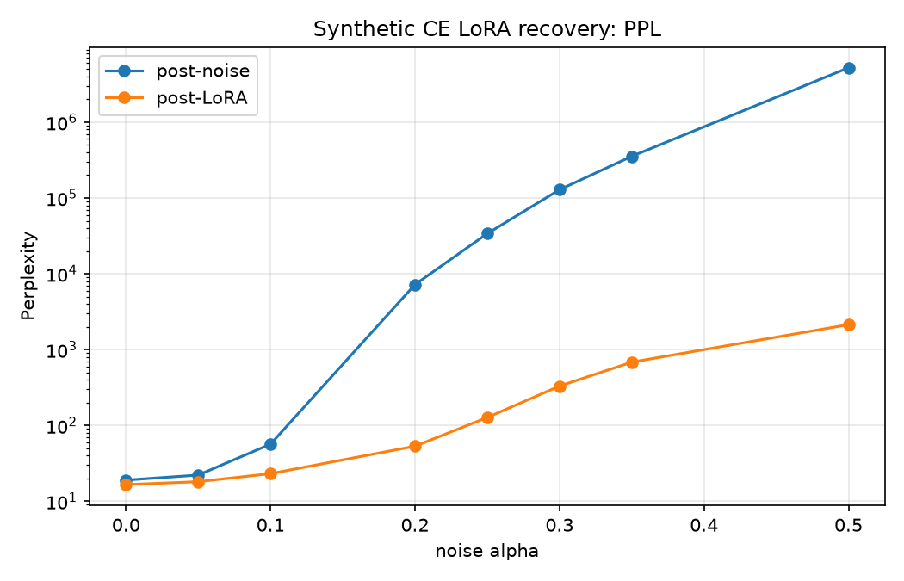
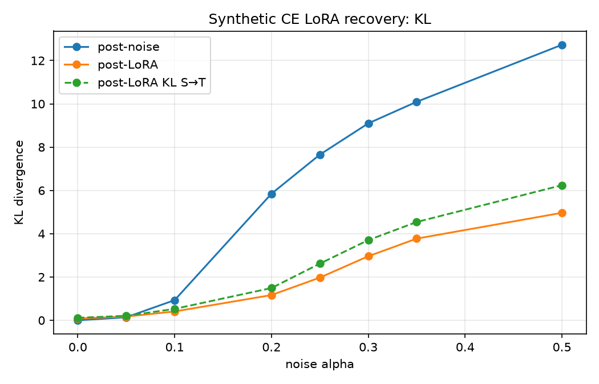
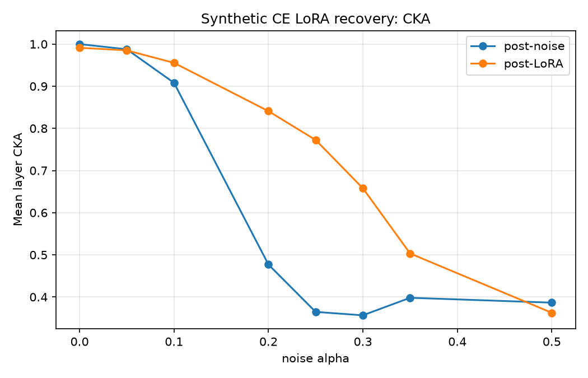

# LoRA-восстановление Qwen3.5-0.8B после Gaussian noise

## Область отчёта и финальные доказательства

В этом документе описан только финальный sweep, для которого сохранены и
независимо загружены все восемь PEFT-адаптеров. Источник каждого числа — один
из следующих raw-каталогов:

- `results/adapter_check_a0p00_seed0`
- `results/saved_adapter_a0p05_seed0` … `results/saved_adapter_a0p50_seed0`

Предварительные smoke, validation, online-KD recovery и 120-step pilot
архивированы в [archive/PRELIMINARY_RESULTS.md](archive/PRELIMINARY_RESULTS.md).

## Модель, данные и метод

- Базовая модель: `Qwen/Qwen3.5-0.8B-Base`, revision
  `dc7cdfe2ee4154fa7e30f5b51ca41bfa40174e68`, Intel XPU, BF16.
- Train-данные: 1 500 уникальных синтетических примеров FineWeb-Edu из
  `qwen_continuation_dataset/outputs/qwen35_08b_fineweb_1500_seed42.jsonl`.
  Генератор использовал fixed prefix 128 токенов, greedy continuation длиной до
  32 токенов, seed 42 и cycle detection. Обучающий текст — `synthetic_text`.
- Held-out: 64 уникальных `source_id` из
  `qwen_continuation_dataset/outputs/qwen35_08b_fineweb_heldout_seed43.jsonl`.
  Eval и probe используют разные срезы по восемь примеров; пересечения
  train/eval, train/probe и eval/probe по `source_id` равны нулю.
- Шум: для каждого подходящего двумерного weight tensor применяется
  `W += alpha * std(W) * eps`, где `eps ~ N(0, 1)` генерируется на CPU с
  `noise_seed=0`. Norms, biases и rotary tensors исключены; tied storage
  зашумляется один раз.
- Обучение student: LoRA rank 8, LoRA alpha 16, dropout 0, AdamW, LR `5e-5`,
  warmup 10, batch size 4, gradient accumulation 1, gradient clip 1.0.
- Objective: автономный `synthetic_ce`, next-token CE по `synthetic_text`.
  Teacher не входит в training loss: каждый run фиксирует
  `teacher_train_forwards=0`. Он используется только для baseline PPL, KL и
  CKA на evaluation.

Каждый run — ровно один packed pass: 1 500/1 500 уникальных `source_id`,
1 494 token blocks, 374 packed batches и 374 optimizer steps. Все логи
проверены на NaN/Inf. Teacher baseline PPL: 19.044344.

## Финальный sweep

Alpha: `0.00, 0.05, 0.10, 0.20, 0.25, 0.30, 0.35, 0.50`.
`NLL = ln(PPL)`; NLL recovery измеряется от post-noise к teacher baseline и
не определён для `alpha=0.00`.

| alpha | PPL noise → LoRA | NLL noise → LoRA | NLL recovery | CKA noise → LoRA |
|---:|---:|---:|---:|---:|
| 0.00 | 19.044344 → 16.608057 | 2.946771 → 2.809888 | n/a | 1.000000 → 0.991173 |
| 0.05 | 22.200193 → 18.151386 | 3.100101 → 2.898747 | 131.32% | 0.987683 → 0.985135 |
| 0.10 | 56.790665 → 23.162994 | 4.039371 → 3.142557 | 82.08% | 0.908079 → 0.955460 |
| 0.20 | 7222.313477 → 53.362564 | 8.884931 → 3.977109 | 82.65% | 0.476863 → 0.840883 |
| 0.25 | 33920.769531 → 127.529007 | 10.431783 → 4.848344 | 74.59% | 0.364551 → 0.772414 |
| 0.30 | 128651.812500 → 330.966187 | 11.764865 → 5.802016 | 67.62% | 0.356498 → 0.657891 |
| 0.35 | 354515.468750 → 684.807373 | 12.778507 → 6.529138 | 63.56% | 0.398065 → 0.503160 |
| 0.50 | 5211579.000000 → 2135.025879 | 15.466393 → 7.666234 | 62.30% | 0.386509 → 0.362498 |

| alpha | KL T→S noise → LoRA | KL S→T noise → LoRA | время, с | peak XPU MiB |
|---:|---:|---:|---:|---:|
| 0.00 | 0.000000 → 0.084040 | 0.000000 → 0.114084 | 1271.4 | 9406.6 |
| 0.05 | 0.138147 → 0.171488 | 0.152598 → 0.208295 | 1019.0 | 9406.6 |
| 0.10 | 0.931540 → 0.408064 | 1.248085 → 0.527263 | 983.9 | 9406.6 |
| 0.20 | 5.847468 → 1.165347 | 6.923172 → 1.490127 | 698.7 | 9406.6 |
| 0.25 | 7.654323 → 1.973338 | 9.005793 → 2.619056 | 566.6 | 9406.6 |
| 0.30 | 9.098409 → 2.958968 | 10.302210 → 3.705241 | 905.2 | 9406.6 |
| 0.35 | 10.094532 → 3.773887 | 11.186578 → 4.541360 | 572.4 | 9406.6 |
| 0.50 | 12.728163 → 4.965972 | 13.774975 → 6.240411 | 570.3 | 9406.6 |







CSV [SYNTHETIC_CE_SWEEP.csv](SYNTHETIC_CE_SWEEP.csv) генерируется из тех же
восьми raw-логов и отчётов независимой проверки адаптеров.

## Интерпретация и ограничения

- `alpha=0.00` — контроль автономного CE, а не recovery: PPL становится ниже
  teacher baseline, но обе KL отклоняются от нуля, а CKA уменьшается.
- `alpha=0.10` — практическая граница убедительного recovery: PPL, обе KL и
  CKA существенно улучшаются после шума.
- При `alpha=0.20` относительный NLL recovery велик, но финальный PPL 53.36
  остаётся значительно выше clean baseline; это сильное, но неполное recovery.
- При `alpha>=0.25` режим катастрофический для данного one-epoch LoRA budget.
  NLL уменьшается, но абсолютные PPL/KL остаются высокими; это не почти полное
  восстановление.
- CE может улучшать PPL, не восстанавливая KL, потому что hard next-token
  labels не сохраняют полное распределение вероятностей teacher.

Ограничения: один noise seed, одна модель, 1 500 коротких greedy continuation,
один epoch, по восемь eval/probe blocks и нет повторов по seeds. Held-out
независим по `source_id`, но происходит из того же корпуса и генератора.
Сравнения с другими KD или full fine-tuning экспериментами возможны только
качественно: отличаются данные, objective, training budget и параметризация.

## Сохранённые адаптеры и восстановление

Проверенные адаптеры — локальные артефакты в
`artifacts/lora_adapters/alpha_*`. Каждый содержит `adapter_model.safetensors`,
`adapter_config.json`, `run_metadata.json` и `verify_report.json`.
Независимая загрузка воспроизводит порядок: clean base model с указанной
revision → matching Gaussian noise (`alpha`, seed 0) → PEFT adapter; затем
сравниваются PPL, обе KL и CKA с post-training metadata.

Переносимый архив:
`artifacts/qwen35_08b_lora_recovery_adapters_seed0.zip`. Его распакованная
форма: `artifacts/yandex_upload/`; в ней находятся восемь адаптеров,
`manifest.json`, `SHA256SUMS.txt`, `environment.json` и `base_config.yaml`.
`manifest.json` использует переносимые пути с прямыми слешами и фиксирует
порядок применения, revision, seeds, LoRA-параметры, размеры/checksums,
финальные метрики, source run и статус проверки.

Размер ZIP: `151791302` байт. SHA-256:
`766e3473e631be0038152c4a6675fb6ca7f3d4d467f22051f498575430ce6e2d`.

JSONL-датасеты, базовые веса, веса LoRA-адаптеров и ZIP остаются локальными и
игнорируются Git. Лёгкие metadata адаптеров, `manifest.json`, checksums,
сведения об окружении и основной конфиг сохраняются в Git для аудита.
Небольшие raw `config.json`, `log.jsonl`, `noise_report.json` и
`verify_report.json` также сохранены для аудита.

## Пересборка и проверка

Из корня репозитория в PowerShell:

```powershell
Push-Location lora_recovery
..\.venv\Scripts\python.exe -m src.rebuild_final_results
..\.venv\Scripts\python.exe -m src.verify_adapter `
  --adapter-dir artifacts/lora_adapters/alpha_0p10
Pop-Location
```

Для запуска нового eight-point sweep (в рамках этой финализации не запускался):

```powershell
Push-Location lora_recovery
..\.venv\Scripts\python.exe -m src.run_saved_adapter_sweep
Pop-Location
```

Sweep runner выполняется последовательно и останавливается до перезаписи
существующего run.
